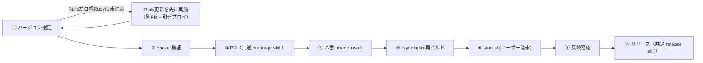

# Rubyバージョンアップ

全体の流れ:



## ① バージョン選定

- EOLと最新パッチは https://endoflife.date/ruby で確認（Rubyは毎年3/31にどれかの系統がEOLになる）
- **Railsの対応が上限を決める。** Rails 7.x系のうちRuby 3.4+を扱えるのは7.1以降
  （3.4でbase64/mutex_m/drb/bigdecimal等がdefault gemから外れ、旧Railsでは Gemfile追加が必要になるため）。
  Railsが古いままなら「default gem構成が変わらない範囲の最新系統」に留めるのが安全
- 目標のRubyを現行Railsがサポートしない場合は**Rails更新を先に、別ブランチ・別PR・別デプロイで**行う
  （RubyとRailsの同時更新は問題発生時の切り分けが不能になるため避ける）
- 判断材料はユーザーに提示して合意を得てから作業に入る

### Railsを先に上げる場合の要点

- アップグレードガイドの推奨どおり**1マイナーずつ** `bundle update rails` → rspec で検証して進める
- `config.load_defaults` の引き上げは各デフォルト変更の影響を確認してから。このアプリで見る観点:
  cookie/session（未使用か）・Rails.cacheの利用実態・ActiveJob引数のシリアライズ・
  生SQL（`exec_query`等）への型デコード変更。**7.2以降はYJIT自動有効化**があるため、
  本番VPSのメモリ余力を確認するまで `config.yjit = false` で明示オフにする
- eager load起因の本番事故予防に `rails zeitwerk:check` と `CI=1 bundle exec rspec` を必ず実行
  （本番は`eager_load=true`、開発・通常テストはfalseのため通常検証では踏めない）
- `db/schema.rb` のバージョンスタンプ差分（`Schema[X.Y]`）もコミット対象

## ② docker検証（ローカルMacにRubyを入れない）

変更箇所チェックリスト（旧バージョン文字列をgrepして漏れがないか確認する）:

| 場所 | ファイル |
|---|---|
| application/backend | `.ruby-version` / `Gemfile`の`ruby "…"` / `Dockerfile`のFROM / `README.md` / `Gemfile.lock`（後述） |
| リポジトリルート | `README.md` / `CLAUDE.md`（`tmp/backend.md`は過去の作業ログなので対象外） |

```bash
docker compose build appserver && docker compose up -d
```

### ⚠️ イメージ再ビルド後は `restart` ではなく `up -d --force-recreate`

`docker compose restart` は**既存コンテナ（旧イメージ + 旧 /usr/local/bundle）をそのまま再起動する**ため、
新Rubyが使われず「Your Ruby version is X, but your Gemfile specified Y」で起動失敗する。
再ビルド後の起動確認は `docker compose up -d --force-recreate appserver` で行い、
`docker compose exec appserver ruby -v` で新版が動いていることを先に確認する
（`docker compose run --rm` は毎回新イメージから作られるため、この問題の影響を受けない）。

Gemfile.lockの更新はコンテナ内で行う。**gemの解決が一切変わらないこと**（差分がRUBY VERSIONとBUNDLED WITHの2箇所だけであること）をgit diffで確認する:

```bash
docker compose run --rm appserver bash -c "BUNDLE_PATH=vendor/bundle bundle update --ruby"
```

### ⚠️ 最重要: BUNDLED WITHはrbenv同梱のbundlerに合わせる（bundler 4にしない）

`bundle update --bundler` は**最新bundler(4系)をlockに書いてしまう**。bundler 4は`--path`の
設定記憶が廃止されており、`bundle install --path vendor/bundle` 後の別プロセスの `bundle exec` が
gemを発見できず起動失敗する。**deploy.sh/start.sh/docker_setup.shはすべてこの構造**のため、
本番デプロイが確実に壊れる（過去のRuby更新時にdocker検証で実際に発生し、本番到達前に捕捉した）。

対処: 新イメージ内で `bundle update --ruby` を実行すると、実行中のbundler（=イメージ同梱版）が
BUNDLED WITHに書かれるため通常は手編集不要。git diffで**bundler 4系が書かれていないこと**を必ず確認し、
ズレていた場合のみ同梱版へ手で修正する。同梱版はdocker公式イメージの `bundle -v` で確認でき、
rbenv側は `~/.rbenv/versions/<新版>/bin/bundle -v`（通常は一致する）。

### ⚠️ docker公式rubyイメージのbundler設定はコンテナ内に消える

公式イメージは `BUNDLE_APP_CONFIG=/usr/local/bundle` を設定しており、`--path`の記憶が
ホストマウントされた`.bundle/config`ではなく**コンテナ内**に書かれる。`docker compose run`は
毎回新コンテナなので記憶が残らない。単発コマンドには毎回 `--path vendor/bundle` か
`BUNDLE_PATH=vendor/bundle` を明示する（`bundle check`が「全gem missing」を返しても壊れていない）。

検証項目（すべてパスしてからPRへ）: rails/puma起動・`curl`でGraphQL実データ応答・
nginx経由(:10000)で画面200・sidekiq起動とsidekiq-cronの`daily_ingestion_job`登録ログ・
`bundle exec rspec`・`bundle exec rubocop`（TargetRubyVersionが変わり新規指摘が出得る）。

## ③ PR

共通 create-pr skill の運用どおり。backend側の変更とREADME/CLAUDE.md更新を1本のPRにまとめる。
PR本文にはバージョン選定理由・検証チェックリスト・BUNDLED WITH固定の理由を書く。

## ④〜⑦ 本番反映（順序が生命線）

**新Rubyのインストールがrsyncより先。** 逆にすると、サーバの`.ruby-version`/Gemfileが
新版を指すのにRuby実体が無く、bundle installもrakeも全部失敗する。

```bash
# ④ ruby-build更新とビルド（sudo不要・稼働中プロセスに無影響・本番VPSでは十数分かかる）
ssh -o BatchMode=yes "$HOST" "bash -ic 'git -C ~/.rbenv/plugins/ruby-build pull --ff-only && rbenv install <新版>'"
```

- `$HOST` / `$SERVER_DIR` の値はgit管理外の /deploy スキルの方法で取り出す（このファイルには書かない）
- sidekiqのsystemdユニットは `~/.rbenv/shims/bundle` 経由でバージョン固定パスが無く、
  WorkingDirectoryの`.ruby-version`に自動追従する。**ユニット変更は不要**
  （変更が要る構成になっていないか `systemctl cat <ユニット名>` で毎回確認はする。
  ユニット名は本番の`start.sh`内の`systemctl`呼び出しで確認できる）
- `rbenv global` は旧版のままでよい（サーバディレクトリの`.ruby-version`が優先される）

```bash
# ⑤ rsync転送（git管理外の /deploy スキルの事前チェック準拠）→ gem再ビルド（稼働中プロセスは旧Rubyのまま無影響）
bash application/backend/deploy.sh
ssh -o BatchMode=yes "$HOST" "cd $SERVER_DIR && bash -ic 'bundle install --path vendor/bundle'"
```

- ネイティブ拡張の再ビルドが走る（数分）。gemは`vendor/bundle/ruby/<新ABI>/`に入り旧ABIと共存する
- サーバの`.bundle/config`には`BUNDLE_PATH: vendor/bundle`が永続化済み

⑥ `start.sh`（sidekiq→puma再起動）はsudoが必要なため**ユーザーの対話端末で実行してもらう**。
**必ず⑤のgem再ビルド完了後**（start.shはsidekiq再起動が先頭にあり、gemが無いと失敗する）。

### ⚠️ start.shのpuma再起動は`server.pid`が無いと静かに失敗する

start.shのkillは`tmp/pids/server.pid`頼みのため、pidファイルが消えていると（rsync等で起こり得る）
旧pumaが残り、新pumaが「Address already in use」で起動に失敗して**旧Rubyのまま気づかず運用してしまう**。
⑦の`readlink`確認が唯一の検出手段なので省略しないこと。復旧はsudo不要:
`pgrep -af puma`で旧pumaのPIDを特定してkillし、`ss -tln`でポートが解放されるのを待ってから
`bash -ic 'bundle exec ./bin/rails s -d -e production -p <ポート>'`で起動し直す
（kill直後の即起動はポート未解放で同じ失敗を繰り返す）。

⑦ 反映確認は /deploy §4 に加えて:

```bash
# pumaが新Rubyで動いている直接証明（pumaは同一ユーザーなので/procが読める）
ssh -o BatchMode=yes "$HOST" "PID=\$(pgrep -f puma | head -1); readlink /proc/\$PID/exe"
```

```bash
# sidekiq死活とcron登録
ssh -o BatchMode=yes "$HOST" "systemctl is-active <sidekiqユニット名>; cd $SERVER_DIR && bash -ic 'RAILS_ENV=production bundle exec rails runner \"puts Sidekiq::Cron::Job.all.map { |j| j.name + %q( ) + j.cron }\"'"
```

翌朝、日次取込（DailyIngestionJob）の初回実行が正常だったか確認する。

⑧ 反映確認まで済んだら 共通 release skill の手順でtag・releaseを作成する。

## ロールバックと後始末

- 旧Ruby・旧`vendor/bundle/ruby/<旧ABI>`はサーバに残す＝ロールバック手段。
  戻すときは旧コミットをrsyncして（`.ruby-version`が旧版に戻る）start.sh
- 数日安定稼働後の掃除（実施前にユーザーへ確認）: `rbenv uninstall <旧版>`・
  旧ABIディレクトリ削除・`rbenv global <新版>`・ローカルMacのrbenvも同様に更新
