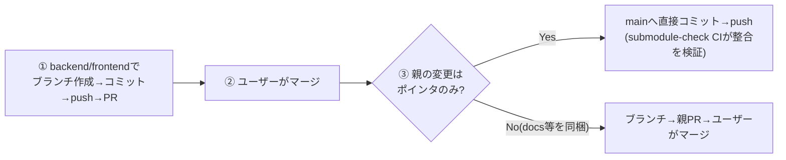

# submodule構成のPR運用

このリポジトリは 親 + submodule 2つ(application/backend, application/frontend)で構成される。
**submodule内の変更はそれぞれのリポジトリで別コミット・別PRになり、親は「submoduleの特定コミットSHA(ポインタ)」だけを記録する。**

## 大原則: 「submoduleをマージしてから、親のポインタを更新」

親PRをsubmodule PRと**同時に作らない**。親のポインタは常に「マージ後のmain先端」を指すようにする。
(同時に作るとポインタがfeatureブランチ先端を指し、マージコミットが生まれた瞬間に必ずズレる。
また親がfeature SHAを参照するとsquashマージで壊れるため「squash禁止」の制約まで生まれる)



## 手順詳細

### ① submodule側のPR

```bash
cd application/backend   # またはfrontend
git checkout main && git pull
git checkout -b <feature/fix/choreブランチ名>
# 変更 → 意味ごとにコミット → push → gh pr create
```

- コミットは意味ごとに分ける。メッセージはprefix(`add:` `update:` `change:` `fix:`)+末尾に
  `Co-Authored-By: Claude Fable 5 <noreply@anthropic.com>`
- PR本文の末尾は `🤖 Generated with [Claude Code](https://claude.com/claude-code)`
- backendとfrontend両方に変更がある場合はPRを2本作り、本文で相互参照する
  (マージ順は backend → frontend。フロントが新APIに依存し得るため)

### ③ 親側のポインタ更新(submoduleマージ後に行う)

**ポインタ更新のみの場合は、親mainへ直接コミット・pushしてよい**(2026-08-12の運用決定):

```bash
cd application/backend && git checkout main && git pull && cd ../..   # frontendも同様
git checkout main && git pull
git add application/backend application/frontend
git commit  # "update: backend/frontend submodules (変更概要)"
git push origin main   # push時にsubmodule-check CIが参照整合を検証する
```

親のdocs変更(docs/guide等)を同梱する場合は、従来どおりブランチを切って親PRにする:

```bash
git checkout -b <同系統のブランチ名>
git add application/backend application/frontend  # + docs等の変更
git commit && git push -u origin <ブランチ名>
gh pr create  # ポインタ更新+関連するdocs変更をまとめる
```

- どちらの方式でもポインタは常にmainに実在するコミットを指すため、
  submodule側のマージ方式(merge commit / squash)はどちらでも壊れない

## 「M application/backend」の差分が出たときの読み方

これは**ファイル変更ではなく参照コミットのズレ**。原因は2つ:

| 原因 | 対処 |
|---|---|
| submoduleに新しいコミットが積まれたのに親のポインタ未更新 | 上記③のポインタ更新を行う(急ぎでなければ次の親PRに含めればよい) |
| 親の記録がfeature先端のまま、submoduleのmainがマージコミットで進んだ(旧方式の名残) | 同上。壊れてはいない(旧SHAもmainに含まれる) |

壊れているかの判定は親の `submodule-check` CI(mainへのpush時)が行う:
「ポインタがsubmoduleのmainに含まれないSHAを指す」ときだけエラーになる。

## 全リポジトリをmainへ揃える(マージ後の後始末)

```bash
cd application/backend && git checkout main && git pull && cd ../frontend && git checkout main && git pull && cd ../.. && git checkout main && git pull
```
