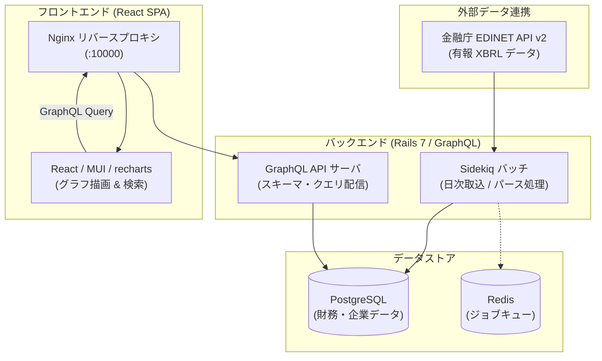

# financial-statement (investee)

上場企業の財務三表（貸借対照表・損益計算書・キャッシュフロー計算書）をグラフで直感的に可視化するWebアプリケーションです。

金融庁の開示システム（EDINET）から有価証券報告書のXBRLデータを取得・解析し、積み上げグラフやウォーターフォールグラフとして表示します。

- **本番サービス**: [https://investee.info](https://investee.info)

---

## 主な機能

- **財務三表のビジュアル表示**: 貸借対照表（BS）、損益計算書（PL）、キャッシュフロー計算書（CF）を視覚的なグラフで比較・分析。
- **銘柄検索・絞り込み**: 証券コードや企業名による検索、キャッシュフローのパターン（営業・投資・財務CFの正負の組み合わせ）によるスクリーニング。
- **自動データ更新**: EDINET APIと連携し、提出された有価証券報告書を日次バッチで自動取り込み。

---

## システム構成



---

## 技術スタック

| レイヤー | 技術・ライブラリ |
|---|---|
| **フロントエンド** | React, TypeScript, Apollo Client, Redux Toolkit, Material-UI, recharts |
| **バックエンド** | Ruby 3.4, Ruby on Rails 7, GraphQL (graphql-ruby), Sidekiq |
| **データベース / キャッシュ** | PostgreSQL 12, Redis |
| **インフラ / 実行環境** | Docker, Docker Compose, Nginx |
| **外部連携** | 金融庁 EDINET API v2 |

---

## 開発環境のセットアップ

Docker Compose を利用して、バックエンド・フロントエンド・データベース・Redis を一括で立ち上げることができます。

### 1. リポジトリの準備

```bash
git clone https://github.com/shin4488/financial-statement.git
cd financial-statement
```

### 2. 環境変数の設定

`application/backend/config/application.yml`（Git管理外）を作成し、EDINET APIキーを設定します。

```yaml
EDINET_API_KEY: "発行したEDINET_APIキー"
SENTRY_DSN: "" # 任意（エラー監視を使用する場合のみ）
```
※ EDINET APIキーは金融庁の[API利用登録ページ](https://api.edinet-fsa.go.jp/api/auth/index.aspx?mode=1)より無料で取得できます。

### 3. コンテナの起動

```bash
docker compose up
```

起動後、以下のURLから各サービスにアクセスできます：
- **フロントエンド画面**: `http://localhost:10000`
- **GraphQL エンドポイント**: `http://localhost:20000/graphql`

---

## データの取り込み（有報インポート）

ローカル環境のデータベースに有価証券報告書データを取り込むには、Rakeタスクを実行します。

```bash
# 日付範囲を指定して一括取り込み
docker compose exec appserver bundle exec rake 'ingestion:backfill[2026-06-20,2026-06-30]'

# 書類管理番号（docID）を指定してピンポイントで取り込み
docker compose exec appserver bundle exec rake 'ingestion:documents[S100YB5L S100YB25]'
```

---

## 主な開発コマンド

```bash
# フロントエンドの GraphQL 型生成（スキーマ変更時）
cd application/frontend && npm run compile

# バックエンドのテスト実行
docker compose exec appserver bundle exec rspec

# フロントエンドのテスト実行
docker compose exec appserver yarn --cwd application/frontend test
```

---

## リポジトリ構成

```text
financial-statement/
├── application/
│   ├── backend/             # Rails API サーバ（モデル、バッチ、GraphQLスキーマ）
│   └── frontend/            # React SPA（UIコンポーネント、チャート描画）
├── web/                     # Nginx のリバースプロキシ設定
├── database/                # PostgreSQL の初期化スクリプト
├── cache/                   # Redis のコンテナ定義
├── docs/                    # 会計基準別の変換仕様や運用設計ドキュメント
└── docker-compose.yml       # 開発環境コンテナ定義
```
