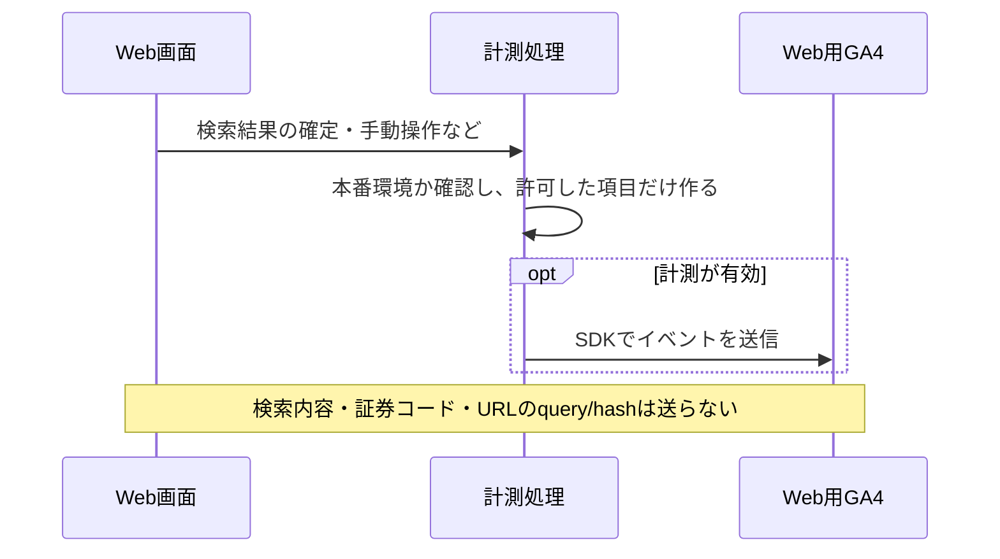
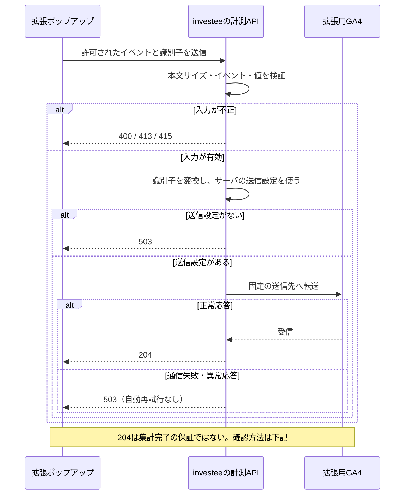

# investee の利用状況と改善判断

GA4 Web プロパティ: `407300014`（測定 ID `G-ZCJ8NTQ6KY`）。
拡張機能は別プロパティ `463560127`。両者のユーザー数を足しても実人数にはならない。

## 週に一度見る順序

同じ長さの期間（まず過去28日とその前の28日）で比較する。少数の利用では率が大きく動くため、必ずユーザー数・イベント数を併記する。

| 確認すること | 見るもの | 次に調べる改善候補 |
| --- | --- | --- |
| 利用されているか | アクティブユーザー、新規・リピーター、流入元 | 流入減なら検索流入・拡張からの導線、再訪減なら更新頻度・使い勝手 |
| 目的の企業へ到達できるか | search_submit と report_result、検索方法別の表示結果 | empty が多ければ対象企業・入力案内・データ収録、error が多ければAPIの稼働状況 |
| 分析に使われているか | analysis_interaction のユーザー数、グラフの種類 | 表示成功に対して操作が少なければグラフの説明・ナビゲーション・初期表示 |
| どこで止まるか | report_load_more の結果、デバイス別のキーイベント率 | 追加読込失敗やスマートフォンだけの低下を再現して確認 |
| 外部へ調査を続けているか | outbound_click | 企業名リンクの認知・関連情報への導線 |

これらは原因の断定ではなく調査の入口。イベント数の単純な割算を、同じ利用者が順番に進んだファネル率として扱わない。経路はGA4のファネル探索で同一セッション・順序を指定する。

## 計測の契約

| イベント | 発火条件 | 主なパラメータ |
| --- | --- | --- |
| page_view | 初回とページ分類の変更。検索クエリ変更・StrictMode再実行では増やさない | 正規化したpage_location / page_title |
| search_submit | 利用者が検索条件を変更した時 | search_mode、stock_count |
| report_result | 検索結果が確定した時。追加読込では増やさない | result_status、result_count、unavailable_count、search_mode |
| report_load_more | 追加読込が完了・失敗した時 | result_status、result_count |
| analysis_interaction | 手動グラフ切替、自動切替設定の変更 | interaction_type、chart_type |
| outbound_click | 企業名から株探へ移動 | link_domain |

`result_status`: success / empty / error。
`search_mode`: browse / stock / cash_flow / combined。
`chart_type`: bs / pl / cf / indicators。
`unavailable_count` は「3表のうち1つ以上が表示不可のレポート数」であり、通信失敗数ではない。
`analytics_version=2` は新しい計測契約。過去のclickや旧イベントと直接増減比較しない。

キーイベントは `analysis_interaction`（セッションごとに1回、金額なし）。自動再生や単なる表示を成果として数えない。
カスタム定義はイベントスコープで「表示結果=result_status」「検索方法=search_mode」「分析操作=interaction_type」「グラフの種類=chart_type」。数値パラメータを集計する場合はGA4のカスタム指標に登録する。

本番ビルドかつ `investee.info` のみ送信。ローカル・previewは本番データを汚さない。
自由入力・検索内容・証券コード・query/hashは送らない。GA4の拡張計測は手動page_viewや独自クリックとの重複を避ける設定にする。

## 計測の流れ

[財務データの表示](../guide/03_data_flow.md#sequence-display)や利用者の操作をきっかけに送信する。計測の失敗で財務表示を止めない。Webと拡張では送信経路・集計先が異なる。

### Web：ブラウザから送信

### 拡張機能：サーバで検証して中継

設定と送信内容の制約は次節、受信・集計の確認は[検証と反映時差](#検証と反映時差)を参照。

## 拡張機能の計測中継

`POST /api/analytics/extension`（Rails側は `/analytics/extension`）で、固定のGA4送信先へ転送する。新しい拡張を公開する前にこのAPIをデプロイする。

Git管理外のbackend `config/application.yml` に以下を設定する。

- `EXTENSION_GA_MEASUREMENT_ID`: GA4の拡張機能データストリームに表示される**完全な**測定ID。
- `EXTENSION_GA_API_SECRET`: 同ストリームのMeasurement Protocol API secret。ブラウザ用のVITE変数には置かない。

キーはログ・PR・スクリーンショット・配布zipへ含めない。以前の拡張に入っていたキーは既存配布物から消せないため、運用上のローテーションは旧版への影響と合わせて判断する。

送信イベント4種、列挙型パラメータ、UUID、数値範囲、2KiBの本文上限を検証する。UUIDはSHA-256から生成した安定した数値ペアに変換し、GA Webストリームが要求する `number.number` 形式で送る。任意の送信先・パラメータを受け付けない。既存nginxの `/api/` レート制限を使用し、Googleへの通信は短いタイムアウト・再試行なし。障害時は503、未設定時も503であり、成功したふりをしない。表示処理は計測の成功を待たない。

IP・User-Agent・URLを利用者からGoogleへ転送しない。MPのみの拡張について地域・端末・流入や新規/再訪をWeb SDKと同等の精度で解釈しない。サイト名・表示結果・操作・バージョンと総ユーザー数を中心に見る。

## 検証と反映時差

- Web: 型・lint・Vitest・ビルド。本番で手動操作しGA4リアルタイムのイベント名とパラメータを確認する。
- 拡張: Jestで同一セッション・30分後の切替・計測停止・StrictModeの重複抑止・自動再生の除外を確認。配布物に秘密キーとlocalhostがないことを検査する。
- サーバ: request specで正常転送、任意パラメータ拒否、サイズ制限、未設定、上流タイムアウトを確認する。
- Measurement ProtocolはHTTP 204だけで集計成功とは断定できない。`/debug/mp/collect` の検証結果とGA4リアルタイムを別々に確認する。debugエンドポイントの検証リクエスト自体は集計されない。
- 新しい定義・イベントは過去に遡って補完されない。通常レポートやカスタム定義の反映は24～48時間待つ場合がある。公開直後の0件を離脱や障害と断定しない。

公式仕様: [Measurement Protocol](https://developers.google.com/analytics/devguides/collection/protocol/ga4/reference)、[イベントの検証](https://developers.google.com/analytics/devguides/collection/protocol/ga4/validating-events)。
