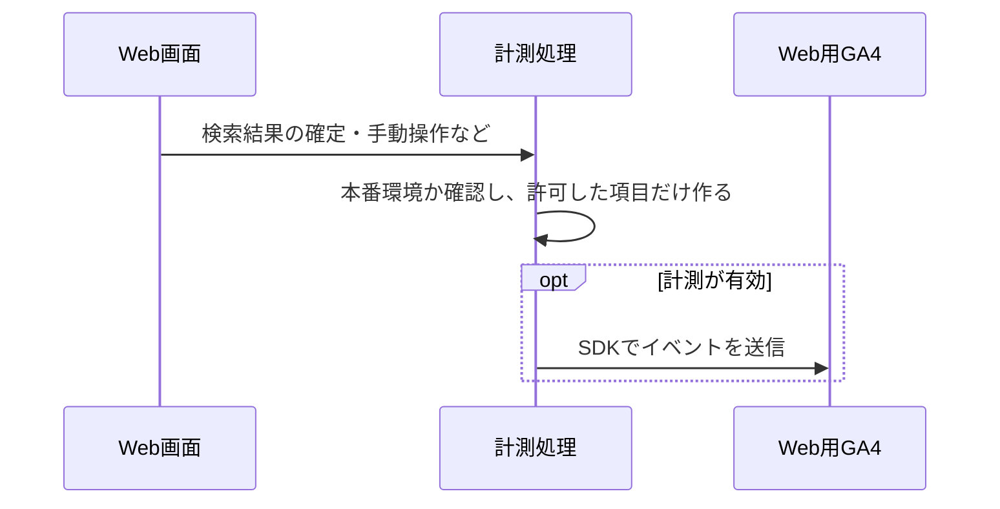
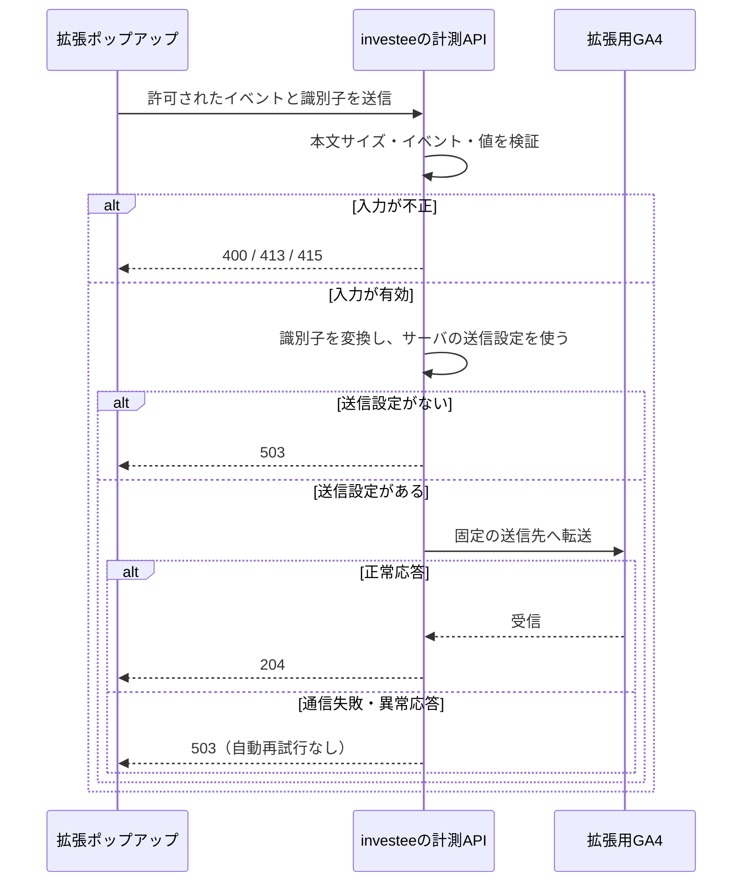

# investeeの利用状況を確認する

GA4 Web プロパティ: `407300014`（測定 ID `G-ZCJ8NTQ6KY`）。
拡張機能は別プロパティ `463560127`。同じ人が両方を使う場合があるため、ユーザー数は合算しない。

## 週に一度の確認

過去28日間とその前の28日間など、同じ長さの期間で比較する。利用が少ないと割合が大きく変わるため、ユーザー数・イベント数も確認する。

| 確認すること | 見るもの | 次に調べる改善候補 |
| --- | --- | --- |
| 利用されているか | アクティブユーザー、新規・リピーター、流入元 | 流入減なら検索流入・拡張からの導線、再訪減なら更新頻度・使い勝手 |
| 目的の企業へ到達できるか | search_submit と report_result、検索方法別の表示結果 | empty が多ければ対象企業・入力案内・データ収録、error が多ければAPIの稼働状況 |
| グラフが操作されているか | analysis_interaction のユーザー数、グラフの種類 | 表示成功に対して操作が少なければグラフの説明・切替ボタン・初期表示 |
| どこで止まるか | report_load_more の結果、デバイス別のキーイベント率 | 追加読込失敗やスマートフォンだけの低下を再現して確認 |
| 関連情報へ移動しているか | outbound_click | 企業名がリンクだと分かるか、関連情報へ進みやすいか |

イベント件数の比率だけでは、検索した人がグラフ操作まで進んだ割合は分からない。検索から操作までの流れは、GA4のファネル探索で同一セッション内の順序を指定して確認する。

## Webのイベント定義

| イベント | 記録するタイミング | 主なパラメータ |
| --- | --- | --- |
| page_view | 初回とページ分類の変更。検索クエリ変更・画面処理の再実行では増やさない | 正規化したpage_location / page_title |
| search_submit | 利用者が検索条件を変更した時 | search_mode、stock_count |
| report_result | 検索結果が確定した時。追加読込では増やさない | result_status、result_count、unavailable_count、search_mode |
| report_load_more | 追加読込が完了・失敗した時 | result_status、result_count |
| analysis_interaction | 手動グラフ切替、自動切替設定の変更 | interaction_type、chart_type |
| outbound_click | 企業名から株探へ移動 | link_domain |

| パラメータ | 値・意味 |
|---|---|
| `result_status` | `success`：表示成功、`empty`：0件、`error`：取得失敗 |
| `search_mode` | `browse`：条件なし、`stock`：証券コード、`cash_flow`：CFパターン、`combined`：両方 |
| `chart_type` | `bs`：貸借対照表、`pl`：損益計算書、`cf`：キャッシュフロー計算書、`indicators`：財務指標 |
| `unavailable_count` | 3表のうち1つ以上が表示できないレポート数。通信失敗数ではない |

この定義は `analytics_version=2`。過去のclickや旧イベントとは集計条件が異なるため、件数の増減を直接比較しない。

### GA4の集計設定

- キーイベント：`analysis_interaction`。セッションごとに1回、金額なしで集計する。自動切替や画面を表示しただけでは数えない。
- カスタム定義：イベントスコープで「表示結果=result_status」「検索方法=search_mode」「分析操作=interaction_type」「グラフの種類=chart_type」を登録する。
- 数値パラメータ：集計するものをカスタム指標に登録する。

本番ビルドを `investee.info` で表示したときだけ送信する。
検索内容・証券コードなどの自由入力や、URLのクエリ・ハッシュは送らない。GA4の拡張計測は、このイベント一覧と二重に記録されないよう設定する。

## 計測の流れ

財務データの表示や利用者の操作をきっかけに送信する。計測の失敗で財務表示を止めない。Webと拡張では送信経路・集計先が異なる。

### Web：ブラウザから送信

### 拡張機能：サーバで検証して中継

## 拡張機能の設定と計測の確認

拡張は `POST /api/analytics/extension` を使う。公開前に中継APIをデプロイし、Git管理外のbackend `config/application.yml` に次を設定する。

| 項目 | 設定する値 |
|---|---|
| `EXTENSION_GA_MEASUREMENT_ID` | 拡張用データストリームの測定ID |
| `EXTENSION_GA_API_SECRET` | 同ストリームのMeasurement Protocol API secret。ブラウザ用変数や配布物には含めない |

確認には次の2つを使う。HTTP 204が返っても、GA4で集計されたとは限らない。

| 確認すること | 方法 |
|---|---|
| 送信内容が正しいか | Measurement Protocolのdebugエンドポイントで検証する。検証リクエスト自体は集計されない |
| 操作が記録されるか | 公開後に拡張機能を操作し、GA4リアルタイムでイベントとパラメータを確認する |

通常レポートや新しいカスタム定義の反映には24〜48時間かかる場合があり、過去分も補完されない。公開直後の0件だけで障害と判断しない。

拡張はWebと計測方法が異なるため、地域・端末・流入元・新規／再訪は同じ精度で比較できない。サイト名・表示結果・操作・バージョンと総ユーザー数を中心に確認する。

公式仕様: [Measurement Protocol](https://developers.google.com/analytics/devguides/collection/protocol/ga4/reference)、[イベントの検証](https://developers.google.com/analytics/devguides/collection/protocol/ga4/validating-events)。
