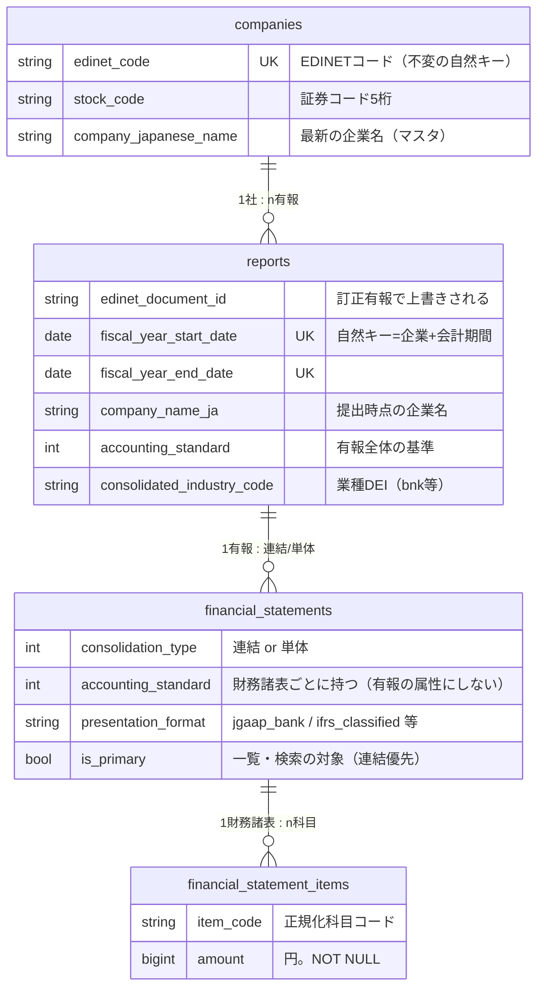
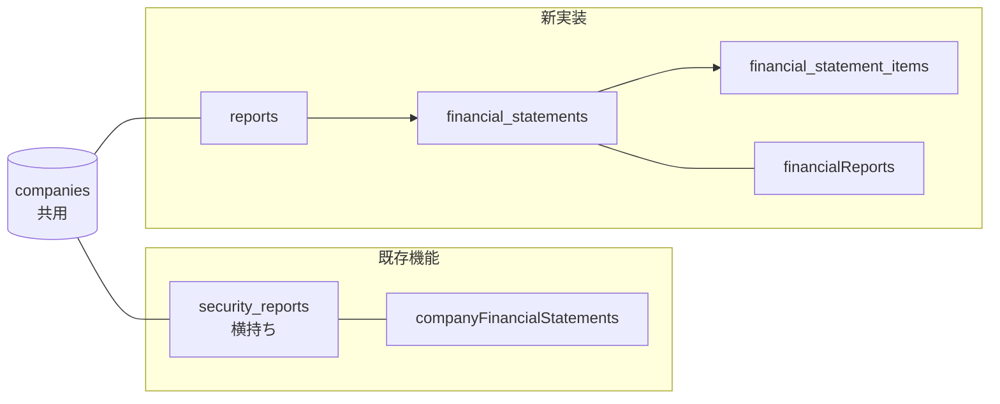

# データモデル

## ER図



ポイント3つ:

1. **会計基準・表示形式は「有報」でなく「財務諸表」の属性**。
   IFRS企業でも単体財務諸表は日本基準でタグ付けされる（実測6社すべて）ため、
   有報1通の中に `ifrs_classified`（連結）と `jgaap_general`（単体）が同居する。
2. **科目は縦持ち**。形式ごとに保存する科目が違っても行の内容が変わるだけで、
   スキーマは変わらない。
3. **企業名は2箇所に持つ**（下記）。

## 企業名の持ち方: マスタ（最新名）+ 有報（提出時点の名前）

社名変更した企業は、**各年度の有報を当時の名前で表示したい**。そのため:

| 置き場所 | 内容 | 更新ルール | 用途 |
|---|---|---|---|
| `companies.company_japanese_name` | 最新の企業名 | その企業の**最新会計期**の有報を取り込んだときだけ更新（過去年度のバックフィルでは巻き戻さない） | マスタ・SecurityReport系機能の表示 |
| `reports.company_name_ja` | 提出時点の企業名 | その有報を取り込むたび（訂正有報も上書き） | `financialReports` APIの表示名 |

実例（NTT。2025年に日本電信電話から社名変更）:

```
reports:
  | fiscal_year_end | company_name_ja                              | 画面表示        |
  |-----------------|----------------------------------------------|----------------|
  | 2024-03-31      | 日本電信電話株式会社                          | 当時の名前のまま |
  | 2026-03-31      | NTT株式会社（旧会社名 日本電信電話株式会社）   | 提出書類の表記   |

companies: company_japanese_name = "NTT株式会社（旧会社名 日本電信電話株式会社）"（最新）
```

## 実データ例: 武田薬品の連結（ifrs_classified）はこう入る

```
financial_statements:  id=1, consolidation_type=consolidated,
                       accounting_standard=ifrs, presentation_format="ifrs_classified", is_primary=true

financial_statement_items:
  | item_code                  | amount             | 由来タグ                                  |
  |----------------------------|--------------------|-------------------------------------------|
  | bs.assets                  |  15,511,506,000,000 | jpigp_cor:AssetsIFRS                     |
  | bs.current_assets          |   3,090,503,000,000 | jpigp_cor:CurrentAssetsIFRS              |
  | bs.equity                  |   7,430,649,000,000 | jpigp_cor:EquityIFRS                     |
  | bs.goodwill_and_intangibles|   9,228,358,000,000 | のれん+無形の2タグをExtractorが合算       |
  | pl.revenue                 |   4,505,720,000,000 | jpigp_cor:RevenueIFRS                    |
  | pl.profit_before_tax       |    -142,355,000,000 | 赤字は負の値のまま                        |
  | cf.operating               |   1,041,431,000,000 | jpigp_cor:NetCash...OperatingActivitiesIFRS |
  | ...                        |                    |                                           |
  ※ "pl.gross_profit" の行は存在しない（武田は売上総利益を開示していないため）
```

## 規約: 「行がない = 開示なし」

```
値が取れた科目   → 行を作る（0円なら amount=0 の行）
取れない科目     → 行を作らない（NULLも0も保存しない）
```

- 「0円」と「開示なし」の区別問題が構造的に消える
- Before の横持ちでは IFRS企業の全カラムが0で埋まっていた（0なのか無いのか判別不能）

## 科目コードレジストリ

科目コードの唯一の定義は [`app/lib/financial_statements/item_codes.rb`](../../application/backend/app/lib/financial_statements/item_codes.rb)。
DBにマスタテーブルは作らない（コードと利用ロジックは必ず同時に変わるため、Rubyの定数で
grep・コードレビューが効く方を優先）。

命名規則と代表例:

```
"<財務諸表>.<スネークケース英名>"

bs.assets            資産合計         ← 全4形式が保存（どの形式でも取れる骨格）
bs.current_assets    流動資産         ← 流動/非流動の分類がある形式のみ
bs.loans             貸出金           ← 銀行のみ
pl.revenue           売上高/売上収益  ← 銀行以外
pl.ordinary_revenue  経常収益         ← 銀行のトップライン（pl.revenueは保存しない）
cf.operating         営業CF           ← 全形式共通（CFは基準・業種で構造が変わらない）
```

保存時の正当性はモデルのバリデーション + 「Extractorのマッピング ⊆ レジストリ」を
specで担保（`spec/services/ingestion/extractors/mapping_consistency_spec.rb`）。

## 既存テーブルとの共存



- `companies` だけ共用（企業マスタを二重に持たない）。新モデル `Disclosure::Company` が
  カラム名差異（`company_japanese_name` ↔ `name_ja`）をaliasで吸収
- 検索用インデックス: `(item_code, amount)` 複合（CF符号フィルタ用）+
  `(financial_statement_id, item_code)` ユニーク
