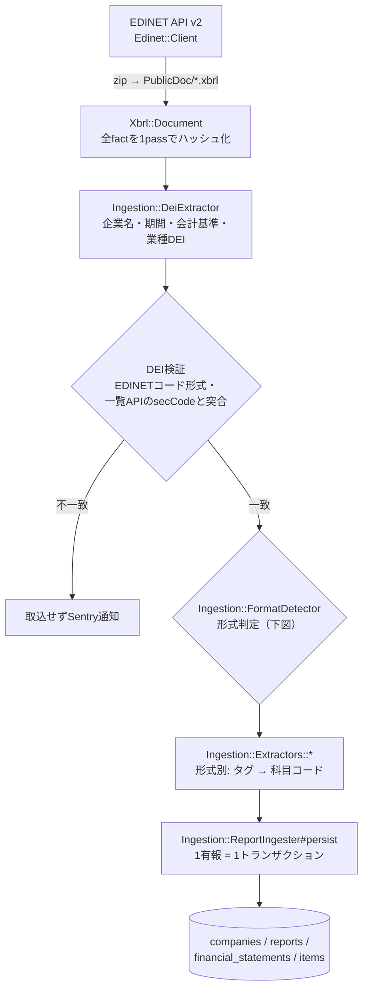
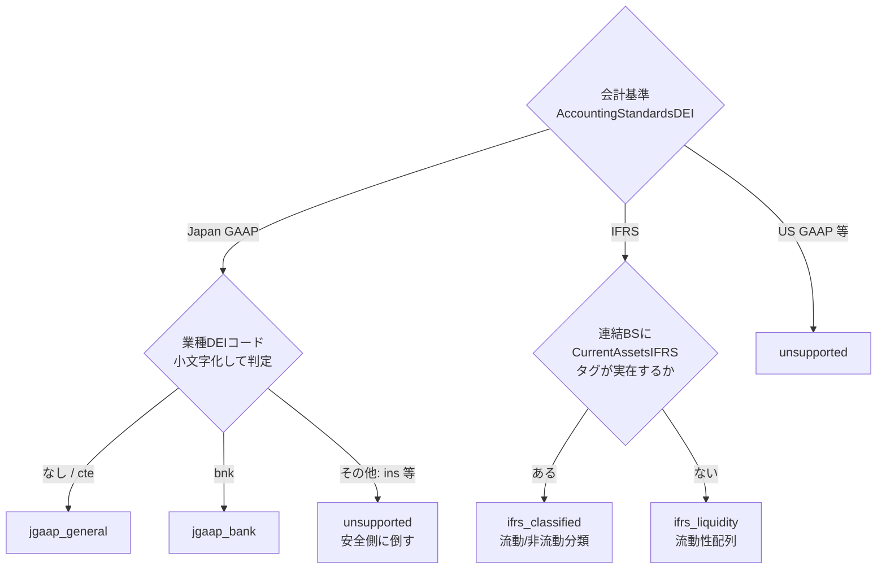

# 取込層（Ingestion）

## パイプライン全体



- 実行入口は2つ: `DailyIngestionJob`（日次・毎日2:00に`sidekiq-cron`で実行）と
  `rake 'ingestion:backfill[from,to]'` / `rake 'ingestion:documents[docID...]'`（手動）
- **DEIは提出者が書いた値のため、企業マスタのキーとして使う前に検証する**:
  EDINETコードの形式（`[A-Z]\d{5}`）と、金融庁の一覧API（`documents.json`）が返す`secCode` との突合。食い違う書類は他社レコードを上書きし得るため取り込まない（なりすまし・提出ミスの両方が同じ経路で起きる）。docID指定のrakeタスクは一覧メタデータを持たないため証券コードの突合はスキップされる
- EDINETはリクエスト過多で403になるため**同期・逐次**（並列化しない）+
  書類間に1秒スリープ。一覧APIはHTTPステータスを明示チェック（403を早期に検出）
- 失敗の隔離境界は「1書類」と「1日」。1社の失敗が他社に波及しない（Sentryに通知）
- 全処理が冪等（再実行・訂正有報は同じ期のデータを上書き）

## 失敗時のリカバリ（運用手順）

自動リトライは持たない。冪等な再実行が唯一のリカバリ手段:

| Sentry通知 | 意味 | リカバリ |
|---|---|---|
| `list failed <日付>` / `EDINET documents.json failed` | その日の一覧取得ごと失敗（**その日の全有報が未取込**） | `rake 'ingestion:backfill[<日付>,<日付>]'` を再実行 |
| `ingest failed <docID>`（document_idタグ付き） | その書類だけ失敗 | `rake 'ingestion:documents[<docID>]'` を再実行 |
| `primary statement missing bs.assets` | 取込は成功したが形式判定ミスの疑い | 該当XBRLを実測し、FormatDetector/Extractorを修正して再取込 |

放置するとその日の有報が欠落したままになるため、`list failed` は必ず再実行すること。

既知のエッジ（fail-safe方向・対応不要）: 「連結廃止をDEIで伝え、かつ財務factを含まない訂正有報」が来ると、連結行の削除と単体行の更新スキップが同時に起こり、`is_primary` の行が一時的に無くなってその有報が一覧から消える（Sentry警告あり。次の正常な取込で復元される）。

## 形式判定（FormatDetector）



- IFRSの2様式はDEIでは区別できず、**タグの実在**でしか判定できない（実測知見）
- 判定は連結・単体それぞれで行う。**単体は常に日本基準**として判定する
  （IFRS適用企業でも単体はjppfs_corでタグ付けされる。実測6社すべて）

## Extractor = 「タグ → 科目コード」の対応表

形式1つ = クラス1つ。中身はほぼ宣言的なマッピング定数で、コードを読む場所はここだけになる。

```ruby
# 例: JgaapBank（抜粋）。実物は app/services/ingestion/extractors/jgaap_bank.rb
INSTANT_MAPPING = {                     # BS残高系 = CurrentYearInstant コンテキスト
  "bs.assets"   => "jppfs_cor:Assets",  # 合計は一般企業と同じ汎用タグ
  "bs.loans"    => "jppfs_cor:LoansAndBillsDiscountedAssetsBNK",
}
DURATION_MAPPING = {                    # PL/CF増減系 = CurrentYearDuration コンテキスト
  "pl.ordinary_revenue" => "jppfs_cor:OrdinaryIncomeBNK",  # 経常収益（トップライン）
  "pl.ordinary_profit"  => "jppfs_cor:OrdinaryIncome",     # 経常利益（別物。BNKなし）
}
```

値を配列にするとフォールバックリストになり、先に取れたタグを採用する。企業ごとの科目名のゆれ（完成工事高・営業収益など）はこれで吸収している。

マッピングで表せないものだけ `extract_extras` フックに書く。現在あるのはCF期首残高（前期末という別コンテキストを見る）と、のれん+無形資産の合算の2種類だけ。

**全形式・全科目のタグ対応は [05_taxonomy_mapping.md](05_taxonomy_mapping.md) に一覧がある。**

## 出力例（同じ入口から形式ごとに違う科目が出る）

Extractorの戻り値は `{科目コード => 金額}` のハッシュで、形式によって入るキーが変わる。

| 科目コード | 武田薬品（ifrs_classified） | 三菱UFJ FG（jgaap_bank） |
|---|---|---|
| bs.assets | 15.5兆 | 431.7兆 |
| bs.current_assets | 3.09兆 | キーなし（銀行に流動区分がない） |
| bs.loans | キーなし | 133.8兆 |
| bs.deposits | キーなし | 239.4兆 |
| pl.revenue | 4.5兆 | キーなし（銀行は売上高がない） |
| pl.ordinary_revenue | キーなし | 14.6兆 |
| pl.profit_before_tax | -0.14兆 | 3.3兆 |
| cf.operating | 1.04兆 | -23.1兆 |

キーが無い = 開示なし。東京海上のPLは `pl.revenue` のキー自体が出ない。

## 新形式の追加手順（例: 日本基準・保険業）

1. 対象企業の有報XBRLを1件取得してタグを実測する（`Edinet::Client#download_xbrl`）
2. `app/services/ingestion/extractors/jgaap_insurance.rb` を追加（マッピング定数が本体）
3. `FormatRegistry` に定数 + `EXTRACTORS` 1行、`FormatDetector::JGAAP_INDUSTRY_FORMATS` に `"ins" => ...` 1行
4. 必要なら `ItemCodes` に科目を追加（例: `pl.insurance_revenue`）
5. 表示層のBuilderを追加（[03_serving.md](03_serving.md)）
6. 実測値でスペックを書く（`spec/services/ingestion/extractors/` の既存4形式と同型）

**DBマイグレーション・GraphQL・フロントの変更はなし。**

## テスト

| スペック | 内容 | fixture |
|---|---|---|
| `extractors/*_spec.rb` | 実XBRLからの抽出値 = 実測表の値 | 実XBRL（`spec/fixtures/xbrl/`・git管理外。取得方法は同README） |
| `extractors/mapping_consistency_spec.rb` | 全マッピングキー ⊆ ItemCodesレジストリ | 不要 |
| `format_detector_spec.rb` | 判定表・大文字小文字ゆれ・unsupported | 不要 |
