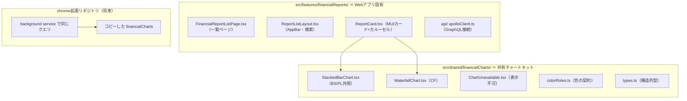

# フロントエンド（一覧ページ + 共有チャートキット）

## ディレクトリの分け方 = 共有できるか否か



## 共有チャートキットの規約（`src/shared/financialCharts/README.md` にも記載）

| 規約 | 理由 |
|---|---|
| import は `react` と `recharts` のみ | 両リポジトリ共通の依存だけに絞る |
| `@/` エイリアス・codegen生成型・Redux・Router 禁止 | アプリごとの設定に依存させない |
| 型は構造的型（`types.ts`）で受ける | codegen生成型と構造が一致するため**変換なしで代入できる** |
| スタイルはコンポーネント内で完結 | 外部CSSを要求しない |

→ Chrome拡張側は**このディレクトリをコピーして同じクエリ結果を渡すだけ**。科目別チャート部品（balanceSheetBarChart / profitLossBarChart / cashFlowBarChart…）を両リポジトリで二重保守する状態が解消される。

### 拡張側実装時のTODO（コードレビュー指摘・忘れ防止）

- [ ] `manifest.ts` の `host_permissions` を `'https://investee.info/*'` に修正
      （現状の `'https://investee.info/'` はパス `/` のみにマッチし `/api/graphql` を許可しない）
- [ ] 拡張の `codegen.ts` に `scalars: { Money: 'number' }` を追加
      （無いとMoneyが `any` になる）。schemaが本番introspectionのため、
      `financialReports` の本番デプロイ前はローカルdockerのschemaを指す等の対応が必要
- [ ] クエリは拡張の流儀（`documents: '**/*.graphql'`）に合わせて `.graphql` ファイルで置く

## フロントが科目を知らない、の実装

recharts は「行の配列 × 固定dataKey」を要求するが、こちらはバーごとにセグメント列が違う。`toStackRows` が「行 = バー、列 = 全セグメントkeyの和集合」に変換する:

```
API（bars×segments）                     recharts（rows×columns）
借方: [原価, 販管費]          →          rows: [{ name:"借方", costOfSales: 1.57兆, sga: 1.08兆 },
貸方: [収益, 税引前損失]                        { name:"貸方", revenue: 4.5兆, lossBeforeTax: 0.14兆 }]
                                         columns: [costOfSales, sga, revenue, lossBeforeTax]
                                         ※ あるバーに無いkeyはundefined → その行には描かれない
```

- ラベル・色・積み上げ順はすべてAPI由来（`label` / `colorRole` / 配列順）
- 新形式が増えても**フロントの変更はゼロ**。唯一変更が要るのは新しい `colorRole` 値の
  追加時に `colorRoles.ts` へ1行（意図的な契約変更）

## 見た目は既存ページと同一

| 要素 | 実装 |
|---|---|
| AppBar（自動切替・キャッシュフロー・証券コード検索・infoアイコン） | `ReportListLayout` が既存 `DefaultLayout` と同じMUI構成。CF選択肢は既存の `cashFlowTypes` 定数を再利用 |
| カード（企業名→株探リンク・期間・カルーセル3枚） | 既存 `AppCarousel`（自動切替はReduxを共有）+ MUI Card |
| チャートの寸法・配色・ツールチップ | 既存と同じ 90%×400・同じカラーコード・`#F6F4EB` ツールチップ |
| CFの棒 | 正= `#A1C2F1` / 負= `#FF9EAA`・値ラベルを棒の上に表示（既存と同じ） |

既存との差分は2つだけ:
- サブヘッダに日本基準以外のとき `（連結・IFRS）` と基準を表示
- 表示不可のとき業種ハードコードでなく APIの `note` を表示

## 一覧ページの状態管理

```
URLクエリが唯一の検索状態:  /?stock-codes=7203,4502&cash-flow-type=healthy
   ├→ GraphQL変数へ変換（cashFlowTypeRequestMap を再利用）
   └→ URLで検索結果を共有・ブックマークできる（Redux不使用。自動切替のみ既存スライス共有）

無限スクロール: Apollo typePolicies の merge で offset 違いの結果を連結
               （専用ApolloClientをこのページ配下だけに提供し、他と独立に保つ）
```

## 本番デプロイ時の確認事項

- **nginxのSPAフォールバック**: 一覧ページへの直アクセス・リロードが index.html に
  フォールバックする必要がある（`try_files $uri /index.html;` 相当）。リポジトリ内の `web/` は開発用のdevサーバproxy（devサーバが自前でフォールバックする）のため、この問題は本番のnginx設定側でのみ起きる。デプロイ前に`https://investee.info/` の直アクセスとリロードを確認すること

## codegen

- スキーマは起動中のバックエンドから introspection（既存の `codegen.ts` 方式のまま）
- 追加設定は `scalars: { Money: 'number' }` のみ（金額はJSON数値で届く）
- クエリ定義は `src/features/financialReports/api/financialReportsQuery.tsx`。
  変更したら `docker compose exec appfront npm run compile`
