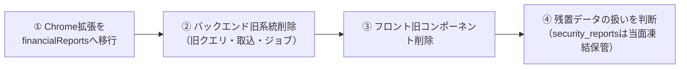

# 旧系統の削除・変更リスト（新系統の安定確認後に実施）

2026-08-02の切替で**旧系統はコードとして残したまま停止**した（日次cronは`DailyIngestionJob`のみ、
画面は`/`が新一覧・旧ページはルーティングなし）。新系統の安定を確認できたら、
このリストを上から潰して旧系統を削除する。

## 大前提

- **データは削除しない**。`security_reports`テーブルはそのまま残す
  （旧cron停止に伴い2026-08-02時点の内容で凍結。閲覧・検証用）
- `companies`テーブルは**新系統（`Disclosure::Company`）が使用中**のため削除・変更禁止
- **Chrome拡張が`companyFinancialStatements`クエリを使用中**。拡張が`financialReports`へ
  移行し、ストア審査を通過してユーザーに行き渡るまで、バックエンドの旧クエリ系統は削除禁止
  （拡張のデータソース`security_reports`は凍結済みのため、移行が遅れるほど拡張の表示は古くなる）

## 削除の順序

## ② バックエンド（application/backend）

削除するファイル:

- [ ] `app/services/security_report/subscriber_service.rb` / `fetcher_service.rb`
- [ ] `app/repositories/security_report/reader_repository.rb` / `document_repository.rb`
- [ ] `app/jobs/security_report_subscriber_job.rb`
- [ ] `app/models/security_report.rb`
- [ ] `app/models/company.rb`（トップレベルの旧モデル。`Disclosure::Company`と同じテーブルを指す別クラス）
- [ ] `app/graphql/types/financial_statement/` 配下すべて（旧クエリの型ツリー）
- [ ] `lib/app_file/xml_parser.rb`（REXML依存。`Xbrl::Document`に置換済み）

変更するファイル:

- [ ] `app/graphql/types/query_type.rb`: `companyFinancialStatements` フィールドと
      そのresolverメソッドを削除（**スキーマ破壊変更 — ①完了が前提**）
- [ ] `Gemfile`: `gem 'rexml'` を削除（xml_parser.rbと同時。`bundle install`でlock更新）

削除しないもの（新系統が使用中）:

`Disclosure::*` / `Ingestion::*` / `Charts::*` / `Xbrl::Document` / `Edinet::Client` /
`FinancialStatements::ItemCodes` / `Resolvers::FinancialReports` / `Types::Chart::*` /
`Types::MoneyType` / `Types::CashFlowSignType` / `DailyIngestionJob` / `lib/tasks/ingestion.rake`

## ③ フロントエンド（application/frontend）

削除するファイル:

- [ ] `src/pages/financialStatementList/` 一式（旧一覧ページ）
- [ ] `src/layouts/default/` 一式（旧AppBar。`ReportListLayout`に置換済み）
- [ ] `src/components/balanceSheetBarChart/` / `profitLossBarChart/` / `cashFlowBarChart/` /
      `waterFlowBarChart/` / `financialStatementBarChart/` / `chartAlternative/`
      （科目別チャート部品。`shared/financialCharts`に置換済み）
- [ ] `src/plugins/apollo/service.ts`（旧クエリ用クライアント。新系統は`features/financialReports/apolloClient.ts`）
- [ ] `src/store/slices/financialStatementFilterSlice.ts`（検索条件はURLクエリに移行済み）

変更するファイル:

- [ ] `src/store/store.ts`: `financialStatementFilter` slice の登録を削除（`autoPlayStatus`は残す）
- [ ] `src/constants/values.ts`: 旧チャート専用の定数を削除
      （`barChartWidth` / `barChartHeight` / `tooltipStyle` / `stackLabelListFillColor`）

削除しないもの（新系統が使用中）:

| モジュール | 新系統での用途 |
|---|---|
| `src/components/appCarousel/` | `ReportCard`のカルーセル |
| `src/store/store.ts` + `slices/autoPlayStatusSlice.ts` | カルーセル自動切替の共有状態 |
| `src/constants/values.ts` の `financialStatementOffsetUnit` / `autoPlayStatusLocalStorageKey` / `cashFlowTypes` / `cashFlowTypeRequestMap` | ページサイズ・自動切替・CFプリセット |
| `src/plugins/firebase/` / `src/plugins/utils/` | アナリティクス等 |
| `src/shared/financialCharts/` / `src/features/financialReports/` | 新系統本体 |

## ④ データ・インフラ

- [ ] `security_reports` の扱いを判断（当面は凍結保管。消す場合もバックアップを取ってから）
- [ ] 判断済みまで**何もしない**（`drop_table`のマイグレーションは作らない）

## 削除後の確認

- [ ] `bundle exec rspec` 全合格 / `rails zeitwerk:check`
- [ ] `npx tsc --noEmit` / webpackビルド成功
- [ ] `/` の表示・検索・無限スクロール、`/api/graphql` の `financialReports`
- [ ] Chrome拡張の表示（②の後）
