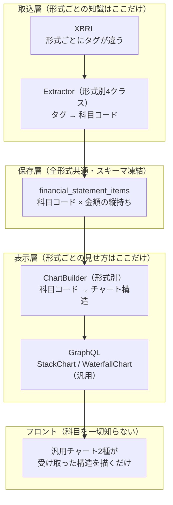

# 財務3表チャート 新アーキテクチャ（実装済み）

このディレクトリは**実際に動いているコード**の構造とその意図を説明する。

## 何が問題だったか

| Before | 何が起きるか |
|---|---|
| 取込が日本基準タグ（`jppfs_cor`）のみ対応 | IFRS企業（武田・商社・NTT等の主要企業）の連結が**0円で保存**され表示できない |
| 銀行・電力は非対応 | フロントで業種コードをハードコードして**グラフを出さない**分岐 |
| `security_reports` が横持ち約60カラム | 会計基準・業種を増やす = **スキーマ変更 + 取込 + API + フロント全層改修** |
| フロントが科目名を知っている（科目別チャート部品） | 新形式のたびにチャートコンポーネントが増える。Chrome拡張にも同じ部品の複製がある |

## 解決の骨子: 3層で「知識」を分離する

「XBRLの科目」と「グラフの見た目」を直接結合させず、間に**正規化した科目コード**と**汎用チャート契約**を置く。



**新形式（例: 日本基準の保険業）を追加するときに触るもの:**

| 層 | 作業 | 変更規模 |
|---|---|---|
| 取込 | Extractorクラスを1つ追加 + 判定表に1行 | ファイル追加のみ |
| DB | **なし**（マイグレーション不要） | 0 |
| 表示 | Builderクラスを1〜2つ追加 + 対応表に1行 | ファイル追加のみ |
| GraphQL / フロント / Chrome拡張 | **なし** | 0 |

## 対応形式（presentation_format）

形式 = 「会計基準 × 表示様式」。会計基準だけでは決まらない（同じIFRSでもBSの様式が2種ある）。

| 形式 | 対象 | 実測に使った企業（2026年提出有報） |
|---|---|---|
| `jgaap_general` | 日本基準・一般事業会社 | 従来から表示できていた全企業 |
| `jgaap_bank` | 日本基準・銀行 | 三菱UFJ FG |
| `ifrs_classified` | IFRS・流動/非流動分類BS | 武田薬品・三菱商事・NTT |
| `ifrs_liquidity` | IFRS・流動性配列BS | 楽天グループ・東京海上HD |
| `unsupported` | US GAAP等 | チャートの代わりに説明文を表示（正常系） |

## コードの場所

```
application/backend
  app/lib/
    financial_statements/item_codes.rb   # 科目コードレジストリ（唯一の科目一覧）
    edinet/client.rb                     # EDINET API（外部I/Oはここだけ）
    xbrl/document.rb                     # XBRLのfact検索プリミティブ
  app/models/disclosure/                 # 新テーブルのモデル（Disclosure名前空間）
  app/services/
    ingestion/                           # 形式判定・Extractor・取込
    charts.rb + charts/                  # ChartBuilder（チャート構造の組み立て）
    disclosure/search_query.rb           # 一覧検索（CF符号・証券コード）
  app/graphql/
    resolvers/financial_reports.rb       # 新クエリ financialReports
    types/chart/                         # StackChart / WaterfallChart 型
application/frontend
  src/shared/financialCharts/            # 汎用チャートキット（Chrome拡張と共有可能）
  src/features/financialReports/         # 一覧ページ（Webアプリ固有）
```

## ドキュメント構成

| ファイル | 内容 |
|---|---|
| [01_data_model.md](01_data_model.md) | DBスキーマ・縦持ちの実データ例・「行がない=開示なし」の規約 |
| [02_ingestion.md](02_ingestion.md) | 取込パイプライン・形式判定・Extractor・新形式の追加手順 |
| [03_serving.md](03_serving.md) | ChartBuilder・チャート契約（GraphQL）・実レスポンス例 |
| [04_frontend.md](04_frontend.md) | 汎用チャートキット・Chrome拡張との共通化方針・一覧ページ |
| [05_deviations.md](05_deviations.md) | 設計段階からの変更点とその理由（実装時の判断記録） |
| [06_xbrl_format_research.md](06_xbrl_format_research.md) | 6社・4形式の実XBRL調査結果（タグ・実測値。スペックの期待値の出典） |
| [07_legacy_cleanup.md](07_legacy_cleanup.md) | 旧系統（SecurityReport系）の削除・変更リストと実施順序 |

## 旧系統（SecurityReport系）との関係

2026-08-02に切替済み。**旧系統はコードとして残置したまま停止**している。

| | 旧系統（停止・残置） | 現行 |
|---|---|---|
| テーブル | `security_reports`（2026-08-02時点で凍結・削除しない） | `companies`（共用）+ `reports` / `financial_statements` / `financial_statement_items` |
| GraphQL | `companyFinancialStatements`（Chrome拡張の移行完了まで提供継続） | `financialReports` |
| 画面 | ルーティングなし（コードのみ残置） | `/` |
| 日次バッチ | cron解除済み | `DailyIngestionJob`（毎日2:00） |

旧系統の削除・変更リストと実施順序は [07_legacy_cleanup.md](07_legacy_cleanup.md)。
