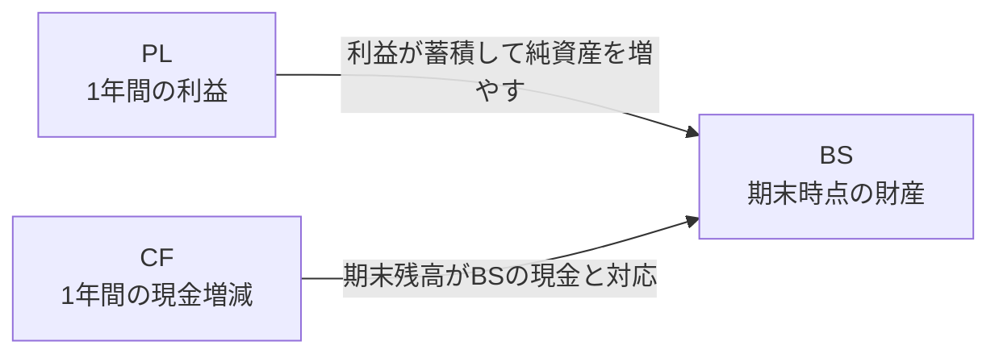

# 01. 財務・開示の基礎知識

このシステムが扱うデータそのものの話。会計やディスクロージャー制度になじみがない人向けに、
「上場企業の財務情報が、どんな形式で、どこから手に入るのか」を順に説明する。

## 財務3表とは

企業の財政状態と経営成績を表す3種類の書類。上場企業は法律に基づきこれを開示している。

| 表 | 正式名称 | 何を表すか | 性質 |
|---|---|---|---|
| BS | 貸借対照表（IFRSでは財政状態計算書） | ある時点で、企業が何を持っていて（資産）、その調達源泉は何か（負債・純資産） | ある一時点の残高（ストック） |
| PL | 損益計算書 | 1年間で、どれだけ売り上げ、費用を使い、いくら儲けたか | 期間の集計（フロー） |
| CF | キャッシュフロー計算書 | 1年間で、現金がどの活動でいくら増減したか | 期間の集計（フロー） |

### BS（貸借対照表）

左側（借方）に資産、右側（貸方）に負債と純資産を並べ、**左右の合計は必ず一致する**
（資産 = 負債 + 純資産）。これがBSを積み上げ棒グラフ2本で描ける理由でもある。

```
┌─────────────┬─────────────┐
│  流動資産    │  流動負債     │  流動  = 1年以内に現金化・支払期限が来るもの
│             ├─────────────┤
│─────────────│  固定負債    │  固定  = それより長期のもの
│  固定資産    ├─────────────┤
│             │  純資産      │  純資産 = 返す必要のない自己資本
└─────────────┴─────────────┘
   資産（借方）     負債・純資産（貸方）
```

- 負債が資産を上回り純資産がマイナスになった状態を**債務超過**と呼ぶ
  （このシステムでは3本目のバーとして特別に描画する。詳細は[02章](02_product.md)）
- 銀行業は流動・固定の区分を持たない独自の様式（貸出金・預金など）で開示する

### PL（損益計算書）

「売上（収益）− 費用 = 利益」の構造。利益にはいくつか段階があり、このシステムでは
本業の儲けを表す**営業利益**（銀行は経常利益、IFRSは税引前利益）までを扱う。
売上より費用が大きければ**営業損失**（赤字）になる。

### CF（キャッシュフロー計算書）

PLの利益は会計上の計算値であり、現金の動きとは一致しない（掛け売り・減価償却など）。
CFは現金の増減だけを3つの活動に分けて示す。

| 区分 | 内容 | プラスの意味 / マイナスの意味 |
|---|---|---|
| 営業CF | 本業での現金の出入り | 本業で現金を稼げている / 本業で現金が流出している |
| 投資CF | 設備・株式などへの投資と回収 | 資産を売却して現金回収 / 将来のために投資している |
| 財務CF | 借入・返済・増資・配当 | 資金を調達している / 借入返済や配当で流出している |

期首の現金残高に3区分の増減を足すとおおむね期末残高になる
（為替換算差額があるため厳密には一致しない。この点はチャート実装にも影響する）。

### 3表のつながり



## 有価証券報告書とは

上場企業が金融商品取引法に基づいて**事業年度ごとに提出する開示書類**（通称: 有報）。
財務3表のほか、事業の状況・役員・株主構成なども含む。決算期末から3か月以内に提出される
ため、3月決算企業の有報は6月に集中する（取込件数が6月に跳ね上がる理由）。

提出後に誤りが見つかると**訂正有価証券報告書**（訂正有報）が別書類として提出される。
同じ会計期間のデータを上書きする必要があるため、取込処理はこれを前提に設計されている。

## EDINETとは

金融庁が運営する開示書類の電子開示システム。誰でも閲覧でき、**EDINET API**（v2）を使うと
プログラムから書類一覧の取得・書類のダウンロードができる。APIキーは無料で発行できる。

| APIでの呼び方 | 意味 |
|---|---|
| docID（書類管理番号） | 書類1件を特定するID（例: `S100YB5L`。英数8桁） |
| docTypeCode `120` | 有価証券報告書 |
| docTypeCode `130` | 訂正有価証券報告書 |
| EDINETコード | 提出者（企業）を特定する不変のID（例: `E01234`。英字1桁+数字5桁） |

制約として、**短時間に大量リクエストすると403エラーで遮断される**。このシステムの取込が
並列化せず、書類ごとに間隔を空けて逐次実行しているのはこのため。

## XBRLとは

有報の財務データが機械可読な形で埋め込まれている、XMLベースの国際標準形式。
EDINETからダウンロードできるzipの中にXBRLファイルが入っている。

XBRLの中身は「fact（事実）」の集まりで、1つのfactは次の組で構成される。

| 構成要素 | 内容 | 例 |
|---|---|---|
| 要素名（タグ） | 何の数値か | `jppfs_cor:Assets`（資産合計） |
| コンテキスト | いつ時点/どの期間か、連結か単体か | `CurrentYearInstant`（当期末時点） |
| 値 | 金額など | `1234567000` |

### タクソノミと名前空間

使ってよいタグの辞書を**タクソノミ**と呼び、金融庁が定義している。タグは名前空間で
分類されており、このシステムが読むのは以下の4つ。**どの名前空間のタグが使われるかは
会計基準によって変わる**点が、このシステムの設計を貫く重要な事実になっている。

| 名前空間 | 内容 |
|---|---|
| `jpdei_cor` | DEI（書類情報）。会計基準・EDINETコード・連結の有無・会計期間など書類のメタ情報 |
| `jpcrp_cor` | 有報共通の記載項目（表紙の企業名・提出日など） |
| `jppfs_cor` | **日本基準**の財務諸表本表のタグ |
| `jpigp_cor` | **IFRS**の財務諸表本表のタグ |

このほか企業が独自に定義する「企業拡張タグ」も存在するが、企業ごとに意味の保証がない
ため、このシステムは意図的に読まない（詳細は[13章](13_taxonomy_mapping.md)）。

### コンテキスト

同じタグでも「当期末なのか前期末なのか」「連結なのか単体なのか」で別のfactになる。

| コンテキストID | 意味 |
|---|---|
| `CurrentYearInstant` | 当期末時点（BS項目に使う） |
| `CurrentYearDuration` | 当期の期間（PL・CF項目に使う） |
| `Prior1YearInstant` | 前期末時点（CFの期首残高に使う） |
| 上記 + `_NonConsolidatedMember` | 単体（サフィックスなしは連結） |

## 会計基準と開示様式

### 3つの会計基準

財務諸表の作成ルール。どの基準で作られたかはDEIタグ `AccountingStandardsDEI` に書かれている。

| 基準 | DEI上の値 | 概要 | このシステムでの扱い |
|---|---|---|---|
| 日本基準 | `Japan GAAP` | 日本の会計基準。大半の上場企業が採用 | 対応済み |
| IFRS | `IFRS` | 国際会計基準。グローバル企業を中心に採用が増加 | 対応済み（連結） |
| 米国基準 | `US GAAP` | 米国会計基準。採用は少数 | 未対応（本表タグがEDINETタクソノミに存在しないため） |

押さえておくべき事実:

- **IFRS採用企業でも、単体財務諸表は日本基準（`jppfs_cor`）でタグ付けされる**。
  IFRSが求められるのは連結のみのため
- IFRSのBSには様式が2種類ある。流動/非流動に区分する**分類様式**と、区分せず流動性の
  高い順に並べる**流動性配列**（金融業に多い）。DEIでは区別できず、タグの実在で判定する

### 業種別様式

日本基準でも、銀行・保険など一部の業種は業法に基づく独自の様式で開示する。
どの業種様式かはDEIの業種コードでわかる（例: `bnk`=銀行、`INS`=保険、`cte`=一般と同等）。
銀行は対応済み、保険は未対応（詳細な対応状況は[02章](02_product.md)）。

## 連結と単体

- **連結**財務諸表: 子会社を含む企業グループ全体の数値。投資判断では通常こちらを見る
- **単体**財務諸表: 提出企業1社のみの数値

このシステムは連結を優先し、連結を作成していない企業のみ単体を表示する。

## 証券コードとEDINETコード

| ID | 桁数 | 性質 |
|---|---|---|
| 証券コード | 一般に4桁（例: 7203） | 株式市場で使うコード。**EDINET上は末尾に0を付けた5桁**（例: 72030）で記録される |
| EDINETコード | 英字1桁+数字5桁 | EDINETでの提出者ID。証券コードと違い変わらないため、企業マスタの主キーに使っている |

UIでは4桁で検索させ、内部で5桁に変換して照合する。逆に表示時は5桁から末尾0を落とす。

---

次章: [02. プロダクト仕様](02_product.md) — この知識を使って、investeeが何をどう見せるかを説明する。
