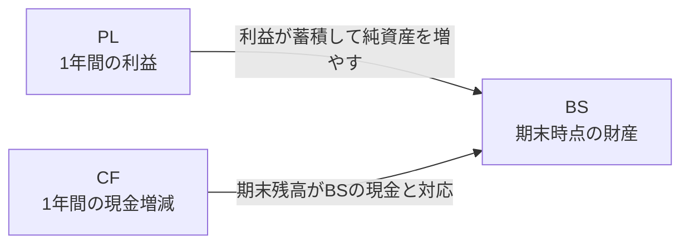

# 01. 財務・開示の基礎知識

財務諸表の基本と、EDINETから取得する開示データの用語を説明する。

## 財務3表とは

企業の財政状態と経営成績を表す3種類の書類。上場企業は法律に基づきこれを開示している。

| 表 | 正式名称 | 何を表すか | 性質 |
|---|---|---|---|
| BS | 貸借対照表（IFRSでは財政状態計算書） | ある時点で、企業が何を持っていて（資産）、その調達源泉は何か（負債・純資産） | ある一時点の残高（ストック） |
| PL | 損益計算書 | 1年間で、どれだけ売り上げ、費用を使い、いくら儲けたか | 期間の集計（フロー） |
| CF | キャッシュフロー計算書 | 1年間で、現金がどの活動でいくら増減したか | 期間の集計（フロー） |

### BS（貸借対照表）

左側（借方）に資産、右側（貸方）に負債と純資産を並べ、**左右の合計は必ず一致する**（資産 = 負債 + 純資産）。これがBSを積み上げ棒グラフ2本で描ける理由でもある。

```
┌─────────────┬─────────────┐
│  流動資産    │  流動負債     │  流動  = 1年以内に現金化・支払期限が来るもの
│             ├─────────────┤
│─────────────│  固定負債    │  固定  = それより長期のもの
│  固定資産    ├─────────────┤
│             │  純資産      │  純資産 = 資産から負債を引いた額
└─────────────┴─────────────┘
   資産（借方）     負債・純資産（貸方）
```

- 負債が資産を上回り純資産がマイナスになった状態を**債務超過**と呼ぶ
- 銀行のBSは、貸出金・預金など業務に応じた項目で構成される

### PL（損益計算書）

「売上（収益）− 費用 = 利益」の構造。売上を「何に使ったか（費用）+ 残った儲け（利益）」に分解して左右に並べると、BSと同じく**左右の合計は必ず一致する**。これがPLも積み上げ棒グラフ2本で描ける理由になる。

```
┌─────────────┬─────────────┐
│  売上原価    │             │  売上原価 = 商品・サービスを作るのにかかった費用
├─────────────┤             │
│  販管費      │  売上高      │  販管費  = 売る・管理するのにかかった費用
├─────────────┤             │
│  営業利益    │             │  営業利益 = 差し引きで残った本業の儲け
└─────────────┴─────────────┘
   費用 + 利益（借方）  売上（貸方）
```

利益には営業利益・経常利益・税引前利益などの段階がある。本業の収益から費用を引いた額が営業利益で、マイナスなら営業損失となる。

### CF（キャッシュフロー計算書）

PLの利益は会計上の計算値であり、現金の動きとは一致しない（掛け売り・減価償却など）。CFは現金の増減だけを3つの活動に分けて示す。

| 区分 | 内容 | プラスの意味 / マイナスの意味 |
|---|---|---|
| 営業CF | 本業での現金の出入り | 本業で現金を稼げている / 本業で現金が流出している |
| 投資CF | 設備・株式などへの投資と回収 | 資産を売却して現金回収 / 将来のために投資している |
| 財務CF | 借入・返済・増資・配当 | 資金を調達している / 借入返済や配当で流出している |

現金が期首から期末までにどう増減したかを、階段状に示したものがウォーターフォールグラフ。以下は説明用の例（█ = 残高・増加、▒ = 減少、1マス = 10）。

```
期首残 ██████████            100
営業CF           ███         +30
投資CF            ▒▒         -20
財務CF           ▒           -10
期末残 ██████████            100
```

増減のバーが「直前の残高の高さから」浮いて始まるのが特徴で、現金がどこで増えてどこで減ったかを一目で追える。なお実際には為替換算差額があるため「期首 + 3区分 = 期末」は厳密には一致しない。

### 3表のつながり



## 会計基準と開示様式

### 3つの会計基準

財務諸表の作成ルール。どの基準で作られたかは提出データに機械可読な形で記録されている。

| 基準 | 提出データ上の値 | 概要 | このシステムでの扱い |
|---|---|---|---|
| 日本基準 | `Japan GAAP` | 日本の会計基準。大半の上場企業が採用 | 対応済み |
| IFRS | `IFRS` | 国際会計基準。グローバル企業を中心に採用が増加 | 対応済み（連結） |
| 米国基準 | `US GAAP` | 米国会計基準。採用は少数 | 未対応 |

- **IFRS採用企業でも、単体財務諸表は日本基準で作成される**。IFRSが求められるのは連結のみのため
- IFRSのBS様式2種（下表）は提出データの属性からは区別できず、実データの中身で判定する

### 会計基準 × 業種で決まる財務諸表の形

会計基準が同じでも、業種によって科目や並び方が異なる。銀行・保険は事業に合わせた様式を持ち、IFRSにも2種類のBSがある。

| 形式 | BSの構成 | このサイトのPLで使う利益 |
|---|---|---|
| 日本基準・一般事業会社 | 流動資産・固定資産、流動負債・固定負債・純資産 | 営業利益 |
| 日本基準・銀行 | 貸出金・預金など。流動・固定に分けない | 経常利益 |
| 日本基準・保険 | 有価証券・保険契約準備金など | 経常利益 |
| IFRS・分類様式 | 流動・非流動に分ける。純資産に相当する部分を「資本」と呼ぶ | 税引前利益 |
| IFRS・流動性配列 | 現金など、流動性の高い順に並べる | 税引前利益 |

銀行のBSの例。主要な科目だけを示す。

```
┌─────────────┬─────────────┐
│  現金預け金   │             │
├─────────────┤  預金        │
│  貸出金      │             │
├─────────────┼─────────────┤
│  有価証券    │  その他負債   │
├─────────────┼─────────────┤
│  その他資産   │  純資産      │
└─────────────┴─────────────┘
   資産（借方）    負債・純資産（貸方）
```

IFRSのBSは2様式ある。分類様式は一般事業会社の図と同じ枠組みで、名称だけが変わる（固定 → 非流動、純資産 → 資本）。

```
┌─────────────┬─────────────┐
│  流動資産    │  流動負債     │
│             ├─────────────┤
├─────────────┤  非流動負債   │
│  非流動資産   ├─────────────┤
│             │  資本        │
└─────────────┴─────────────┘
   資産（借方）    負債・資本（貸方）
```

流動性配列は流動/非流動の区分の枠がなく、現金及び現金同等物を先頭に流動性の高い順で科目が並ぶ。

```
┌─────────────┬─────────────┐
│  現金同等物   │  負債       │
├─────────────┤ （区分なし）  │
│  営業債権    │             │
├─────────────┼─────────────┤
│  …          │  資本        │
│ （流動性順）  │             │
└─────────────┴─────────────┘
   資産（借方）    負債・資本（貸方）
```

IFRSのPLは、企業によって費用の分け方が異なる。ここでは、売上収益から費用を引いて税引前利益に至る関係を示す。

```
┌─────────────┬─────────────┐
│  売上原価    │             │
├─────────────┤             │
│  販管費など  │  売上収益    │
├─────────────┤             │
│  税引前利益   │             │
└─────────────┴─────────────┘
   費用 + 利益（借方）  売上収益（貸方）
```

## 連結と単体

- **連結**財務諸表: 子会社を含む企業グループ全体の数値。投資判断では通常こちらを見る
- **単体**財務諸表: 提出企業1社のみの数値

このシステムは連結を優先し、連結を作成していない企業のみ単体を表示する。

## 有価証券報告書とは

- 上場企業が金融商品取引法に基づいて**事業年度ごとに提出する開示書類**（通称: 有報）。財務3表のほか、事業の状況・役員・株主構成なども含む
- 決算期末から3か月以内に提出されるため、3月決算企業の有報は6月に集中する（取込件数が6月に跳ね上がる）
- 提出後に誤りが見つかると**訂正有価証券報告書**（訂正有報）が別書類として提出される。元の有報と同じ企業・会計期間に対する訂正として扱う

## EDINETとは

- 金融庁が運営する開示書類の電子開示システム。誰でも閲覧できる
- **EDINET API**（v2）を使うとプログラムから書類一覧の取得・書類のダウンロードができる（[API仕様書](https://disclosure2dl.edinet-fsa.go.jp/guide/static/disclosure/download/ESE140206.pdf)）。APIキーは[アカウント登録ページ](https://api.edinet-fsa.go.jp/api/auth/index.aspx?mode=1)で無料で発行できる

| API上の用語 | 何を指すか |
|---|---|
| docID（書類管理番号） | 書類1件を特定するID（例: `S100YB5L`。英数8桁） |
| docTypeCode `120` | 有価証券報告書 |
| docTypeCode `130` | 訂正有価証券報告書 |
| EDINETコード | 提出者（企業）を特定する不変のID（例: `E01234`。英字1桁+数字5桁） |

## 証券コードとEDINETコード

| ID | 桁数 | 性質 |
|---|---|---|
| 証券コード | 一般に4桁（例: 7203。英字を含むコードもある: 391A） | 株式市場で使うコード。**EDINET上は末尾に0を付けた5桁**（例: 72030）で記録される |
| EDINETコード | 英字1桁+数字5桁 | EDINETでの提出者ID。証券コードと違い変わらないため、企業を識別するために使う |

画面では4桁で検索し、内部で5桁に変換して照合する。逆に表示時は5桁から末尾0を落とす。

## XBRLとは

- 有報の財務データが機械可読な形で埋め込まれている、XMLベースの国際標準形式。EDINETからダウンロードできるzipの中にXBRLファイルが入っている
- XBRLの中身は、「資産合計は431.7兆円」のような**数値1件ずつの記録**を大量に集めたもの
- この1件分の記録をXBRLの用語で**fact**と呼ぶ。1つのfactは次の3つの組で構成される

| 構成要素 | 内容 | 例 |
|---|---|---|
| 要素名（タグ） | 何の数値か | `jppfs_cor:Assets`（資産合計） |
| コンテキスト | いつ時点/どの期間か、連結か単体か | `CurrentYearInstant`（当期末時点） |
| 値 | 金額など | `431731548000000` |

実物のfactはXBRLファイルの中で次のようなXMLの1行になっている（三菱UFJの2026年3月期・連結の資産合計431.7兆円）:

```xml
<jppfs_cor:Assets contextRef="CurrentYearInstant" unitRef="JPY">431731548000000</jppfs_cor:Assets>
```

- 同じタグでも、コンテキスト（当期末か前期末か、連結か単体か）が違えば別のfactとして複数入っている
- 使ってよいタグの辞書は**タクソノミ**と呼ばれ、金融庁が定義している。タグは名前空間で分類され、**どの名前空間のタグが使われるかは会計基準によって変わる**（日本基準の本表は `jppfs_cor`、IFRSの本表は `jpigp_cor`）
- 会計基準・業種コード・連結の有無といった書類のメタ情報は、**DEI**と呼ばれる専用のタグ群に入っている
