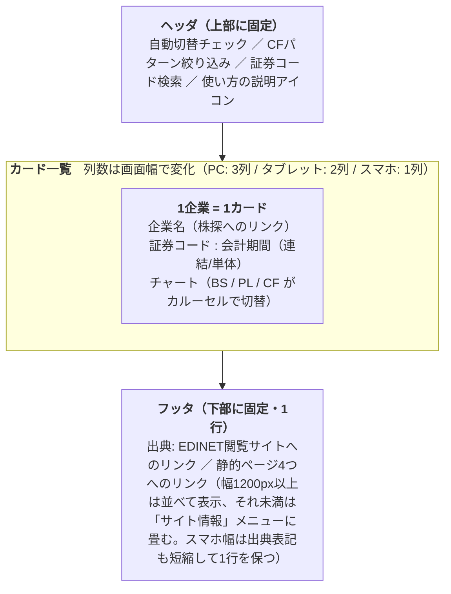

# 02. プロダクト仕様

investee（https://investee.info ）が、[01章](01_financial_knowledge.md)で説明したデータをどんな画面でどう見せるかを説明する。実装の話はせず、「何が起きるか」だけを扱う。

## investeeとは

上場企業の財務3表をグラフで一覧比較できるWebアプリ。EDINETに提出された有価証券報告書を毎日自動で取り込み、企業ごとにBS・PL・CFの3つのチャートをカード形式で表示する。

- 画面は一覧ページ1つ + サイト説明・規約系の静的ページ4つ（後述の「静的ページ」）。機能があるのは一覧ページだけ
- データは毎日2:00のバッチで前日提出分を自動追加（詳細は[04章](04_system.md)）
- 認証はなく、誰でも閲覧できる

## 画面構成と操作

画面は上から「ヘッダ」「カード一覧」「フッタ」の3段構成。



| 操作 | 挙動 |
|---|---|
| 証券コードで検索 | 4桁コードを複数入力できるタグ入力。入力するとその企業だけに絞り込む（最大100件） |
| CFパターンで絞り込み | 営業/投資/財務CFの正負の組合せ8種から選択（後述） |
| 自動切替 | カード内のチャートが6秒ごとにBS→PL→CFと自動で切り替わる。チェックを外すと停止 |
| 企業名クリック | 株探（[kabutan.jp](https://kabutan.jp/)）の該当銘柄ページを新しいタブで開く |
| スクロール | 末尾に近づくと次の30件を自動読込（無限スクロール） |

- 検索条件はURLクエリに反映される（例: `/?stock-codes=7203,4502&cash-flow-type=healthy`）。URLを共有すれば同じ絞り込み結果が再現できる
- 初回表示と検索条件の変更では、データ取得が終わるまでスピナーを表示する
- カードの見出しは「証券コード : 会計期間（連結/単体）」。日本基準以外のときだけ括弧内に「IFRS」「米国基準」を併記する（例:（連結・IFRS）。大半が日本基準のため、例外だけ表記する）
- 企業名は提出時点の社名を表示する（社名変更があっても過去の有報は当時の名前のまま）
- 並び順は提出日の新しい順

## チャートの読み方

### BS・PL: 積み上げ棒グラフ

借方と貸方を左右2本の積み上げ棒で並べる。[01章](01_financial_knowledge.md)で見たとおり両者の合計は一致するはずなので、**2本の高さが揃うことがデータの正しさの確認にもなる**。

| 表 | 左のバー（借方） | 右のバー（貸方） | セグメントのラベル |
|---|---|---|---|
| BS | 資産の内訳 | 負債の内訳 + 純資産 | 構成比%（総資産などを分母にした割合） |
| PL | 費用の内訳 + 営業利益（黒字時） | 売上 + 営業損失（赤字時） | 売上を100%とした割合 |

- セグメントにマウス（タッチ）を乗せると金額（円）がツールチップで出る
- **債務超過**の企業は3本目のバー「債務超過」が現れ、マイナスの純資産を可視化する
- 借方と貸方の合計が1割を超えてずれているデータは、誤解を招くグラフを出すより表示しない方が良いという判断で、チャート自体を非表示にする

### CF: ウォーターフォールグラフ

現金残高の推移を階段状に描く。

```
期首残 ──→ 営業CF ──→ 投資CF ──→ 財務CF ──→ 期末残
(絶対額)   (+で上へ)   (−で下へ)   (増減)     (絶対額)
```

- 「期首残」「期末残」は残高そのもの、間の3つは増減分
- 増加は青系、減少は赤系で塗り分ける
- 期末残は「期首残+3区分の合計」ではなく開示された実額を描く（為替換算差額などで一致しないことがあるため）

## CFパターンによる絞り込み

営業・投資・財務CFの正負（↑/↓）の組合せは8通りあり、企業の状況を推し量る古典的な見方が知られている。investeeではこの8通りに名前を付けて絞り込みに使う。

| パターン | 営業 | 投資 | 財務 | 一般的な解釈 |
|---|---|---|---|---|
| 健全型 | ↑ | ↓ | ↓ | 本業で稼ぎ、投資と借入返済に回せている |
| 積極型 | ↑ | ↓ | ↑ | 本業の稼ぎに加えて資金調達し、積極投資している |
| 安定型 | ↑ | ↑ | ↑ | 稼ぎながら資産売却・調達もして現金を厚くしている |
| 改善型 | ↑ | ↑ | ↓ | 稼ぎと資産売却で借入返済を進めている |
| 勝負型 | ↓ | ↓ | ↑ | 本業は赤字だが、調達した資金で投資している |
| リストラ型 | ↓ | ↑ | ↓ | 本業赤字を資産売却で補い、返済も進めている |
| 大幅見直し型 | ↓ | ↓ | ↓ | 全区分で現金流出。過去の蓄えで凌いでいる状態 |
| 救済型 | ↓ | ↑ | ↑ | 本業赤字を資産売却と外部調達の両方で支えている |

（解釈はあくまで一般的な財務分析の見方であり、アプリ内では名前と矢印のみを表示する）

## 静的ページ

一覧ページとは別に、サイトの説明・規約・連絡先を載せる文章中心のページが4つある。どのページからもフッタのリンクで行き来できる。
検索UIは持たず、ヘッダは「investee」ロゴと一覧ページへの「財務諸表を検索する」リンクだけ。

| URL | ページ | 内容 |
|---|---|---|
| `/about` | このサイトについて | サービス概要、データの出典と更新、数値の注意点、免責事項、運営者情報 |
| `/guide` | 財務三表の読み方 | BS・PL・CFの基本、各グラフの見方（一覧と同じチャート部品で描いた説明用の架空データつき）、CF8パターンの解釈、会計基準・業種による違い、使い方 |
| `/privacy` | プライバシーポリシー | Google Analytics・Google AdSenseでのCookie利用、お問い合わせフォーム（Googleフォーム）の入力内容の扱い、ブラウザに保存する設定、免責 |
| `/contact` | お問い合わせ | Googleフォームの埋め込み（メールアドレス等を公開しないため）と、報告時に添えてほしい情報 |

- 各ページは `<title>` と meta description・canonical をページごとに持つ（一覧ページはこれまでどおり `index.html` の値）
- 上記4つは静的 `sitemap.xml` にも列挙している。`ads.txt`（AdSense用）も `public/` から配信する
- 上記以外のURLはすべて一覧ページとして扱う（従来どおり。404ページはない）

## 対応している形式と「表示に対応していません」

表示できるかどうかは「会計基準 × 開示様式」の組合せ（**形式**と呼ぶ）で決まる。

| 形式 | 対象 | 状態 |
|---|---|---|
| `jgaap_general` | 日本基準・一般事業会社（建設・鉄道・電気・ガス・海運・電気通信・証券・特定金融・商品先物・投資業など、業種別の勘定科目を持つが骨格が同じ業種を含む） | 対応済み |
| `jgaap_bank` | 日本基準・銀行 | 対応済み |
| `jgaap_insurance` | 日本基準・保険（生保・損保） | 対応済み |
| `ifrs_classified` | IFRS・流動/非流動分類のBS | 対応済み |
| `ifrs_liquidity` | IFRS・流動性配列のBS | 対応済み |
| `ifrs_summary` | IFRS・詳細タグなし（詳細タグ付けが義務化された2019年3月期より前の有報。本表のタグが収録されていない） | 経営指標サマリからPL・CFを表示。BSは説明文 |
| `unsupported` | 米国基準（本表のタグがEDINETタクソノミにない） | チャートの代わりに説明文を表示 |

`unsupported` は**エラーではなく正常系**として設計されている。未対応の形式や、必要な科目が開示されていないデータ（企業独自の拡張タグでしか開示されていない収益など）は、チャート枠と同じ大きさの領域に「この会計基準・業種の財務諸表は表示に対応していません。」などの説明文を出す。判定の仕組みと説明文がどう決まるかは[03章](03_data_flow.md)で説明する。

---

次章: [03. 財務データのつながり](03_data_flow.md) — この仕様を実現しているデータの流れを見る。
