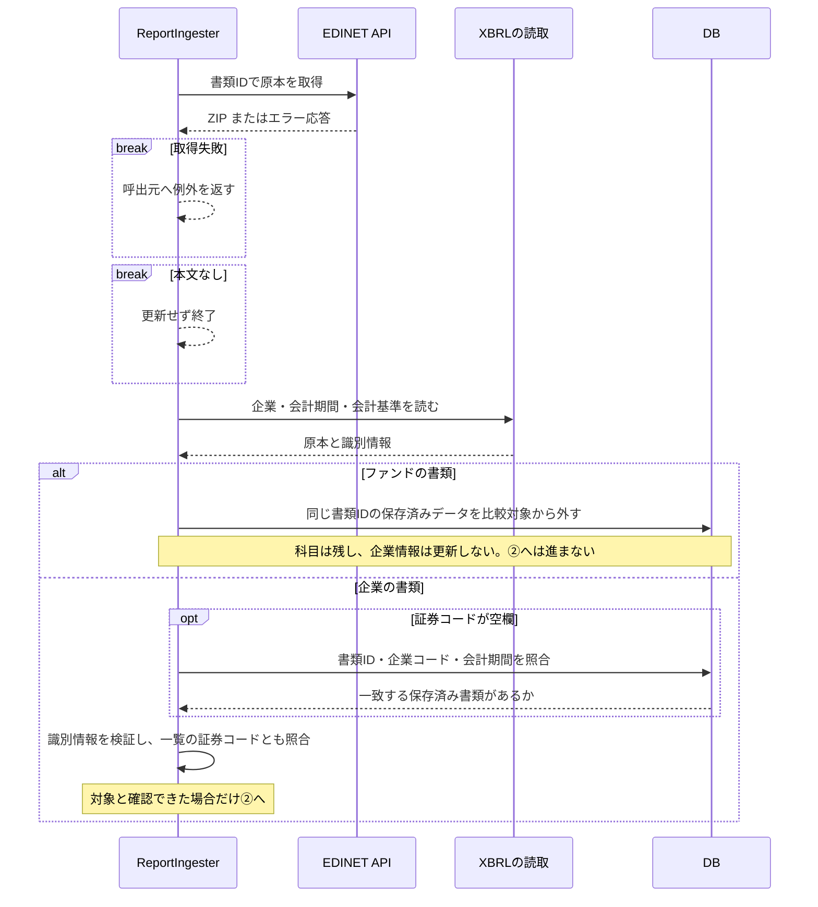
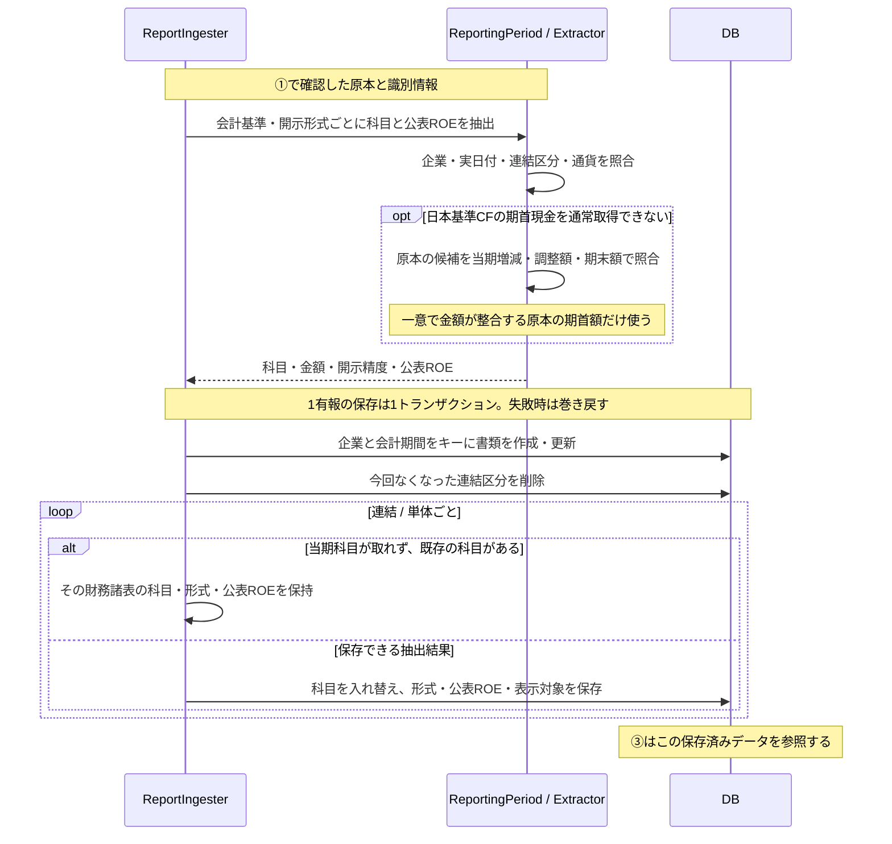
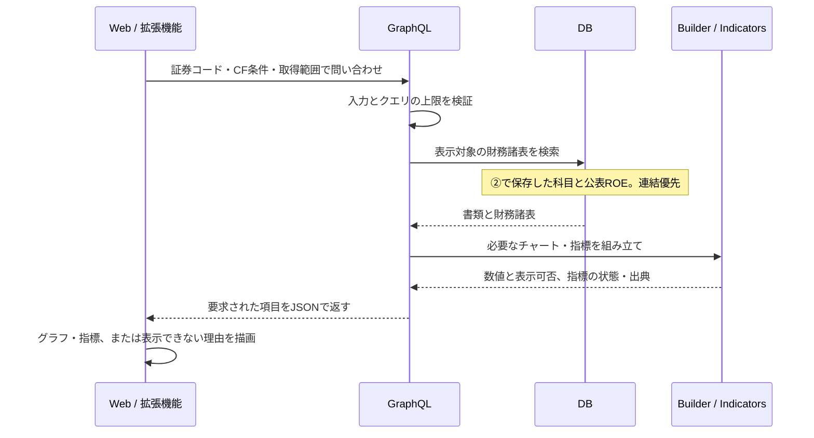
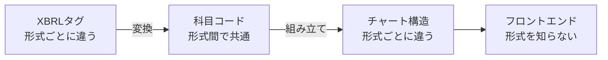
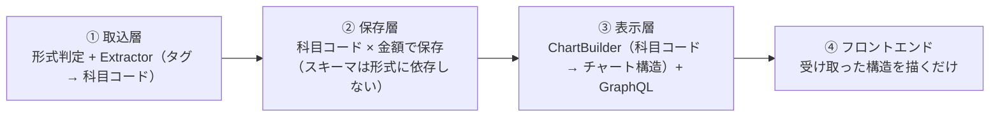
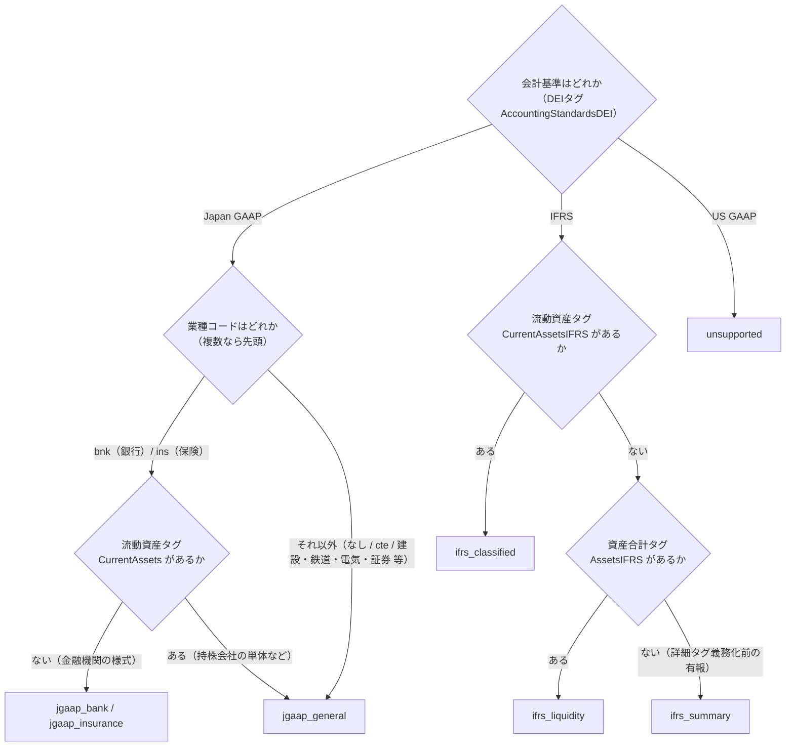
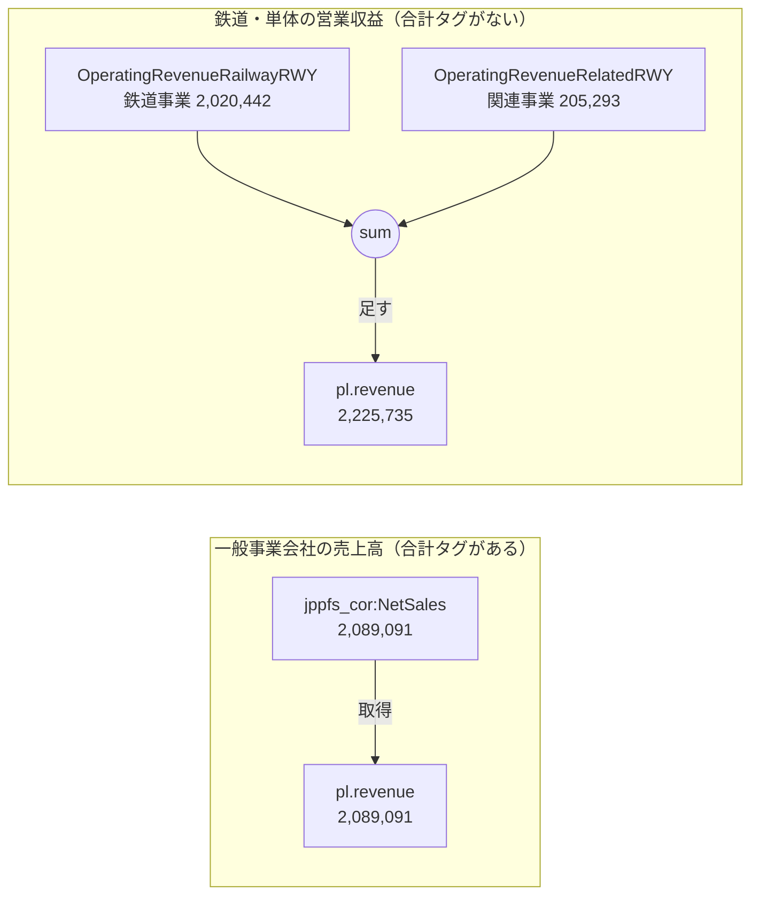
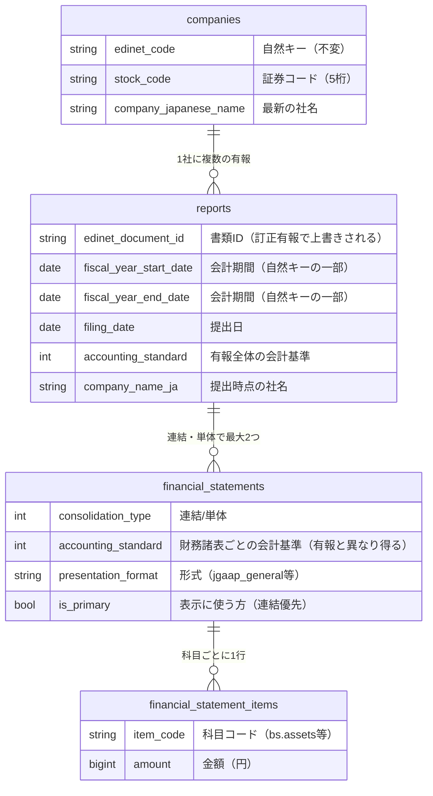

# 03. 財務データのつながり — XBRLタグから画面まで

EDINETの原本を取得し、財務数値を保存して、グラフや指標として表示するまでの流れを説明する。

| 節 | 内容 |
|---|---|
| [全体像](#全体像-1つの科目が画面に届くまで) | 2系統の処理と、1つの科目が画面に届くまでの変換の全段階 |
| [XBRLとタクソノミの読み方](#xbrlとタクソノミの読み方) | 名前空間・コンテキスト・企業拡張タグの扱い |
| [取込](#取込-形式判定とextractorタグ--科目コード) | 形式判定と、Extractorによるタグ → 科目コードの変換 |
| [保存](#保存-dbのデータモデル) | データモデルと未取得の科目の扱い |
| [チャート組み立て](#チャート組み立て-builder科目コード--チャート構造) | Builderによる科目コード → チャート構造の組み立て |
| [GraphQL API](#graphql-api) | クエリと応答の形、検索の決まり |
| [描画](#描画-チャート構造--recharts--画面) | チャート構造をrechartsで描くフロントエンド側 |
| [変更ガイド](#変更ガイド-どの層を触るか) | 変更の種類ごとに触る層とファイル |

## 全体像: 1つの科目が画面に届くまで

原本を保存する処理と、保存済みのデータを表示する処理は分かれている。

| 系統 | 動くとき | すること | DBへの書き込み |
|---|---|---|---|
| 取込系 | 毎日2:00（バッチ） | EDINETから有報を取得し、DBへ保存 | **あり（ここだけ）** |
| 参照系 | 画面アクセスのたび | DBを検索し、チャートの構造を組み立てて返す | なし（読み取り専用） |

武田薬品の流動資産を例に、原本の数値が画面へ届くまでを示す。この科目の金額は変えず、保存用の名前、表示名、割合、色を付けていく。

```mermaid
flowchart LR
    subgraph Ingest["取込系（毎日2:00のバッチ）"]
        F["EDINETから取得したXBRL内の1つのfact（タクソノミのタグ。単位: 円）<br>jpigp_cor:CurrentAssetsIFRS contextRef=CurrentYearInstant<br>値: 3090503000000"]
        D["パース後の辞書（タグ + コンテキスト → 値）<br>[jpigp_cor, CurrentAssetsIFRS, CurrentYearInstant] => 3090503000000"]
        R["financial_statement_items テーブルの1行<br>item_code: bs.current_assets / amount: 3,090,503,000,000"]
        F -->|"パース: XMLを辞書化（Xbrl::Document）"| D
        D -->|"Extractorの対応表で科目コードへ<br>bs.current_assets => jpigp_cor:CurrentAssetsIFRS"| R
    end
    subgraph Refer["参照系（画面アクセスのたび）"]
        S["GraphQL応答の1セグメント（借方バー内）<br>key: currentAssets / label: 流動資産 / amount: 3090503000000<br>ratio: 19.9 / colorRole: asset1"]
        C["rechartsの1行（行 = バー、列 = セグメントkey）<br>name: 借方 / currentAssets: 3090503000000"]
        V["画面: 借方バーの最上段<br>「流動資産」を総資産比19.9%の高さ・asset1の色で描画"]
        S -->|"toStackRows: バー×セグメントを行×列へ変換"| C
        C -->|"colorRoles.ts: 色の役割名 → 実際の色"| V
    end
    R -->|"Builderの対応表でラベルと色の役割を付与し、総資産比を計算<br>[currentAssets, 流動資産, bs.current_assets, asset1]<br>ratio = 3,090,503 ÷ 15,511,506 = 19.9%"| S
```



### 原本の取得・保存・表示

[① 原本取得・対象確認](#sequence-source) → [② 科目抽出・保存](#sequence-save) → **DB** → [③ 検索・表示](#sequence-display)。①②は取込時、③は閲覧時に動く。画面を開くたびにEDINETへ取りに行くわけではない。

<a id="sequence-source"></a>

#### ① 原本取得・対象確認

HTTP応答だけでなく本文のエラーも確認する。対象と確認できた原本を②へ渡す。



<a id="sequence-save"></a>

#### ② 科目抽出・保存

①の原本を企業・期間・連結区分で読み分ける。保存した科目と企業公表ROEが、③の入力になる。



照合で候補が決まらない科目は欠損のままにし、他の取得できた科目は保存する。CFの補完をROE・ROAの期首残高には流用しない。

<a id="sequence-display"></a>

#### ③ 検索・表示

②の保存後、利用者の検索に応じて動く。APIは読み取り専用で、チャートと指標をそれぞれ組み立てる。



### 形式の違いは、取込とチャートの組み立てで扱う

会計基準や開示様式の組合せを、このシステムでは「形式」と呼ぶ。形式によって原本のタグ名やグラフの内訳が異なる。この違いを取込時とチャート作成時に処理し、保存形式とフロントエンドを共通にする。

| 処理 | 役割 | 例 |
|---|---|---|
| 取込 | 異なるタグを共通の科目コードに変換する | 日本基準の `Assets` とIFRSの `AssetsIFRS` を、どちらも `bs.assets` として保存する |
| チャートの組み立て | 形式に応じた内訳・順序・色を決める | 銀行では貸出金や有価証券を使って資産の内訳を作る |
| フロントエンド | 受け取った構造を描画する | 会計基準や業種ごとの描画部品を持たない |

既存の科目コードとチャート構造で表せる形式なら、取込とチャートの組み立てを追加するだけで対応できる。



### 処理の分担

取込・保存・チャート作成・描画の4つに分ける。



## XBRLとタクソノミの読み方

XBRLは、科目の名前（タグ）、企業・期間・連結区分（コンテキスト）、金額などの値を組にして記録する形式。この1件分の記録をfactと呼ぶ。

### 名前空間

タグは名前空間で分類され、扱うのは次の4つ。

| 名前空間 | 内容 | タグの例 |
|---|---|---|
| `jpdei_cor` | DEI（書類情報）。会計基準・業種コード・EDINETコード・連結の有無・会計期間など書類のメタ情報 | `AccountingStandardsDEI`（会計基準） |
| `jpcrp_cor` | 有報共通の記載項目（表紙の企業名・提出日・経営指標サマリなど） | `CompanyNameCoverPage`（表紙の企業名） |
| `jppfs_cor` | **日本基準**の財務諸表本表のタグ | `Assets`（資産合計）・`NetSales`（売上高） |
| `jpigp_cor` | **IFRS**の財務諸表本表のタグ | `AssetsIFRS`（資産合計）・`RevenueIFRS`（売上収益） |

このほか企業が独自に定義する**企業拡張タグ**がある（例: `jpcrp030000-asr_E04430-000:OperatingRevenuesIFRS`。NTTが独自定義した営業収益）。企業ごとに意味の保証がなく、誤った値を拾うリスクの方が大きいため、パースの時点（`Xbrl::Document`）で標準タクソノミ以外を意図的に捨てている。

そのため、科目が拡張タグでしか開示されていない企業ではその科目が取れない。NTTの収益は経営指標サマリ（`jpcrp_cor`）の標準タグから取得でき、東京海上HDはサマリにも無いためPLだけ表示不可になる。

業種別の勘定科目のタグは、標準タグ名に業種の接尾辞が付く（`OperatingRevenueELE`=電気の営業収益、`OperatingExpensesRWY`=鉄道の営業費）。接尾辞は業種DEIコードと同じ。

### コンテキスト

同じタグでも「当期末なのか前期末なのか」「連結なのか単体なのか」で別のfactになる。たとえば同じ `jppfs_cor:Assets` タグのfactが、1つのXBRLファイルの中に次のように複数入っている。

| fact（タグ × コンテキスト） | 意味 |
|---|---|
| `Assets` × `CurrentYearInstant` | 当期末・連結の資産合計 |
| `Assets` × `Prior1YearInstant` | 前期末・連結の資産合計 |
| `Assets` × `CurrentYearInstant_NonConsolidatedMember` | 当期末・単体の資産合計 |

EDINETの標準コンテキストIDの読み方:

| コンテキストID | 意味 |
|---|---|
| `CurrentYearInstant` | 当期末時点（BSの残高に使う） |
| `CurrentYearDuration` | 当期の期間（PL・CFの増減に使う） |
| `Prior1YearInstant` | 前期末時点（CF・ROE/ROA用の期首残高） |
| 上記 + `_NonConsolidatedMember` | 単体（サフィックスなしは連結） |

実際の取込ではID名だけで当期を決めない。`Xbrl::Document` はXMLのfactとcontextを索引化し、`Xbrl::Context` は企業・日付・ディメンションを解析する。`Xbrl::ReportingPeriod` が連結／単体の対象期間を決めて、同じ意味のcontextから科目を選ぶ。IDが任意の名称でも同じ結果になり、標準名でも別年度や別企業の数値は使わない。

IFRS採用企業でも、単体財務諸表は日本基準の `jppfs_cor` + `_NonConsolidatedMember` でタグ付けされる。このため単体は常に日本基準として処理する。

## 取込: 形式判定とExtractor（タグ → 科目コード）

原本の会計基準と開示様式を確認し、対応するタグから数値を取り出す。

### 形式判定

形式によって、数値を取り出す処理（Extractor）とチャートを作る処理（Builder）を選ぶ。



業種コードだけでなく、原本にあるタグで様式を確かめる。銀行・保険の持株会社でも、単体は一般様式の場合がある。古いIFRS書類に本表の詳細タグがない場合は、経営指標の一覧から取得する。

### 科目コード — 形式間で共通

科目コードは、会計基準が違っても同じ意味の数値を扱うための名前。`bs.assets` は総資産、`pl.revenue` は売上高を表す。定義は `app/lib/financial_statements/item_codes.rb` にまとめている。

### タグから科目コードへの変換

Extractorは、原本のタグと科目コードの対応表を使って数値を取り出す。企業・業種でタグ名が異なるため、次の4通りで指定する。

| 記法 | 意味 | 例 |
|---|---|---|
| `"jppfs_cor:NetSales"` | 単一タグ | 売上高 |
| `[ "…:A", "…:B", … ]` | フォールバック（先頭から順に探し、最初に取れた値を採用） | 売上高（営業収益・完成工事高などのゆれ） |
| `sum("…:A", "…:B")` | 合算（存在するタグだけを足す。1つも無ければ「開示なし」） | 合計タグを持たず事業区分別に開示する鉄道単体・電気通信・海運の営業収益 |
| `max("…:A", sum("…:B", "…:C"))` | 最大値（総額の候補が複数併記されるとき、最も包括的な値を採る。内訳は総額を超えないことが根拠） | 一般事業会社の売上高: 営業収益 と 売上高+営業収入 のどちらが総額かは企業のタグ付けで揺れる（下記） |

`max` が要るのは、制度上は「営業収益 = 売上高 + 営業収入」なのに、どのタグをどう付けるかが企業ごとに揺れるため。「先に見つかった方を採る」だけでは下表の2・3で総額を取り損ねるが、内訳は総額を超えないので「大きい方」ならどのパターンでも総額になる。

| 企業のタグ付けパターン | 実例 | maxが採る値 |
|---|---|---|
| 1. 営業収益を総額として3タグとも付ける（小売など） | イオン: 営業収益 10,715,342 / 売上高 9,355,439 / 営業収入 1,359,903（百万円） | どちらでも同じ（総額） |
| 2. 総額タグを付けず売上高と営業収入だけ付ける | バローHD連結: 売上高 896,199 + 営業収入 27,914（サマリは924,114。開示時の丸めによる差がある） | 売上高+営業収入 |
| 3. 売上高が総額で、営業収益は一部の事業にだけ付ける | メルディアDC連結: 売上高 35,745,038 / 営業収益 2,389,993（千円） | 売上高+営業収入 |
| 4. 営業収入だけを開示する（持株会社の単体） | gooddaysHD単体: 営業収入 585,960 | 営業収入 |

#### 内訳から合計を求める場合

原本に合計額のタグがなく、事業別の内訳だけがある場合は、その内訳を合算する。



| 数値の扱い | 内容 | 例・理由 |
|---|---|---|
| 開示された合計額を優先する | 合計額を取得できれば、その値を使う | 企業が示した合計を、こちらで計算し直さない |
| 合計がなければ、その内訳を足す | 開示様式で「内訳の合計が求める金額になる」と分かる項目だけを足す | 鉄道事業の収益と関連事業の収益を足して、全社の営業収益を求める |
| 費用と利益から収益を逆算しない | 営業収益がなくても、「営業費＋営業利益」で埋めない | 収益の内訳を足すことと、別の数値から収益を求めることは区別する |

### 形式による取得結果の違い

同じ抽出処理でも、形式によって取得できる科目は異なる。

| 科目コード | 武田薬品（ifrs_classified） | 三菱UFJ FG（jgaap_bank） |
|---|---|---|
| bs.assets | 15.5兆 | 431.7兆 |
| bs.current_assets | 3.09兆 | 該当科目なし（銀行に流動区分がない） |
| bs.loans / bs.deposits | 該当科目なし | 133.8兆 / 239.4兆 |
| pl.revenue | 4.5兆 | 該当科目なし（銀行に売上高がない） |
| pl.ordinary_revenue | 該当科目なし | 14.6兆 |

## 保存: DBのデータモデル

書類や企業情報は、次のように保存する。

| 業務上の事実 | データモデルへの反映 |
|---|---|
| 訂正有報には元の有報と異なる書類IDが付く | 企業と会計期間で同じ決算の書類を識別する |
| 企業は社名を変えるが、過去の有報は提出当時の名前で読みたい | 現在の企業名と提出時点の企業名を分ける |
| IFRS企業でも単体財務諸表は日本基準でタグ付けされる | 会計基準・表示形式を「有報」でなく「財務諸表」の属性にする。有報1通の中に `ifrs_classified`（連結）と `jgaap_general`（単体）が同居する |



### 企業名は2箇所に持つ

| 置き場所 | 内容 | 更新するのは |
|---|---|---|
| `companies.company_japanese_name` | 最新の企業名 | その企業の**最新会計期**の有報を取り込んだときだけ（過去年度の取込では巻き戻さない） |
| `reports.company_name_ja` | 提出時点の企業名 | その有報を取り込むたび（訂正有報も上書き） |

実例（NTT。2025年に日本電信電話から社名変更）: 2024年3月期の有報は「日本電信電話株式会社」のまま表示され、2026年3月期は「NTT株式会社（旧会社名 日本電信電話株式会社）」という提出書類の表記で表示される。マスタは最新名だけを持つ。

### 取得できない科目は保存しない

取得できた科目は、0円も含めて保存する。未開示や不正な数値などで取得できない科目は、行を作らず、0やNULLで埋めない。これにより「0円」と「値を取得できない状態」を区別する。

保存された行の実例（武田薬品・IFRS連結。単位: 円）:

| item_code | amount | 由来 |
|---|---|---|
| bs.assets | 15,511,506,000,000 | `jpigp_cor:AssetsIFRS` |
| bs.goodwill_and_intangibles | 9,228,358,000,000 | のれん+無形の2タグをExtractorが合算 |
| pl.profit_before_tax | -142,355,000,000 | 赤字は負の値のまま保存 |

`pl.gross_profit` の行は存在しない（武田は売上総利益を開示していないため）。

再取込には時間がかかるため、現在のチャートで使わない科目も、指標計算などに使えるよう保存している。

### 金額の開示精度

原本が百万円単位などで丸められていることを考慮し、金額と一緒に端数差の上限（`rounding_error`）を保存する。精度不明はNULL、丸めなしは0。合算した科目では上限も足し、精度不明の値があれば合計の精度も不明とする。

## チャート組み立て: Builder（科目コード → チャート構造）

Builderは、保存した科目からグラフの項目・順序・色・割合を決める。

### チャート構造

WebとChrome拡張には、BS・PL用とCF用の2種類のデータを返す。

| データ | 対象 | 内容 |
|---|---|---|
| `StackChart` | BS・PL | 棒の一覧（`bars`）と、各棒を構成する項目（`segments`） |
| `WaterfallChart` | CF | 期首残高、営業・投資・財務の増減、期末残高の5項目（`steps`） |

各項目には表示名・金額・色の役割を付ける。BS・PLには割合も付け、棒の高さには金額の絶対値、金額表示には元の符号付きの値を使う。

表示できない場合は `renderable: false` と説明文 `note` を返す。

### 赤字と差額の表示：武田薬品のPL

計算に使う保存済みの科目（単位: 百万円）:

| 科目コード | 金額 |
|---|---|
| pl.revenue | 4,505,720 |
| pl.cost_of_sales | 1,571,588 |
| pl.sga | 1,084,215 |
| pl.profit_before_tax | -142,355 |

開示されている費用だけでは貸借が合わないため、差額を「その他損益（純額）」として導出する。

```
その他損益（純額） = 税引前利益 - (収益 - 開示済み費用) = -1,992,272 → 負なので費用側へ
```

| バー | セグメント | ratio |
|---|---|---|
| 借方 | 売上原価 / 販管費 / その他損益（純額） | 34.8% / 24.0% / -44.2% |
| 貸方 | 収益 / 税引前損失 | 100% / -3.1% |

残差項目のおかげで借方合計と貸方合計は常に一致し、赤字（税引前損失）は貸方に積んで高さを揃える。銀行・保険のBSも同じ考え方で、内訳科目が多すぎて全部は描けないため、主要科目（銀行: 現金預け金・貸出金・有価証券・預金 / 保険: 現金及び預貯金・有価証券・貸付金・保険契約準備金）だけタグで取り、「その他資産」「その他負債」を合計との残差で導出する。

### 必要な科目がない場合：東京海上のPL

東京海上の対象書類は、収益が企業独自のタグでしか開示されていない。PLには表示できない理由を示し、取得できたBS・CFは表示する。

### 業種による費用の違い：日本基準のPL

`jgaap_general` のPLは業種によって費用科目の組合せが違う。Builderは次の構成を順に試し、**借方合計（費用+営業利益）が売上と1割以内で合う最初の構成**で描く（開示された科目だけを積む）。

| 順 | 構成 | 当てはまる業種 | この順に置く理由 |
|---|---|---|---|
| 1 | 売上原価・金融費用・販管費（あるものだけ） | 一般事業会社（原価+販管費）、証券（金融費用+販管費）、原価と販管費の内訳を営業費用と併記する鉄道連結など | 内訳と一括を併記する企業で、情報量が多い内訳を捨てないため先頭 |
| 2 | 営業費用（一括） | 電気・特定金融・投資業など、原価と販管費に分けず一括開示する業種 | 営業費用が原価を含む合計の業種で原価を二重に積まないため、3より先 |
| 3 | 売上原価 + 営業費用（原価控除後） | 商品先物取引業（営業収益−売上原価=営業総利益、−営業費用=営業利益） | — |

原価が営業費用の内訳として併記される特定金融は、1（内訳だけ）では貸借が合わず2で描かれる。どの構成でも合わなければ描かない。

BSも同様に、固定資産は「有形・無形・投資その他の3分類の合計が固定資産に合うときだけ内訳」で描き、合わない業種（電気・鉄道・電気通信の単体など、業種別様式で3分類を持たない）は固定資産合計の1段で描く。

### 表示前の確認

- **借方合計と貸方合計の乖離が1割を超えたら描かない**（誤ったグラフより出さない方を選ぶ）
- 必須科目が欠けたら描かない。銀行BSは預金がなければ、保険BSは保険契約準備金がなければ描かず（「預金0%の銀行」を出さない）、CFは5点すべて揃わなければ描かない
- 比率はBigDecimalで計算して小数1桁に切り捨て（「19.900000000000002%」や合計100%超を防ぐ）

## ROE・ROAの組み立て

保存した財務数値からサーバ側で指標を計算し、画面はその結果を表示する。

| 段階 | 処理 |
|---|---|
| データを揃える | 同じ有報・連結区分の純利益、売上高、期首・期末の総資産と自己資本を使う |
| 指標を計算する | ROE・ROAとその内訳を、それぞれに必要なデータで計算する。グラフ用の比率や丸めた値は使わない |
| 結果を画面へ渡す | 数値に加え、計算できたか、企業公表値かを伝える。画面側で再計算しない |

ROEは計算値を優先し、データ不足の場合に限って同じ決算の企業公表値を使う。計算できない指標があっても、他の指標は表示する。

計算式と表示の意味は [Webガイド](https://investee.info/guide) にまとめている。

## GraphQL API

GraphQLは、画面側が必要な項目を指定してデータを取得するAPI。`POST /graphql` の `financialReports` で検索条件と取得件数を渡すと、企業情報・チャート・指標をJSONで返す。

```graphql
query {
  financialReports(limit: 30, offset: 0,
                   stockCodes: ["4502"],          # 4桁。5桁化はバックエンドの責務
                   operatingCfSign: POSITIVE) {   # CFパターン絞り込み
    companyName
    accountingStandard      # 会計基準の表示用
    balanceSheet { renderable note bars { label segments { key label amount signedAmount ratio colorRole } } }
    cashFlow     { renderable note steps { key label amount kind colorRole } }
  }
}
```

| 項目 | 扱い |
|---|---|
| 金額は独自スカラ `Money`（JSON数値のまま返す） | 標準のBigInt型は文字列になり、Web・Chrome拡張の両方に変換処理が必要になる。日本企業の最大級の総資産400兆円=4×10^14はJavaScriptの安全整数9×10^15に収まる |
| 検索は提出日降順 | 保存した提出日の新しい順に返す |
| CFパターンは科目行の符号で判定 | 絞り込み対象は `is_primary`（連結優先）の財務諸表だけ |

## 描画: チャート構造 → recharts → 画面

描画には、Chrome拡張と共通の `shared/financialCharts/` を使う。APIが指定した順序で項目を並べ、数値に応じた高さと色で描く。

### 積み上げ棒（`StackedBarChart`）

APIの `bars × segments` を、rechartsが要求する「行 × 列」の表に変換する（`toStackRows`）。行=バー、列=全バーに登場するセグメントkeyの和集合。

```
API（bars × segments）              recharts（rows × columns）
借方: [原価, 販管費]        →       { name: "借方", costOfSales: 60, sga: 30 }
貸方: [収益]                        { name: "貸方", revenue: 100 }
                                   ※ あるバーに無い列はundefinedになり、その行には描かれない
```

- Y軸を反転して上から積み上げ、`spacer`（債務超過の高さ合わせ）はツールチップにも出さない
- ツールチップの金額は符号つきの `signedAmount` を使う（描画高さの `amount` は絶対値）。表示は `formatAmount` で百万円単位（有報の慣行どおり百万円未満切捨て）にし、百万円未満の値だけ千円単位で出す（千円単位で開示する小規模企業の科目を「0百万円」に潰さないため）。ウォーターフォールのバー上のラベルも同じ関数を使う

### ウォーターフォール（`WaterfallChart`）

rechartsにウォーターフォール専用の部品はないため、積み上げ棒を流用し、各ステップを「位置合わせ用の透明な棒 + 金額を表す棒」の2段積みで表現している。

| 項目 | 描き方 |
|---|---|
| `kind: "balance"`（期首残・期末残） | 累積をリセットして0起点で描く（為替の影響などで期首+増減と期末が一致しない場合があるため） |
| `kind: "flow"`（営業・投資・財務） | 直前の累積から浮かせて増減分だけ描く |
| 色 | バックエンドが `colorRole`（cashIncrease / cashDecrease）で指定（増加=青系・減少=赤系） |

### 色の指定（`colorRoles.ts`）

APIは `asset1`（資産）や `profit`（利益）などの色の役割を返し、`colorRoles.ts` が実際の色に変換する。未定義の役割はグレーで表示し、開発者向けに警告を出す。

### 表示不可（`ChartUnavailable`）

`renderable: false` のとき、チャートと同じ寸法の枠に説明文（`note`、なければ既定文言）を表示する。寸法を揃えるのはカルーセルの高さが跳ねないようにするため。

## 変更ガイド: どの層を触るか

既存の保存形式とチャート構造で表せる変更は、主に取込とチャート作成の処理で対応する。

| 変更の種類 | 主な変更箇所 |
|---|---|
| 取得するタグや優先順位の変更 | 対象形式のExtractor。新科目なら `item_codes.rb`、表示にも使うならBuilderを更新する |
| 一般様式の業種を追加 | `JgaapGeneral` に業種のタグを追加する |
| 構成の異なる形式を追加 | Extractor・Builderを作成し、形式判定と登録表に追加する |
| 色の役割を追加 | バックエンド、Webの `colorRoles.ts`、Chrome拡張を揃えて変更する |

タグを変更するときは、原本の数値で検証し、[タグ対応表](06_taxonomy_mapping.md)も更新する。

- `mapping_consistency_spec.rb` で未定義の科目コードがないことを確認する。業種を追加するときは、`industry_formats_spec.rb` に実XBRLのケースを加え、形式判定から描画まで検証する。
- 既に `unsupported` で保存済みの有報は再取込タスクで取り直す（[05章](05_development_operations.md)）
