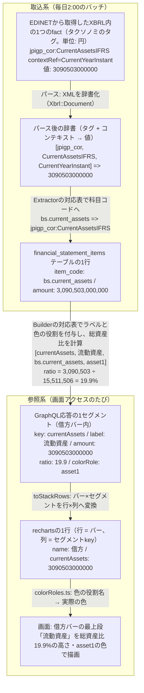
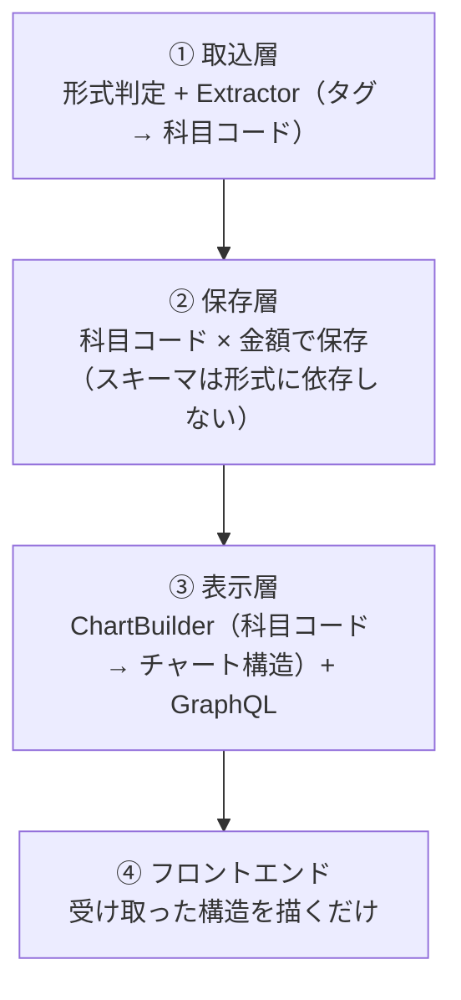
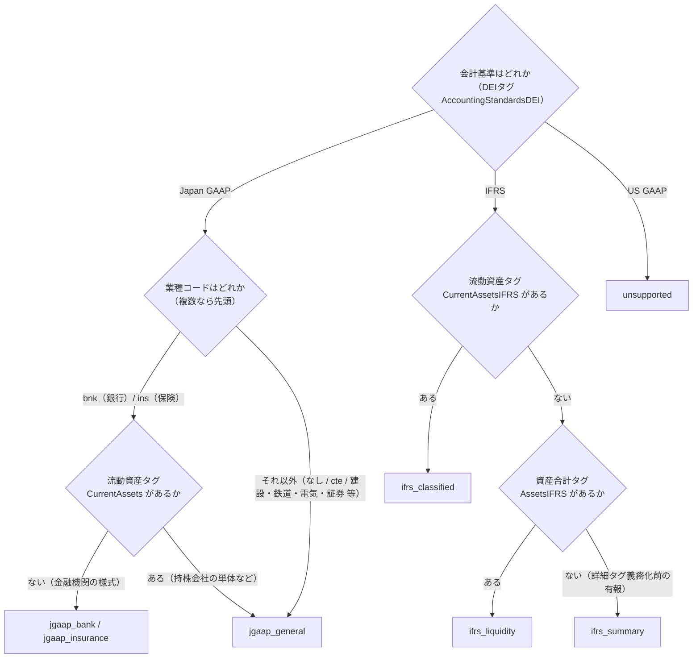
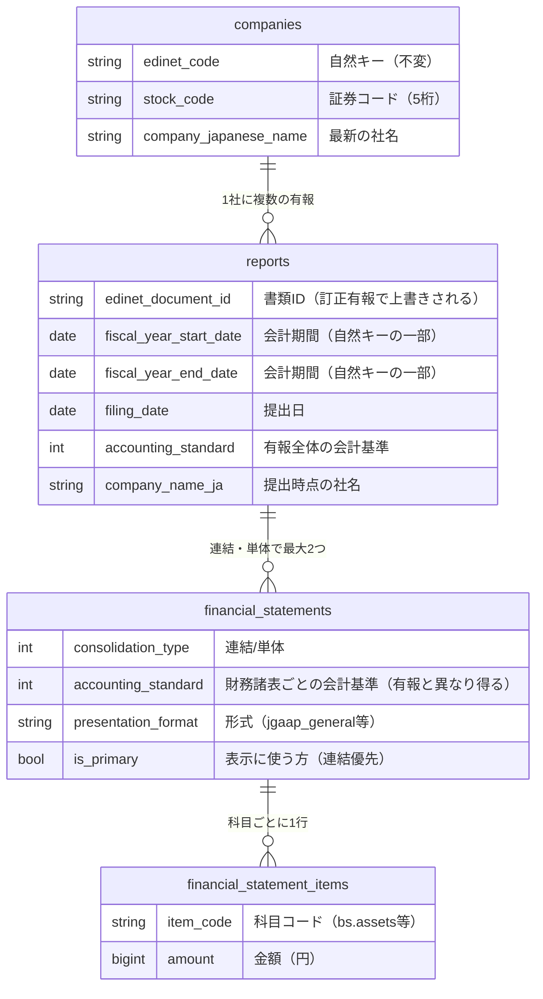

# 03. 財務データのつながり — XBRLタグから画面まで

[01章](01_financial_knowledge.md)で見た財務諸表のデータが、EDINETのXBRLからどう取り込まれ、DBに保存され、GraphQLで配信され、[02章](02_product.md)のチャートとして描かれるか。この章はその全行程を、データの流れる順に1本で追う。設計の「なぜ」は、それが効いている場所に織り込んで説明する。

データの中身ではなく器の話（構成・取込ジョブの信頼性・画面の実装）は[04章](04_system.md)、個々のXBRLタグと科目コードの対応を引く表は[06章](06_taxonomy_mapping.md)。

## 全体像: 1つの科目が画面に届くまで

処理は2系統に分かれ、DBのテーブル定義と科目コード（後述）だけを共有し、互いの実装を知らない。

| 系統 | 動くとき | すること | DBへの書き込み |
|---|---|---|---|
| 取込系 | 毎日2:00（バッチ） | EDINETから有報を取得し、DBへ保存 | **あり（ここだけ）** |
| 参照系 | 画面アクセスのたび | DBを検索し、チャートの構造を組み立てて返す | なし（読み取り専用） |

武田薬品の「流動資産」の実データで、1つのfactが画面に届くまでの各段階の名前・値・付随情報を追うと次のとおり。**金額は最初から最後まで一度も加工されず、変わるのは名前（タグ → 科目コード → key/label）と付随情報だけ**。



以降の節が、この図の変換を1段ずつ追う。「出発点」がfactの読み方、「取込」がタグ → 科目コード、「保存」がテーブルの1行、「チャート組み立て」と「配信」がGraphQL応答、「描画」が画面まで。

### なぜ変換を挟むのか

やりたいことは「有報の数字をグラフにする」だけだが、[01章](01_financial_knowledge.md)で見たとおり、同じ「資産合計」でも会計基準によってXBRLのタグ名が違う。

```
武田薬品（IFRS）      jpigp_cor:AssetsIFRS
三菱UFJ（日本基準）    jppfs_cor:Assets
トヨタ（日本基準）      jppfs_cor:Assets      ← 銀行と同じタグ
```

タグ名だけでなく、財務諸表の構造そのものも変わる。この「会計基準 × 開示様式」の組合せを、このシステムでは**形式**と呼ぶ（[02章](02_product.md)で見た7種類）。

| | 一般事業会社 | 銀行 | IFRS |
|---|---|---|---|
| BSの区分 | 流動 / 固定 | 区分なし（貸出金・預金） | 流動 / 非流動 |
| PLのトップライン | 売上高 | 経常収益 | 売上収益 |
| 利益の段階 | 営業→経常→当期 | 経常→当期 | 経常利益が無い |

この違いをそのままコードに持ち込むと、テーブルは全形式の全科目を横に並べた形になり、グラフ部品は形式ごとの専用コンポーネントに分かれていく。その状態で新しい形式（例: 保険）を1つ足すと、変更が全部の層に及ぶ。

```
DBにカラム追加 → 取込に分岐追加 → APIに項目追加 → フロントに部品追加 → Chrome拡張にも複製
```

実際、旧実装ではIFRS企業の連結が0円で保存されて表示できない、という形でこの問題が起きていた。つまり解くべき問題は、**形式ごとの違いがデータにも画面にも広がること**。

### 解き方: 変わるものを端に寄せる

形式が変わったとき、何が変わり何が変わらないかを分ける。

| | 具体例 |
|---|---|
| 形式ごとに変わるもの | XBRLのタグ名、BSの段の構成、PLの利益段階 |
| 形式によらず変わらないもの | 「資産 = 負債 + 資本」という関係、積み上げバー2本で貸借を表す見せ方 |

変わらないもの、すなわち**科目コード**（`bs.assets` など全形式共通の42種の語彙）を中央に置き、変わるものを入口と出口に寄せる。


### 4つの層

この方針をコードに落とすと4層になる。依存は上から下への一方向で、逆流させない。



| 層 | 知ってよいこと | 知ってはいけないこと |
|---|---|---|
| ① 取込 | XBRLのタグ名・タクソノミ・形式判定 | グラフの見た目・色・段の順序 |
| ② 保存 | 科目コードの一覧 | XBRLのタグ名 / グラフの構造 |
| ③ 表示 | 科目コード・グラフの構成・色の役割 | XBRLのタグ名 |
| ④ フロント | チャート構造の形（bars / segments・steps） | 科目名。会計基準はバッジ表示用に受け取るだけで、描画分岐には使わない |

この表が実装で迷ったときの判断基準になる。たとえば「フロントで銀行だけ色を変えたい」は④に③の知識を持ち込む変更なので、代わりに③で色の役割（`colorRole`）を割り当て直す。

層の間で受け渡すデータの形は2つの取り決めで固定している。取り決め1「科目コード」は「取込」の節、取り決め2「チャート構造」は「チャート組み立て」の節で、それぞれ実物を見る。

## 出発点: XBRLとタクソノミの読み方

[01章](01_financial_knowledge.md)のとおり、XBRLの中身はfact（タグ × コンテキスト × 値）の集まり。ここでは取込の実装が前提にしている読み方をまとめる。

### 名前空間

タグは名前空間で分類され、扱うのは次の4つ。

| 名前空間 | 内容 | タグの例 |
|---|---|---|
| `jpdei_cor` | DEI（書類情報）。会計基準・業種コード・EDINETコード・連結の有無・会計期間など書類のメタ情報 | `AccountingStandardsDEI`（会計基準） |
| `jpcrp_cor` | 有報共通の記載項目（表紙の企業名・提出日・経営指標サマリなど） | `CompanyNameCoverPage`（表紙の企業名） |
| `jppfs_cor` | **日本基準**の財務諸表本表のタグ | `Assets`（資産合計）・`NetSales`（売上高） |
| `jpigp_cor` | **IFRS**の財務諸表本表のタグ | `AssetsIFRS`（資産合計）・`RevenueIFRS`（売上収益） |

このほか企業が独自に定義する**企業拡張タグ**がある（例: `jpcrp030000-asr_E04430-000:OperatingRevenuesIFRS`。NTTが独自定義した営業収益）。企業ごとに意味の保証がなく、誤った値を拾うリスクの方が大きいため、パースの時点（`Xbrl::Document`）で標準タクソノミ以外を意図的に捨てている。

この方針の帰結として、科目が拡張タグでしか開示されていない企業ではその科目が取れない。NTTの収益は経営指標サマリ（`jpcrp_cor`）の標準タグへのフォールバックで救済でき、東京海上HDはサマリにも無いためPLだけ表示不可になる（表示不可を正常系として扱う仕組みは「チャート組み立て」の節。実測の記録は[07章](07_taxonomy_survey.md)）。

業種別の勘定科目のタグは、標準タグ名に業種の接尾辞が付く（`OperatingRevenueELE`=電気の営業収益、`OperatingExpensesRWY`=鉄道の営業費）。接尾辞は業種DEIコードと同じで、一覧は[06章](06_taxonomy_mapping.md)の凡例にある。

### コンテキスト

同じタグでも「当期末なのか前期末なのか」「連結なのか単体なのか」で別のfactになる。たとえば同じ `jppfs_cor:Assets` タグのfactが、1つのXBRLファイルの中に次のように複数入っている。

| fact（タグ × コンテキスト） | 意味 |
|---|---|
| `Assets` × `CurrentYearInstant` | 当期末・連結の資産合計 |
| `Assets` × `Prior1YearInstant` | 前期末・連結の資産合計 |
| `Assets` × `CurrentYearInstant_NonConsolidatedMember` | 当期末・単体の資産合計 |

コンテキストIDの読み方:

| コンテキストID | 意味 |
|---|---|
| `CurrentYearInstant` | 当期末時点（BSの残高に使う） |
| `CurrentYearDuration` | 当期の期間（PL・CFの増減に使う） |
| `Prior1YearInstant` | 前期末時点（CFの期首残高のみ） |
| 上記 + `_NonConsolidatedMember` | 単体（サフィックスなしは連結） |

[01章](01_financial_knowledge.md)の「IFRS採用企業でも単体は日本基準」はタグ付けにも表れていて、単体財務諸表はIFRS適用企業でも `jppfs_cor` + `_NonConsolidatedMember` でタグ付けされる（実測6社すべて。[07章](07_taxonomy_survey.md)）。このため単体は常に日本基準として処理する。

## 取込: 形式判定とExtractor（タグ → 科目コード）

毎日2:00のバッチが前日提出分の有報XBRLを取得し、パース → 検証 → 形式判定 → 科目抽出 → 保存と進む（バッチとしての信頼性設計は[04章](04_system.md)）。この節ではデータが変換される2段階、形式判定と科目抽出を追う。

### 形式判定

どのExtractor（とBuilder）を使うかを決める入口の判定。次のフローで決まる。



- IFRSの2様式はDEI（書類メタ情報）では区別できず、タグの実在で判定する（楽天のfactダンプで確認。根拠は[07章](07_taxonomy_survey.md)）
- 資産合計タグすら無いIFRS書類は、本表の詳細タグ付けが義務化された2019年3月31日以後終了事業年度より前の有報（`jpigp_cor` のfact自体が収録されていない）。経営指標サマリ（`jpcrp_cor`）だけで構成する `ifrs_summary` に落とす
- 日本基準で形式を分けるのは、財務諸表の**骨格そのものが違う**銀行・保険だけ。建設・鉄道・電気・ガス・海運・電気通信・証券・特定金融・商品先物・投資業などは業種別の勘定科目を持つが骨格は一般と同じなので `jgaap_general` にまとめ、タグ名の違いはExtractorのフォールバックで吸収する（後述）
- 業種コードが銀行・保険でも流動資産タグを持つ財務諸表（持株会社の単体など）は一般様式で作られているため、タグの実在で `jgaap_general` に戻す（業種コードは提出者が付けるため、様式はデータで確かめる）

### 取り決め1: 科目コード — 全形式共通の42種の語彙

変換先となる中央の語彙。命名は `<財務諸表>.<英名スネークケース>`（`bs.assets`・`pl.revenue` など42種）。

定義はRubyの定数1ファイル（`app/lib/financial_statements/item_codes.rb`）に限定し、「Extractorが使うコード ⊆ 定義」をspec（`mapping_consistency_spec.rb`）で機械検証している。DBマスタテーブルにしないのは、コードと利用箇所は必ず同時に変わるため、grepとレビューが効くRubyの定数の方が安全という判断。

### Extractorは対応表

Extractorは実質「タグ → 科目コードの対応表」で、ロジックをほぼ持たない。対応表の値は4記法で、**企業・業種ごとの科目名のゆれをここで吸収する**。

| 記法 | 意味 | 例 |
|---|---|---|
| `"jppfs_cor:NetSales"` | 単一タグ | 資産合計など |
| `[ "…:A", "…:B", … ]` | フォールバック（先頭から順に探し、最初に取れた値を採用） | 売上高（営業収益・完成工事高などのゆれ） |
| `sum("…:A", "…:B")` | 合算（存在するタグだけを足す。1つも無ければ「開示なし」） | 合計タグを持たず事業区分別に開示する鉄道単体・電気通信・海運の営業収益 |
| `max("…:A", sum("…:B", "…:C"))` | 最大値（総額の候補が複数併記されるとき、最も包括的な値を採る。内訳は総額を超えないことが根拠） | 一般事業会社の売上高: 営業収益 と 売上高+営業収入 のどちらが総額かは企業のタグ付けで揺れる（下記） |

`max` が要るのは、制度上は「営業収益 = 売上高 + 営業収入」なのに、どのタグをどう付けるかが企業ごとに揺れるため。「先に見つかった方を採る」だけでは下表の2・3で総額を取り損ねるが、内訳は総額を超えないので「大きい方」ならどのパターンでも総額になる。

| 企業のタグ付けパターン | 実例 | maxが採る値 |
|---|---|---|
| 1. 営業収益を総額として3タグとも付ける（小売など） | イオン: 営業収益 10,715,342 / 売上高 9,355,439 / 営業収入 1,359,903（百万円） | どちらでも同じ（総額） |
| 2. 総額タグを付けず売上高と営業収入だけ付ける | バローHD連結: 売上高 896,199 + 営業収入 27,914（サマリの売上高 924,114 と一致） | 売上高+営業収入 |
| 3. 売上高が総額で、営業収益は一部の事業にだけ付ける | メルディアDC連結: 売上高 35,745,038 / 営業収益 2,389,993（千円） | 売上高+営業収入 |
| 4. 営業収入だけを開示する（持株会社の単体） | gooddaysHD単体: 営業収入 585,960 | 営業収入 |

```ruby
# 売上のフォールバック（jgaap_general。順序が優先度。JgaapGeneral::DURATION_MAPPING から抜粋）
"pl.revenue" => [
  "jppfs_cor:OperatingRevenueRWY",   # 営業収益（鉄道）… 業種固有の合計タグを先に試す
  "jppfs_cor:OperatingRevenueELE",   # 営業収益（電気）
  # 一般事業会社の総額: 営業収益 と 売上高+営業収入 の「大きい方」（上表の揺れを吸収する）
  max("jppfs_cor:OperatingRevenue1",
      sum("jppfs_cor:NetSales", "jppfs_cor:OperatingRevenue2")),
  "jppfs_cor:NetSalesOfCompletedConstructionContractsCNS",  # 完成工事高（建設業）
  # 鉄道（単体）: 営業収益の合計タグがなく事業区分別にしか開示しないため、区分タグを合算する
  # （存在するタグだけを足す。鉄道事業だけの会社も、鉄道+不動産+開発の会社も同じ1行で引ける）
  sum("jppfs_cor:OperatingRevenueRailwayRWY",      # 鉄道事業営業収益
      "jppfs_cor:OperatingRevenueRelatedRWY",      # 関連事業営業収益
      "jppfs_cor:OperatingRevenueDevelopmentRWY",  # 開発事業営業収益
      "jppfs_cor:OperatingRevenueOtherRWY")        # その他事業営業収益 …ほか区分タグが続く
]
```

例えばJR東日本の単体は鉄道事業 2,020,442百万円と関連事業 205,293百万円しか開示していないので、この合算は 2,225,735百万円（=`pl.revenue`）になる。

業種固有のタグ（`…ELE` `…RWY` のように業種の接尾辞が付く）はその業種の有報にしか現れないため、リストの中で業種をまたぐ優先順位を気にする必要はなく、同一業種内の「合計タグ → 区分の合算」の順序だけが意味を持つ。

#### なぜ合算記法があるのか

普通の科目は合計のタグを「引く」だけで済むが、鉄道事業会計規則のように損益を事業区分ごとに並べる様式では、合計が1つのタグとして開示されていない（レシートに商品ごとの金額はあるのに合計行がない）。引けないものは内訳を「足す」しかない、というのが `sum(...)` の役割。


| 決めごと | 内容 | 理由 |
|---|---|---|
| 足すのは「合計タグを引けない開示」だけ | 鉄道単体・電気通信・海運の営業収益/費用（合計タグ自体が無い）、IFRSののれん＋無形（別掲企業がある）、売上高+営業収入（総額タグを付けない企業がある。上記`max`の内側） | 合計タグが引けるならそれが一次情報 |
| 足してよい項目 | 法令様式が「区分の和＝合計」と定める項目のみ | 推計でなく開示値の合計。JR東日本: 2,225,735 = 営業費 1,923,728 + 全事業営業利益 302,007 |
| 存在するタグだけ足す | 1つも無ければ「開示なし」（0は保存しない） | 区分の組合せが会社ごとに違う（鉄道のみ／鉄道+不動産+開発／…）ため1つのリストで全パターンを引く |
| フォールバックの最後に置く | 合計タグがあればそれを採用 | 開示された合計が一次情報（東急など） |
| 逆算はしない | 「営業費＋営業利益」で求めない | 逆算は推計になる。差し引きは表示側Builderの導出項目（その他損益（純額））だけに限定し、DBには開示値だけを置く |

### 形式ごとのExtractor

| Extractor | 特徴 |
|---|---|
| `JgaapGeneral` | 一般事業会社に加え、建設・鉄道・電気・ガス・海運・電気通信・証券・特定金融・商品先物・投資業など**業種別の勘定科目を持つ業種もすべて**この1つで扱う（骨格が同じため）。売上・原価・販管費・営業費用のフォールバックが本体 |
| `JgaapBank` | 貸出金・預金など銀行専用タグ。**経常収益（`OrdinaryIncomeBNK`）と経常利益（`OrdinaryIncome`）は似た名前で桁が兆単位で違う** |
| `JgaapInsurance` | 有価証券・貸付金・保険契約準備金など保険専用タグ。**経常収益のタグ名が `OperatingIncomeINS`**（一般形式の営業利益 `OperatingIncome` と同系の名前で意味が違う） |
| `IfrsClassified` | 非流動負債はタクソノミ公式のタイポ（`NonCurrentLabilitiesIFRS`）を先に引く。のれん+無形は合算記法 |
| `IfrsLiquidity` | BSは合計系+現金。PL/CFは`IfrsClassified`と定数を共有（継承はしない。後述） |
| `IfrsSummary` | 詳細タグの無い有報（2019年3月期より前）用。経営指標サマリ（`jpcrp_cor:*IFRSSummaryOfBusinessResults`）から収益・税引前利益・CF5点の7科目のみ抽出。**BSは抽出しない**（サマリに負債の実値が無く、導出すると非支配持分が混ざるため） |

同じ入口から、形式によって違う科目が出てくる（キーが無い = 開示なし）。

| 科目コード | 武田薬品（ifrs_classified） | 三菱UFJ FG（jgaap_bank） |
|---|---|---|
| bs.assets | 15.5兆 | 431.7兆 |
| bs.current_assets | 3.09兆 | キーなし（銀行に流動区分がない） |
| bs.loans / bs.deposits | キーなし | 133.8兆 / 239.4兆 |
| pl.revenue | 4.5兆 | キーなし（銀行に売上高がない） |
| pl.ordinary_revenue | キーなし | 14.6兆 |

全科目のタグ対応表は[06章](06_taxonomy_mapping.md)（**XBRLタグを触る作業の前に該当する表は必読**）、その根拠の実測記録は[07章](07_taxonomy_survey.md)。

### 形式は登録表で増やす

形式ごとの差異を `if` や継承で書くと、形式が増えるたびに既存コードを触ることになる。代わりに「形式 → クラス」のハッシュ登録に統一している。

```ruby
EXTRACTORS = { "jgaap_bank" => Extractors::JgaapBank, ... }   # 取込側の登録表
BS         = { "jgaap_bank" => Builders::BsJgaapBank, ... }   # 表示側の登録表
```

- 新形式の追加 = クラスを1つ書いて、表に1行足すだけ。既存形式のコードは触らない（追加の手順は「変更ガイド」の節）
- 似た形式（IFRSの2様式）でも**継承はさせない**。片方の修正がもう片方に波及するのを避けるためで、マッピング定数の重複はあえて許容する

## 保存: DBのデータモデル

保存の形は、開示実務の4つの事実から決まっている。

| 業務上の事実 | データモデルへの反映 |
|---|---|
| 訂正有報が、同じ会計期間のデータを別書類として上書きしに来る | 有報の自然キーを書類IDでなく「企業+会計期間」にする |
| 企業は社名を変えるが、過去の有報は提出当時の名前で読みたい | 企業名を2箇所に持つ（下記） |
| 開示しない科目がある。「0円」とは意味が違う | 「行がない = 開示なし」の規約（下記） |
| IFRS企業でも単体財務諸表は日本基準でタグ付けされる（前述） | 会計基準・表示形式を「有報」でなく「財務諸表」の属性にする。有報1通の中に `ifrs_classified`（連結）と `jgaap_general`（単体）が同居する |



### 企業名は2箇所に持つ

| 置き場所 | 内容 | 更新するのは |
|---|---|---|
| `companies.company_japanese_name` | 最新の企業名 | その企業の**最新会計期**の有報を取り込んだときだけ（過去年度の取込では巻き戻さない） |
| `reports.company_name_ja` | 提出時点の企業名 | その有報を取り込むたび（訂正有報も上書き） |

実例（NTT。2025年に日本電信電話から社名変更）: 2024年3月期の有報は「日本電信電話株式会社」のまま表示され、2026年3月期は「NTT株式会社（旧会社名 日本電信電話株式会社）」という提出書類の表記で表示される。マスタは最新名だけを持つ。

### 規約: 「行がない = 開示なし」

| XBRLから値が | どうするか |
|---|---|
| 取れた | 行を作る（0円なら `amount = 0` の行を作る） |
| 取れない | 行を作らない（NULLも0も保存しない。数値として不正な値も「0円」でなく「取れない」として扱う） |

これで「0円」と「開示なし」を区別できる。横持ちだった旧テーブルではIFRS企業の全カラムが0で埋まり、どちらなのか判別できなかった。

保存された行の実例（武田薬品・IFRS連結。単位: 円）:

| item_code | amount | 由来 |
|---|---|---|
| bs.assets | 15,511,506,000,000 | `jpigp_cor:AssetsIFRS` |
| bs.goodwill_and_intangibles | 9,228,358,000,000 | のれん+無形の2タグをExtractorが合算 |
| pl.profit_before_tax | -142,355,000,000 | 赤字は負の値のまま保存 |

`pl.gross_profit` の行は存在しない（武田は売上総利益を開示していないため）。このデータが次の節で、チャートになるまで登場する。

保存する科目はチャートが使うものより広めに取ってある（[06章](06_taxonomy_mapping.md)の表でBuilder列が「—」の科目）。再取込のコストが高いため、将来の指標計算やコメント生成の入力に使えるようにしておく狙い。

このほか旧実装の `security_reports` テーブルが凍結保管されている（コードからの参照はゼロ。扱いは[08章](08_unused_but_kept.md)）。

## チャート組み立て: Builder（科目コード → チャート構造）

ここから参照系。検索で有報を絞り（検索の仕様は「配信」の節）、形式ごとのBuilderが科目コードの行からチャートの構造そのものを組み立てる。

### 取り決め2: チャート構造

バックエンドが「チャートの構造そのもの」まで組み立てて返し、型はGraphQLスキーマで固定する。形式が増えても構造は変わらないため、フロントの変更が要らない。フロント・Chrome拡張と共有する構造は次の2種類。

```
StackChart（BS/PL用。例は日本基準・一般のPL・黒字）
├ renderable: 描けるか
├ note: renderable=false のとき表示する説明文
└ bars: [                            # 借方・貸方の2本（債務超過時のみ3本目「債務超過」が加わる）
    { label: "借方",
      segments: [                    # 段の構成（key・数・順序）は形式ごとのBuilderが決める
        { key: "costOfSales",        # セグメントの識別子
          label: "売上原価",          # 表示ラベル
          amount: 描画高さの円（常に0以上）,
          signedAmount: 実値の円（ツールチップ用。損失は負）,
          ratio: 構成比%（spacer等の非表示セグメントはnull）,
          colorRole: "expense1" },   # 色の役割名。実際の色はフロントが解決する
        { key: "sga",             label: "販売一般管理費", amount, signedAmount, ratio, colorRole: "expense2" },
        { key: "operatingProfit", label: "営業利益",       amount, signedAmount, ratio, colorRole: "profit" } ] },
    { label: "貸方",
      segments: [
        { key: "revenue", label: "売上", amount, signedAmount, ratio, colorRole: "revenue" } ] } ]
```

```
WaterfallChart（CF用。5段の構成は全形式共通）
├ renderable: 描けるか
├ note: renderable=false のとき表示する説明文
└ steps: [
    { key: "cashBegin", label: "期首残",
      amount: 符号付きの円（-23兆もあり得る）,
      kind: "balance",                                         # 残高: 0起点で描く
      colorRole: "cashIncrease" },                             # 増減の向きの色（負ならcashDecrease）
    { key: "operating", label: "営業CF", amount, kind: "flow", colorRole }, # 増減: 累積から浮かせる
    { key: "investing", label: "投資CF", amount, kind: "flow", colorRole },
    { key: "financing", label: "財務CF", amount, kind: "flow", colorRole },
    { key: "cashEnd",   label: "期末残", amount, kind: "balance", colorRole } ]
```

| 構造の仕掛け | 吸収する業務上の差異 |
|---|---|
| `segments[]` をそのまま積む（固定キーなし） | 形式ごとの段数・科目の違い（銀行BS 4段 / IFRS流動性配列 2段…） |
| `colorRole`（意味ベースの色の役割名） | 「何色にするか」。新科目にも既存の役割を割り当てるだけ |
| `amount`（高さ）と `signedAmount`（実値）の分離 | 赤字・債務超過（負値を棒グラフに渡すと逆向きに描かれる） |
| `spacer` セグメント | 債務超過時の3本目バーの位置合わせ（透明の詰め物） |
| `renderable: false` + `note` | 「この表は出せない」を**正常系のデータ**として返す |
| `kind: balance / flow` | CFの残高（0起点）と増減（浮かせる）の描き分け + 為替換算差額の吸収 |

### 実例1: 武田薬品のPL（赤字 + 残差の導出）

前節で保存した行が、チャートになるまで。入力（単位: 百万円）:

| 科目コード | 金額 |
|---|---|
| pl.revenue | 4,505,720 |
| pl.cost_of_sales | 1,571,588 |
| pl.sga | 1,084,215 |
| pl.profit_before_tax | -142,355 |

開示されている費用だけでは貸借が合わないため、差額を「その他損益（純額）」として導出する。

```
その他損益（純額） = 税引前利益 - (収益 - 開示済み費用) = -1,992,272 → 負なので費用側へ
```

| バー | セグメント | ratio |
|---|---|---|
| 借方 | 売上原価 / 販管費 / その他損益（純額） | 34.8% / 24.0% / -44.2% |
| 貸方 | 収益 / 税引前損失 | 100% / -3.1% |

残差項目のおかげで借方合計と貸方合計は常に一致し、赤字（税引前損失）は貸方に積んで高さを揃える。銀行・保険のBSも同じ考え方で、内訳科目が多すぎて全部は描けないため、主要科目（銀行: 現金預け金・貸出金・有価証券・預金 / 保険: 現金及び預貯金・有価証券・貸付金・保険契約準備金）だけタグで取り、「その他資産」「その他負債」を合計との残差で導出する。

### 実例2: 表示不可も正常系（東京海上のPL）

保険IFRSは収益が企業拡張タグのみで標準タグから取れない（「出発点」の節）。その場合も**カード全体を落とさず、取れなかったチャートだけ**説明文にする。

```json
{ "profitLoss":   { "renderable": false,
                    "note": "損益計算書: この企業のIFRS損益計算書は表示に対応していません。" },
  "balanceSheet": { "renderable": true, "bars": [...] },
  "cashFlow":     { "renderable": true, "steps": [...] } }
```

### 実例3: 業種で費用の構成が違うPL（日本基準・一般）

`jgaap_general` のPLは業種によって費用科目の組合せが違う。Builderは次の構成を順に試し、**借方合計（費用+営業利益）が売上と1割以内で合う最初の構成**で描く（開示された科目だけを積む）。

| 順 | 構成 | 当てはまる業種 | この順に置く理由 |
|---|---|---|---|
| 1 | 売上原価・金融費用・販管費（あるものだけ） | 一般事業会社（原価+販管費）、証券（金融費用+販管費）、原価と販管費の内訳を営業費用と併記する鉄道連結など | 内訳と一括を併記する企業で、情報量が多い内訳を捨てないため先頭 |
| 2 | 営業費用（一括） | 電気・特定金融・投資業など、原価と販管費に分けず一括開示する業種 | 営業費用が原価を含む合計の業種で原価を二重に積まないため、3より先 |
| 3 | 売上原価 + 営業費用（原価控除後） | 商品先物取引業（営業収益−売上原価=営業総利益、−営業費用=営業利益） | — |

原価が営業費用の内訳として併記される特定金融は、1（内訳だけ）では貸借が合わず2で描かれる。どの構成でも合わなければ描かない。

BSも同様に、固定資産は「有形・無形・投資その他の3分類の合計が固定資産に合うときだけ内訳」で描き、合わない業種（電気・鉄道・電気通信の単体など、業種別様式で3分類を持たない）は固定資産合計の1段で描く。

### Builderの分担と共通ルール

| 形式 | BS | PL | CF |
|---|---|---|---|
| `jgaap_general` | 流動/固定の4段（3分類を持たない業種は固定資産1段） | 費用（構成は業種で異なる。実例3）+営業利益 | 全形式共通（期首残→営業→投資→財務→期末残） |
| `jgaap_bank` | 主要科目+残差 | 経常収益/費用/利益（`PlJgaapFinancialInstitution`。保険と共通） | 同上 |
| `jgaap_insurance` | 主要科目+残差 | 銀行と共通 | 同上 |
| `ifrs_classified` | 流動/非流動 | 費用（原価+販管費 と 営業費用一括のどちらの開示でも同じリストで吸収）+税引前利益（残差つき） | 同上 |
| `ifrs_liquidity` | 現金+残差 | ifrs_classifiedと共通 | 同上 |
| `ifrs_summary` | 「詳細データが収録されていない」（renderable: false。負債の実値がサマリに無く残差でも描かない） | ifrs_classifiedと共通（サマリの収益+税引前利益で骨格を描く） | 同上 |
| `unsupported` | 「表示に対応していません」（renderable: false） | 同左 | Builderは共通だが科目が無いため常にrenderable: false |

形式によらない共通ロジックは基底クラスに1回だけ書く（形式別Builderには書かせない）。

- **借方合計と貸方合計の乖離が1割を超えたら描かない**（誤ったグラフより出さない方を選ぶ）
- 必須科目が欠けたら描かない。銀行BSは預金がなければ、保険BSは保険契約準備金がなければ描かず（「預金0%の銀行」を出さない）、CFは5点すべて揃わなければ描かない
- 債務超過は3本目のバー「債務超過」を作り、透明な`spacer`で高さを合わせて描く
- 比率はBigDecimalで計算して小数1桁に切り捨て（「19.900000000000002%」や合計100%超を防ぐ）

## 配信: GraphQL

GraphQLはフロントエンドとの間の問い合わせ言語で、RESTのようにURLごとに決まった形のデータを返すのではなく、**クライアントが「必要な項目」を宣言し、サーバがその形で返す**。サーバは「何をどんな型で問い合わせできるか」を**スキーマ**として定義し、スキーマ自体もAPIで取得できる（イントロスペクション。フロントの型生成が使う。[04章](04_system.md)）。

エンドポイントは `POST /graphql` の1本、クエリも `financialReports` の1フィールドだけ。検索で有報を絞り、前節のチャート構造をそのままJSONで返す。

```graphql
query {
  financialReports(limit: 30, offset: 0,
                   stockCodes: ["4502"],          # 4桁。5桁化はバックエンドの責務
                   operatingCfSign: POSITIVE) {   # CFパターン絞り込み
    companyName
    accountingStandard      # バッジ表示のみに使う。描画分岐に使わない（規律）
    balanceSheet { renderable note bars { label segments { key label amount signedAmount ratio colorRole } } }
    profitLoss   { ... }
    cashFlow     { renderable note steps { key label amount kind colorRole } }
  }
}
```

データまわりの決まり:

| 決まり | 内容・理由 |
|---|---|
| 金額は独自スカラ `Money`（JSON数値のまま返す） | 標準のBigInt型は文字列になり、Web・Chrome拡張の両方に変換処理が必要になる。日本企業の最大級の総資産400兆円=4×10^14はJavaScriptの安全整数9×10^15に収まる |
| 検索は提出日降順 | [02章](02_product.md)の並び順の実装 |
| CFパターンは科目行の符号で判定 | 絞り込み対象は `is_primary`（連結優先）の財務諸表だけ |

未認証・公開エンドポイントとしての防御（入力量・クエリ複雑度の上限）は[04章](04_system.md)。

## 描画: チャート構造 → recharts → 画面

フロントエンドはチャート描画キット（`shared/financialCharts/`。Chrome拡張と共有。[04章](04_system.md)）で受け取った構造を描くだけで、**並び替えも形式による分岐もしない**（4つの層の規律の実装）。

### 積み上げ棒（`StackedBarChart`）

APIの `bars × segments` を、rechartsが要求する「行 × 列」の表に変換する（`toStackRows`）。行=バー、列=全バーに登場するセグメントkeyの和集合。

```
API（bars × segments）              recharts（rows × columns）
借方: [原価, 販管費]        →       { name: "借方", costOfSales: 60, sga: 30 }
貸方: [収益]                        { name: "貸方", revenue: 100 }
                                   ※ あるバーに無い列はundefinedになり、その行には描かれない
```

- Y軸を反転して上から積み上げ、`spacer`（債務超過の高さ合わせ）はツールチップにも出さない
- ツールチップの金額は符号つきの `signedAmount` を使う（描画高さの `amount` は絶対値）。表示は `formatAmount` で百万円単位（有報の慣行どおり百万円未満切捨て）にし、百万円未満の値だけ千円単位で出す（千円単位で開示する小規模企業の科目を「0百万円」に潰さないため）。ウォーターフォールのバー上のラベルも同じ関数を使う

### ウォーターフォール（`WaterfallChart`）

rechartsにウォーターフォール専用の部品はないため、積み上げ棒を流用し、各ステップを「透明の下駄バー + 実バー」の2段積みで表現している。

| 仕掛け | 内容 |
|---|---|
| `kind: "balance"`（期首残・期末残） | 累積をリセットして0起点で描く（期首+増減と期末が一致しない場合があるため。[02章](02_product.md)） |
| `kind: "flow"`（営業・投資・財務） | 直前の累積から浮かせて増減分だけ描く |
| 色 | バックエンドが `colorRole`（cashIncrease / cashDecrease）で指定（増加=青系・減少=赤系） |

### 色の解決（`colorRoles.ts`）

バックエンドは色そのものではなく `colorRole`（`asset1`・`liability1`・`profit` など17種の役割名）を返し、フロントのこのファイルが実際の色に変換する。新形式が増えてもフロントの変更はゼロで、**唯一の例外がこの役割名の追加（バックエンドとChrome拡張リポジトリもあわせて同時に変更する取り決めになっている）**。未知の役割名はグレーで描画しつつ `console.warn` で気づけるようにしている。

### 表示不可（`ChartUnavailable`）

`renderable: false` のとき、チャートと同じ寸法の枠に説明文（`note`、なければ既定文言）を表示する。寸法を揃えるのはカルーセルの高さが跳ねないようにするため。エラー画面ではなくデータとして描く（正常系）。

## 変更ガイド: どの層を触るか

層の分離が狙いどおり効いているかは「変更の種類ごとに触る範囲」で確認できる。**どの変更でもDBマイグレーションとフロントエンドの変更は不要**（実際に保険 `jgaap_insurance` を追加したときも触ったのは下表の範囲だけだった）。

| 変更の種類 | 手順 |
|---|---|
| タグを1つ追加する / フォールバックを直す | ① 対象企業の有報XBRLを取得してタグを実測（手順はbackendの `spec/fixtures/xbrl/README.md`。タグの候補はEDINETの勘定科目リスト `1f_AccountList.xlsx` の業種別シートで引ける）→ ② 科目コードが未定義なら `item_codes.rb` に追加 → ③ 該当形式のExtractorのマッピング定数に1行 → ④ 表示に使うなら該当Builderの科目指定（`debit_specs`/`credit_specs`・CFの `STEPS` など）に追加 → ⑤ 実測値でスペックを書き、[06章](06_taxonomy_mapping.md)の表を更新 |
| 骨格が一般と同じ業種を追加する（建設・鉄道など） | 形式は増やさず `jgaap_general` に吸収する。`JgaapGeneral` のフォールバックリストに業種タグを足すだけで、あとは上と同じ（実測 → スペック → [06章](06_taxonomy_mapping.md)更新） |
| 骨格が違う新形式を追加する（銀行・保険のように流動/固定がない等） | 上の①のあと、Extractorクラスを追加 → 判定表（`FormatDetector`）に1行 + 形式レジストリに定数とExtractor対応を追加 → 必要なら科目コード追加 → Builderを追加して登録表（BS・PL）に1行ずつ → 実測値でスペック + [06章](06_taxonomy_mapping.md)更新 |
| 色の役割（colorRole）を追加する | 唯一の3リポジトリ同時変更。バックエンド・フロント `colorRoles.ts`・Chrome拡張をあわせて変える |

- Extractorに `item_codes.rb` に無いコードを書くと `mapping_consistency_spec.rb` が落ちて気づける。業種を丸ごと追加するときは `industry_formats_spec.rb`（実XBRLで形式判定→抽出→描画を通す回帰テスト）に1行足す
- 既に `unsupported` で保存済みの有報は再取込タスクで取り直す（[05章](05_development_operations.md)）

---

次章: [04. システム — 構成と実装](04_system.md) — このデータの流れを動かしている器を見る。
