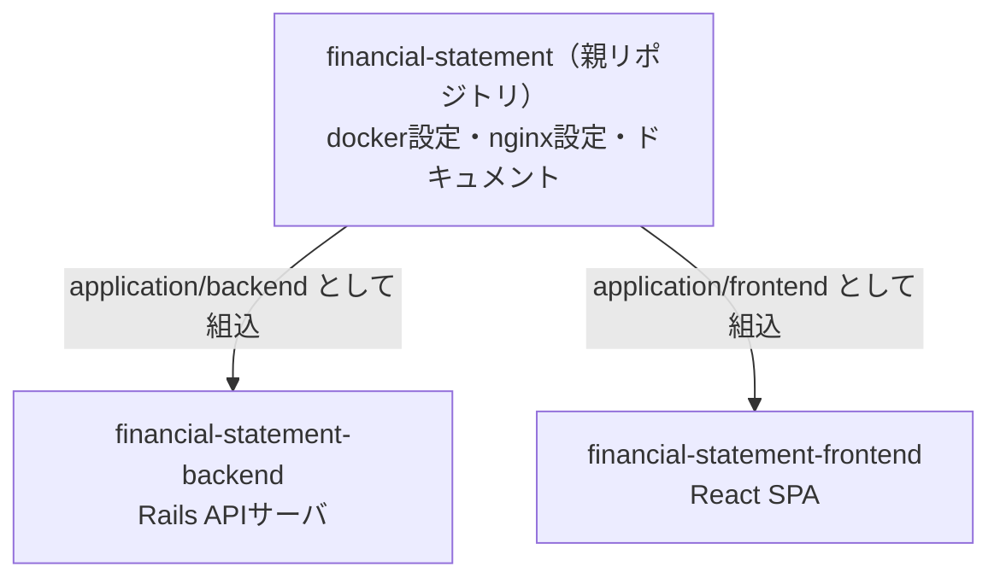

# 03. 技術の前提知識

実装を読むために必要な技術要素の基礎知識。このシステムで「どの技術が」「何の役割で」
使われているかに絞って説明する。すでに知っている項目は読み飛ばして良い。

## 最初に押さえる3つの言葉

このシステムは「画面を担当するフロントエンド」と「データを担当するバックエンド」が
分かれた、Web開発で一般的な構成をとる（実際の構成図とデータの流れは[04章](04_system_overview.md)）。

- **SPA**（Single Page Application）: 最初にHTMLとJavaScriptを読み込んだ後は、
  ページ遷移せずJavaScriptが画面を書き換える方式。investeeの画面はReactで作られたSPA
- **APIサーバ**: 画面を持たず、データだけを返すサーバ。フロントエンドから
  ネットワーク越しに呼び出される
- **バッチ処理**: ユーザーの操作とは無関係に、決まった時刻に走る処理。
  EDINETからのデータ取込がこれにあたる

## GraphQLとは

フロントエンドとバックエンドの間の問い合わせ言語。RESTのようにURLごとに決まった形の
データを返すのではなく、**クライアントが「必要な項目」を宣言し、サーバがその形で返す**。

investeeが実際に使っているクエリを簡略化した例:

```graphql
query {
  financialReports(limit: 30, offset: 0, stockCodes: ["7203"]) {
    companyName
    balanceSheet { renderable bars { label segments { label amount } } }
  }
}
```

押さえておくべき性質:

| 性質 | 内容 |
|---|---|
| 単一エンドポイント | すべての問い合わせが `POST /graphql` の1本に集約される |
| スキーマと型 | サーバ側が「何をどんな型で問い合わせできるか」をスキーマとして定義する。値の形が保証される |
| イントロスペクション | スキーマ自体をAPIで取得できる。これを使いフロントのTypeScript型を自動生成する（graphql-codegen） |
| コスト制御 | 自由な問い合わせを許す代わりに、クエリの複雑さ（complexity）や深さ（depth）に上限を設けて濫用を防ぐ |

## フロントエンドの技術

| 技術 | 役割 |
|---|---|
| React | UIライブラリ。画面を「コンポーネント」という部品の組み合わせで記述する |
| TypeScript | JavaScriptに型を加えた言語。GraphQLの型生成と組み合わせてデータの形の間違いをコンパイル時に検出する |
| CRA + craco | React公式の雛形ツール（Create React App）と、その設定を上書きするためのツール |
| Apollo Client | GraphQLクライアント。問い合わせの発行と結果のキャッシュを担当する |
| Redux Toolkit | 画面をまたいで共有する状態の置き場。ただしこのアプリでの用途はごく小さい（[06章](06_frontend.md)） |
| MUI | Reactコンポーネント集（ボタン・カードなど）。Material Designベース |
| recharts | チャート描画ライブラリ。積み上げ棒・ウォーターフォールの描画に使う |

## バックエンドの技術

| 技術 | 役割 |
|---|---|
| Ruby on Rails | Webアプリケーションフレームワーク。画面を返さないAPIモードで使用 |
| ActiveRecord | RailsのORM。DBのテーブルをRubyのクラスとして扱う。スキーマ変更は「マイグレーション」ファイルで管理する |
| graphql-ruby | GraphQLサーバ実装。スキーマ・型・リゾルバをRubyで定義する |
| puma | Railsを動かすアプリケーションサーバ |
| Sidekiq | 非同期ジョブ実行基盤。ジョブの受け渡しにRedisを使う |
| sidekiq-cron | Sidekiqに「毎日2:00に実行」のようなスケジュール実行を加える拡張 |
| Nokogiri | XMLパーサ。XBRLの解析に使う |
| figaro | 環境変数を `config/application.yml`（gitignore済み）で管理するgem |
| Sentry | エラー監視サービス。例外や警告を集約し通知する |

## データストア

| 技術 | 役割 |
|---|---|
| PostgreSQL | 主データベース。取り込んだ財務データをすべてここに保存する |
| Redis | Sidekiqのジョブキューとスケジュール保持のみに使用（キャッシュ用途では使っていない） |

## Docker Compose

開発環境を「コンテナ」という独立した実行環境の組で立ち上げるツール。
`docker compose up` の1コマンドで、nginx・フロント・バックエンド・PostgreSQL・Redisの
5サービスがまとめて起動する（構成の詳細は[04章](04_system_overview.md)）。
ローカルにRubyやNode.jsを直接インストールしなくても開発を始められる。

**nginx**はリクエストの振り分け役（リバースプロキシ）。「`/api` で始まるURLはバックエンドへ、
それ以外はフロントエンドへ」という交通整理を行う。本番でも同じ役割を担う。

## git submoduleとは

あるgitリポジトリの中に、**別のリポジトリを部品として組み込む**仕組み。
このプロジェクトは3つのリポジトリで構成されている。



重要なのは、親リポジトリが持っているのはsubmoduleの**中身ではなく「どのコミットを
使うか」というポインタ（コミットハッシュ）だけ**という点。ここから運用上の性質が生まれる。

- `git clone` しただけでは中身が空。`--recursive` 付きでcloneするか、
  `git submodule update --init` で中身を取得する
- submodule内のファイルを変更したら、**①submodule側のリポジトリでコミット・マージ、
  ②親リポジトリでポインタを新しいコミットに更新してコミット**、の2段階が必要になる
- 親リポジトリの `git status` に出る `M application/backend` は「ファイルが変わった」
  ではなく「ポインタと実体がずれている」の意味

この2段階を安全に回すためのPR運用ルールが決まっている（[07章](07_development_operations.md)）。

---

次章: [04. システム全体像](04_system_overview.md) — これらの部品が実際にどう組み合わさっているかを見る。
