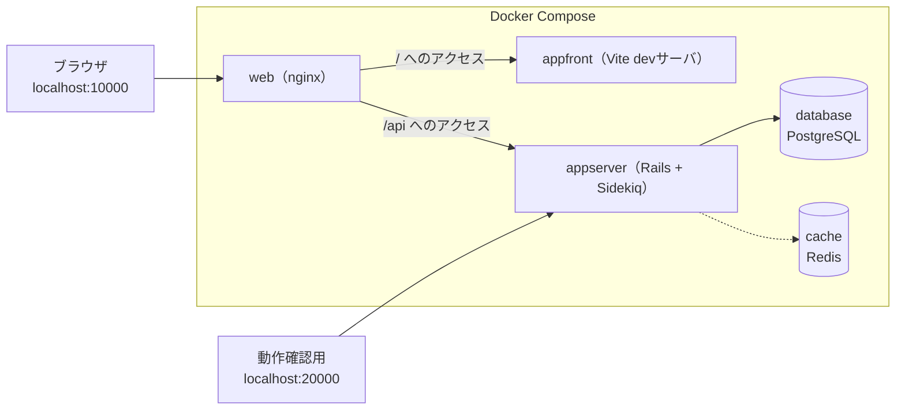
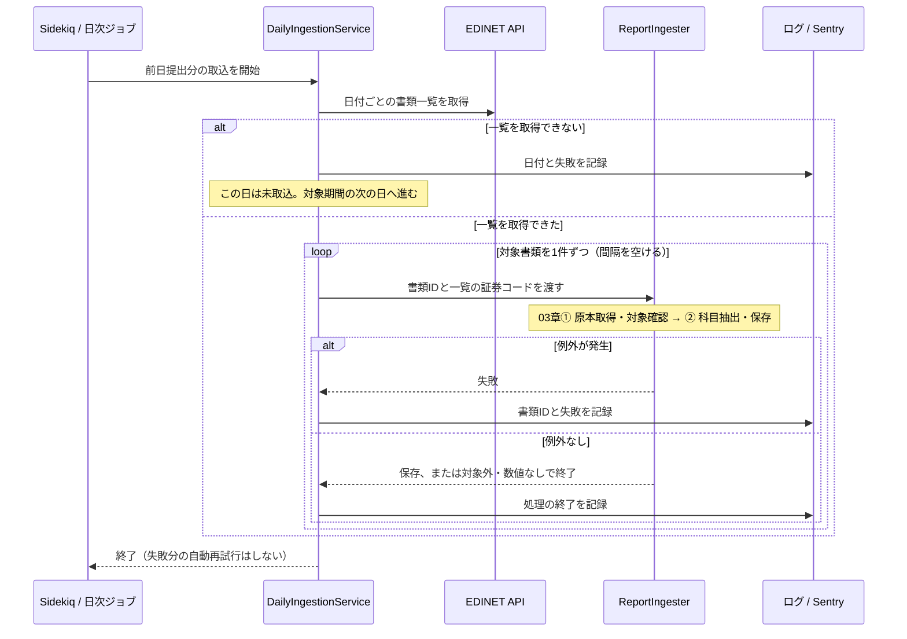
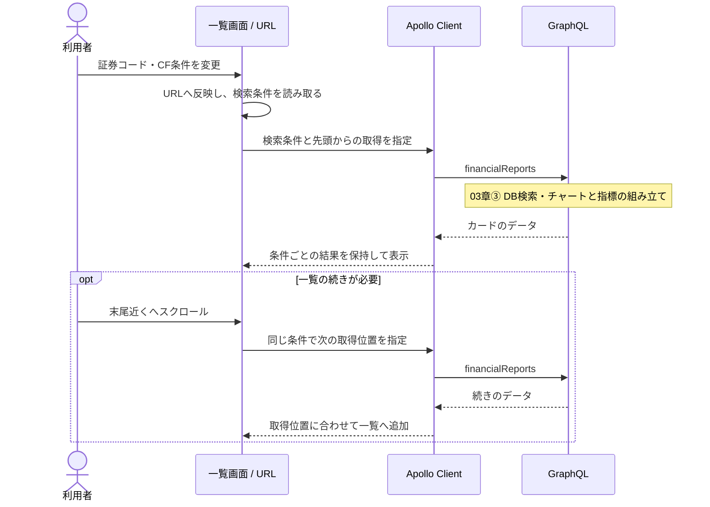

# 04. システム — 構成と実装

この章は、システムの構成、日次取込、公開API、画面の状態管理を説明する。

| 知りたいこと | 参照先 |
|---|---|
| 利用者から見た仕様 | [02章](02_product.md) |
| 原本の読取・保存・チャートと指標の組み立て | [03章](03_data_flow.md) |
| 起動・検証・デプロイ・障害対応 | [05章](05_development_operations.md)と各アプリのREADME |

## 構成

画面・データ・取込で役割を分けた、Web開発で一般的な構成になっている。

| 部品 | 役割 |
|---|---|
| SPA（Single Page Application） | 画面担当。最初にHTMLとJavaScriptを読み込んだ後は、ページ遷移せずJavaScriptが画面を書き換える方式。investeeの画面はReactで作られたSPA |
| APIサーバ | データ担当。画面を持たず、データだけを返すサーバ（Rails）。フロントエンドからネットワーク越しに呼び出される |
| バッチ処理 | 取込担当。ユーザーの操作とは無関係に、決まった時刻に走る処理。EDINETからのデータ取込がこれにあたる |

### リポジトリ構成（monorepo）

バックエンドとフロントエンドを単一のGitリポジトリで管理する。

| パス | 内容 |
|---|---|
| `application/backend` | Rails APIサーバ |
| `application/frontend` | React SPA |
| `web/` | nginx（リバースプロキシ）の設定 |
| `database/` / `cache/` | PostgreSQL / RedisのDocker設定 |
| `docs/` | ドキュメント（このガイド・改善バックログ） |
| `docker-compose.yml` | 開発環境の全体起動 |
| `.github/workflows/` | CIのワークフロー |
| `.claude/skills/` | 定型作業の手順書（デプロイ・日次確認・PR運用・リリース・Rubyバージョンアップ・ブラウザ拡張への同期） |

### 開発環境（Docker Compose）

開発環境は「コンテナ」という独立した実行環境の組で立ち上げる。`docker compose up` の1コマンドで下図の5サービスがまとめて起動し、ローカルにRubyやNode.jsを直接インストールしなくても開発を始められる（手順は[ルートREADME](../../README.md)が正）。

- **nginx**（web）はリクエストの振り分け役（リバースプロキシ）。「`/api` で始まるURLはバックエンドへ、それ以外はフロントエンドへ」と振り分ける。本番でも同じ役割を担う（本番構成は[05章](05_development_operations.md)）
- **PostgreSQL**（database）が主データベースで、取り込んだ財務データをすべてここに保存する
- **Redis**（cache）はSidekiq（後述の非同期ジョブ実行基盤）のジョブキューとスケジュール保持のみに使い、キャッシュ用途では使っていない

## 使っている技術

### バックエンド

| 技術 | 役割 |
|---|---|
| Ruby on Rails | Webアプリケーションフレームワーク。画面を返さないAPIモードで使用 |
| ActiveRecord | RailsのORM。DBのテーブルをRubyのクラスとして扱う。スキーマ変更は「マイグレーション」ファイルで管理する |
| graphql-ruby | GraphQLサーバ実装。スキーマ・型・リゾルバをRubyで定義する |
| puma | Railsを動かすアプリケーションサーバ |
| Sidekiq | 非同期ジョブ実行基盤。ジョブの受け渡しにRedisを使う |
| sidekiq-cron | Sidekiqに「毎日2:00に実行」のようなスケジュール実行を加える拡張 |
| Nokogiri | XMLパーサ。XBRLの解析に使う |
| figaro | 環境変数を `config/application.yml`（gitignore済み）で管理するgem |
| Sentry | エラー監視サービス。例外や警告を集約し通知する |

### フロントエンド

| 技術 | 役割 |
|---|---|
| React | UIライブラリ。画面を「コンポーネント」という部品の組み合わせで記述する |
| TypeScript | JavaScriptに型を加えた言語。GraphQLの型生成と組み合わせてデータの形の間違いをコンパイル時に検出する |
| Vite + Vitest | 開発サーバと本番ビルドを担うツールと、その設定（パス別名など）を共有するテストランナー |
| Apollo Client | GraphQLクライアント。問い合わせの発行と結果のキャッシュを担当する |
| Redux Toolkit | 画面をまたいで共有する状態の置き場。ただしこのアプリでの用途はごく小さい（後述） |
| MUI | Reactコンポーネント集（ボタン・カードなど）。Material Designベース |
| recharts | チャート描画ライブラリ。積み上げ棒・ウォーターフォールの描画に使う |

## コードの入口とディレクトリ

### バックエンド（application/backend/ 以下）

| 役割 | 場所 |
|---|---|
| 日次バッチの入口（毎日2:00） | `app/jobs/daily_ingestion_job.rb`・`config/sidekiq-cron.yml` |
| 手動取込（日付範囲 / 書類ID指定） | `lib/tasks/ingestion.rake` |
| 取込パイプライン | `app/services/ingestion/`（Service・形式判定・Extractor） |
| EDINET通信・XBRLパース | `app/lib/edinet/client.rb`・`app/lib/xbrl/document.rb` |
| 科目コードの定義 | `app/lib/financial_statements/item_codes.rb` |
| 保存層のモデル | `app/models/disclosure/` |
| チャート組み立て・検索 | `app/services/charts/`・`app/services/disclosure/search_query.rb` |
| GraphQL | `app/graphql/` |

### フロントエンド（application/frontend/src/ 以下）

| パス | 内容 |
|---|---|
| `index.tsx` / `App.tsx` | エントリポイント。MUIテーマ定義とルーティング（静的ページ4ルート + 残り全URL→一覧ページ） |
| `features/financialReports/` | 一覧ページ本体（**Webアプリ固有**のコード）。カード・レイアウト・BS→PL→CF→ROE・ROAの自動切替カルーセルを含む |
| `features/siteLayout/` | 全ページ共通の骨組み: URL定義（`siteRoutes`）・フッター（`SiteFooter`）・静的ページ用シェル（`StaticPageLayout`）・ページ別meta切替（`usePageMeta`） |
| `features/staticPages/` | 静的ページ4つの本文と、文章用の小部品（見出し・箇条書き・表）。読み方ページの説明用チャートデータもここ |
| `shared/financialCharts/` | チャート描画キット（**Chrome拡張と共有**するコード） |
| `constants/` | 30件単位・CFパターン定義などの定数 |
| `store/` | Redux（カルーセル自動切替フラグのみ） |
| `plugins/firebase/` | Firebase Analytics初期化とイベント送信 |
| `__generated__/` | graphql-codegenの生成物（コミット済み） |

ディレクトリ分割の基準は機能ではなく「**Chrome拡張（別リポジトリ `financial-statement-chrome-extension`）と共有できるか否か**」。共有キット（`shared/financialCharts/`）はディレクトリごとコピーして共有するため依存の制限（`react`と`recharts`のみ・アプリ固有物に依存しない等）があり、それ以外は `features/` に置く。キットの規約の全文と展開手順はキット内 `README.md` が原本（コピー先のChrome拡張にも同じREADMEが入る）。

## 取込ジョブの信頼性

日次ジョブは前日提出分を取り込む。日付範囲を指定した手動取込も同じサービスを使う。ここではジョブ全体の進み方と失敗時の扱いを示す。

書類ごとの処理は[03章①②](03_data_flow.md#sequence-source)、通知後の対応は[05章のリカバリ](05_development_operations.md#日次バッチの監視とリカバリ)へ続く。処理終了のログだけでは、科目が更新されたとは限らない。

EDINETへのリクエスト集中を避けるため、書類は間隔を空けて逐次処理する。保存時のトランザクションや既存データの保持は[03章②](03_data_flow.md#sequence-save)を参照。

## 公開APIとしての防御

`/graphql` は**未認証・公開エンドポイント**のため、悪意ある・過大なクエリを前提に上限を設けている（クエリとデータの中身は[03章](03_data_flow.md)）。

| 設計 | 内容・理由 |
|---|---|
| 入力量の上限 | `limit` 1〜100、`stockCodes` 最大100件、クエリ複雑度400・深さ20まで |
| `limit` 連動のコスト計算 | ライブラリ既定は引数を見ず `limit:1` と `limit:100` が同コストになるため、`limit` に比例した値（`limit / 2`）を複雑度に加算する |

本番のnginxのレート制限は[05章の本番構成](05_development_operations.md#本番環境の構成)、API変更時の検証は[同章の開発手順](05_development_operations.md#sequence-codegen)を参照。

## 一覧画面の実装

チャートの描画そのものは[03章](03_data_flow.md)。ここでは検索からカード一覧までのページの動きを扱う。

API内部は[03章③](03_data_flow.md#sequence-display)。検索条件を変えると別の一覧として扱い、以前の条件の追加読込結果と混ぜない。

### 状態と取得結果の管理

| 管理するもの | 置き場・ルール | 目的 |
|---|---|---|
| 検索条件 | URLクエリ。`searchCriteria.ts`で正規化・上限・未知値を処理する | 検索UIの表示とAPIへ渡す条件を揃え、共有・再読込でも再現する |
| 取得したカード | ページ専用のApolloキャッシュ。追加分は`offset`の位置へ併合する | 検索条件ごとに結果を分け、別ページへの影響を避ける |
| 追加読込の終了 | 初回が取得単位未満、または追加取得が取得単位未満（0件を含む）なら終了。条件変更時に判定をリセットする | 末尾に達した後の取得を止める |
| 自動切替のON / OFF | ReduxとlocalStorage。保存済みの設定を起動時に復元する | 再訪時も選択を維持する。未保存ならON |
| 通信エラー / 該当なし | 取得エラーと検索結果0件で案内を分ける | 障害を「対象企業がない」と誤解させない |

APIの接続先は相対パス`/api/graphql`。nginxがRailsへ中継するため、Web側の接続先は開発・本番で共通になる。

### カード表示の実装ノート

見出しの形式・基準バッジ・カルーセル・株探リンクといった見た目の仕様は[02章](02_product.md)が正。ここでは実装面の注意だけ挙げる。

- 外部リンクには `rel="noopener noreferrer"` を明示する（MUIのLinkは自動付与しない。referrer遮断は検索条件つきURLの外部漏洩防止も兼ねる）

## 静的ページ・SEO・計測

静的ページの仕様（URL・内容）は[02章](02_product.md)が正。実装面は次のとおり。

| 項目 | 現状 |
|---|---|
| title・description・OGP・JSON-LD | `public/index.html` に静的記述（一覧ページの値）。静的ページは表示中だけ `usePageMeta` が title / description / canonical を差し替え、離れたら `index.html` の値に戻す（一覧ページ側にmeta設定コードを持たせないため。OGPはCSRのため差し替えても効果がなく対象外） |
| robots.txt / sitemap.xml / ads.txt | 全許可 / トップ + 静的ページ4URL / AdSenseの販売者情報 |
| 広告 | Google AdSenseのスクリプトを読み込み |
| 利用状況の計測 | 検索結果・手動操作などを送信する。自由入力や証券コードは送らない。Webと拡張の送信経路は[計測のシーケンス](../analytics/README.md#sequence-analytics)を参照 |
| 改善案 | 企業別URL・動的sitemapなどは [docs/improvements.md](../improvements.md) にバックログあり |

---

次章: [05. 開発と運用](05_development_operations.md)
