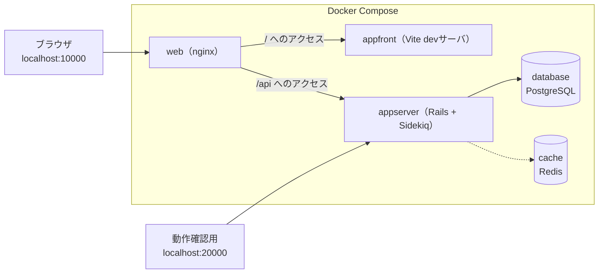
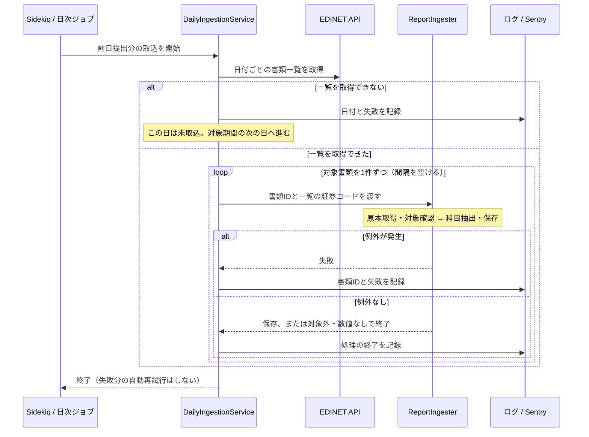
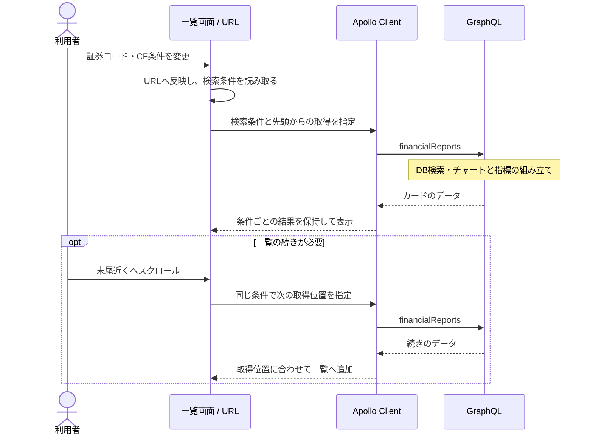

# 04. システム — 構成と実装

この章は、システムの構成、日次取込、公開API、画面の状態管理を説明する。

## 構成

画面・データ・取込で役割を分けた、Web開発で一般的な構成になっている。

| 部品 | 役割 |
|---|---|
| SPA（Single Page Application） | 画面担当。最初にHTMLとJavaScriptを読み込んだ後は、ページ遷移せずJavaScriptが画面を書き換える方式。investeeの画面はReactで作られたSPA |
| APIサーバ | データ担当。画面を持たず、データだけを返すサーバ（Rails）。フロントエンドからネットワーク越しに呼び出される |
| バッチ処理 | 取込担当。ユーザーの操作とは無関係に、決まった時刻に走る処理。EDINETからのデータ取込がこれにあたる |

### 開発環境の構成

Redisは取込ジョブのキューとスケジュールを保持する。財務データのキャッシュには使わない。

## 使っている技術

### バックエンド

| 技術 | 役割 |
|---|---|
| Ruby on Rails | Webアプリケーションフレームワーク。画面を返さないAPIモードで使用 |
| ActiveRecord | RailsのORM。DBのテーブルをRubyのクラスとして扱う。スキーマ変更は「マイグレーション」ファイルで管理する |
| graphql-ruby | GraphQLサーバ実装。スキーマ・型・リゾルバをRubyで定義する |
| puma | Railsを動かすアプリケーションサーバ |
| Sidekiq | 非同期ジョブ実行基盤。ジョブの受け渡しにRedisを使う |
| sidekiq-cron | Sidekiqに「毎日2:00に実行」のようなスケジュール実行を加える拡張 |
| Nokogiri | XMLパーサ。XBRLの解析に使う |
| figaro | 環境変数を `config/application.yml`（gitignore済み）で管理するgem |
| Sentry | エラー監視サービス。例外や警告を集約し通知する |

### フロントエンド

| 技術 | 役割 |
|---|---|
| React | UIライブラリ。画面を「コンポーネント」という部品の組み合わせで記述する |
| TypeScript | JavaScriptに型を加えた言語。GraphQLの型生成と組み合わせてデータの形の間違いをコンパイル時に検出する |
| Vite + Vitest | 開発サーバと本番ビルドを担うツールと、その設定（パス別名など）を共有するテストランナー |
| Apollo Client | GraphQLクライアント。問い合わせの発行と結果のキャッシュを担当する |
| Redux Toolkit | 画面をまたいで共有する状態の置き場。ただしこのアプリでの用途はごく小さい（後述） |
| MUI | Reactコンポーネント集（ボタン・カードなど）。Material Designベース |
| recharts | チャート描画ライブラリ。積み上げ棒・ウォーターフォールの描画に使う |

## 取込ジョブの信頼性

日次ジョブは前日提出分を取り込む。日付範囲を指定した手動取込も同じサービスを使う。ここではジョブ全体の進み方と失敗時の扱いを示す。

処理終了のログだけでは、科目が更新されたとは限らない。

EDINETへのリクエスト集中を避けるため、書類は間隔を空けて逐次処理する。

## 公開APIとしての防御

`/graphql` は**未認証・公開エンドポイント**のため、悪意ある・過大なクエリを前提に上限を設けている。

| 設計 | 内容・理由 |
|---|---|
| 入力量の上限 | `limit` 1〜100、`stockCodes` 最大100件、クエリ複雑度400・深さ20まで |
| `limit` 連動のコスト計算 | ライブラリ既定は引数を見ず `limit:1` と `limit:100` が同コストになるため、`limit` に比例した値（`limit / 2`）を複雑度に加算する |

## 一覧画面の実装

検索条件を変えると別の一覧として扱い、以前の条件の追加読込結果と混ぜない。

### 状態と取得結果の管理

| 管理するもの | 置き場・ルール | 目的 |
|---|---|---|
| 検索条件 | URLクエリ。`searchCriteria.ts`で正規化・上限・未知値を処理する | 検索UIの表示とAPIへ渡す条件を揃え、共有・再読込でも再現する |
| 取得したカード | ページ専用のApolloキャッシュ。追加分は`offset`の位置へ併合する | 検索条件ごとに結果を分け、別ページへの影響を避ける |
| 追加読込の終了 | 初回が取得単位未満、または追加取得が取得単位未満（0件を含む）なら終了。条件変更時に判定をリセットする | 末尾に達した後の取得を止める |
| 自動切替のON / OFF | ReduxとlocalStorage。保存済みの設定を起動時に復元する | 再訪時も選択を維持する。未保存ならON |
| 通信エラー / 該当なし | 取得エラーと検索結果0件で案内を分ける | 障害を「対象企業がない」と誤解させない |

APIの接続先は相対パス`/api/graphql`。nginxがRailsへ中継するため、Web側の接続先は開発・本番で共通になる。

## 静的ページ・SEO・計測

| 項目 | 現状 |
|---|---|
| title・description・OGP・JSON-LD | `public/index.html` に静的記述（一覧ページの値）。静的ページは表示中だけ `usePageMeta` が title / description / canonical を差し替え、離れたら `index.html` の値に戻す。OGP・JSON-LDは初期HTMLの値を使う |
| robots.txt / sitemap.xml / ads.txt | 全許可 / トップ + 静的ページ4URL / AdSenseの販売者情報 |
| 広告 | Google AdSenseのスクリプトを読み込み |
| 利用状況の計測 | 検索結果・手動操作などを送信する。自由入力や証券コードは送らない。Webと拡張の送信経路は[計測のシーケンス](../analytics/README.md#sequence-analytics)を参照 |
| 改善案 | 企業別URL・動的sitemapなどは [docs/improvements.md](../improvements.md) にバックログあり |

---

次章: [05. 開発と運用](05_development_operations.md)
