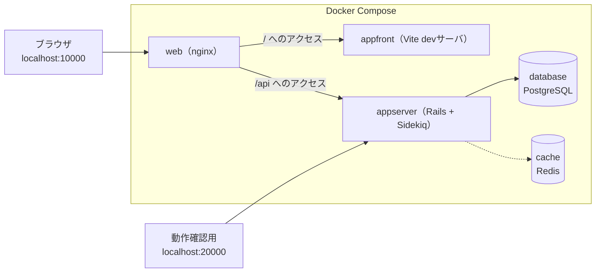
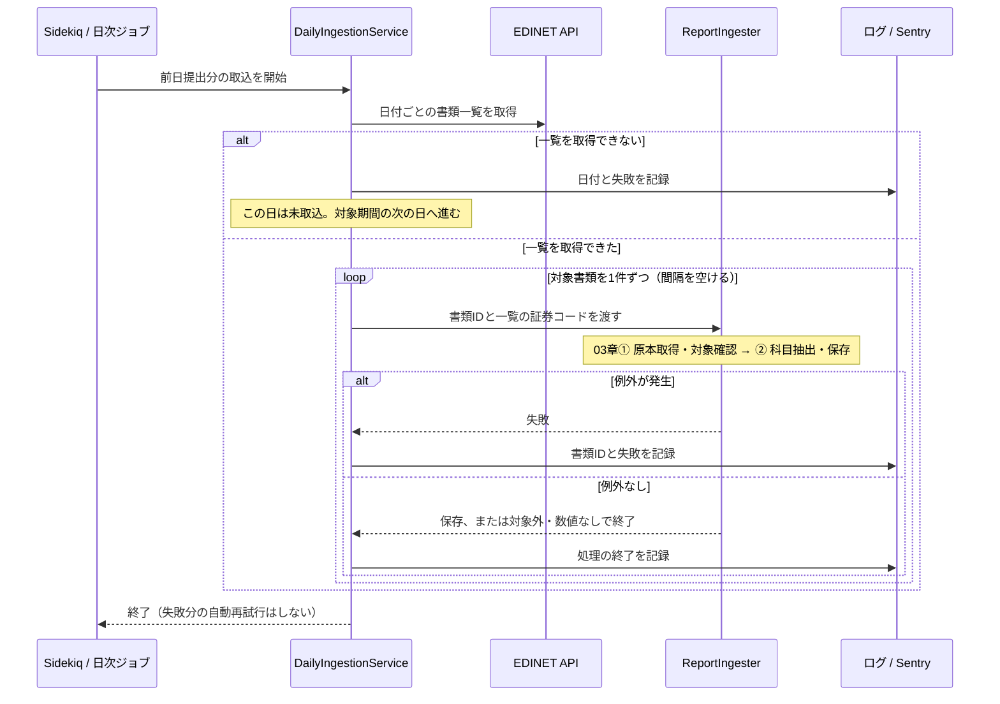
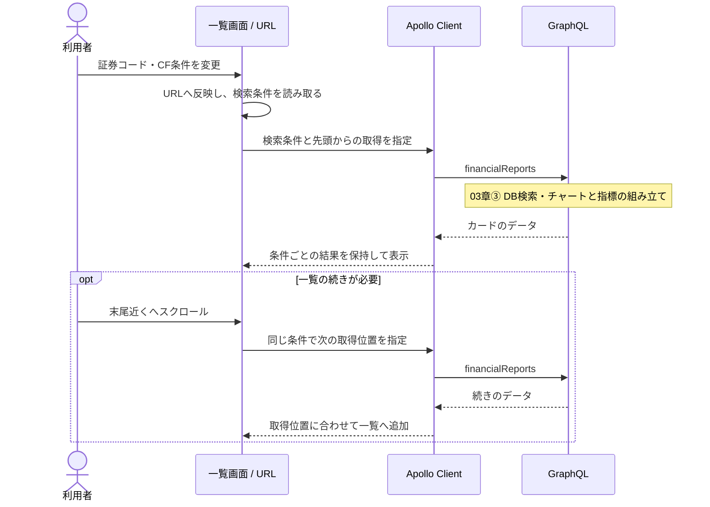
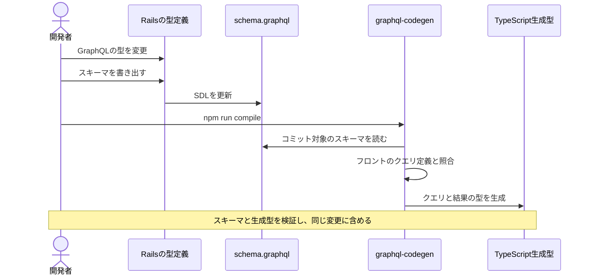

# 04. システム — 構成と実装

[03章](03_data_flow.md)がデータの中身の話だったのに対し、この章はそれを動かすシステム側の話。構成・使っている技術・取込ジョブの信頼性・公開APIとしての防御・画面の実装を、backend / frontendまとめて扱う。環境変数・起動・テスト実行などの手順は各README（`application/backend/README.md`・`application/frontend/README.md`）が正、開発の決まりと本番運用は[05章](05_development_operations.md)。

## 構成

画面・データ・取込で役割を分けた、Web開発で一般的な構成になっている。

| 部品 | 役割 |
|---|---|
| SPA（Single Page Application） | 画面担当。最初にHTMLとJavaScriptを読み込んだ後は、ページ遷移せずJavaScriptが画面を書き換える方式。investeeの画面はReactで作られたSPA |
| APIサーバ | データ担当。画面を持たず、データだけを返すサーバ（Rails）。フロントエンドからネットワーク越しに呼び出される |
| バッチ処理 | 取込担当。ユーザーの操作とは無関係に、決まった時刻に走る処理。EDINETからのデータ取込がこれにあたる |

### リポジトリ構成（monorepo）

コードは単一のgitリポジトリ（monorepo）で管理する。かつてbackend/frontendは別リポジトリのgit submoduleだったが、「submodule側でコミット→親でポインタ更新コミット」の二度手間を解消するため全履歴ごと統合した（履歴中に多数ある `update: backend/frontend submodule` 系コミットはその時代のポインタ更新。ファイル単位の履歴は移行前まで連続して追える）。

ディレクトリは次の役割を持つ。

| パス | 内容 |
|---|---|
| `application/backend` | Rails APIサーバ |
| `application/frontend` | React SPA |
| `web/` | nginx（リバースプロキシ）の設定 |
| `database/` / `cache/` | PostgreSQL / RedisのDocker設定 |
| `docs/` | ドキュメント（このガイド・改善バックログ） |
| `docker-compose.yml` | 開発環境の全体起動 |
| `.github/workflows/` | CI（backend-ci / frontend-ci。変更のあった側だけ本体ジョブを実行） |
| `.claude/skills/` | 定型作業の手順書（デプロイ・日次確認・PR運用・リリース・Rubyバージョンアップ・ブラウザ拡張への同期） |

### 開発環境（Docker Compose）

開発環境は「コンテナ」という独立した実行環境の組で立ち上げる。`docker compose up` の1コマンドで下図の5サービスがまとめて起動し、ローカルにRubyやNode.jsを直接インストールしなくても開発を始められる（手順は[ルートREADME](../../README.md)が正）。



- **nginx**（web）はリクエストの振り分け役（リバースプロキシ）。「`/api` で始まるURLはバックエンドへ、それ以外はフロントエンドへ」と振り分ける。本番でも同じ役割を担う（本番構成は[05章](05_development_operations.md)）
- **PostgreSQL**（database）が主データベースで、取り込んだ財務データをすべてここに保存する
- **Redis**（cache）はSidekiq（後述の非同期ジョブ実行基盤）のジョブキューとスケジュール保持のみに使い、キャッシュ用途では使っていない

## 使っている技術

### バックエンド

| 技術 | 役割 |
|---|---|
| Ruby on Rails | Webアプリケーションフレームワーク。画面を返さないAPIモードで使用 |
| ActiveRecord | RailsのORM。DBのテーブルをRubyのクラスとして扱う。スキーマ変更は「マイグレーション」ファイルで管理する |
| graphql-ruby | GraphQLサーバ実装。スキーマ・型・リゾルバをRubyで定義する |
| puma | Railsを動かすアプリケーションサーバ |
| Sidekiq | 非同期ジョブ実行基盤。ジョブの受け渡しにRedisを使う |
| sidekiq-cron | Sidekiqに「毎日2:00に実行」のようなスケジュール実行を加える拡張 |
| Nokogiri | XMLパーサ。XBRLの解析に使う |
| figaro | 環境変数を `config/application.yml`（gitignore済み）で管理するgem |
| Sentry | エラー監視サービス。例外や警告を集約し通知する |

### フロントエンド

| 技術 | 役割 |
|---|---|
| React | UIライブラリ。画面を「コンポーネント」という部品の組み合わせで記述する |
| TypeScript | JavaScriptに型を加えた言語。GraphQLの型生成と組み合わせてデータの形の間違いをコンパイル時に検出する |
| Vite + Vitest | 開発サーバと本番ビルドを担うツールと、その設定（パス別名など）を共有するテストランナー |
| Apollo Client | GraphQLクライアント。問い合わせの発行と結果のキャッシュを担当する |
| Redux Toolkit | 画面をまたいで共有する状態の置き場。ただしこのアプリでの用途はごく小さい（後述） |
| MUI | Reactコンポーネント集（ボタン・カードなど）。Material Designベース |
| recharts | チャート描画ライブラリ。積み上げ棒・ウォーターフォールの描画に使う |

## コードの入口とディレクトリ

### バックエンド（application/backend/ 以下）

| 役割 | 場所 |
|---|---|
| 日次バッチの入口（毎日2:00） | `app/jobs/daily_ingestion_job.rb`・`config/sidekiq-cron.yml` |
| 手動取込（日付範囲 / 書類ID指定） | `lib/tasks/ingestion.rake` |
| 取込パイプライン | `app/services/ingestion/`（Service・形式判定・Extractor） |
| EDINET通信・XBRLパース | `app/lib/edinet/client.rb`・`app/lib/xbrl/document.rb` |
| 科目コードの定義 | `app/lib/financial_statements/item_codes.rb` |
| 保存層のモデル | `app/models/disclosure/` |
| チャート組み立て・検索 | `app/services/charts/`・`app/services/disclosure/search_query.rb` |
| GraphQL | `app/graphql/` |

### フロントエンド（application/frontend/src/ 以下）

| パス | 内容 |
|---|---|
| `index.tsx` / `App.tsx` | エントリポイント。MUIテーマ定義とルーティング（静的ページ4ルート + 残り全URL→一覧ページ） |
| `features/financialReports/` | 一覧ページ本体（**Webアプリ固有**のコード）。カード・レイアウト・BS→PL→CF→ROE・ROAの自動切替カルーセルを含む |
| `features/siteLayout/` | 全ページ共通の骨組み: URL定義（`siteRoutes`）・フッター（`SiteFooter`）・静的ページ用シェル（`StaticPageLayout`）・ページ別meta切替（`usePageMeta`） |
| `features/staticPages/` | 静的ページ4つの本文と、文章用の小部品（見出し・箇条書き・表）。読み方ページの説明用チャートデータもここ |
| `shared/financialCharts/` | チャート描画キット（**Chrome拡張と共有**するコード） |
| `constants/` | 30件単位・CFパターン定義などの定数 |
| `store/` | Redux（カルーセル自動切替フラグのみ） |
| `plugins/firebase/` | Firebase Analytics初期化とイベント送信 |
| `__generated__/` | graphql-codegenの生成物（コミット済み） |

ディレクトリ分割の基準は機能ではなく「**Chrome拡張（別リポジトリ `financial-statement-chrome-extension`）と共有できるか否か**」。共有キット（`shared/financialCharts/`）はディレクトリごとコピーして共有するため依存の制限（`react`と`recharts`のみ・アプリ固有物に依存しない等）があり、それ以外は `features/` に置く。キットの規約の全文と展開手順はキット内 `README.md` が原本（コピー先のChrome拡張にも同じREADMEが入る）。

## 取込ジョブの信頼性

一覧取得は企業内容等開示府令（`ordinanceCode: 010`）の有報・訂正有報に限定し、ファンドコードあり・証券コードなしの書類を除く。信託受益証券の有報には提出会社の証券コードが付くことがあるため、証券コードだけでは企業自身の有報と判定しない。docID直接指定でもファンドは企業マスタの更新前に除外し、誤登録済みなら科目を残して表示対象から外す。証券コード空欄の再取込は、保存済み書類と企業・期間まで一致する場合に限る。

取込がデータをどう変換するかは[03章](03_data_flow.md)。ここではバッチとしての動き方と、壊れたデータ・壊れた日から回復できる仕組みを扱う。

<a id="sequence-daily"></a>



書類ごとの処理は[03章①②](03_data_flow.md#sequence-source)、通知後の対応は[05章のリカバリ](05_development_operations.md#日次バッチの監視とリカバリ)へ続く。処理終了のログだけでは、科目が更新されたとは限らない。

深夜2:00に実行するのは、当日分の提出が出そろうのを待つため（対象は前日提出分）。

### 具体例: ある日のバッチで4件の書類が来たら

逐次実行・失敗の隔離・冪等・取り込まない判断を、ある1日の動きで追う。

| 書類 | 内容 | 何が起きるか |
|---|---|---|
| A | 通常の有報 | 保存される。1秒待って次へ |
| B | Aと同じ企業・同じ会計期間の訂正有報 | 新規追加ではなく**同じ行への上書き**になる（自然キーが「企業+会計期間」のため。[03章](03_data_flow.md)） |
| C | パース中に例外が発生 | ログ+Sentry通知して**次の書類へ進む**（Cだけが未取込になり、他は無事） |
| D | DEIの証券コードが一覧APIと不一致 | **保存せず**Sentryへ通知 |

翌日、通知に気づいたら `rake 'ingestion:documents[Cの書類ID]'` で再取込する。全処理が冪等なので、A・Bごと再実行しても壊れない（リカバリ手順は[05章](05_development_operations.md)）。

### 信頼性を支える設計判断

| 設計 | 理由（業務上の背景） |
|---|---|
| 同期・逐次 + 書類間1秒待ち。**並列化しない** | EDINET APIはリクエスト過多で403を返して遮断する |
| DEI（提出者が書くメタ情報）を信用せず、EDINETコードの形式と一覧APIの証券コードで検証してから使う | なりすましも提出ミスも同じ経路で起き、検証なしだと**他社レコードを上書き**し得る |
| 自動リトライなし・冪等な再実行だけ | リトライの複雑さを持ち込むより、いつ何度実行しても安全な方が運用が単純になる |

### 保存時の防御

| 防御 | 目的 |
|---|---|
| 当期科目が取れず既存データがあるなら、その財務諸表を保持 | 財務データを含まない訂正有報が、正しいデータを空で潰さない |
| 科目は削除→一括挿入で総入れ替え | 訂正で消えた科目は消える必要がある（[03章](03_data_flow.md)の「行がない=開示なし」を保つ） |
| 連結がなくなった有報では旧連結行を削除 | 連結廃止時に古い表示用データが残らない |

社名の巻き戻し防止（企業マスタの社名更新は最新年度の取込時のみ）は、[03章](03_data_flow.md)の「企業名は2箇所に持つ」が担う。

既知のエッジケース（安全側に倒れるため対応不要）: 「連結廃止をDEIで伝え、かつ財務データを含まない訂正有報」が来ると、その有報が一覧から一時的に消える（Sentry警告あり。次の正常な取込で復元される）。

## 公開APIとしての防御

`/graphql` は**未認証・公開エンドポイント**のため、悪意ある・過大なクエリを前提に上限を設けている（クエリとデータの中身は[03章](03_data_flow.md)）。

| 設計 | 内容・理由 |
|---|---|
| 入力量の上限 | `limit` 1〜100、`stockCodes` 最大100件、クエリ複雑度400・深さ20まで |
| `limit` 連動のコスト計算 | ライブラリ既定は引数を見ず `limit:1` と `limit:100` が同コストになるため、`limit` に比例した値（`limit / 2`）を複雑度に加算する |

フィールドを増やすときは複雑度の実測値（一覧54 / Chrome拡張89 / 型生成のイントロスペクション187。上限400）に収まるか確認する。本番ではさらにnginxのレート制限がかかる（[05章](05_development_operations.md)）。

## 一覧画面の実装

チャートの描画そのものは[03章](03_data_flow.md)。ここでは検索からカード一覧までのページの動きを扱う。

<a id="sequence-search"></a>



API内部は[03章③](03_data_flow.md#sequence-display)。検索条件を変えると別の一覧として扱い、以前の条件の追加読込結果と混ぜない。

### 具体例: URLがそのままクエリになる

[02章](02_product.md)の「健全型」（営業↑ 投資↓ 財務↓）で2社を検索したときの変換。

```
URL:         /?stock-codes=7203,4502&cash-flow-type=healthy
              ↓ useQueryVariables() が変換
GraphQL変数:  { limit: 30, offset: 0,
               stockCodes: ["7203", "4502"],
               operatingCfSign: POSITIVE,
               investingCfSign: NEGATIVE,
               financingCfSign: NEGATIVE }
```

| 実装上の決まり | 内容 |
|---|---|
| 検索状態の正はURLクエリだけ | 検索UIは `navigate()` でURLを書き換えるだけ。リロード・共有で状態が再現できる |
| URLの解釈は `searchCriteria.ts` に1本化 | 正規化（大文字化・trim）・件数上限・未知値のフォールバックを、GraphQL変数化とチップ表示の両方が同じ関数で行う（表示と検索結果を食い違わせない） |
| 追加取得の併合 | Apolloのキャッシュ設定（`typePolicies`）で `offset` の位置に書き込んで1リストに併合。`offset` 以外の条件が変わると別リスト扱い |
| 無限スクロールの終端判定 | 「取得済み件数が30の倍数」の間は続行し、30件未満しか返らなかったら終端 |
| APIの向き先 | 相対パス `/api/graphql` 固定。nginxが中継するため開発と本番でコードが同じ（環境変数・`.env` なし） |
| Apolloインスタンス | このページ専用に生成し、`ApolloProvider` もページ配下だけに提供（キャッシュ設定を他機能と独立に保つ） |

### 画面の状態はどこに置くか

| 状態 | 置き場 | 補足 |
|---|---|---|
| 検索条件 | URLクエリ | 上記のとおり。Reduxには置かない |
| カルーセル自動切替のON/OFF | Redux（唯一のスライス）+ localStorageへ保存 | 起動時にlocalStorageから復元する（明示的にOFFにした場合のみOFF、未保存はONで開始） |
| それ以外 | なし | 取得データはApolloキャッシュが持つ |

### カード表示の実装ノート

見出しの形式・基準バッジ・カルーセル・株探リンクといった見た目の仕様は[02章](02_product.md)が正。ここでは実装面の注意だけ挙げる。

- 外部リンクには `rel="noopener noreferrer"` を明示する（MUIのLinkは自動付与しない。referrer遮断は検索条件つきURLの外部漏洩防止も兼ねる）
- 検索結果・手動操作などを計測する。自由入力や証券コードは送信しない。Webの直接送信と拡張機能のサーバ中継の違いは[計測のシーケンス](../analytics/README.md#sequence-analytics)を参照

## 静的ページ・SEO・計測

静的ページの仕様（URL・内容）は[02章](02_product.md)が正。実装面は次のとおり。

| 項目 | 現状 |
|---|---|
| title・description・OGP・JSON-LD | `public/index.html` に静的記述（一覧ページの値）。静的ページは表示中だけ `usePageMeta` が title / description / canonical を差し替え、離れたら `index.html` の値に戻す（一覧ページ側にmeta設定コードを持たせないため。OGPはCSRのため差し替えても効果がなく対象外） |
| robots.txt / sitemap.xml / ads.txt | 全許可 / トップ + 静的ページ4URL / AdSenseの販売者情報 |
| 広告 | Google AdSenseのスクリプトを読み込み |
| 改善案 | 企業別URL・動的sitemapなどは [docs/improvements.md](../improvements.md) にバックログあり |

## GraphQL型生成（graphql-codegen）

<a id="sequence-codegen"></a>



これは開発時の処理で、[03章③の実行時のAPI通信](03_data_flow.md#sequence-display)とは別。操作手順は[05章](05_development_operations.md#graphqlスキーマを変えたときの連鎖手順)を参照。

| 決まり | 内容 |
|---|---|
| バックエンドの起動は不要 | スキーマの参照先が `../backend/schema.graphql`（コミット済みSDL）のため。スキーマを変えたときの連鎖手順は[05章](05_development_operations.md) |
| 生成物はコミットする | デプロイやビルドだけなら再生成不要。スキーマを変えたときだけ再生成してコミット。取り込み忘れはCIが差分検知する |
| `Money` は `number` に対応づけ | 金額はJSON数値のまま届く（[03章](03_data_flow.md)の `Money` スカラ） |
| 開発中はwatchモードが常駐 | 起動スクリプトが自動起動し、クエリ変更に追従する |

## 品質の現状

バックエンドの検証コマンド・specの実行は `application/backend/README.md` が正（Extractorの機械検証と回帰specは[03章](03_data_flow.md)の変更ガイド）。フロントエンドは次のとおり。

| 項目 | 状態 |
|---|---|
| 検証コマンド | `npx tsc --noEmit` / `yarn test` / eslint / prettier / `yarn build`（`application/frontend/README.md` が正） |
| CI | 導入済み（`.github/workflows/frontend-ci.yml`。検証コマンド一式 + テスト + 型生成の差分検知 + build） |
| テストコード | ロジックを持つ純粋関数（チャートの行列変換・金額表示・色解決・検索条件パース）に仕様ベースのユニットテストあり。コンポーネント描画のテストは無い |
| GraphQLエラー時の画面表示 | 取得エラーと検索結果0件を区別し、エラー時は再試行を案内する |

---

次章: [05. 開発と運用](05_development_operations.md)
