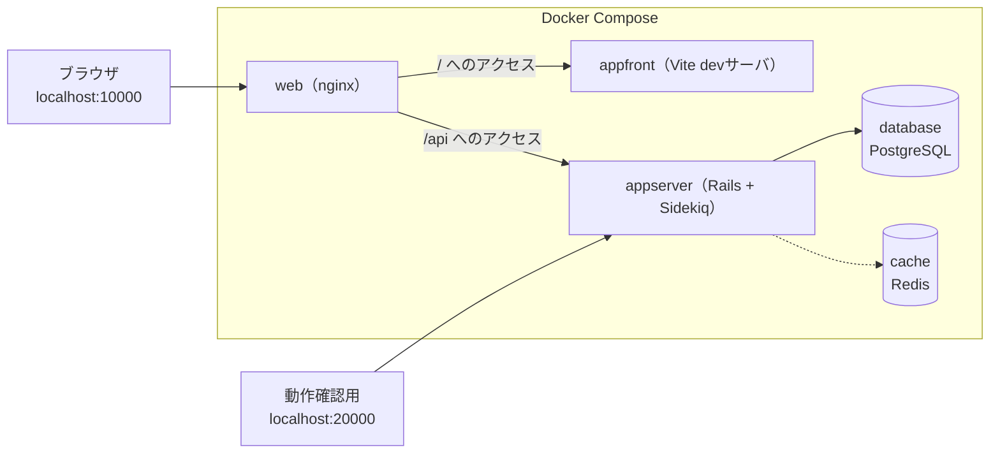
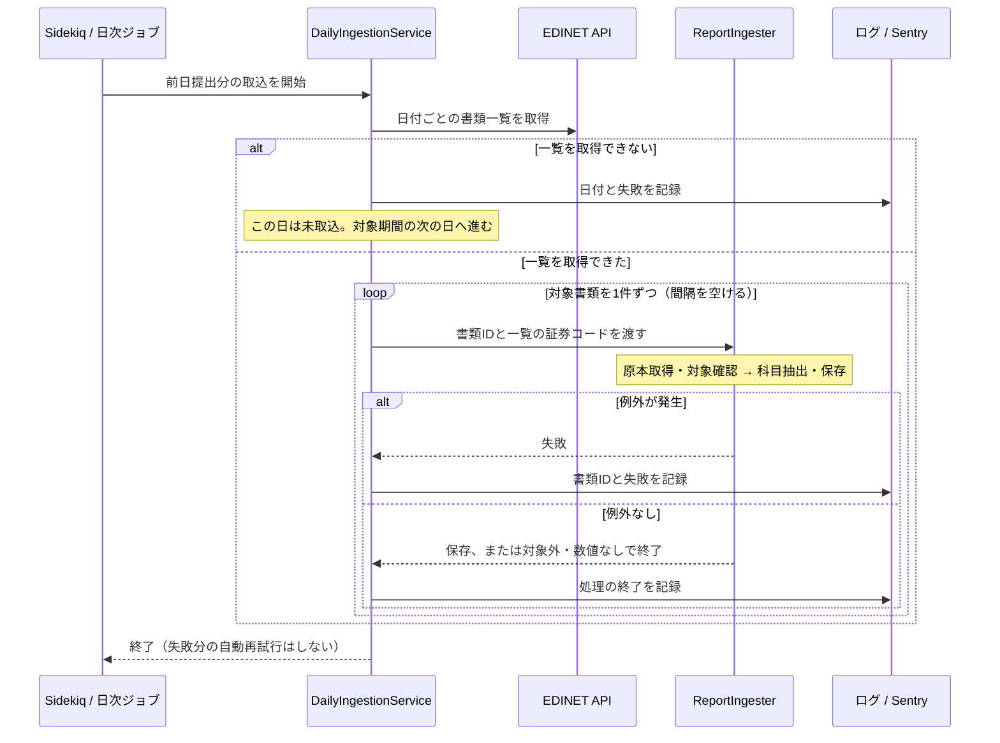
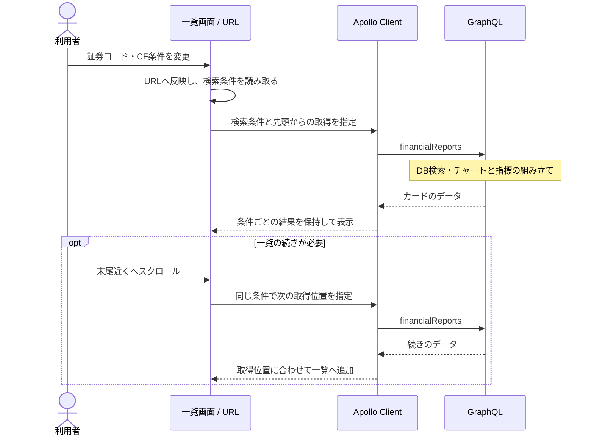

# 04. システム — 構成と実装

この章は、システムの構成、日次取込、公開API、画面の状態管理を説明する。

## 構成

画面はReact、データの取得と配信はRailsが担当する。

| 部品 | 役割 |
|---|---|
| SPA（Single Page Application） | 画面担当。最初にHTMLとJavaScriptを読み込んだ後は、ページ遷移せずJavaScriptが画面を書き換える方式。investeeの画面はReactで作られたSPA |
| APIサーバ | データ担当。画面を持たず、データだけを返すサーバ（Rails）。フロントエンドからネットワーク越しに呼び出される |
| バッチ処理 | 取込担当。ユーザーの操作とは無関係に、決まった時刻に走る処理。EDINETからのデータ取込がこれにあたる |

### 開発環境の構成

Redisは取込ジョブのキューとスケジュールを保持する。財務データのキャッシュには使わない。

## 取込ジョブの信頼性

Sidekiqが毎日2:00に前日提出分を取り込む。手動で日付範囲を指定するときも同じ処理を使う。EDINETへのリクエスト集中を避けるため、書類は間隔を空けて1件ずつ処理する。

処理終了のログだけでは、科目が更新されたとは限らない。

## 公開APIとしての防御

`/graphql` はログイン不要で利用できるため、1回の問い合わせで取得できる量と処理の複雑さを制限する。

| 設計 | 内容・理由 |
|---|---|
| 入力量の上限 | `limit` 1〜100、`stockCodes` 最大100件、クエリ複雑度400・深さ20まで |
| 件数に応じた負荷の評価 | 取得件数が多い問い合わせほど、複雑度を高く評価する |

## 一覧画面の実装

### 状態と取得結果の管理

| 対象 | 管理方法 |
|---|---|
| 検索条件 | URLに保存する。入力を整えてから検索に使い、不明な条件や件数の上限を処理する |
| 取得したカード | Apollo Clientが検索条件ごとに結果を保持し、追加取得したカードを指定位置へ並べる。違う条件の結果は混ぜない |
| 追加読込 | 取得件数が要求した件数より少なければ終了する。条件を変えたら先頭から取得する |
| 自動切替 | Reduxで状態を管理し、localStorageに保存する。保存済みの設定がなければON |

APIの接続先は相対パス`/api/graphql`。nginxがRailsへ中継するため、Web側の接続先は開発・本番で共通になる。

## 静的ページ・SEO・計測

| 項目 | 現状 |
|---|---|
| ページ情報（検索結果・SNS向け） | `public/index.html` に静的記述（一覧ページの値）。静的ページは表示中だけ `usePageMeta` が title / description / canonical を差し替え、離れたら `index.html` の値に戻す。OGP・JSON-LDは初期HTMLの値を使う |
| 公開ファイル | `robots.txt` はクロールを許可。`sitemap.xml` はトップと案内4ページを掲載。`ads.txt` は広告の販売者情報 |
| 広告 | Google AdSenseのスクリプトを読み込み |
| 利用状況の計測 | Google Analyticsへ検索結果や操作のイベントを送信する |
