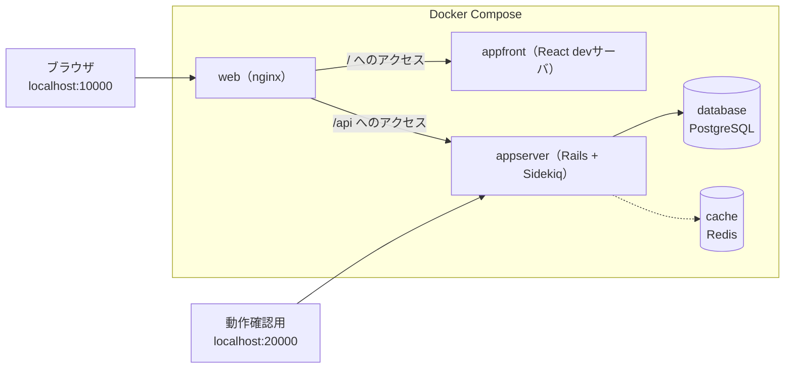
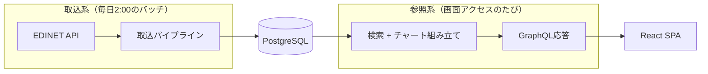
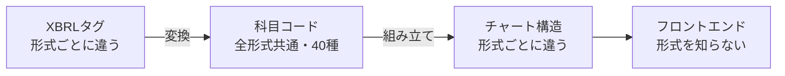
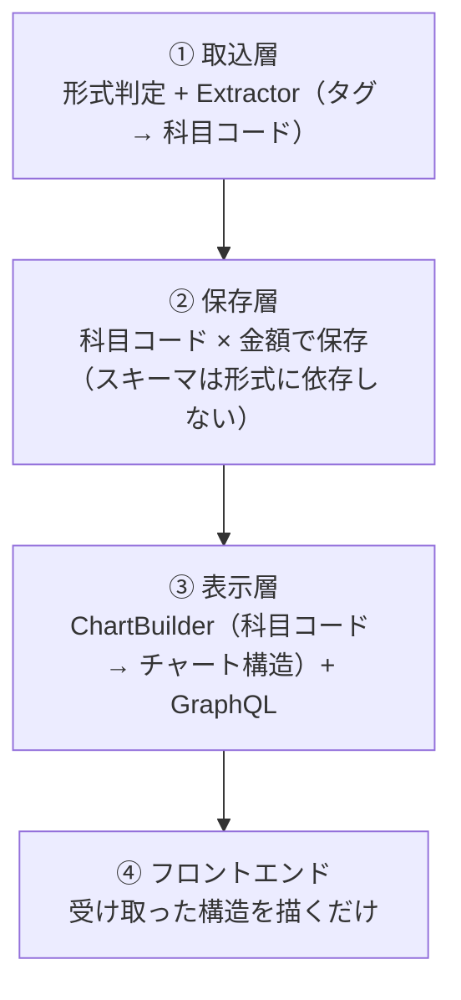
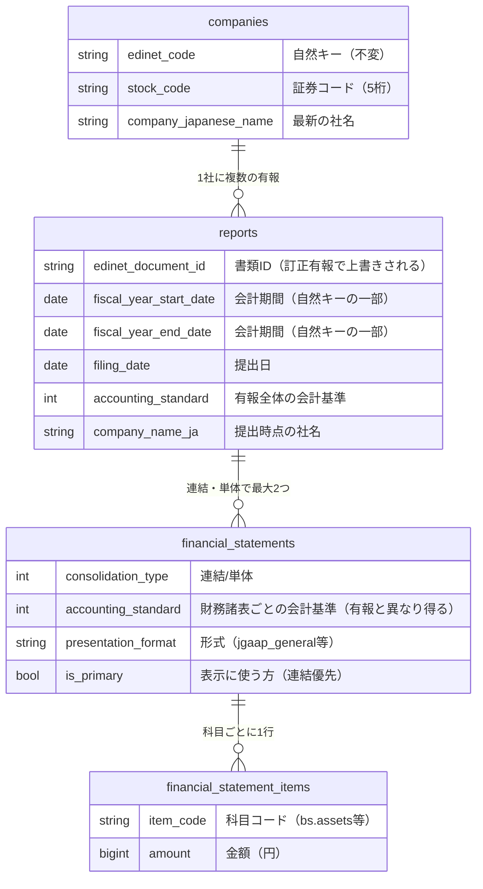
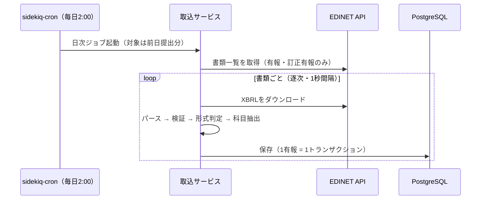
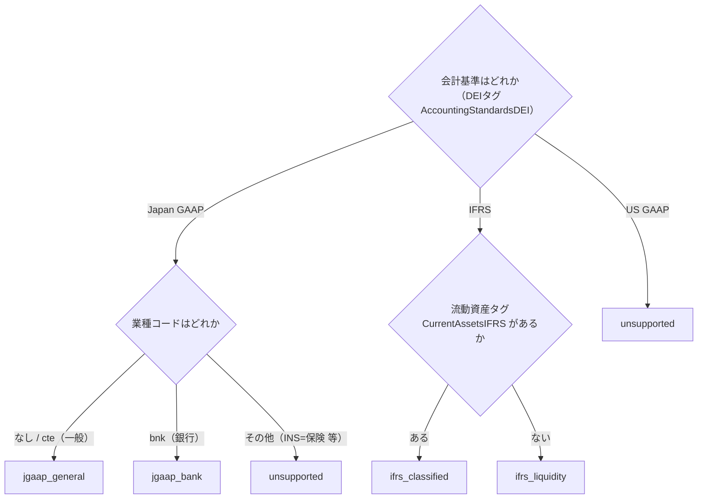
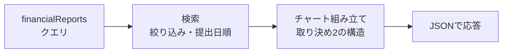

# 04. システム全体像と設計

この章は次の6つの問いに、この順番で答える。前の答えが次の前提になる。

| 節 | 答える問い |
|---|---|
| 構成 | 何でできているか |
| 全体の動き | データはいつ・どう流れるか |
| 難しさ | なぜ単純に作れないか |
| 解き方 | どういう設計で解いているか（4つの層と2つの取り決め） |
| データの持ち方 | データをどんな形で保存するか |
| 取込の流れ / 参照の流れ | 2つの系統は具体的に何をするか |

## 構成: 何でできているか

[03章](03_tech_prerequisites.md)で見たとおり3リポジトリ構成で、親リポジトリのディレクトリは次の役割を持つ。

| パス | 内容 |
|---|---|
| `application/backend` | Rails APIサーバ（別リポジトリのsubmodule） |
| `application/frontend` | React SPA（別リポジトリのsubmodule） |
| `web/` | nginx（リバースプロキシ）の設定 |
| `database/` / `cache/` | PostgreSQL / RedisのDocker設定 |
| `docs/` | ドキュメント（このガイド・改善バックログ） |
| `docker-compose.yml` | 開発環境の全体起動 |
| `.github/workflows/` | CI（submodule参照の整合性チェック） |
| `.claude/skills/` | 定型作業の手順書（デプロイ・日次確認・PR運用・リリース） |

開発環境は `docker compose up` で5サービスが起動する（手順は[ルートREADME](../../README.md)が正）。



## 全体の動き: データはいつ・どう流れるか

処理は2系統に分かれる。



| 系統 | 動くとき | すること | DBへの書き込み |
|---|---|---|---|
| 取込系 | 毎日2:00（バッチ） | EDINETから有報を取得し、DBへ保存 | **あり（ここだけ）** |
| 参照系 | 画面アクセスのたび | DBを検索し、チャートの構造を組み立てて返す | なし（読み取り専用） |

2つの系統はDBのテーブル定義と科目コード（後述）だけを共有し、互いの実装を知らない。

## 難しさ: なぜ単純に作れないか

やりたいことは「有報の数字をグラフにする」だけだが、[01章](01_financial_knowledge.md)で見たとおり、同じ「資産合計」でも会計基準によってXBRLのタグ名が違う。

```
武田薬品（IFRS）      jpigp_cor:AssetsIFRS
三菱UFJ（日本基準）    jppfs_cor:Assets
トヨタ（日本基準）      jppfs_cor:Assets      ← 銀行と同じタグ
```

タグ名だけでなく、財務諸表の構造そのものも変わる。この「会計基準 × 開示様式」の組合せを、このシステムでは**形式**と呼ぶ（[02章](02_product.md)で見た5種類）。

| | 一般事業会社 | 銀行 | IFRS |
|---|---|---|---|
| BSの区分 | 流動 / 固定 | 区分なし（貸出金・預金） | 流動 / 非流動 |
| PLのトップライン | 売上高 | 経常収益 | 売上収益 |
| 利益の段階 | 営業→経常→当期 | 経常→当期 | 経常利益が無い |

この違いをそのままコードに持ち込むと、テーブルは全形式の全科目を横に並べた形になり、グラフ部品は形式ごとの専用コンポーネントに分かれていく。その状態で新しい形式（例: 保険）を1つ足すと、変更が全部の層に及ぶ。

```
DBにカラム追加 → 取込に分岐追加 → APIに項目追加 → フロントに部品追加 → Chrome拡張にも複製
```

実際、旧実装ではIFRS企業の連結が0円で保存されて表示できない、という形でこの問題が起きていた。つまり解くべき問題は、**形式ごとの違いがデータにも画面にも広がること**。

## 解き方: 4つの層と2つの取り決め

### 方針: 変わるものを端に寄せる

形式が変わったとき、何が変わり何が変わらないかを分ける。

| | 具体例 |
|---|---|
| 形式ごとに変わるもの | XBRLのタグ名、BSの段の構成、PLの利益段階 |
| 形式によらず変わらないもの | 「資産 = 負債 + 資本」という関係、積み上げバー2本で貸借を表す見せ方 |

変わらないもの、すなわち**科目コード**（`bs.assets` など全形式共通の40種の語彙）を中央に置き、変わるものを入口と出口に寄せる。



### 4つの層

この方針をコードに落とすと4層になる。依存は上から下への一方向で、逆流させない。



| 層 | 知ってよいこと | 知ってはいけないこと |
|---|---|---|
| ① 取込 | XBRLのタグ名・タクソノミ・形式判定 | グラフの見た目・色・段の順序 |
| ② 保存 | 科目コードの一覧 | XBRLのタグ名 / グラフの構造 |
| ③ 表示 | 科目コード・グラフの構成・色の役割 | XBRLのタグ名 |
| ④ フロント | チャート構造の形（bars / segments） | 科目名も会計基準も一切 |

この表が実装で迷ったときの判断基準になる。たとえば「フロントで銀行だけ色を変えたい」は④に③の知識を持ち込む変更なので、代わりに③で色の役割（`colorRole`）を割り当て直す。

### 2つの取り決め

層の間で受け渡すデータの形は、次の2つの取り決めで固定している。

| 取り決め | つなぐ層 | 内容 | 守られる仕組み |
|---|---|---|---|
| 取り決め1: 科目コード | ① → ② → ③ | `bs.assets` など40種の共通語彙。命名は `<財務諸表>.<英名スネークケース>` | 定義をRubyの定数1ファイルに限定。「Extractorが使うコード ⊆ 定義」をspecで機械検証 |
| 取り決め2: チャート構造 | ③ → ④ | バーとセグメントの構造をそのまま返す。セグメントは固定キーなしの配列 | 型をGraphQLスキーマで固定。形式が増えても構造は変わらない（中身は[05章](05_backend.md)） |

科目コードのDBマスタテーブルは作らない。コードと利用箇所は必ず同時に変わるため、grepとレビューが効くRubyの定数の方が安全と判断している。

### 形式は登録表で増やす

形式ごとの差異を `if` や継承で書くと、形式が増えるたびに既存コードを触ることになる。代わりに「形式 → クラス」のハッシュ登録に統一している。

```ruby
EXTRACTORS = { "jgaap_bank" => Extractors::JgaapBank, ... }   # ①取込側の登録表
BS         = { "jgaap_bank" => Builders::BsJgaapBank, ... }   # ③表示側の登録表
```

- 新形式の追加 = クラスを1つ書いて、表に1行足すだけ。既存形式のコードは触らない
- 似た形式（IFRSの2様式）でも**継承はさせない**。片方の修正がもう片方に波及するのを避けるためで、マッピング定数の重複はあえて許容する
- 逆に、形式によらない共通ロジック（債務超過・貸借検証・比率計算）は基底クラスに1回だけ書く

狙いどおり分離できているかは「新形式の追加で触るファイル」で確認できる。

| 層 | 新形式（例: 保険）追加時の作業 |
|---|---|
| ① 取込 | Extractorクラスを1つ追加 + 判定表と登録表に1行ずつ |
| ② 保存 | **なし**（マイグレーション不要） |
| ③ 表示 | Builderクラスを1〜2つ追加 + 登録表に1行 |
| ④ フロント / Chrome拡張 | **なし** |

## データの持ち方（② 保存層）

保存の形は、開示実務の4つの事実から決まっている。

| 業務上の事実 | データモデルへの反映 |
|---|---|
| 訂正有報が、同じ会計期間のデータを別書類として上書きしに来る | 有報の自然キーを書類IDでなく「企業+会計期間」にする |
| 企業は社名を変えるが、過去の有報は提出当時の名前で読みたい | 企業名を2箇所に持つ（下記） |
| 開示しない科目がある。「0円」とは意味が違う | 「行がない = 開示なし」の規約（下記） |
| IFRS企業でも単体財務諸表は日本基準でタグ付けされる（実測6社すべて） | 会計基準・表示形式を「有報」でなく「財務諸表」の属性にする。有報1通の中に `ifrs_classified`（連結）と `jgaap_general`（単体）が同居する |



### 企業名は2箇所に持つ

| 置き場所 | 内容 | 更新するのは |
|---|---|---|
| `companies.company_japanese_name` | 最新の企業名 | その企業の**最新会計期**の有報を取り込んだときだけ（過去年度の取込では巻き戻さない） |
| `reports.company_name_ja` | 提出時点の企業名 | その有報を取り込むたび（訂正有報も上書き） |

実例（NTT。2025年に日本電信電話から社名変更）: 2024年3月期の有報は「日本電信電話株式会社」のまま表示され、2026年3月期は「NTT株式会社（旧会社名 日本電信電話株式会社）」という提出書類の表記で表示される。マスタは最新名だけを持つ。

### 規約: 「行がない = 開示なし」

| XBRLから値が | どうするか |
|---|---|
| 取れた | 行を作る（0円なら `amount = 0` の行を作る） |
| 取れない | 行を作らない（NULLも0も保存しない） |

これで「0円」と「開示なし」を区別できる。横持ちだった旧テーブルではIFRS企業の全カラムが0で埋まり、どちらなのか判別できなかった。

保存された行の実例（武田薬品・IFRS連結。単位: 円）:

| item_code | amount | 由来 |
|---|---|---|
| bs.assets | 15,511,506,000,000 | `jpigp_cor:AssetsIFRS` |
| bs.goodwill_and_intangibles | 9,228,358,000,000 | のれん+無形の2タグをExtractorが合算 |
| pl.profit_before_tax | -142,355,000,000 | 赤字は負の値のまま保存 |

`pl.gross_profit` の行は存在しない（武田は売上総利益を開示していないため）。このデータが[05章](05_backend.md)で、抽出からチャートになるまで登場する。

このほか旧実装の `security_reports` テーブルが凍結保管されている（コードからの参照はゼロ。経緯は[09章](09_legacy_cleanup.md)）。

## 取込の流れ（① 取込層）



- 深夜2:00に実行するのは、当日分の提出が出そろうのを待つため（対象は前日提出分）
- EDINET APIの403対策で並列化せず、書類間に1秒の間隔を置く
- 失敗は「書類単位」「日単位」で隔離され、1件の失敗が全体を止めない。自動リトライは持たず、**全処理を冪等（何度実行しても同じ結果）にして再実行で回復する**

シーケンス中の「形式判定」は次のフローで決まる。



- IFRSの2様式はDEI（書類メタ情報。[01章](01_financial_knowledge.md)）では区別できず、タグの実在で判定する（根拠の実測は[08章](08_taxonomy_mapping.md)）
- 未知の業種コードは安全側に倒して `unsupported` にする（誤ったグラフを出さない）
- **単体財務諸表は常に日本基準として扱う**（[01章](01_financial_knowledge.md)の「IFRS企業でも単体は日本基準タグ」の実装反映）

## 参照の流れ（③ 表示層 → ④ フロントエンド）



エンドポイントは `POST /graphql` の1本だけ。検索で有報を絞り、Builderがチャート構造を組み立てて返す。組み立ての中身と実データの例は[05章](05_backend.md)、受け取って描く側は[06章](06_frontend.md)。

---

次章: [05. バックエンド](05_backend.md) / [06. フロントエンド実装](06_frontend.md)
