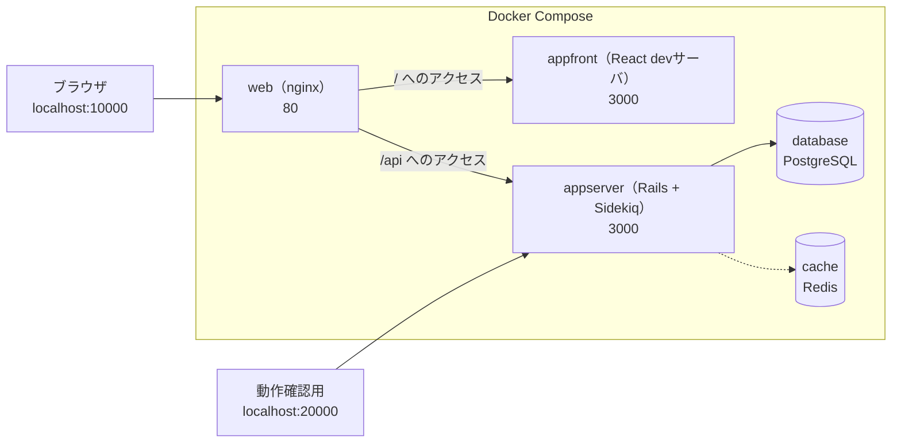
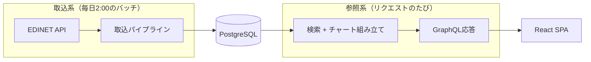
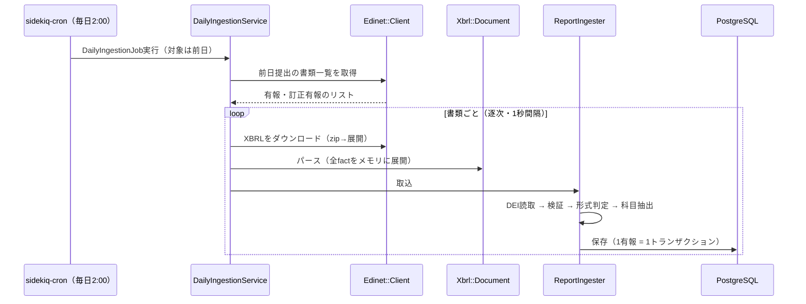
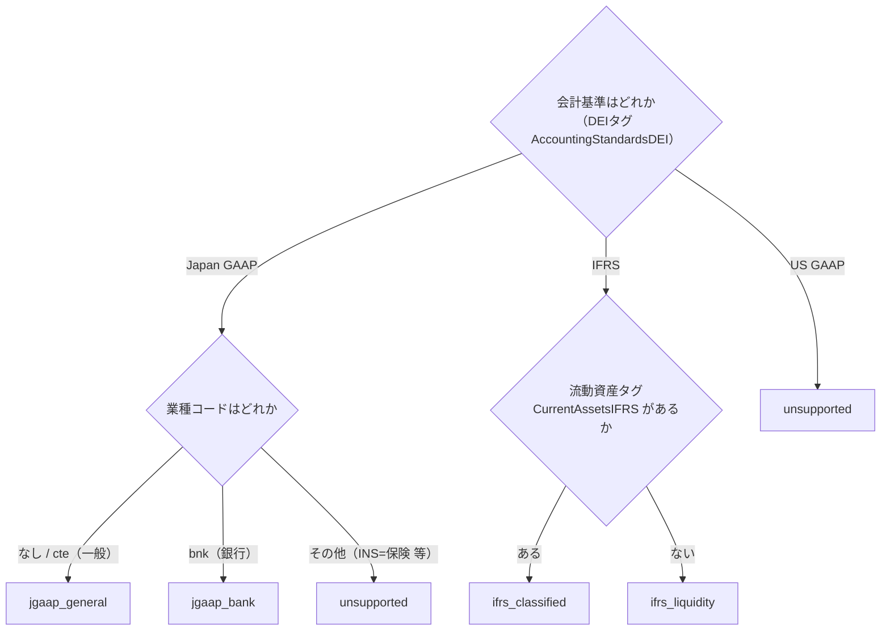
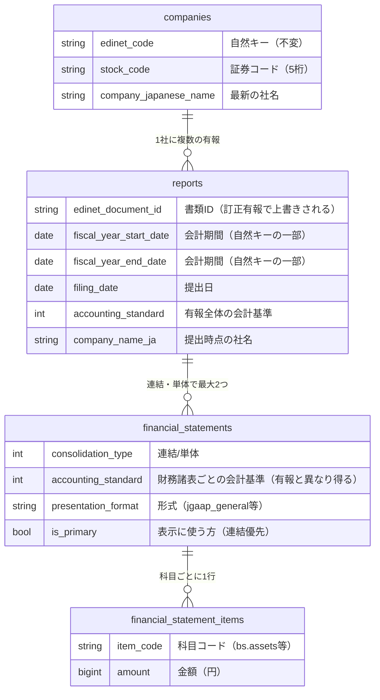
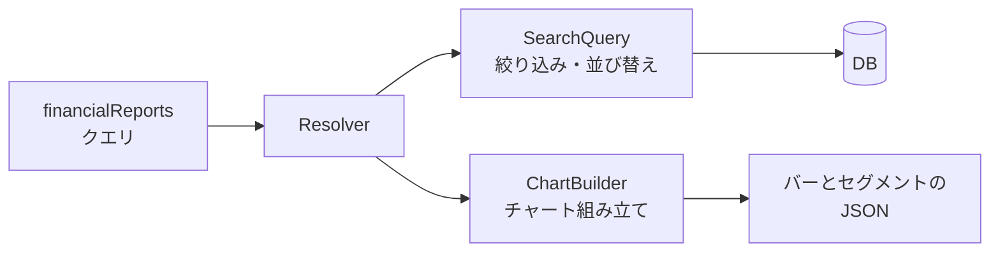
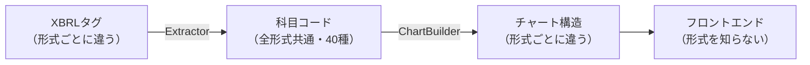

# 04. システム全体像

リポジトリの構成、データが流れる道筋、データの持ち方、設計の考え方。
この章を読むと「どこで何が起きているか」の地図ができ、[05章](05_backend.md)以降の
実装詳細を迷わず読めるようになる。

## リポジトリ構成

[03章](03_tech_prerequisites.md)で見たとおり3リポジトリ構成で、親リポジトリの
ディレクトリは次の役割を持つ。

| パス | 内容 |
|---|---|
| `application/backend` | Rails APIサーバ（別リポジトリのsubmodule） |
| `application/frontend` | React SPA（別リポジトリのsubmodule） |
| `web/` | nginx（リバースプロキシ）の設定 |
| `database/` | PostgreSQLのDockerfileと初期化SQL |
| `cache/` | RedisのDockerfile |
| `docs/` | ドキュメント（このガイド・アーキテクチャ解説・改善バックログ） |
| `docker-compose.yml` | 開発環境の全体起動 |
| `.github/workflows/` | CI（submodule参照の整合性チェック） |
| `.claude/skills/` | 定型作業の手順書（デプロイ・日次確認・PR運用・リリース） |

## 開発環境の5サービス

`docker compose up` で以下が起動する。

| サービス | 公開ポート | 役割 |
|---|---|---|
| `web` | 10000 → 80 | nginx。`/` をappfrontへ、`/api` をappserverへ振り分け |
| `appfront` | なし（web経由） | React devサーバ。ソースをマウントしホットリロードが効く |
| `appserver` | 20000 → 3000 | Rails APIとSidekiqが同居。起動スクリプトがマイグレーションも実行 |
| `database` | なし | PostgreSQL。初回起動時に `database/init/1.0.0.sql` でDB作成 |
| `cache` | なし | Redis。Sidekiqのジョブキュー |

セットアップの具体的手順は[ルートREADME](../../README.md)が正。

## 2つの処理系統

このシステムの処理は、互いに独立した2つの系統に分かれる。

- **取込系**: EDINETから有報を取得しDBへ保存する。書き込みはここだけ
- **参照系**: DBを検索し、チャートの構造まで組み立てて返す。読み取り専用

両者はDBのテーブル定義（と科目コード）だけを共有し、互いの実装を知らない。

## 取込系の流れ

- 深夜2:00に実行するのは、当日分の提出が出そろうのを待つため（対象は前日提出分）
- EDINET APIの403対策で並列化せず、書類間に1秒の間隔を置く
- 失敗は「書類単位」「日単位」で隔離され、1件の失敗が全体を止めない。
  自動リトライは持たず、**全処理を冪等（何度実行しても同じ結果）にして再実行で回復する**設計

## 形式判定

[02章](02_product.md)の「形式」（会計基準 × 様式）は、取込時に次のフローで決まる。

- IFRSの2様式はDEIでは区別できないため、タグの実在で判定する
- 未知の業種コードは安全側に倒して `unsupported` にする（誤ったグラフを出さない）
- **単体財務諸表は常に日本基準として扱う**（[01章](01_financial_knowledge.md)で見た
  「IFRS企業でも単体は日本基準タグ」の実装反映）

## データモデル

理解の要点は3つ。実データ例と細かい規約は[09章](09_data_model.md)にある。

1. **科目は縦持ち**。「1科目=1行」の `(item_code, amount)` で保存する。
   科目コードは全40種（BS 18・PL 17・CF 5）で、コードの一覧はRubyの定数
   `FinancialStatements::ItemCodes` が唯一の定義
2. **行がない = 開示なし**。`amount = 0` の行は「0円と開示された」ことを意味し、
   行が存在しないこととは区別する
3. **自然キーでの上書き（upsert）**。企業は `edinet_code`、有報は「企業+会計期間」を
   キーに上書きするため、訂正有報や再実行で二重登録にならない（冪等性の土台）

このほか旧実装の `security_reports` テーブルが凍結保管されている（コードからの参照はゼロ。
経緯は[14章](14_legacy_cleanup.md)）。

## 参照系の流れと4層の設計

参照系は `POST /graphql` の1本だけ。検索とチャート組み立てを行い、
**チャートの構造そのもの**（バーとセグメントの並び）をJSONで返す。

この設計を支えるのが、会計基準ごとの差異を層の両端に閉じ込める4層構造。

入口（Extractor）と出口（ChartBuilder）だけが形式を知り、中央の科目コードとフロントエンドは
形式を知らない。新しい形式への対応はExtractorとBuilderのファイル追加だけで済み、
DBマイグレーションもフロントエンドの変更も不要になる。
この判断の背景と、層ごとに「知ってよいこと・いけないこと」の基準は[08章](08_layering.md)にある。

---

次章: [05. バックエンド実装](05_backend.md) / [06. フロントエンド実装](06_frontend.md) —
この地図の各所を実装レベルで見ていく。
