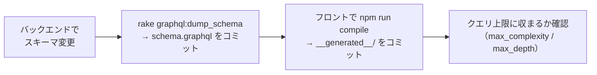
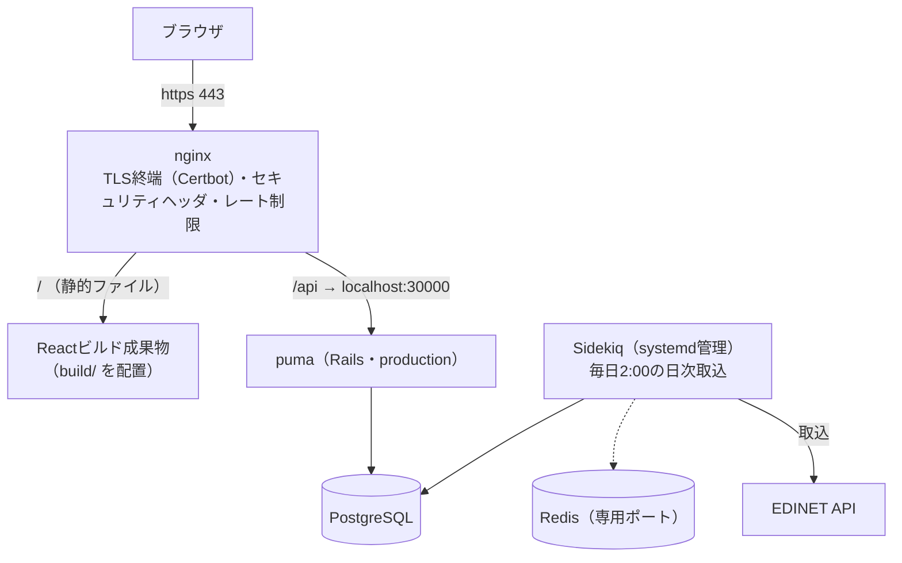
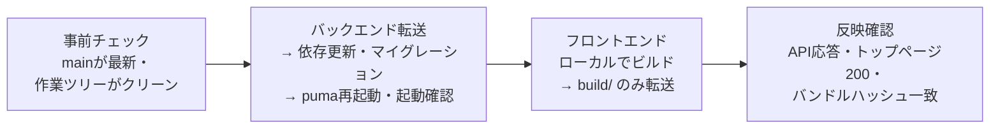

# 05. 開発と運用

このリポジトリで手を動かすときの決まりごとと、本番環境（https://investee.info ）の運用。個々の手順の正は各READMEと `.claude/skills/` にあり（下表）、この章では**このリポジトリに特有の運用**（ほかのドキュメントに記載がないもの）だけを扱う。実ホスト名・鍵などはgit管理外のファイル（`deploy.sh` など）だけが持ち、ドキュメントには書かない。

## 手順の在り処

| やりたいこと | 正となる場所 |
|---|---|
| 初回セットアップ・起動・データ投入 | [ルートREADME](../../README.md) |
| バックエンド単体の起動・環境変数・テスト実行 | `application/backend/README.md` |
| フロントエンドの検証コマンド・ビルド | `application/frontend/README.md` |
| デプロイ・日次確認・PR運用・リリース・Rubyバージョンアップ・ブラウザ拡張への同期の詳細手順 | `.claude/skills/` 配下の各SKILL.md |

## 開発

### GraphQLスキーマを変えたときの連鎖手順

スキーマの変更はバックエンド・フロントエンド双方に波及するため、次の順で追随させる。

- `npm run compile` はコミット済みの `schema.graphql` を参照するため、バックエンドの起動は不要（[04章](04_system.md)）
- クエリ上限の値と意図は[04章](04_system.md)を参照
- スキーマの書き出し忘れ・型生成の取り込み忘れはCIが差分検知する（`schema.graphql` が変わるとfrontend CIも起動し、型生成のズレを検知できる）
- Claude Codeでの編集時は、フック（`.claude/hooks/format-lint.sh`）がCIと同じフォーマッタ・リンタ（backend: rubocop -A / frontend: eslint --fix → prettier → tsc --noEmit）を自動実行し、自動修正しきれなかった指摘をClaudeに返す

### ブランチ・PR運用

単一リポジトリのため、ブランチを切って変更をまとめ、1本のPRでマージする（詳細手順はskill `pr` 参照）。

- backendとfrontend両方に変更があるときも1本のPRでよい。ただし**デプロイはbackend → frontendの順**（フロントが新しいAPIに依存し得るため）
- CIは変更のあった側（backend-ci / frontend-ci）だけが本体ジョブを実行する。変更がない側はskipされ、必須チェックとしては成功扱いになる（docsのみのPRでもマージはブロックされない）

コミット・PRの規約:

| 項目 | 規約 |
|---|---|
| コミットメッセージ | prefix `add:` / `update:` / `change:` / `fix:` を付ける |
| docs変更 | 関連するコード変更と同じPRに同梱してよい |

## 本番環境の構成

さくらVPS1台に全コンポーネントが同居する。開発環境（Docker）と違いコンテナは使わず、OS上に直接構築されている。

開発環境との違いで押さえておくべき点:

| 項目 | 内容 |
|---|---|
| 本番nginxの設定 | **リポジトリ外**（サーバ上の `/etc/nginx/` 直下）にあり、rsyncデプロイの対象外。変更はサーバ上で直接行う |
| フロントエンド | devサーバではなく、ビルド済み静的ファイルをnginxが直接配信する。SPAのフォールバック設定（未知パス→index.html）は本番nginx側の責務 |
| セキュリティヘッダ | nginxで一元管理し、Rails側のヘッダ出力は明示的に止めている（二重出力防止）。CSPはReport-Onlyで運用（AdSenseとMUIがインラインコードを要求するため強制モードにできない） |
| HTTPS | Certbot（Let's Encrypt）による301リダイレクトとTLS終端。Railsの `force_ssl` は使わない（nginxが `X-Forwarded-Proto` を転送しておらず、有効化すると無限リダイレクトになる） |
| レート制限 | `/api/` に対して2リクエスト/秒（バースト20、超過は429）。未認証・公開APIの防御の一部 |

## デプロイ

CI/CDはなく、**ローカルの作業ツリーをrsyncでVPSへ転送して再起動する**方式。

- **rsyncは未コミットの変更もそのまま本番に載せてしまう**。だから最初に作業ツリーがクリーンであることを確認する
- 順序は必ず**バックエンド → フロントエンド**（フロントが新しいAPIに依存し得るため）
- Sidekiq再起動が必要な変更（ジョブやgemの追加）はsudoを要するため非対話SSHでは完結できず、対話端末での操作が必要になる
- 過去に「非対話SSHで再起動スクリプトを実行してAPIが数分停止する」事故があり、対話モード強制（`bash -ic`）や `RAILS_ENV=production` の明示など、再発防止の決まりが手順書（`.claude/skills/deploy/`）に記録されている

## 日次バッチの監視とリカバリ

[04章](04_system.md)のとおり自動リトライはなく、**冪等な再実行が唯一のリカバリ手段**。異常はSentry通知で気づき、対応する再実行コマンドを打つ、が基本形になる。

| Sentry通知（ログメッセージ） | 意味 | リカバリ |
|---|---|---|
| `list failed <日付>`（`EDINET documents.json failed` も同種） | その日の書類一覧の取得自体に失敗（1日分が丸ごと未取込） | **必ず再実行**: `rake 'ingestion:backfill[日付,日付]'` |
| `ingest failed <docID>` | 特定の書類の取込に失敗 | `rake 'ingestion:documents[docID]'` |
| `accounting standard unknown` | 未知の会計基準（取込対象外としてスキップ済み） | 対応不要。頻発するなら形式対応を検討 |
| `primary statement missing bs.assets` | 取り込めたが主要科目が欠けている | Extractor・形式判定を修正して再取込 |

形式対応を広げた後にまとめて取り直す再取込タスク:

| きっかけ | コマンド | 対象の絞り込み |
|---|---|---|
| 新しい業種・形式に対応した | `rake 'ingestion:reingest_unsupported[提出日from,提出日to]'` | `unsupported` を含む有報だけ（全期間のバックフィルよりEDINETへのリクエストが桁違いに少ない） |
| 詳細タグ義務化前のIFRS有報が `ifrs_liquidity` のまま残っている | `rake ingestion:reingest_ifrs_summary` | 「primaryなのに資産合計が無い」有報をDBから自動特定（移行完了後は0件になり、再実行しても何もしない） |

どの再取込も1件ずつ1秒間隔・失敗は隔離（日次と同じ方針）。取込コードを変えたデプロイでは、日次ジョブ側（sidekiq）の再起動も忘れないこと（[deployスキル](../../.claude/skills/deploy/SKILL.md)の2-b）。

日々の健全性確認は `.claude/skills/investee-daily-check/` のスクリプト1本にまとまっており、次を一度に確認できる。

- 前夜の日次ジョブがログに痕跡を残しているか、エラー行数はいくつか
- 前日提出分の取込件数と、EDINET側の提出一覧（突き合わせ用）
- 本番サイトの死活（トップページが200を返すか）

読み方の注意として、DBの提出日はEDINETの提出日ではなくXBRL表紙の日付に由来するため、**訂正有報は元の有報の日付で記録される**。「EDINET一覧に提出があるのに前日日付の取込件数が0」は、訂正有報のみだった日の正常な結果として読み分ける。

## 監視・ログ

| 仕組み | 内容 |
|---|---|
| Sentry | 例外・警告の通知先。**送信は本番環境のみ**（development・testからは送らない）。デプロイ時のプロセス停止による `SystemExit` / `SignalException` は通知しない。個人情報を送らない設定（EDINET APIキーがURLに含まれるため、リクエスト情報の送出を明示的に抑止している）。パフォーマンストレースは10%サンプリング |
| ログ | lograge形式で `log/production.log` へ。サイズ上限つきローテーション（ディスク枯渇対策）。SQLログは別ファイル |

## リリースタグ

デプロイと連動した自動化はないが、リリースの区切りをGitHub Releaseで記録する。

- タグ名は `release-X.Y.Z`。機能追加ありはYを+1、修正のみはZを+1
- リリースノートは公開情報のため、ホスト名・キーなどの実値を書かない

## ドキュメントの運用ルール

| ドキュメント | ルール |
|---|---|
| 学ぶ章（docs/guide/ 01〜05） | 入門・データの流れ・システム・運用の説明を担当。実装や設計が変わったら該当章を追随させる |
| 資料（docs/guide/ 06） | タグ対応表と実測記録。タグを触る変更とセットで更新する |
| docs/improvements.md | 未着手の改善だけを書く。**対応が完了した項目は記述ごと削除する**（完了の記録はgit履歴が持つ） |
| 秘密情報 | 実ホスト名・キー・接続情報はどのドキュメントにも書かない。git管理されるファイルには「項目名と入手方法」まで |

---

学ぶ章はこの章まで。作業時に引く資料: [06章 XBRLタグ対応表と実地調査](06_taxonomy_mapping.md)
