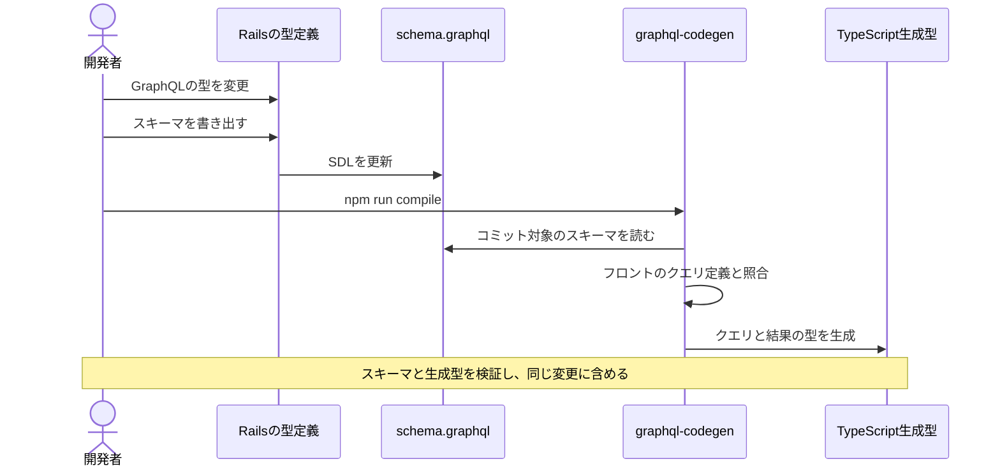
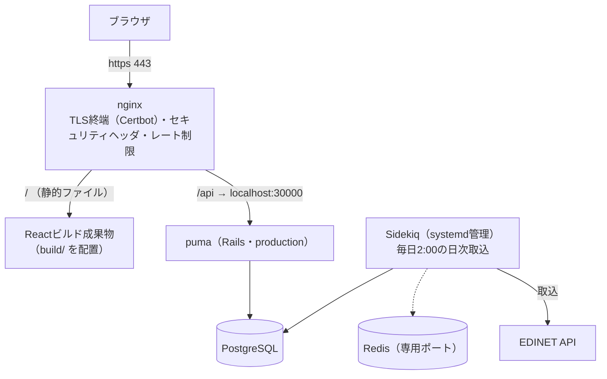
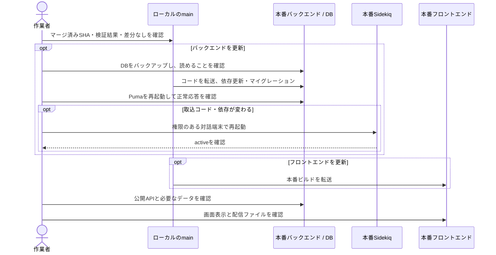

# 05. 開発と運用

この章では、変更時の検証、本番への反映、取込障害からの復旧を扱う。

| 手順 | 参照先 |
|---|---|
| セットアップ・起動・データ投入 | [ルートREADME](../../README.md) |
| バックエンドの起動・環境変数・テスト | [backend README](../../application/backend/README.md) |
| フロントエンドの検証・ビルド | [frontend README](../../application/frontend/README.md) |

## 開発

### GraphQLスキーマの変更

スキーマの変更はバックエンド・フロントエンド双方に波及するため、次の順で追随させる。

<a id="sequence-codegen"></a>



| 確認すること | 内容 |
|---|---|
| 実行コマンド | backendで`bundle exec rake graphql:dump_schema`、frontendで`npm run compile`を実行する |
| 生成元 | コミット済みの`application/backend/schema.graphql`とフロントのクエリ定義。バックエンドの起動は不要 |
| 型の対応 | 金額の`Money`はTypeScriptの`number`に対応付ける |
| 変更の反映 | 開発中のwatchはクエリ変更に追従する。スキーマと生成型を同じ変更に含め、CIで生成差分がないことを確認する |
| APIの上限 | Web・Chrome拡張のクエリが複雑度・深さの上限内に収まるか実行して確認する。上限の設計は[04章](04_system.md#公開apiとしての防御) |

CIは変更した側だけ本体ジョブを実行する。変更していない側のskipは、検証済みを意味しない。

### backend変更時のローカル検証

実XBRLフィクスチャを使うspecは、入力がGit管理外のためCIではpendingになる。この範囲はbackend変更時に、コミット・PR作成前のローカル実行で確認する。

```bash
docker compose exec appserver bash -c 'cd /home/app/financialStatement && bundle exec rspec $(grep -rl xbrl_fixture spec --include="*_spec.rb")'
```

- 固定リストではなく `xbrl_fixture` の利用箇所を探すため、新しいspecも対象になる。
- `0 failures` だけでなくpendingがないことを確認する。不足する入力は [フィクスチャの手順](../../application/backend/spec/fixtures/xbrl/README.md) に従って用意する。
- ほかのspecはCIが実行する。このローカル専用範囲が未実施なら、CI成功だけで検証済みとは扱わない。

### 指標用データの追加後の再取込

DBマイグレーションだけでは、既存書類の追加科目は埋まらない。バックアップとバックエンドの反映・再起動後に、必要なタスクを実行する。

| 追加するデータ | コマンド（backendで実行） | 再実行時の扱い |
|---|---|---|
| 期首総資産・期首自己資本・期末自己資本 | `bundle exec rake ingestion:reingest_indicators` | 不足する科目を持つ対応済み有報が対象。原本で未開示なら対象に残るため、日次ジョブには加えない |
| 企業公表ROE | `bundle exec rake ingestion:reingest_disclosed_roe` | 抽出未確認の有報が対象。未開示でも確認済みになり、途中失敗分は再実行できる |

- 有報全体を再取得して科目を更新する。EDINETへの負荷を避けるため、間隔を空けた逐次実行を維持する。
- 残った欠損は、原本の未開示・未対応形式・取得失敗を区別する。期首残高を期末残高で代用しない。
- 反映後は公開APIと実際の一覧で、既存書類の指標表示を確認する。

## 本番環境の構成

さくらVPS1台に全コンポーネントが同居する。開発環境（Docker）と違いコンテナは使わず、OS上に直接構築されている。



開発環境との違いで押さえておくべき点:

| 項目 | 内容 |
|---|---|
| 本番nginxの設定 | **リポジトリ外**（サーバ上の `/etc/nginx/` 直下）にあり、rsyncデプロイの対象外。変更はサーバ上で直接行う |
| フロントエンド | devサーバではなく、ビルド済み静的ファイルをnginxが直接配信する。SPAのフォールバック設定（未知パス→index.html）は本番nginx側の責務 |
| セキュリティヘッダ | nginxで一元管理し、Rails側のヘッダ出力は明示的に止めている（二重出力防止）。CSPはReport-Onlyで運用（AdSenseとMUIがインラインコードを要求するため強制モードにできない） |
| HTTPS | Certbot（Let's Encrypt）による301リダイレクトとTLS終端。Railsの `force_ssl` は使わない（nginxが `X-Forwarded-Proto` を転送しておらず、有効化すると無限リダイレクトになる） |
| レート制限 | `/api/` に対して2リクエスト/秒（バースト20、超過は429）。未認証・公開APIの防御の一部 |

## デプロイ

自動デプロイはなく、**ローカルの作業ツリーをrsyncでVPSへ転送して再起動する**方式。



rsyncは未コミットの変更も転送するため、マージ済みのmainと差分のない作業ツリーを使う。バックアップは転送時の削除対象外に保存する。

フロントが新しいAPIに依存し得るため、**バックエンド → フロントエンド**の順に反映する。追加科目が必要なら、フロントの反映前に[再取込](#指標用データの追加後の再取込)も行う。

## 日次バッチの監視とリカバリ

Sentry通知とログから失敗した日付・書類を特定し、原因を確認して必要な分だけ再実行する。

| Sentry通知（ログメッセージ） | 意味 | リカバリ |
|---|---|---|
| `list failed <日付>`（`EDINET documents.json failed` も同種） | その日の書類一覧の取得自体に失敗（1日分が丸ごと未取込） | 原因解消後に `rake 'ingestion:backfill[日付,日付]'` |
| `ingest failed <docID>` | 特定の書類の取込に失敗 | `rake 'ingestion:documents[docID]'` |
| `accounting standard unknown` | 未知の会計基準（取込対象外としてスキップ済み） | 対応不要。頻発するなら形式対応を検討 |
| `primary statement missing bs.assets` | 取り込めたが主要科目が欠けている | Extractor・形式判定を修正して再取込 |

**注意が必要な組合せ：**連結廃止を示す訂正書類に当期の財務数値がない場合、旧連結行の削除と単体の既存データ保持が重なり、一覧から書類が消えることがある。Sentryの警告だけでなく表示対象も確認する。再取込しても原本の内容が同じなら解消するとは限らない。

形式対応を広げた後にまとめて取り直す再取込タスク:

| きっかけ | コマンド | 対象の絞り込み |
|---|---|---|
| 新しい業種・形式に対応した | `rake 'ingestion:reingest_unsupported[提出日from,提出日to]'` | `unsupported` を含む有報だけ（全期間のバックフィルよりEDINETへのリクエストが桁違いに少ない） |
| 詳細タグ義務化前のIFRS有報が `ifrs_liquidity` のまま残っている | `rake ingestion:reingest_ifrs_summary` | 「primaryなのに資産合計が無い」有報をDBから自動特定（移行完了後は0件になり、再実行しても何もしない） |

EDINETの404は書類の取得不能、403・429はアクセス制限として原因を確認し、連続再試行しない。HTTP 200でも本文にエラーが含まれる場合がある。

日次確認では、ジョブの実行ログ・エラー、取込件数とEDINETの提出一覧、公開APIの応答を確認する。

読み方の注意として、DBの提出日はEDINETの提出日ではなくXBRL表紙の日付に由来するため、**訂正有報は元の有報の日付で記録される**。「EDINET一覧に提出があるのに前日日付の取込件数が0」は、訂正有報のみだった日の正常な結果として読み分ける。

## 監視・ログ

| 仕組み | 内容 |
|---|---|
| Sentry | 例外・警告の通知先。**送信は本番環境のみ**（development・testからは送らない）。デプロイ時のプロセス停止による `SystemExit` / `SignalException` は通知しない。個人情報を送らない設定（EDINET APIキーがURLに含まれるため、リクエスト情報の送出を明示的に抑止している）。パフォーマンストレースは10%サンプリング |
| ログ | lograge形式で `log/production.log` へ。サイズ上限つきローテーション（ディスク枯渇対策）。SQLログは別ファイル |

## ドキュメントの運用ルール

| ドキュメント | ルール |
|---|---|
| ガイド（docs/guide/ 01〜05） | 仕様・設計・運用の判断に必要な情報を残す。実装の局所的な意図や注意点はコードコメントに書く |
| 資料（docs/guide/ 06） | タグ対応表と実測記録。タグを触る変更とセットで更新する |
| docs/improvements.md | 未着手の改善だけを書く。**対応が完了した項目は記述ごと削除する**（完了の記録はgit履歴が持つ） |
| 秘密情報 | 実ホスト名・キー・接続情報はどのドキュメントにも書かない。git管理されるファイルには「項目名と入手方法」まで |

---

学ぶ章はこの章まで。作業時に引く資料: [06章 XBRLタグ対応表と実地調査](06_taxonomy_mapping.md)
