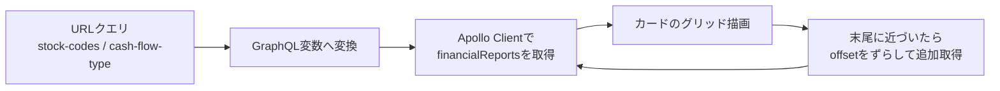
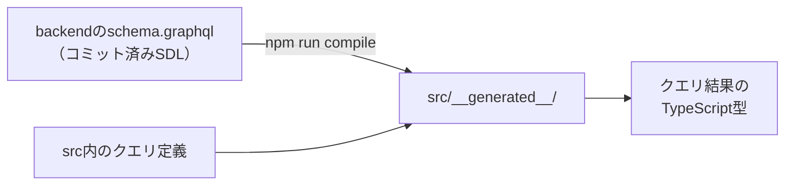

# 05. フロントエンド実装

`application/frontend`（React SPA）の実装ガイド。画面は[02章](02_product.md)の一覧ページ1つと文章中心の静的ページ4つで、ソースは `src/` 配下の約35ファイルと小さい。チャートキットの規約の原本はキット内の `src/shared/financialCharts/README.md`（コピー先のChrome拡張にも同じREADMEが入る）。

## 使っている技術

| 技術 | 役割 |
|---|---|
| React | UIライブラリ。画面を「コンポーネント」という部品の組み合わせで記述する |
| TypeScript | JavaScriptに型を加えた言語。GraphQLの型生成と組み合わせてデータの形の間違いをコンパイル時に検出する |
| CRA + craco | React公式の雛形ツール（Create React App）と、その設定を上書きするためのツール |
| Apollo Client | GraphQLクライアント。問い合わせの発行と結果のキャッシュを担当する |
| Redux Toolkit | 画面をまたいで共有する状態の置き場。ただしこのアプリでの用途はごく小さい（後述） |
| MUI | Reactコンポーネント集（ボタン・カードなど）。Material Designベース |
| recharts | チャート描画ライブラリ。積み上げ棒・ウォーターフォールの描画に使う |

## ディレクトリマップと分割基準

| パス（src/ 以下） | 内容 |
|---|---|
| `index.tsx` / `App.tsx` | エントリポイント。MUIテーマ定義とルーティング（静的ページ4ルート + 残り全URL→一覧ページ） |
| `features/financialReports/` | 一覧ページ本体（**Webアプリ固有**のコード）。カード・レイアウト・BS→PL→CFの自動切替カルーセルを含む |
| `features/siteLayout/` | 全ページ共通の骨組み: URL定義（`siteRoutes`）・フッター（`SiteFooter`）・静的ページ用シェル（`StaticPageLayout`）・ページ別meta切替（`usePageMeta`） |
| `features/staticPages/` | 静的ページ4つの本文と、文章用の小部品（見出し・箇条書き・表）。読み方ページの説明用チャートデータもここ |
| `shared/financialCharts/` | チャート描画キット（**Chrome拡張と共有**するコード） |
| `constants/` | 30件単位・CFパターン定義などの定数 |
| `store/` | Redux（カルーセル自動切替フラグのみ） |
| `plugins/firebase/` | Firebase Analytics初期化とイベント送信 |
| `__generated__/` | graphql-codegenの生成物（コミット済み） |

ディレクトリ分割の基準は機能ではなく「**Chrome拡張と共有できるか否か**」。共有キット（`shared/financialCharts/`）には厳しい依存制限があり（後述）、それ以外は `features/` に置く。

## 一覧ページのデータフロー



### 具体例: URLがそのままクエリになる

[02章](02_product.md)の「健全型」（営業↑ 投資↓ 財務↓）で2社を検索したときの変換。

```
URL:         /?stock-codes=7203,4502&cash-flow-type=healthy
              ↓ useQueryVariables() が変換
GraphQL変数:  { limit: 30, offset: 0,
               stockCodes: ["7203", "4502"],
               operatingCfSign: POSITIVE,
               investingCfSign: NEGATIVE,
               financingCfSign: NEGATIVE }
```

| 実装上の決まり | 内容 |
|---|---|
| 検索状態の正はURLクエリだけ | 検索UIは `navigate()` でURLを書き換えるだけ。リロード・共有で状態が再現できる |
| 追加取得の併合 | Apolloのキャッシュ設定（`typePolicies`）で `offset` の位置に書き込んで1リストに併合。`offset` 以外の条件が変わると別リスト扱い |
| 無限スクロールの終端判定 | 「取得済み件数が30の倍数」の間は続行し、30件未満しか返らなかったら終端 |
| APIの向き先 | 相対パス `/api/graphql` 固定。nginxが中継するため開発と本番でコードが同じ（環境変数・`.env` なし） |
| Apolloインスタンス | このページ専用に生成し、`ApolloProvider` もページ配下だけに提供（キャッシュ設定を他機能と独立に保つ） |

## 画面の状態はどこに置くか

| 状態 | 置き場 | 補足 |
|---|---|---|
| 検索条件 | URLクエリ | 上記のとおり。Reduxには置かない |
| カルーセル自動切替のON/OFF | Redux（唯一のスライス）+ localStorageへ保存 | 起動時にlocalStorageから復元する（明示的にOFFにした場合のみOFF、未保存はONで開始） |
| それ以外 | なし | 取得データはApolloキャッシュが持つ |

## カード表示の実装ノート

見出しの形式・基準バッジ・カルーセル・株探リンクといった見た目の仕様は[02章](02_product.md)が正。ここでは実装面の注意だけ挙げる。

- 外部リンクには `rel="noopener noreferrer"` を明示する（MUIのLinkは自動付与しない。referrer遮断は検索条件つきURLの外部漏洩防止も兼ねる）
- 企業名クリックなどはFirebase Analyticsへイベント送信される（Firebase設定値はソースにハードコード。クライアント公開前提の識別子で秘密情報ではない）

## チャート描画キット（`shared/financialCharts/`）

Chrome拡張（別リポジトリ `financial-statement-chrome-extension`）へディレクトリごとコピーして共有するため、次の規約を守る。チャート部品を両リポジトリで二重保守しないための決まりごとになる。

| 規約 | 理由 |
|---|---|
| importしてよいのは `react` と `recharts` だけ（キット内は相対importのみ） | 両リポジトリ共通の依存だけに絞る |
| GraphQLクライアント・codegen生成型・ルーティング・Redux・`@/`エイリアスに依存しない | アプリごとの設定・生成物に依存させない |
| 受け取る型は `types.ts` の構造的型で定義する | codegen生成型と構造が一致するため、変換なしで代入できる |
| スタイルはコンポーネント内で完結させる | コピー先に外部CSSを要求しない |

### 積み上げ棒（`StackedBarChart`）

APIの `bars × segments` を、rechartsが要求する「行 × 列」の表に変換する（`toStackRows`）。行=バー、列=全バーに登場するセグメントkeyの和集合。

```
API（bars × segments）              recharts（rows × columns）
借方: [原価, 販管費]        →       { name: "借方", costOfSales: 60, sga: 30 }
貸方: [収益]                        { name: "貸方", revenue: 100 }
                                   ※ あるバーに無い列はundefinedになり、その行には描かれない
```

- **積み上げ順・色・ラベルはすべてバックエンドの決定に従う**。フロントは並び替えも分岐もしない（[03章](03_system_overview.md)の「フロントは形式を知らない」の実装）
- Y軸を反転して上から積み上げ、`spacer`（債務超過の高さ合わせ）はツールチップにも出さない
- ツールチップの金額は符号つきの `signedAmount` を使う（描画高さの `amount` は絶対値）。表示は `formatAmount` で百万円単位（有報の慣行どおり百万円未満切捨て）にし、百万円未満の値だけ千円単位で出す（千円単位で開示する小規模企業の科目を「0百万円」に潰さないため）。ウォーターフォールのバー上のラベルも同じ関数を使う

### ウォーターフォール（`WaterfallChart`）

rechartsにウォーターフォール専用の部品はないため、積み上げ棒を流用し、各ステップを「透明の下駄バー + 実バー」の2段積みで表現している。

| 仕掛け | 内容 |
|---|---|
| `kind: "balance"`（期首残・期末残） | 累積をリセットして0起点で描く（期首+増減と期末が一致しない場合があるため。[02章](02_product.md)） |
| `kind: "flow"`（営業・投資・財務） | 直前の累積から浮かせて増減分だけ描く |
| 色 | 増加は青系・減少は赤系 |

### 色の対応（`colorRoles.ts`）

バックエンドは色そのものではなく `colorRole`（`asset1`・`liability1`・`profit` など15種の役割名）を返し、フロントのこのファイルが実際の色に変換する。新形式が増えてもフロントの変更はゼロで、**唯一の例外がこの役割名の追加（バックエンドとChrome拡張リポジトリもあわせて同時に変更する取り決めになっている）**。未知の役割名はグレーで描画しつつ `console.warn` で気づけるようにしている。

### 表示不可（`ChartUnavailable`）

`renderable: false` のとき、チャートと同じ寸法の枠に説明文（`note`、なければ既定文言）を表示する。寸法を揃えるのはカルーセルの高さが跳ねないようにするため。エラー画面ではなくデータとして描く（正常系）。

## GraphQL型生成（graphql-codegen）



| 決まり | 内容 |
|---|---|
| バックエンドの起動は不要 | スキーマの参照先が `../backend/schema.graphql`（コミット済みSDL）のため。スキーマを変えたときはbackend側で `rake graphql:dump_schema` を先に実行する |
| 生成物はコミットする | デプロイやビルドだけなら再生成不要。スキーマを変えたときだけ再生成してコミット（[06章](06_development_operations.md)）。取り込み忘れはCIが差分検知する |
| `Money` は `number` に対応づけ | 金額はJSON数値のまま届く |
| 開発中はwatchモードが常駐 | 起動スクリプトが自動起動し、クエリ変更に追従する |

## SEOと計測

| 項目 | 現状 |
|---|---|
| title・description・OGP・JSON-LD | `public/index.html` に静的記述（一覧ページの値）。静的ページは表示中だけ `usePageMeta` が title / description / canonical を差し替え、離れたら `index.html` の値に戻す（一覧ページ側にmeta設定コードを持たせないため。OGPはCSRのため差し替えても効果がなく対象外） |
| robots.txt / sitemap.xml / ads.txt | 全許可 / トップ + 静的ページ4URL / AdSenseの販売者情報 |
| 広告 | Google AdSenseのスクリプトを読み込み |
| 改善案 | 企業別URL・動的sitemapなどは [docs/improvements.md](../improvements.md) にバックログあり |

## 品質まわりの現状

| 項目 | 状態 |
|---|---|
| 検証コマンド | `npx tsc --noEmit` / eslint / prettier / `CI=false yarn build`（`application/frontend/README.md` が正） |
| CI | 導入済み（`.github/workflows/frontend-ci.yml`。検証コマンド一式 + 型生成の差分検知 + build） |
| テストコード | **0件**（CRA雛形のテスト基盤のみ残している。[08章](08_unused_but_kept.md)） |
| GraphQLエラー時の画面表示 | 未実装（エラー時も0件時と同じ「条件に一致する企業がありません。」が表示される） |

---

次章: [06. 開発と運用](06_development_operations.md)
