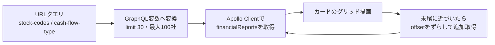
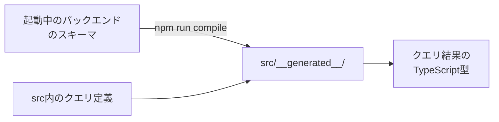

# 06. フロントエンド実装

`application/frontend`（React SPA）の実装ガイド。画面は[02章](02_product.md)の
一覧ページ1つだけで、ソースは `src/` 配下の約25ファイルと小さい。
設計意図の正は [docs/architecture/04_frontend.md](../architecture/04_frontend.md)。

## ディレクトリマップと分割基準

| パス（src/ 以下） | 内容 |
|---|---|
| `index.tsx` / `App.tsx` | エントリポイント。MUIテーマ定義とルーティング（全URL→一覧ページの1ルートのみ） |
| `features/financialReports/` | 一覧ページ本体（**Webアプリ固有**のコード） |
| `shared/financialCharts/` | チャート描画キット（**Chrome拡張と共有**するコード） |
| `components/appCarousel/` | カルーセル部品 |
| `constants/` | 30件単位・CFパターン定義などの定数 |
| `store/` | Redux（カルーセル自動切替フラグのみ） |
| `plugins/firebase/` | Firebase Analytics初期化とイベント送信 |
| `__generated__/` | graphql-codegenの生成物（コミット済み） |

ディレクトリ分割の基準は機能ではなく「**Chrome拡張と共有できるか否か**」。
共有キット（`shared/financialCharts/`）には厳しい依存制限があり（後述）、
それ以外は `features/` に置く。

## 一覧ページのデータフロー

実装上の要点:

- **検索状態の正はURLクエリだけ**。検索UIの操作は `navigate()` でURLを書き換えるだけで、
  URLの変化がクエリ変数の再計算と再取得を引き起こす。リロードや共有で状態が再現できる
- Apolloのキャッシュ設定（`typePolicies`）で、追加取得分は `offset` の位置に書き込んで
  1つのリストに併合する。`offset` 以外の検索条件が変わると別リストとして扱われる
- 無限スクロールは「取得済み件数が30の倍数」を継続条件にし、30件未満しか返らなかった
  時点で終端と判断する
- APIエンドポイントは相対パス `/api/graphql` 固定。nginxがバックエンドへ中継するため、
  開発と本番でコードが変わらない（環境変数・`.env` は使っていない）

## カードとカルーセル

- カードの見出し・バッジ・株探リンクの仕様は[02章](02_product.md)のとおり。
  外部リンクには `rel="noopener noreferrer"` を明示している（MUIのLinkは自動付与
  しないため。referrer遮断は検索条件つきURLの外部漏洩防止も兼ねる）
- カルーセルはBS→PL→CFを6秒間隔で自動切替。ヘッダのチェックボックスと連動する
  自動切替フラグが**Reduxで管理している唯一の状態**
- フラグ変更はlocalStorageに保存されるが、**起動時に読み戻す処理は未実装**
  （既知の実装漏れ。初期値は常にON）
- 企業名クリックなどはFirebase Analyticsへイベント送信される。Firebaseの設定値は
  ソースにハードコードされている（クライアント公開前提の識別子であり秘密情報ではない）

## チャート描画キット（`shared/financialCharts/`）

Chrome拡張（別リポジトリ `financial-statement-chrome-extension`）へディレクトリごと
コピーして共有するため、次の規約を守る。

1. importしてよいのは `react` と `recharts` だけ（キット内は相対importのみ）
2. GraphQLクライアント・codegen生成型・ルーティング・Redux・`@/`エイリアスに依存しない
3. 受け取る型は `types.ts` の構造的型（codegen生成型と構造が一致するため変換不要）
4. スタイルはコンポーネント内で完結させる

### 積み上げ棒（`StackedBarChart`）

- APIの `bars × segments` を、rechartsが要求する「行 × 列」の表に変換する
  （`toStackRows`）。行=バー、列=全バーに登場するセグメントkeyの和集合
- **積み上げ順・色・ラベルはすべてバックエンドの決定に従う**。フロントは並び替えも
  分岐もしない（[04章](04_system_overview.md)の「フロントは形式を知らない」の実装）
- Y軸を反転して上から積み上げ、`spacer`（債務超過の高さ合わせ）はツールチップにも出さない
- ツールチップの金額は符号つきの `signedAmount` を使う（描画高さの `amount` は絶対値）

### ウォーターフォール（`WaterfallChart`）

- 各ステップを「透明の下駄バー + 実バー」の2段積みで表現する定石の実装
- 残高（`kind: "balance"`）のステップで累積をリセットして0起点で描く
  （期首+増減と期末が一致しない場合があるため。理由は[02章](02_product.md)）
- 増加は青系・減少は赤系で塗り分け

### 色の契約（`colorRoles.ts`）

バックエンドは色そのものではなく `colorRole`（`asset1`・`liability1`・`profit` など
15種の役割名）を返し、フロントのこのファイルが実際の色に変換する。
**役割名の追加はバックエンドとChrome拡張を含めた同時変更が必要な契約点**。
未知の役割名はグレーで描画しつつ `console.warn` で気づけるようにしている。

### 表示不可（`ChartUnavailable`）

`renderable: false` のとき、チャートと同じ寸法の枠に説明文（`note`、なければ既定文言）を
表示する。寸法を揃えるのはカルーセルの高さが跳ねないようにするため。
エラー画面ではなくデータとして描く（正常系）。

## GraphQL型生成（graphql-codegen）

- スキーマの取得先が起動中のAPIなので、**実行にはバックエンドの起動が必要**
  （`docker compose exec appfront npm run compile`）
- 生成物はコミットする運用。そのためデプロイやビルドだけなら再生成は不要で、
  バックエンドのスキーマを変えたときだけ再生成してコミットする
- 独自スカラ `Money` はTypeScript上 `number` に対応づけている
- 開発中はcodegenのwatchモードが起動スクリプトで常駐し、クエリ変更に自動追従する

## SEOと計測

- `public/index.html` に title・description・canonical・OGP・Twitterカード・
  JSON-LD（WebSite）を静的に記述。ルートが1つなのでページ別のmetaはない
- `robots.txt` は全許可、`sitemap.xml` はトップ1URLのみ
- Google AdSenseのスクリプトを読み込んでいる
- 企業別URL・動的sitemapなどのSEO改善案は [docs/improvements.md](../improvements.md) に
  バックログとして整理されている

## 品質まわりの現状

- 型・Lint・整形の検証コマンド: `npx tsc --noEmit` / `npx eslint 'src/**/*.{ts,tsx}'` /
  `npx prettier --check 'src/**/*.{ts,tsx}'`、ビルド確認は `CI=false yarn build`
- **テストコードは現状0件**（テスト基盤はCRA雛形のまま残置）。CIも未整備で、
  どちらも [docs/improvements.md](../improvements.md) に既知課題として記載がある
- GraphQLエラー時の画面表示も未実装（0件表示になるだけ）。同じく既知課題

---

次章: [07. 開発の進め方](07_development.md)
