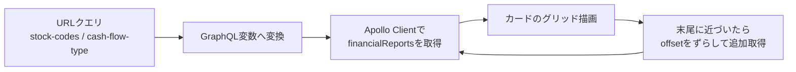
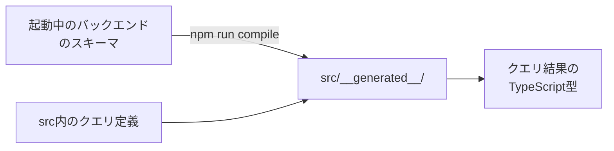

# 06. フロントエンド実装

`application/frontend`（React SPA）の実装ガイド。画面は[02章](02_product.md)の
一覧ページ1つだけで、ソースは `src/` 配下の約25ファイルと小さい。
チャートキットの規約の原本はキット内の `src/shared/financialCharts/README.md`
（コピー先のChrome拡張にも同じREADMEが入る）。

## ディレクトリマップと分割基準

| パス（src/ 以下） | 内容 |
|---|---|
| `index.tsx` / `App.tsx` | エントリポイント。MUIテーマ定義とルーティング（全URL→一覧ページの1ルートのみ） |
| `features/financialReports/` | 一覧ページ本体（**Webアプリ固有**のコード） |
| `shared/financialCharts/` | チャート描画キット（**Chrome拡張と共有**するコード） |
| `components/appCarousel/` | カルーセル部品 |
| `constants/` | 30件単位・CFパターン定義などの定数 |
| `store/` | Redux（カルーセル自動切替フラグのみ） |
| `plugins/firebase/` | Firebase Analytics初期化とイベント送信 |
| `__generated__/` | graphql-codegenの生成物（コミット済み） |

ディレクトリ分割の基準は機能ではなく「**Chrome拡張と共有できるか否か**」。
共有キット（`shared/financialCharts/`）には厳しい依存制限があり（後述）、
それ以外は `features/` に置く。

## 一覧ページのデータフロー



### 具体例: URLがそのままクエリになる

[02章](02_product.md)の「健全型」（営業↑ 投資↓ 財務↓）で2社を検索したときの変換。

```
URL:         /?stock-codes=7203,4502&cash-flow-type=healthy
              ↓ useQueryVariables() が変換
GraphQL変数:  { limit: 30, offset: 0,
               stockCodes: ["7203", "4502"],
               operatingCfSign: POSITIVE,
               investingCfSign: NEGATIVE,
               financingCfSign: NEGATIVE }
```

| 実装上の決まり | 内容 |
|---|---|
| 検索状態の正はURLクエリだけ | 検索UIは `navigate()` でURLを書き換えるだけ。リロード・共有で状態が再現できる |
| 追加取得の併合 | Apolloのキャッシュ設定（`typePolicies`）で `offset` の位置に書き込んで1リストに併合。`offset` 以外の条件が変わると別リスト扱い |
| 無限スクロールの終端判定 | 「取得済み件数が30の倍数」の間は続行し、30件未満しか返らなかったら終端 |
| APIの向き先 | 相対パス `/api/graphql` 固定。nginxが中継するため開発と本番でコードが同じ（環境変数・`.env` なし） |
| Apolloインスタンス | このページ専用に生成し、`ApolloProvider` もページ配下だけに提供（キャッシュ設定を他機能と独立に保つ） |

## 画面の状態はどこに置くか

| 状態 | 置き場 | 補足 |
|---|---|---|
| 検索条件 | URLクエリ | 上記のとおり。Reduxには置かない |
| カルーセル自動切替のON/OFF | Redux（唯一のスライス）+ localStorageへ保存 | **起動時に読み戻す処理は未実装**（既知の実装漏れ。初期値は常にON） |
| それ以外 | なし | 取得データはApolloキャッシュが持つ |

## カード表示の実装ノート

見出しの形式・基準バッジ・カルーセル・株探リンクといった見た目の仕様は[02章](02_product.md)が正。
ここでは実装面の注意だけ挙げる。

- 外部リンクには `rel="noopener noreferrer"` を明示する（MUIのLinkは自動付与しない。
  referrer遮断は検索条件つきURLの外部漏洩防止も兼ねる）
- 企業名クリックなどはFirebase Analyticsへイベント送信される（Firebase設定値はソースに
  ハードコード。クライアント公開前提の識別子で秘密情報ではない）

## チャート描画キット（`shared/financialCharts/`）

Chrome拡張（別リポジトリ `financial-statement-chrome-extension`）へディレクトリごと
コピーして共有するため、次の規約を守る。チャート部品を両リポジトリで二重保守しないための決まりごとになる。

| 規約 | 理由 |
|---|---|
| importしてよいのは `react` と `recharts` だけ（キット内は相対importのみ） | 両リポジトリ共通の依存だけに絞る |
| GraphQLクライアント・codegen生成型・ルーティング・Redux・`@/`エイリアスに依存しない | アプリごとの設定・生成物に依存させない |
| 受け取る型は `types.ts` の構造的型で定義する | codegen生成型と構造が一致するため、変換なしで代入できる |
| スタイルはコンポーネント内で完結させる | コピー先に外部CSSを要求しない |

### 積み上げ棒（`StackedBarChart`）

APIの `bars × segments` を、rechartsが要求する「行 × 列」の表に変換する（`toStackRows`）。
行=バー、列=全バーに登場するセグメントkeyの和集合。

```
API（bars × segments）              recharts（rows × columns）
借方: [原価, 販管費]        →       { name: "借方", costOfSales: 60, sga: 30 }
貸方: [収益]                        { name: "貸方", revenue: 100 }
                                   ※ あるバーに無い列はundefinedになり、その行には描かれない
```

- **積み上げ順・色・ラベルはすべてバックエンドの決定に従う**。フロントは並び替えも
  分岐もしない（[04章](04_system_overview.md)の「フロントは形式を知らない」の実装）
- Y軸を反転して上から積み上げ、`spacer`（債務超過の高さ合わせ）はツールチップにも出さない
- ツールチップの金額は符号つきの `signedAmount` を使う（描画高さの `amount` は絶対値）

### ウォーターフォール（`WaterfallChart`）

rechartsにウォーターフォール専用の部品はないため、積み上げ棒を流用し、
各ステップを「透明の下駄バー + 実バー」の2段積みで表現している。

| 仕掛け | 内容 |
|---|---|
| `kind: "balance"`（期首残・期末残） | 累積をリセットして0起点で描く（期首+増減と期末が一致しない場合があるため。[02章](02_product.md)） |
| `kind: "flow"`（営業・投資・財務） | 直前の累積から浮かせて増減分だけ描く |
| 色 | 増加は青系・減少は赤系 |

### 色の対応（`colorRoles.ts`）

バックエンドは色そのものではなく `colorRole`（`asset1`・`liability1`・`profit` など
15種の役割名）を返し、フロントのこのファイルが実際の色に変換する。
新形式が増えてもフロントの変更はゼロで、**唯一の例外がこの役割名の追加
（バックエンドとChrome拡張もあわせて、3リポジトリ同時に変更する取り決めになっている）**。
未知の役割名はグレーで描画しつつ `console.warn` で気づけるようにしている。

### 表示不可（`ChartUnavailable`）

`renderable: false` のとき、チャートと同じ寸法の枠に説明文（`note`、なければ既定文言）を
表示する。寸法を揃えるのはカルーセルの高さが跳ねないようにするため。
エラー画面ではなくデータとして描く（正常系）。

## GraphQL型生成（graphql-codegen）



| 決まり | 内容 |
|---|---|
| 実行にはバックエンドの起動が必要 | スキーマの取得先が起動中のAPIのため（`docker compose exec appfront npm run compile`） |
| 生成物はコミットする | デプロイやビルドだけなら再生成不要。スキーマを変えたときだけ再生成してコミット（[07章](07_development_operations.md)） |
| `Money` は `number` に対応づけ | 金額はJSON数値のまま届く |
| 開発中はwatchモードが常駐 | 起動スクリプトが自動起動し、クエリ変更に追従する |

## SEOと計測

| 項目 | 現状 |
|---|---|
| title・description・OGP・JSON-LD | `public/index.html` に静的記述（ルートが1つなのでページ別metaはない） |
| robots.txt / sitemap.xml | 全許可 / トップ1URLのみ |
| 広告 | Google AdSenseのスクリプトを読み込み |
| 改善案 | 企業別URL・動的sitemapなどは [docs/improvements.md](../improvements.md) にバックログあり |

## 品質まわりの現状

| 項目 | 状態 |
|---|---|
| 検証コマンド | `npx tsc --noEmit` / eslint / prettier / `CI=false yarn build`（`application/frontend/README.md` が正） |
| テストコード | **0件**（CRA雛形のテスト基盤のみ残置。既知課題として [docs/improvements.md](../improvements.md) に記載） |
| CI | 未整備（同上） |
| GraphQLエラー時の画面表示 | 未実装（0件表示になるだけ。同上） |

---

次章: [07. 開発と運用](07_development_operations.md)
