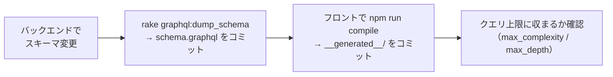
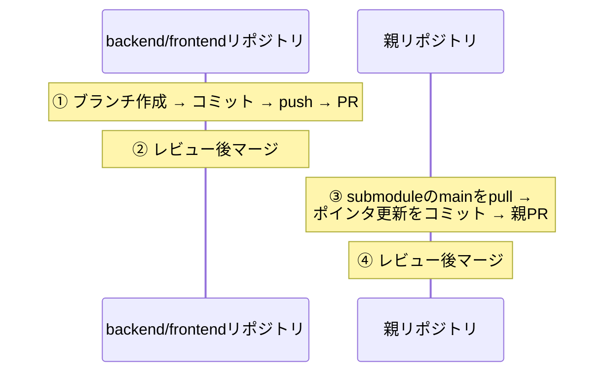

# 07. 開発の進め方

このリポジトリで手を動かすときの決まりごと。セットアップ手順や個々の検証コマンドは
各リポジトリのREADMEが正なので、ここでは「どこを見るか」の案内と、
**このリポジトリ特有でほかに人間向けの記載がない運用**
（スキーマ変更の連鎖手順・submodule構成のPR運用・ドキュメント運用）だけを扱う。

## 手順の在り処

| やりたいこと | 正となる場所 |
|---|---|
| 初回セットアップ・起動・データ投入 | [ルートREADME](../../README.md) |
| バックエンド単体の起動・環境変数・テスト実行 | `application/backend/README.md` |
| フロントエンドの検証コマンド・ビルド | `application/frontend/README.md` |
| 定型作業の手順書（デプロイ・日次確認・PR運用・リリース） | `.claude/skills/` 配下の各SKILL.md |

## GraphQLスキーマを変えたときの連鎖手順

スキーマの変更は3リポジトリに波及するため、次の順で追随させる。

- `npm run compile` はバックエンドの起動が必要（[06章](06_frontend.md)）
- クエリ上限の値と意図は[05章](05_backend.md)を参照

## ブランチ・PR運用（submodule構成の要）

### 大原則

**submodule側をマージしてから、親のポインタを更新する。** 親PRをsubmodule PRと
同時に作らない。

- 親のポインタがマージ前のfeatureブランチ先端を指すと、squashマージ時に
  「mainに存在しないコミットを参照する」壊れた状態になるため、この順序を守る
- backendとfrontend両方に変更があるときはPRを2本作って相互参照し、
  **backend → frontend の順でマージする**（フロントが新しいAPIに依存し得るため）
- 親リポジトリには `submodule-check` というCIがあり、mainへのpush時に
  「submoduleの参照コミットが各リポジトリのmainに含まれるか」を検証する
- `git status` の `M application/backend` の読み方と後始末は
  [03章](03_tech_prerequisites.md)のsubmodule節を参照

### コミット・PRの規約

| 項目 | 規約 |
|---|---|
| コミットメッセージ | prefix `add:` / `update:` / `change:` / `fix:` を付ける |
| 親のポインタ更新コミット | 例: `update: backend/frontend submodules（変更概要）` |
| 親のdocs変更 | ポインタ更新と同じPRに同梱してよい |

この運用の詳しい手順書は `.claude/skills/submodule-pr/SKILL.md` にある。

## ドキュメントの運用ルール

| ドキュメント | ルール |
|---|---|
| このガイド（docs/guide/） | 全体像・入門の説明を担当。実装の詳細が変わったら該当章を追随させる |
| docs/architecture/ | 実装済みアーキテクチャの正。設計変更とセットで更新する |
| docs/improvements.md | 未着手の改善だけを書く。**対応が完了した項目は記述ごと削除する**（完了の記録はgit履歴が持つ） |
| 秘密情報 | 実ホスト名・キー・接続情報はどのドキュメントにも書かない。git管理されるファイルには「項目名と入手方法」まで |

---

次章: [08. 本番運用](08_operations.md)
