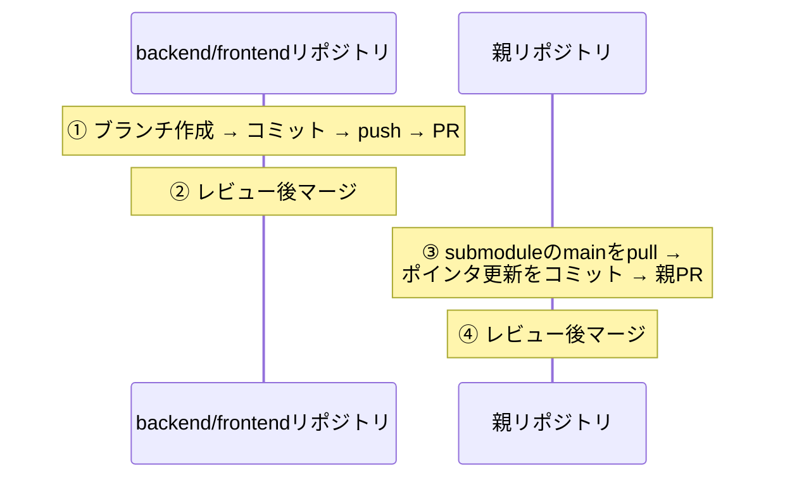

# 07. 開発の進め方

環境構築から、日常の開発ループ、submodule構成ならではのブランチ・PR運用まで。

## 初回セットアップ

具体的なコマンドは[ルートREADME](../../README.md)が正。ここでは各ステップの意味だけ補足する。

| ステップ | 意味 |
|---|---|
| `git clone --recursive` | submodule（backend/frontend）の中身も一緒に取得する（[03章](03_tech_prerequisites.md)） |
| `config/application.yml` を作成 | figaro形式の環境変数ファイル（[05章](05_backend.md)）。EDINET APIキーは無料発行できる。**gitignore済みで、内容をコミット・ドキュメント転記してはならない** |
| `docker compose up` | 5サービス起動（[04章](04_system_overview.md)）。初回はイメージビルドと依存インストールで時間がかかる |
| `rake ingestion:backfill[...]` などで取込 | 起動直後のDBは空。EDINETから実データを取り込んで初めて画面に表示される |

データ投入は6月の日付を指定すると1日数百件になる点、検証用6社のdocID指定という
近道がある点もREADMEに記載がある。

## 日常の開発ループ

1. 対象リポジトリ（backend / frontend / 親）で作業ブランチを切る
2. 実装する
3. 検証する
   - フロント: `npx tsc --noEmit`・eslint・prettier・`CI=false yarn build`（[06章](06_frontend.md)）
   - バック: `bundle exec rspec`（[05章](05_backend.md)。実XBRL fixtureがないテストはskipされる）
4. `docker compose up` の実環境で動作確認する
5. PRを作る（次節の運用に従う）

### GraphQLスキーマを変えたときだけ増える手順

1. バックエンドで `rake graphql:dump_schema` を実行し `schema.graphql` を更新・コミット
2. フロントエンドで `npm run compile` を実行し `src/__generated__/` を再生成・コミット
   （バックエンド起動が必要）
3. フィールドを増やす場合、公開APIのクエリ上限（`max_complexity` / `max_depth`）に
   収まるか確認する

### XBRLタグを触るときの決まり

Extractorやタグ対応を変更する作業の前に、必ず
[docs/architecture/06_xbrl_research.md](../architecture/06_xbrl_research.md)（6社の実測データ）を読む。
タグの有無や値は思い込みと違うことが多く、実測が唯一の裏取り手段になっている。

## ブランチ・PR運用（submodule構成の要）

### 大原則

**submodule側をマージしてから、親のポインタを更新する。** 親PRをsubmodule PRと
同時に作らない。

- 親のポインタがマージ前のfeatureブランチ先端を指すと、squashマージ時に
  「mainに存在しないコミットを参照する」壊れた状態になるため、この順序を守る
- backendとfrontend両方に変更があるときはPRを2本作って相互参照し、
  **backend → frontend の順でマージする**（フロントが新しいAPIに依存し得るため）
- 親リポジトリには `submodule-check` というCIがあり、mainへのpush時に
  「submoduleの参照コミットが各リポジトリのmainに含まれるか」を検証する
- `git status` の `M application/backend` の読み方と後始末は
  [03章](03_tech_prerequisites.md)のsubmodule節を参照

### コミット・PRの規約

| 項目 | 規約 |
|---|---|
| コミットメッセージ | prefix `add:` / `update:` / `change:` / `fix:` を付ける |
| 親のポインタ更新コミット | 例: `update: backend/frontend submodules（変更概要）` |
| 親のdocs変更 | ポインタ更新と同じPRに同梱してよい |

この運用の詳しい手順書は `.claude/skills/submodule-pr/SKILL.md` にある
（`.claude/skills/` には他にデプロイ・日次確認・リリースの手順書もあり、[08章](08_operations.md)で触れる）。

## ドキュメントの運用ルール

| ドキュメント | ルール |
|---|---|
| このガイド（docs/guide/） | 全体像・入門の説明を担当。実装の詳細が変わったら該当章を追随させる |
| docs/architecture/ | 実装済みアーキテクチャの正。設計変更とセットで更新する |
| docs/improvements.md | 未着手の改善だけを書く。**対応が完了した項目は記述ごと削除する**（完了の記録はgit履歴が持つ） |
| 秘密情報 | 実ホスト名・キー・接続情報はどのドキュメントにも書かない。git管理されるファイルには「項目名と入手方法」まで |

---

次章: [08. 本番運用](08_operations.md)
