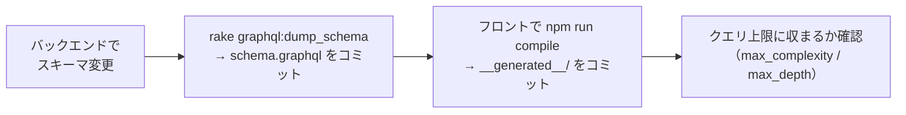
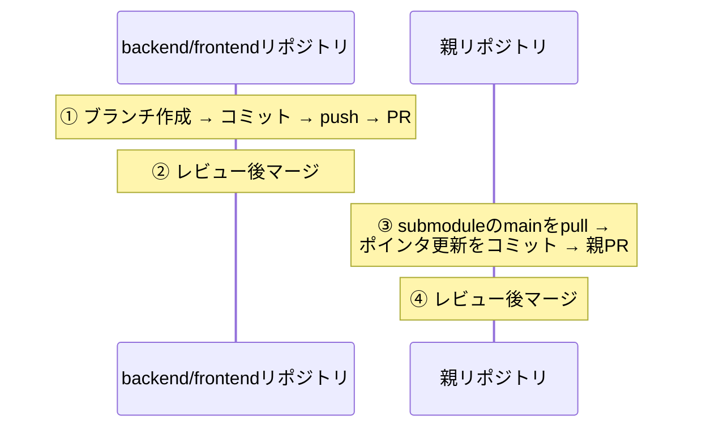
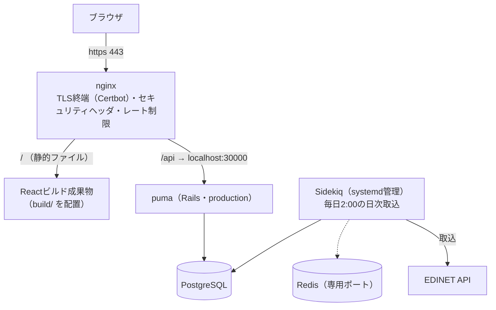
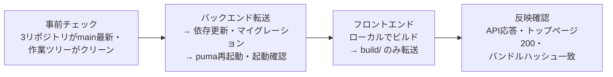

# 07. 開発と運用

このリポジトリで手を動かすときの決まりごとと、本番環境（https://investee.info ）の運用。
個々の手順の正は各READMEと `.claude/skills/` にあり（下表）、この章では
**このリポジトリに特有の運用**（ほかのドキュメントに記載がないもの）だけを扱う。
実ホスト名・鍵などはgit管理外のファイル（`deploy.sh` など）だけが持ち、ドキュメントには書かない。

## 手順の在り処

| やりたいこと | 正となる場所 |
|---|---|
| 初回セットアップ・起動・データ投入 | [ルートREADME](../../README.md) |
| バックエンド単体の起動・環境変数・テスト実行 | `application/backend/README.md` |
| フロントエンドの検証コマンド・ビルド | `application/frontend/README.md` |
| デプロイ・日次確認・PR運用・リリースの詳細手順 | `.claude/skills/` 配下の各SKILL.md |

## 開発

### GraphQLスキーマを変えたときの連鎖手順

スキーマの変更は3リポジトリに波及するため、次の順で追随させる。

- `npm run compile` はバックエンドの起動が必要（[06章](06_frontend.md)）
- クエリ上限の値と意図は[05章](05_backend.md)を参照

### ブランチ・PR運用（submodule構成の要）

**大原則: submodule側をマージしてから、親のポインタを更新する。**
親PRをsubmodule PRと同時に作らない。

- 親のポインタがマージ前のfeatureブランチ先端を指すと、squashマージ時に
  「mainに存在しないコミットを参照する」壊れた状態になるため、この順序を守る
- backendとfrontend両方に変更があるときはPRを2本作って相互参照し、
  **backend → frontend の順でマージする**（フロントが新しいAPIに依存し得るため。
  後述のデプロイ順も同じ理屈）
- 親リポジトリには `submodule-check` というCIがあり、mainへのpush時に
  「submoduleの参照コミットが各リポジトリのmainに含まれるか」を検証する
- `git status` の `M application/backend` の読み方と後始末は
  [03章](03_tech_prerequisites.md)のsubmodule節を参照

コミット・PRの規約:

| 項目 | 規約 |
|---|---|
| コミットメッセージ | prefix `add:` / `update:` / `change:` / `fix:` を付ける |
| 親のポインタ更新コミット | 例: `update: backend/frontend submodules（変更概要）` |
| 親のdocs変更 | ポインタ更新と同じPRに同梱してよい |

## 本番環境の構成

さくらVPS1台に全コンポーネントが同居する。開発環境（Docker）と違いコンテナは使わず、
OS上に直接構築されている。

開発環境との違いで押さえておくべき点:

| 項目 | 内容 |
|---|---|
| 本番nginxの設定 | **リポジトリ外**（サーバ上の `/etc/nginx/` 直下）にあり、rsyncデプロイの対象外。変更はサーバ上で直接行う |
| フロントエンド | devサーバではなく、ビルド済み静的ファイルをnginxが直接配信する。SPAのフォールバック設定（未知パス→index.html）は本番nginx側の責務 |
| セキュリティヘッダ | nginxで一元管理し、Rails側のヘッダ出力は明示的に止めている（二重出力防止）。CSPはReport-Onlyで運用（AdSenseとMUIがインラインコードを要求するため強制モードにできない） |
| HTTPS | Certbot（Let's Encrypt）による301リダイレクトとTLS終端。Railsの `force_ssl` は使わない（nginxが `X-Forwarded-Proto` を転送しておらず、有効化すると無限リダイレクトになる） |
| レート制限 | `/api/` に対して2リクエスト/秒（バースト20、超過は429）。未認証・公開APIの防御の一部 |

## デプロイ

CI/CDはなく、**ローカルの作業ツリーをrsyncでVPSへ転送して再起動する**方式。

- **rsyncは未コミットの変更もそのまま本番に載せてしまう**。だから最初に
  作業ツリーがクリーンであることを確認する
- 順序は必ず**バックエンド → フロントエンド**（PRのマージ順と同じ理屈）
- Sidekiq再起動が必要な変更（ジョブやgemの追加）はsudoを要するため非対話SSHでは
  完結できず、対話端末での操作が必要になる
- 過去に「非対話SSHで再起動スクリプトを実行してAPIが数分停止する」事故があり、
  対話モード強制（`bash -ic`）や `RAILS_ENV=production` の明示など、
  再発防止の決まりが手順書（`.claude/skills/deploy/`）に記録されている

## 日次バッチの監視とリカバリ

[05章](05_backend.md)のとおり自動リトライはなく、**冪等な再実行が唯一のリカバリ手段**。
異常はSentry通知で気づき、対応する再実行コマンドを打つ、が基本形になる。

| Sentry通知（ログメッセージ） | 意味 | リカバリ |
|---|---|---|
| `list failed <日付>`（`EDINET documents.json failed` も同種） | その日の書類一覧の取得自体に失敗（1日分が丸ごと未取込） | **必ず再実行**: `rake 'ingestion:backfill[日付,日付]'` |
| `ingest failed <docID>` | 特定の書類の取込に失敗 | `rake 'ingestion:documents[docID]'` |
| `accounting standard unknown` | 未知の会計基準（取込対象外としてスキップ済み） | 対応不要。頻発するなら形式対応を検討 |
| `primary statement missing bs.assets` | 取り込めたが主要科目が欠けている | Extractor・形式判定を修正して再取込 |

日々の健全性確認は `.claude/skills/investee-daily-check/` のスクリプト1本に
まとまっており、次を一度に確認できる。

- 前夜の日次ジョブがログに痕跡を残しているか、エラー行数はいくつか
- 前日提出分の取込件数と、EDINET側の提出一覧（突き合わせ用）
- 本番サイトの死活（トップページが200を返すか）

読み方の注意として、DBの提出日はEDINETの提出日ではなくXBRL表紙の日付に由来するため、
**訂正有報は元の有報の日付で記録される**。「EDINET一覧に提出があるのに前日日付の
取込件数が0」は、訂正有報のみだった日の正常な結果として読み分ける。

## 監視・ログ

| 仕組み | 内容 |
|---|---|
| Sentry | 例外・警告の通知先。個人情報を送らない設定（EDINET APIキーがURLに含まれるため、リクエスト情報の送出を明示的に抑止している）。パフォーマンストレースは10%サンプリング |
| ログ | lograge形式で `log/production.log` へ。サイズ上限つきローテーション（ディスク枯渇対策）。SQLログは別ファイル |

## リリースタグ

デプロイと連動した自動化はないが、リリースの区切りをGitHub Releaseで記録する。

- タグ名は `release-X.Y.Z`。機能追加ありはYを+1、修正のみはZを+1
- 対象は**親リポジトリは毎回**、backend/frontendは前回タグ以降にコミットがあるものだけ
- 作成順はsubmodule → 親（PRのマージ順と同じ向き）
- リリースノートは公開情報のため、ホスト名・キーなどの実値を書かない

## ドキュメントの運用ルール

| ドキュメント | ルール |
|---|---|
| 学ぶ章（docs/guide/ 01〜07） | 入門・全体像と設計・運用の説明を担当。実装や設計が変わったら該当章を追随させる |
| 資料（docs/guide/ 08〜09） | タグ対応表・実測データ・削除記録。タグや凍結データを触る変更とセットで更新する |
| docs/improvements.md | 未着手の改善だけを書く。**対応が完了した項目は記述ごと削除する**（完了の記録はgit履歴が持つ） |
| 秘密情報 | 実ホスト名・キー・接続情報はどのドキュメントにも書かない。git管理されるファイルには「項目名と入手方法」まで |

---

学ぶ章はこの章まで。作業時に引く資料: [08章 XBRLタグ対応表と実地調査](08_taxonomy_mapping.md) /
[09章 旧系統の削除記録](09_legacy_cleanup.md)
