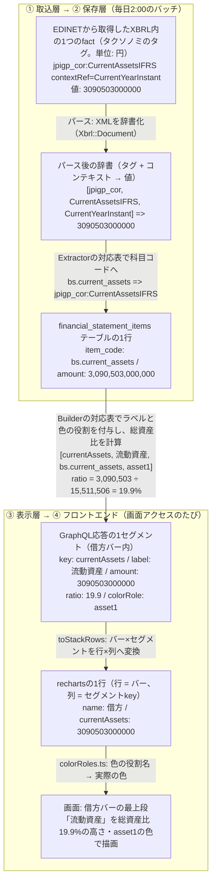

# 07. XBRLタグ対応表と実地調査

前半は「このタグはどの科目コードになり、どのグラフで使われるか」を引く対応表、後半はその根拠になった6社の実測記録。XBRLタグを扱う作業のときに開く。同じ意味の科目でも企業・業種でタグ名がゆれる（売上高・営業収益・完成工事高など）という開示実務の実態を、この表とフォールバックの順序で吸収している。

なぜ「タグ → 科目コード → Builder」の3段構えなのかは[03章](03_system_overview.md)。

---

## 読み方

武田薬品の「流動資産」の実データで、タグが画面に届くまでの各段階の名前・値・付随情報を追うと次のとおり。**金額は最初から最後まで一度も加工されず、変わるのは名前（タグ → 科目コード → key/label）と付随情報だけ**。この章の表は、この流れの「タグ → 科目コード → Builder」の対応を左から右へ辿れるように並べてある。



パース・抽出・Builderの詳細は[04章](04_backend.md)、rechartsへの変換と描画は[05章](05_frontend.md)。

表中の略記:

| 略記 | 形式 | 対象 |
|---|---|---|
| 一般 | `jgaap_general` | 日本基準・一般事業会社 |
| 銀行 | `jgaap_bank` | 日本基準・銀行 |
| 分類 | `ifrs_classified` | IFRS・流動/非流動分類BS（様式511000） |
| 配列 | `ifrs_liquidity` | IFRS・流動性配列BS（様式512000） |

### タクソノミと名前空間

使ってよいタグの辞書を**タクソノミ**と呼び、金融庁が定義している（[01章](01_financial_knowledge.md)）。この表で扱う名前空間は次の4つ。

| 名前空間 | 内容 | タグの例 |
|---|---|---|
| `jpdei_cor` | DEI（書類情報）。会計基準・業種コード・EDINETコード・連結の有無・会計期間など書類のメタ情報 | `AccountingStandardsDEI`（会計基準） |
| `jpcrp_cor` | 有報共通の記載項目（表紙の企業名・提出日・経営指標サマリなど） | `CompanyNameCoverPage`（表紙の企業名） |
| `jppfs_cor` | **日本基準**の財務諸表本表のタグ | `Assets`（資産合計）・`NetSales`（売上高） |
| `jpigp_cor` | **IFRS**の財務諸表本表のタグ | `AssetsIFRS`（資産合計）・`RevenueIFRS`（売上収益） |

このほか企業が独自に定義する「企業拡張タグ」も存在する（例: `jpcrp030000-asr_E04430-000:OperatingRevenuesIFRS`。NTTが独自定義した営業収益）。企業ごとに意味の保証がないため意図的に読まない（後述「標準タグで取れない場合の扱い」）。

### コンテキスト

同じタグでも「当期末なのか前期末なのか」「連結なのか単体なのか」で別のfactになる。たとえば同じ `jppfs_cor:Assets` タグのfactが、1つのXBRLファイルの中に次のように複数入っている。

| fact（タグ × コンテキスト） | 意味 |
|---|---|
| `Assets` × `CurrentYearInstant` | 当期末・連結の資産合計 |
| `Assets` × `Prior1YearInstant` | 前期末・連結の資産合計 |
| `Assets` × `CurrentYearInstant_NonConsolidatedMember` | 当期末・単体の資産合計 |

コンテキストIDの読み方:

| コンテキストID | 意味 |
|---|---|
| `CurrentYearInstant` | 当期末時点（BSの残高に使う） |
| `CurrentYearDuration` | 当期の期間（PL・CFの増減に使う） |
| `Prior1YearInstant` | 前期末時点（CFの期首残高のみ） |
| 上記 + `_NonConsolidatedMember` | 単体（サフィックスなしは連結） |

単体財務諸表はIFRS適用企業でも日本基準（`jppfs_cor`）でタグ付けされるため、単体は常に「一般」または「銀行」の形式で処理される。

---

## BS（貸借対照表）

### 全形式で共通して取る科目

この4科目はどの形式でも取得できる。形式をまたぐ検索・表示はこの4科目を前提にできる。

| 科目コード | 日本語 | 一般 / 銀行 | 分類 / 配列 | 使うBuilder |
|---|---|---|---|---|
| `bs.assets` | 資産合計 | `jppfs_cor:Assets` | `jpigp_cor:AssetsIFRS` | 銀行・分類・配列 |
| `bs.liabilities` | 負債合計 | `jppfs_cor:Liabilities` | `jpigp_cor:LiabilitiesIFRS` | 銀行・配列 |
| `bs.equity` | 資本（純資産）合計 | `jppfs_cor:NetAssets` | `jpigp_cor:EquityIFRS` | BS全Builder |
| `bs.cash_and_equivalents` | 現金及び現金同等物 | 一般 `jppfs_cor:CashAndCashEquivalents`<br>銀行 `jppfs_cor:CashAndDueFromBanksAssetsBNK` | `jpigp_cor:CashAndCashEquivalentsIFRS` | 銀行・配列 |

銀行の `bs.cash_and_equivalents` だけタグが違うのは、BSの「現金預け金」とCFの「現金及び現金同等物」が銀行では別概念のため。値が一致する銀行もあるが混同しないこと。

### 流動 / 非流動の区分（一般・分類のみ）

銀行と配列にはこの区分が存在しない。

| 科目コード | 日本語 | 一般 | 分類 | 使うBuilder |
|---|---|---|---|---|
| `bs.current_assets` | 流動資産 | `jppfs_cor:CurrentAssets` | `jpigp_cor:CurrentAssetsIFRS` | 一般・分類 |
| `bs.non_current_assets` | 非流動（固定）資産 | `jppfs_cor:NoncurrentAssets` | `jpigp_cor:NonCurrentAssetsIFRS` | 分類 |
| `bs.current_liabilities` | 流動負債 | `jppfs_cor:CurrentLiabilities` | `TotalCurrentLiabilitiesIFRS`<br>→ `CurrentLiabilitiesIFRS` | 一般・分類 |
| `bs.non_current_liabilities` | 非流動（固定）負債 | `jppfs_cor:NoncurrentLiabilities` | `NonCurrentLabilitiesIFRS`<br>→ `NonCurrentLiabilitiesIFRS` | 一般・分類 |

`NonCurrentLabilities` は綴りが誤っているように見えるが、金融庁のタクソノミ側のタイポがそのまま公式要素名になっている（`1g_IFRS_ElementList.xlsx` で確認済み）。将来修正される可能性があるので、正しい綴りもフォールバックに入れてある。

### 形式固有の内訳科目

| 科目コード | 日本語 | 形式 | XBRLタグ | 使うBuilder |
|---|---|---|---|---|
| `bs.tangible_fixed_assets` | 有形固定資産 | 一般 | `jppfs_cor:PropertyPlantAndEquipment` | 一般 |
| `bs.intangible_fixed_assets` | 無形固定資産 | 一般 | `jppfs_cor:IntangibleAssets` | 一般 |
| `bs.investments_and_other_assets` | 投資その他の資産 | 一般 | `jppfs_cor:InvestmentsAndOtherAssets` | 一般 |
| `bs.loans` | 貸出金 | 銀行 | `jppfs_cor:LoansAndBillsDiscountedAssetsBNK` | 銀行 |
| `bs.securities` | 有価証券 | 銀行 | `jppfs_cor:SecuritiesAssetsBNK` | 銀行 |
| `bs.deposits` | 預金 | 銀行 | `jppfs_cor:DepositsLiabilitiesBNK` | 銀行 |
| `bs.property_plant_and_equipment` | 有形固定資産 | 分類 | `jpigp_cor:PropertyPlantAndEquipmentIFRS` | — |
| `bs.goodwill_and_intangibles` | のれん及び無形資産 | 分類 | 下記の合算処理 | — |
| `bs.equity_attributable_to_owners` | 親会社所有者帰属持分 | 分類・配列 | `jpigp_cor:EquityAttributableToOwnersOfParentIFRS` | — |
| `bs.non_controlling_interests` | 非支配持分 | 分類・配列 | `jpigp_cor:NonControllingInterestsIFRS` | — |

Builderが「—」の科目も保存している。再取込のコストが高いので保存する科目は広めに取っておき、将来の指標計算やコメント生成の入力に使えるようにしてある。

---

## PL（損益計算書）

### 全形式で共通

| 科目コード | 日本語 | 一般・銀行 | 分類・配列 | 使うBuilder |
|---|---|---|---|---|
| `pl.profit_before_tax` | 税引前利益 | `jppfs_cor:IncomeBeforeIncomeTaxes` | `jpigp_cor:ProfitLossBeforeTaxIFRS` | IFRS |
| `pl.income_tax` | 法人税等 | `jppfs_cor:IncomeTaxes` | `jpigp_cor:IncomeTaxExpenseIFRS` | — |
| `pl.profit` | 当期純利益 | `jppfs_cor:ProfitLoss` | `jpigp_cor:ProfitLossIFRS` | — |
| `pl.profit_attributable_to_owners` | 親会社帰属当期純利益 | `jppfs_cor:ProfitLossAttributableToOwnersOfParent` | `jpigp_cor:ProfitLossAttributableToOwnersOfParentIFRS` | — |

### トップライン（売上・収益）

企業によって科目名が揺れるため、フォールバックリストで順に引く（先に取れた方を採用）。

**一般** — `pl.revenue`

| 順 | XBRLタグ | 日本語 |
|---|---|---|
| 1 | `jppfs_cor:OperatingRevenue1` | 営業収益 |
| 2 | `jppfs_cor:NetSales` | 売上高 |
| 3 | `jppfs_cor:ContractsCompletedRevOA` | 完成工事高 |
| 4 | `jppfs_cor:NetSalesOfCompletedConstructionContractsCNS` | 完成工事高（建設業） |

営業収益を売上高より先に置いている。営業収益型（売上高と営業収入をまとめて開示する小売業など）は両方のタグを持つが、営業利益と貸借が合うのは営業収益の側になるため。

**分類・配列** — `pl.revenue`

| 順 | XBRLタグ | 日本語 |
|---|---|---|
| 1 | `jpigp_cor:RevenueIFRS` | 売上収益 |
| 2 | `jpigp_cor:Revenue2IFRS` | 収益 |
| 3 | `jpigp_cor:NetSalesIFRS` | 売上高 |
| 4 | `jpcrp_cor:RevenueIFRSSummaryOfBusinessResults` | 経営指標サマリ（本表ではない） |

最後の1つだけ本表ではなく経営指標サマリから取っている。本表の収益が企業拡張タグしか無い企業（NTTなど）でも取得できるようにする最終フォールバックで、値は本表と一致することを実測で確認済み。順番を最後にしているのは、本表のタグの方が一次情報だから。

**銀行** — 売上高という概念が無いため `pl.revenue` は保存しない。

| 科目コード | XBRLタグ | 日本語 | MUFG実測 |
|---|---|---|---|
| `pl.ordinary_revenue` | `jppfs_cor:OrdinaryIncomeBNK` | 経常収益 | 14.6兆 |
| `pl.ordinary_expenses` | `jppfs_cor:OrdinaryExpensesBNK` | 経常費用 | 11.2兆 |
| `pl.ordinary_profit` | `jppfs_cor:OrdinaryIncome` | 経常利益 | 3.4兆 |

`OrdinaryIncomeBNK` が経常収益、サフィックスなしの `OrdinaryIncome` が経常利益で、名前が似ているのに意味が違う。取り違えると桁が大きく狂う。

### 費用・利益の中間段階

| 科目コード | 日本語 | 一般 | 分類・配列 | 使うBuilder |
|---|---|---|---|---|
| `pl.cost_of_sales` | 売上原価 | フォールバック8件（下記） | `jpigp_cor:CostOfSalesIFRS` | 一般・IFRS |
| `pl.sga` | 販売費及び一般管理費 | `jppfs_cor:SellingGeneralAndAdministrativeExpenses` | `jpigp_cor:SellingGeneralAndAdministrativeExpensesIFRS` | 一般・IFRS |
| `pl.operating_expenses` | 営業費用（一括計上） | — | `jpigp_cor:OperatingExpensesIFRS` | IFRS |
| `pl.gross_profit` | 売上総利益 | `jppfs_cor:GrossProfit` | `jpigp_cor:GrossProfitIFRS` | — |
| `pl.operating_profit` | 営業利益 | `jppfs_cor:OperatingIncome` | `jpigp_cor:OperatingProfitLossIFRS` | 一般 |
| `pl.ordinary_profit` | 経常利益 | `jppfs_cor:OrdinaryIncome` | 存在しない | 銀行 |
| `pl.non_operating_income` | 営業外収益 | `jppfs_cor:NonOperatingIncome` | 存在しない | — |
| `pl.non_operating_expenses` | 営業外費用 | `jppfs_cor:NonOperatingExpenses` | 存在しない | — |
| `pl.extraordinary_income` | 特別利益 | `jppfs_cor:ExtraordinaryIncome` | 存在しない | — |
| `pl.extraordinary_loss` | 特別損失 | `jppfs_cor:ExtraordinaryLoss` | 存在しない | — |

一般の `pl.cost_of_sales` のフォールバック（順序が優先度）:

| 順 | XBRLタグ | 日本語 |
|---|---|---|
| 1 | `jppfs_cor:OperatingCost` | 営業原価 |
| 2 | `jppfs_cor:CostOfSales` | 売上原価 |
| 3 | `jppfs_cor:CostOfMerchandiseAndFinishedGoodsSoldCOS` | 商品及び製品売上原価 |
| 4 | `jppfs_cor:CostOfFinishedGoodsSold` | 製品売上原価 |
| 5 | `jppfs_cor:CostOfGoodsSold` | 商品売上原価 |
| 6 | `jppfs_cor:CostOfCompletedWorkCOSExpOA` | 完成工事原価 |
| 7 | `jppfs_cor:CostOfSalesOfCompletedConstructionContractsCNS` | 完成工事原価（建設業） |
| 8 | `jppfs_cor:CostOfProductsManufactured` | 当期製品製造原価 |

営業原価が先頭なのは、営業収益とペアの原価だから（営業収益型の企業は売上原価も併記するが、そちらは売上高側の原価になる）。当期製品製造原価が最後なのは、売上原価の代わりにこれで本表を開示する製造業がある一方、通常は製造原価明細の項目として売上原価と併記されるため。

IFRSの営業利益（`pl.operating_profit`）は保存はするがBuilderでは使っていない。IFRSでは開示が任意で、開示する企業としない企業が混在して企業間の比較にならないため。

---

## CF（キャッシュ・フロー計算書）

| 科目コード | 日本語 | 一般・銀行 | 分類・配列 |
|---|---|---|---|
| `cf.operating` | 営業活動によるCF | `jppfs_cor:NetCashProvidedByUsedInOperatingActivities` | `jpigp_cor:NetCashProvidedByUsedInOperatingActivitiesIFRS` |
| `cf.investing` | 投資活動によるCF | `jppfs_cor:NetCashProvidedByUsedInInvestmentActivities` | `jpigp_cor:NetCashProvidedByUsedInInvestingActivitiesIFRS` |
| `cf.financing` | 財務活動によるCF | `jppfs_cor:NetCashProvidedByUsedInFinancingActivities` | `jpigp_cor:NetCashProvidedByUsedInFinancingActivitiesIFRS` |
| `cf.cash_end` | 現金及び現金同等物の期末残高 | `jppfs_cor:CashAndCashEquivalents` | `jpigp_cor:CashAndCashEquivalentsIFRS` |
| `cf.cash_begin` | 同・期首残高 | 同上（`Prior1YearInstant`） | 同上（`Prior1YearInstant`） |

投資活動のタグ名が日本基準は `Investment`、IFRSは `Investing` で異なる。CFは5科目そろわないとウォーターフォールが繋がらないため、1つでも欠けるとチャートは `renderable: false` になる。

期首残高だけはマッピング表に載せられない。表は `CurrentYear` のコンテキストを前提としており、期首残高は前期末（`Prior1YearInstant`）を見る必要があるため、各Extractorの`extract_extras` フックで個別に実装している。

---

## マッピング表で表せないもの

タグと科目コードが1対1、あるいは1対Nのフォールバックで済まないケースは`extract_extras` に書く。現在あるのは2種類だけ。

| ケース | 実装している形式 | 内容 |
|---|---|---|
| 別コンテキストの参照 | 全形式 | CF期首残高（`Prior1YearInstant`） |
| 複数タグの合算 | 分類 | のれん + 無形資産 |

のれんの合算は、合算タグを開示する企業（三菱商事）と別掲する企業（武田）があるため、合算タグを先に探し、無ければ2タグを足して1つの科目コードに正規化している。

```ruby
combined = money("jpigp_cor:GoodwillAndIntangibleAssetsIFRS", ...)
if combined.nil?
  combined = [money("jpigp_cor:GoodwillIFRS", ...),
              money("jpigp_cor:IntangibleAssetsIFRS", ...)].compact.sum
end
```

---

## 標準タグで取れない場合の扱い

企業が独自に定義した拡張タグ（`jpcrp030000-asr_E04430-000:...` のような名前空間）は意図的に読んでいない。企業ごとに意味の保証がないため、`Xbrl::Document` の時点で標準タクソノミ以外を弾いている。

そのため、収益が拡張タグにしか無い企業では `pl.revenue` が取得できない。

| 企業 | 状況 | 結果 |
|---|---|---|
| NTT | 本表は拡張タグだが経営指標サマリに標準タグあり | サマリから取得して表示できる |
| 東京海上HD | 拡張タグのみ。サマリにも無い | PLだけ `renderable: false`。BS・CFは表示 |

取れないことをエラーではなく正常系として扱い、チャート単位で表示を落とす設計にしてある（カード全体は消さない）。詳細は[04章](04_backend.md)。

---

## 新しいタグを追加するとき

1. 対象企業の有報XBRLを取得して実際のタグを確認する（取得手順はbackendの `spec/fixtures/xbrl/README.md`）
2. 科目コードが未定義なら `item_codes.rb` に追加する
3. 該当形式のExtractorのマッピング定数に1行足す
4. 表示に使うなら該当BuilderのSPECに追加する
5. この文書の表を更新する

3で `item_codes.rb` に無いコードを書くと、`mapping_consistency_spec.rb` が落ちて気づけるようになっている。

---

## 実地調査の記録（6社・4形式）

ここまでの表の根拠になった実測。EDINET API v2で実際に有報XBRLを取得し、全factをダンプして確認した（調査当時の旧系統実装の実行結果とも突き合わせ済み）。タクソノミの公式資料だけでは分からない実態が実装判断を左右するため、実物での確認記録を残している。

### 調査対象

| 企業 | 証券コード | docID | 会計基準(DEI) | 連結業種(DEI) | 判定形式 |
|---|---|---|---|---|---|
| 武田薬品工業 | 4502 | S100YB5L | IFRS | cte | ifrs_classified |
| 三菱商事 | 8058 | S100YB25 | IFRS | cte | ifrs_classified |
| ＮＴＴ | 9432 | S100YCP3 | IFRS | cte | ifrs_classified |
| 楽天グループ | 4755 | S100XTNW | IFRS | cte | ifrs_liquidity |
| 東京海上HD | 8766 | S100YLS8 | IFRS | **INS** | ifrs_liquidity |
| 三菱UFJ FG | 8306 | S100YJQO | Japan GAAP | **bnk** | jgaap_bank |

- いずれも2026年提出の有報（楽天のみ2025/12期、他は2026/3期）
- 東京海上HDは2026/3期からIFRSへ移行済みだった（当初は日本基準・保険業のサンプルとして選定）。そのため**日本基準・保険業の実測サンプルは未取得**。将来対応時に実測すること

### 実測での発見と実装への反映

| 実測での発見 | 実装への反映 |
|---|---|
| 楽天のfactダンプで `CurrentAssetsIFRS` の出現が0件（512000様式のツリー自体に流動/非流動の要素がない） | IFRSの2様式は「タグの実在」で判定する（[03章](03_system_overview.md)） |
| IFRS企業の単体財務諸表は6社すべて `jppfs_cor` + `_NonConsolidatedMember` でタグ付け | 単体は常に日本基準として処理（冒頭「読み方」） |
| NTT: 本表の収益が企業拡張タグ `jpcrp030000-asr_E04430-000:OperatingRevenuesIFRS`（営業収益14.41兆円）のみ。経営指標サマリの標準タグは本表と完全一致 | サマリタグを収益フォールバックの最後に置く（PLの表） |
| 東京海上: 保険収益が拡張タグ `InsuranceRevenueIFRS`（7.69兆円）のみで、経営指標サマリの標準タグも存在しない | 標準タグだけでは取れない企業が実在する → 「PLは表示不可」を正常系にする（[04章](04_backend.md)実例2） |
| CFの3区分と現金同等物は全形式で取得可能（タグ名が基準別に異なるのみ） | CFチャートを全形式共通のBuilderにできる（[04章](04_backend.md)） |
| 銀行BSに流動/固定の区分がなく、合計だけは汎用タグ（`jppfs_cor:Assets` 等）で取れる | 銀行BSは主要科目+残差で描く（[04章](04_backend.md)実例1） |

### 金融庁 IFRSタクソノミ要素リスト（1g_IFRS_ElementList.xlsx）からの知見

- **511000 財政状態計算書（流動/非流動）** と **512000 財政状態計算書（流動性配列）** の2様式が公式に存在する。512000には流動/非流動の合計要素自体がない
- **521000 損益計算書**: 収益の標準要素は `RevenueIFRS` / `NetSalesIFRS` / `Revenue2IFRS` の3系列。`GrossProfitIFRS`・`OperatingProfitLossIFRS` は任意項目。経常利益・特別損益に相当する要素は存在しない
- **540000 CF計算書**: 3区分 + 増減 + 現金同等物
- 要素メタデータとして periodType（instant/duration）と balance（debit/credit）が定義されており、マッピング作成時の科目性質の確認に使える

### 検証用データ（実測値。テストの期待値に使用）

| item | 武田 S100YB5L | 三菱商事 S100YB25 | NTT S100YCP3 | 楽天 S100XTNW | 東京海上 S100YLS8 | MUFG S100YJQO |
|---|---|---|---|---|---|---|
| bs.assets | 15,511,506 | 24,151,695 | 46,721,259 | 28,804,400 | 33,002,651 | 431,731,548 |
| bs.equity | 7,430,649 | 10,250,574 | 10,217,533 | 1,354,232 | 8,052,371※1 | 23,744,152 |
| pl.revenue | 4,505,720 | 18,915,995 | 14,409,121※2 | 2,496,575 | 取得不可 | −（銀行は経常収益14,620,843） |
| pl.profit_before_tax | -142,355 | 1,096,094 | 1,581,923 | -29,550 | 750,700 | 3,322,161 |
| cf.operating | 1,041,431 | 1,490,041 | 1,485,190 | 424,093 | 1,390,562 | -23,064,420 |

単位: 百万円。※1 = 親会社帰属7,955,554 + 非支配96,816。※2 = サマリタグからのフォールバック値。
