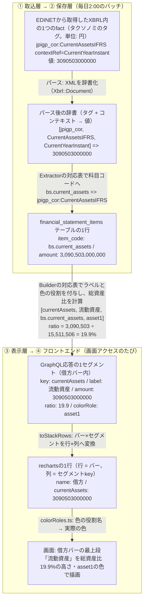

# 07. XBRLタグ対応表と実地調査

前半は「このタグはどの科目コードになり、どのグラフで使われるか」を引く対応表、後半はその根拠になった実測記録（基本8社 + 業種別対応で追加した14業種の実測）。XBRLタグを扱う作業のときに開く。同じ意味の科目でも企業・業種でタグ名がゆれる（売上高・営業収益・完成工事高など）という開示実務の実態を、この表とフォールバックの順序で吸収している。

なぜ「タグ → 科目コード → Builder」の3段構えなのかは[03章](03_system_overview.md)。

---

## 読み方

武田薬品の「流動資産」の実データで、タグが画面に届くまでの各段階の名前・値・付随情報を追うと次のとおり。**金額は最初から最後まで一度も加工されず、変わるのは名前（タグ → 科目コード → key/label）と付随情報だけ**。この章の表は、この流れの「タグ → 科目コード → Builder」の対応を左から右へ辿れるように並べてある。



パース・抽出・Builderの詳細は[04章](04_backend.md)、rechartsへの変換と描画は[05章](05_frontend.md)。

表中の略記:

| 略記 | 形式 | 対象 |
|---|---|---|
| 一般 | `jgaap_general` | 日本基準・一般事業会社（建設・鉄道・電気・ガス・海運・電気通信・証券・特定金融・商品先物・投資業など、業種別の勘定科目を持つが骨格が同じ業種を含む） |
| 銀行 | `jgaap_bank` | 日本基準・銀行 |
| 保険 | `jgaap_insurance` | 日本基準・保険（生保・損保） |
| 分類 | `ifrs_classified` | IFRS・流動/非流動分類BS（様式511000） |
| 配列 | `ifrs_liquidity` | IFRS・流動性配列BS（様式512000） |

業種別の勘定科目のタグは、標準タグ名に業種の接尾辞が付く（`OperatingRevenueELE`=電気の営業収益、`OperatingExpensesRWY`=鉄道の営業費、`SecuritiesAssetsINS`=保険の有価証券）。接尾辞は業種DEIコードと同じ: CNS=建設、BNK=銀行、INS=保険、SEC=証券、RWY=鉄道、WAT=海運、ELC=電気通信、ELE=電気、GAS=ガス、SPF=特定金融、CMD=商品先物、IVT=投資運用、INV=投資業（一覧はEDINETタクソノミの勘定科目リスト `1f_AccountList.xlsx` の業種別シート）。

### タクソノミと名前空間

使ってよいタグの辞書を**タクソノミ**と呼び、金融庁が定義している（[01章](01_financial_knowledge.md)）。この表で扱う名前空間は次の4つ。

| 名前空間 | 内容 | タグの例 |
|---|---|---|
| `jpdei_cor` | DEI（書類情報）。会計基準・業種コード・EDINETコード・連結の有無・会計期間など書類のメタ情報 | `AccountingStandardsDEI`（会計基準） |
| `jpcrp_cor` | 有報共通の記載項目（表紙の企業名・提出日・経営指標サマリなど） | `CompanyNameCoverPage`（表紙の企業名） |
| `jppfs_cor` | **日本基準**の財務諸表本表のタグ | `Assets`（資産合計）・`NetSales`（売上高） |
| `jpigp_cor` | **IFRS**の財務諸表本表のタグ | `AssetsIFRS`（資産合計）・`RevenueIFRS`（売上収益） |

このほか企業が独自に定義する「企業拡張タグ」も存在する（例: `jpcrp030000-asr_E04430-000:OperatingRevenuesIFRS`。NTTが独自定義した営業収益）。企業ごとに意味の保証がないため意図的に読まない（後述「標準タグで取れない場合の扱い」）。

### コンテキスト

同じタグでも「当期末なのか前期末なのか」「連結なのか単体なのか」で別のfactになる。たとえば同じ `jppfs_cor:Assets` タグのfactが、1つのXBRLファイルの中に次のように複数入っている。

| fact（タグ × コンテキスト） | 意味 |
|---|---|
| `Assets` × `CurrentYearInstant` | 当期末・連結の資産合計 |
| `Assets` × `Prior1YearInstant` | 前期末・連結の資産合計 |
| `Assets` × `CurrentYearInstant_NonConsolidatedMember` | 当期末・単体の資産合計 |

コンテキストIDの読み方:

| コンテキストID | 意味 |
|---|---|
| `CurrentYearInstant` | 当期末時点（BSの残高に使う） |
| `CurrentYearDuration` | 当期の期間（PL・CFの増減に使う） |
| `Prior1YearInstant` | 前期末時点（CFの期首残高のみ） |
| 上記 + `_NonConsolidatedMember` | 単体（サフィックスなしは連結） |

単体財務諸表はIFRS適用企業でも日本基準（`jppfs_cor`）でタグ付けされるため、単体は常に日本基準として処理される（業種により「一般」「銀行」「保険」のいずれか）。

---

## BS（貸借対照表）

### 全形式で共通して取る科目

この4科目はどの形式でも取得できる。形式をまたぐ検索・表示はこの4科目を前提にできる。

| 科目コード | 日本語 | 一般 / 銀行 | 分類 / 配列 | 使うBuilder |
|---|---|---|---|---|
| `bs.assets` | 資産合計 | `jppfs_cor:Assets` | `jpigp_cor:AssetsIFRS` | 銀行・分類・配列 |
| `bs.liabilities` | 負債合計 | `jppfs_cor:Liabilities` | `jpigp_cor:LiabilitiesIFRS` | 銀行・配列 |
| `bs.equity` | 資本（純資産）合計 | `jppfs_cor:NetAssets` | `jpigp_cor:EquityIFRS` | BS全Builder |
| `bs.cash_and_equivalents` | 現金及び現金同等物 | 一般 `jppfs_cor:CashAndCashEquivalents`<br>銀行 `jppfs_cor:CashAndDueFromBanksAssetsBNK`<br>保険 `jppfs_cor:CashAndDepositsAssetsINS` | `jpigp_cor:CashAndCashEquivalentsIFRS` | 銀行・保険・配列 |

銀行・保険の `bs.cash_and_equivalents` だけタグが違うのは、BSの「現金預け金」「現金及び預貯金」とCFの「現金及び現金同等物」が金融機関では別概念のため。値が一致する銀行もあるが混同しないこと。

### 流動 / 非流動の区分（一般・分類のみ）

銀行・保険と配列にはこの区分が存在しない。

| 科目コード | 日本語 | 一般 | 分類 | 使うBuilder |
|---|---|---|---|---|
| `bs.current_assets` | 流動資産 | `jppfs_cor:CurrentAssets` | `jpigp_cor:CurrentAssetsIFRS` | 一般・分類 |
| `bs.non_current_assets` | 非流動（固定）資産 | `jppfs_cor:NoncurrentAssets` | `jpigp_cor:NonCurrentAssetsIFRS` | 分類 |
| `bs.current_liabilities` | 流動負債 | `jppfs_cor:CurrentLiabilities` | `TotalCurrentLiabilitiesIFRS`<br>→ `CurrentLiabilitiesIFRS` | 一般・分類 |
| `bs.non_current_liabilities` | 非流動（固定）負債 | `jppfs_cor:NoncurrentLiabilities` | `NonCurrentLabilitiesIFRS`<br>→ `NonCurrentLiabilitiesIFRS` | 一般・分類 |

`NonCurrentLabilities` は綴りが誤っているように見えるが、金融庁のタクソノミ側のタイポがそのまま公式要素名になっている（`1g_IFRS_ElementList.xlsx` で確認済み）。将来修正される可能性があるので、正しい綴りもフォールバックに入れてある。

一般の固定資産は「有形固定資産・無形固定資産・投資その他の資産」の3分類（次表）で描くが、電気・鉄道・電気通信の単体など業種別様式では固定資産を事業用資産（電気事業固定資産・鉄道事業固定資産など）で区分し、有形/無形の標準タグを持たない（投資その他の資産だけ標準タグで取れる）。BuilderはこのときBSを `bs.non_current_assets`（固定資産合計）の1段で描く（[04章](04_backend.md)）。

### 形式固有の内訳科目

| 科目コード | 日本語 | 形式 | XBRLタグ | 使うBuilder |
|---|---|---|---|---|
| `bs.tangible_fixed_assets` | 有形固定資産 | 一般 | `jppfs_cor:PropertyPlantAndEquipment` | 一般 |
| `bs.intangible_fixed_assets` | 無形固定資産 | 一般 | `jppfs_cor:IntangibleAssets` | 一般 |
| `bs.investments_and_other_assets` | 投資その他の資産 | 一般 | `jppfs_cor:InvestmentsAndOtherAssets` | 一般 |
| `bs.loans` | 貸出金 / 貸付金 | 銀行・保険 | 銀行 `jppfs_cor:LoansAndBillsDiscountedAssetsBNK`<br>保険 `jppfs_cor:LoansReceivablesAssetsINS` | 銀行・保険 |
| `bs.securities` | 有価証券 | 銀行・保険 | 銀行 `jppfs_cor:SecuritiesAssetsBNK`<br>保険 `jppfs_cor:SecuritiesAssetsINS` | 銀行・保険 |
| `bs.deposits` | 預金 | 銀行 | `jppfs_cor:DepositsLiabilitiesBNK` | 銀行 |
| `bs.policy_reserves` | 保険契約準備金 | 保険 | `jppfs_cor:ReserveForInsurancePolicyLiabilitiesLiabilitiesINS` | 保険 |
| `bs.property_plant_and_equipment` | 有形固定資産 | 分類 | `jpigp_cor:PropertyPlantAndEquipmentIFRS` | — |
| `bs.goodwill_and_intangibles` | のれん及び無形資産 | 分類 | 下記の合算処理 | — |
| `bs.equity_attributable_to_owners` | 親会社所有者帰属持分 | 分類・配列 | `jpigp_cor:EquityAttributableToOwnersOfParentIFRS` | — |
| `bs.non_controlling_interests` | 非支配持分 | 分類・配列 | `jpigp_cor:NonControllingInterestsIFRS` | — |

Builderが「—」の科目も保存している。再取込のコストが高いので保存する科目は広めに取っておき、将来の指標計算やコメント生成の入力に使えるようにしてある。

---

## PL（損益計算書）

### 全形式で共通

| 科目コード | 日本語 | 一般・銀行・保険 | 分類・配列 | 使うBuilder |
|---|---|---|---|---|
| `pl.profit_before_tax` | 税引前利益 | `jppfs_cor:IncomeBeforeIncomeTaxes` | `jpigp_cor:ProfitLossBeforeTaxIFRS` | IFRS |
| `pl.income_tax` | 法人税等 | `jppfs_cor:IncomeTaxes` | `jpigp_cor:IncomeTaxExpenseIFRS` | — |
| `pl.profit` | 当期純利益 | `jppfs_cor:ProfitLoss` | `jpigp_cor:ProfitLossIFRS` | — |
| `pl.profit_attributable_to_owners` | 親会社帰属当期純利益 | `jppfs_cor:ProfitLossAttributableToOwnersOfParent` | `jpigp_cor:ProfitLossAttributableToOwnersOfParentIFRS` | — |

### トップライン（売上・収益）

企業によって科目名が揺れるため、フォールバックリストで順に引く（先に取れた方を採用）。

**一般** — `pl.revenue`

| 順 | XBRLタグ | 日本語 |
|---|---|---|
| 1 | `jppfs_cor:OperatingRevenueRWY` / `OperatingRevenueTotalRWY` | 営業収益 / 全事業営業収益（鉄道） |
| 2 | `jppfs_cor:OperatingRevenueELE` | 営業収益（電気） |
| 3 | `jppfs_cor:OperatingRevenueSEC` | 営業収益（証券） |
| 4 | `jppfs_cor:OperatingRevenueSPF` | 営業収益（特定金融） |
| 5 | `jppfs_cor:OperatingRevenueCMD` | 営業収益（商品先物） |
| 6 | `jppfs_cor:OperatingRevenueIVT` / `OperatingRevenueINV` | 営業収益（投資運用 / 投資業） |
| 7 | `jppfs_cor:ShippingBusinessRevenueAndOtherOperatingRevenueWAT` | 海運業収益及びその他の営業収益（海運） |
| 8 | 最大値 `max(OperatingRevenue1, NetSales + OperatingRevenue2)` | 一般事業会社の総額: 営業収益 と 売上高+営業収入 の大きい方（下記） |
| 9 | `jppfs_cor:SalesFromGasBusinessGAS` → `GasSalesGAS` | ガス事業売上高 → ガス売上（ガス。単体は売上高でなくこれらで開示する） |
| 10 | `jppfs_cor:ContractsCompletedRevOA` | 完成工事高 |
| 11 | `jppfs_cor:NetSalesOfCompletedConstructionContractsCNS` | 完成工事高（建設業） |
| 12 | 合算 `OperatingRevenue{Railway,Railroad,Related,Incidental,SideLine,RealEstate,Development,Automobile,Other}RWY` | 鉄道（単体）: 事業区分別の営業収益の合計 |
| 13 | 合算 `OperatingRevenueOILTelecommunications` + `OperatingRevenueIncidentalELC` | 電気通信: 電気通信事業営業収益 + 附帯事業営業収益 |
| 14 | 合算 `ShippingBusinessRevenueWAT` + `OtherBusinessRevenueWAT` | 海運（単体）: 海運業収益 + その他事業収益 |

業種固有の営業収益（1〜7）を一般の総額（8）より先に置くのは、商品先物取引業のように商品売上高（`NetSales`）が営業収益の内訳になる業種があるため（業種の接尾辞が付くタグはその業種の有報にしか現れないので、業種をまたぐ順序に意味はなく、同一業種内の「合計タグ → 区分の合算」の順序だけが効く）。

一般の総額を「営業収益 と 売上高+営業収入 の大きい方」にしているのは、制度上は 営業収益 = 売上高 + 営業収入 でも、企業のタグ付けが4通りに揺れるため（内訳は総額を超えないので、大きい方がどのパターンでも総額）:

| パターン | 実例 | 総額 |
|---|---|---|
| 営業収益を総額として3タグとも付ける小売 | イオン: 営業収益 10,715,342 / 売上高 9,355,439 / 営業収入 1,359,903 | 営業収益 |
| 総額タグを付けず売上高と営業収入だけを付ける小売 | バローHD連結: 売上高 896,199 + 営業収入 27,914（サマリの売上高 924,114 と一致） | 売上高+営業収入 |
| 売上高を総額とし営業収益を一部の事業にだけ付ける会社 | メルディアDC連結: 売上高 35,745,038 / 営業収益 2,389,993 | 売上高 |
| 営業収入だけを開示する持株会社の単体 | gooddaysHD単体: 営業収入 585,960 | 営業収入 |

**分類・配列** — `pl.revenue`

| 順 | XBRLタグ | 日本語 |
|---|---|---|
| 1 | `jpigp_cor:RevenueIFRS` | 売上収益 |
| 2 | `jpigp_cor:Revenue2IFRS` | 収益 |
| 3 | `jpigp_cor:NetSalesIFRS` | 売上高 |
| 4 | `jpcrp_cor:RevenueIFRSSummaryOfBusinessResults` | 経営指標サマリ（本表ではない） |

最後の1つだけ本表ではなく経営指標サマリから取っている。本表の収益が企業拡張タグしか無い企業（NTTなど）でも取得できるようにする最終フォールバックで、値は本表と一致することを実測で確認済み。順番を最後にしているのは、本表のタグの方が一次情報だから。

**銀行・保険** — 売上高という概念が無いため `pl.revenue` は保存しない。

| 科目コード | 銀行 | 保険 | 日本語 | MUFG実測 / かんぽ生命実測 |
|---|---|---|---|---|
| `pl.ordinary_revenue` | `jppfs_cor:OrdinaryIncomeBNK` | `jppfs_cor:OperatingIncomeINS` | 経常収益 | 14.6兆 / 5.6兆 |
| `pl.ordinary_expenses` | `jppfs_cor:OrdinaryExpensesBNK` | `jppfs_cor:OperatingExpensesINS` | 経常費用 | 11.2兆 / 5.4兆 |
| `pl.ordinary_profit` | `jppfs_cor:OrdinaryIncome` | `jppfs_cor:OrdinaryIncome` | 経常利益 | 3.4兆 / 0.27兆 |

`OrdinaryIncomeBNK` が経常収益、サフィックスなしの `OrdinaryIncome` が経常利益で、名前が似ているのに意味が違う。保険はさらに紛らわしく、経常収益のタグ名が `OperatingIncomeINS`（一般形式の営業利益 `OperatingIncome` と同系の名前）。取り違えると桁が大きく狂う。

### 費用・利益の中間段階

| 科目コード | 日本語 | 一般 | 分類・配列 | 使うBuilder |
|---|---|---|---|---|
| `pl.cost_of_sales` | 売上原価 | フォールバック11件（下記） | `jpigp_cor:CostOfSalesIFRS` | 一般・IFRS |
| `pl.financial_expenses` | 金融費用 | `jppfs_cor:FinancialExpensesSEC`（証券。営業収益−金融費用=純営業収益） | 存在しない | 一般 |
| `pl.sga` | 販売費及び一般管理費 | フォールバック4件（下記） | `jpigp_cor:SellingGeneralAndAdministrativeExpensesIFRS` | 一般・IFRS |
| `pl.operating_expenses` | 営業費用（一括計上） | フォールバック10件（下記） | `jpigp_cor:OperatingExpensesIFRS` | 一般・IFRS |
| `pl.gross_profit` | 売上総利益 | `jppfs_cor:GrossProfit` → `OperatingGrossProfit`（営業総利益）→ `OperatingGrossProfitWAT` | `jpigp_cor:GrossProfitIFRS` | — |
| `pl.operating_profit` | 営業利益 | `jppfs_cor:OperatingIncome` → `OperatingIncomeTotalBusiness`（全事業営業利益。鉄道単体） | `jpigp_cor:OperatingProfitLossIFRS` | 一般 |
| `pl.ordinary_profit` | 経常利益 | `jppfs_cor:OrdinaryIncome` | 存在しない | 銀行 |
| `pl.non_operating_income` | 営業外収益 | `jppfs_cor:NonOperatingIncome` | 存在しない | — |
| `pl.non_operating_expenses` | 営業外費用 | `jppfs_cor:NonOperatingExpenses` | 存在しない | — |
| `pl.extraordinary_income` | 特別利益 | `jppfs_cor:ExtraordinaryIncome` | 存在しない | — |
| `pl.extraordinary_loss` | 特別損失 | `jppfs_cor:ExtraordinaryLoss` | 存在しない | — |

一般の `pl.cost_of_sales` のフォールバック（順序が優先度）:

| 順 | XBRLタグ | 日本語 |
|---|---|---|
| 1 | `jppfs_cor:OperatingCost` | 営業原価 |
| 2 | `jppfs_cor:CostOfSales` | 売上原価 |
| 3 | `jppfs_cor:CostOfMerchandiseAndFinishedGoodsSoldCOS` | 商品及び製品売上原価 |
| 4 | `jppfs_cor:CostOfFinishedGoodsSold` | 製品売上原価 |
| 5 | `jppfs_cor:CostOfGoodsSold` | 商品売上原価 |
| 6 | `jppfs_cor:CostOfCompletedWorkCOSExpOA` | 完成工事原価 |
| 7 | `jppfs_cor:CostOfSalesOfCompletedConstructionContractsCNS` | 完成工事原価（建設業） |
| 8 | `jppfs_cor:OperatingExpensesAndCostOfSalesOfTransportationRWY` | 運輸業等営業費及び売上原価（鉄道・連結） |
| 9 | `jppfs_cor:ShippingBusinessExpensesAndOtherOperatingExpensesWAT` | 海運業費用及びその他の営業費用（海運） |
| 10 | 合算 `ShippingBusinessExpensesWAT` + `OtherBusinessExpensesWAT` | 海運（単体）: 海運業費用 + その他事業費用 |
| 11 | `jppfs_cor:CostOfProductsManufactured` | 当期製品製造原価 |

営業原価が先頭なのは、営業収益とペアの原価だから（営業収益型の企業は売上原価も併記するが、そちらは売上高側の原価になる）。当期製品製造原価が最後なのは、売上原価の代わりにこれで本表を開示する製造業がある一方、通常は製造原価明細の項目として売上原価と併記されるため。

一般の `pl.sga` のフォールバック:

| 順 | XBRLタグ | 日本語 |
|---|---|---|
| 1 | `jppfs_cor:SellingGeneralAndAdministrativeExpenses` | 販売費及び一般管理費 |
| 2 | `jppfs_cor:SellingGeneralAndAdministrativeExpensesGAS` | 供給販売費及び一般管理費（ガス） |
| 3 | `jppfs_cor:GeneralAndAdministrativeExpensesWAT` | 一般管理費（海運） |
| 4 | `jppfs_cor:GeneralAndAdministrativeExpensesSGA` | 一般管理費。本来は販管費の内訳（ガスの供給販売費及び一般管理費の内訳にも現れる）なので合計系より後ろに置き、販売費を持たず一般管理費だけを開示する持株会社等の最終手段にする |

一般の `pl.operating_expenses`（原価と販管費に分けず一括開示する業種）のフォールバック:

| 順 | XBRLタグ | 日本語 |
|---|---|---|
| 1 | `jppfs_cor:OperatingExpenses` | 営業費用（営業収益−営業費用型の一般事業会社） |
| 2 | `jppfs_cor:OperatingExpensesELE` | 営業費用（電気） |
| 3 | `jppfs_cor:OperatingExpensesSPF` | 営業費用（特定金融。金融費用・その他営業費用・売上原価を含む合計） |
| 4 | `jppfs_cor:OperatingExpensesCMD` | 営業費用（商品先物。売上原価控除後: 営業収益−売上原価=営業総利益、−営業費用=営業利益） |
| 5 | `jppfs_cor:OperatingExpensesIVT` / `OperatingExpensesINV` | 営業費用（投資運用 / 投資業） |
| 6 | `jppfs_cor:OperatingExpensesRWY` / `OperatingExpensesTotalRWY` | 営業費 / 全事業営業費（鉄道） |
| 7 | 合算 `OperatingExpenses{Railway,Railroad,Related,Incidental,SideLine,RealEstate,Development,Automobile,Other}RWY`（収益と同じ9区分） | 鉄道（単体）: 事業区分別の営業費の合計 |
| 8 | 合算 `OperatingExpensesOILTelecommunications` + `OperatingExpensesIncidentalELC` | 電気通信: 電気通信事業営業費用 + 附帯事業営業費用 |

「営業費用」の意味は業種で違う（電気・特定金融は原価・販管費を含む合計、鉄道連結の営業費は内訳と併記される合計、商品先物は原価控除後）。Builderは「内訳（原価・金融費用・販管費）→ 一括の営業費用 → 原価+営業費用」の順に貸借の合う構成を選ぶため、Extractorは業種を問わず営業費用のタグをそのまま保存すればよく、両方保存しても重複計上にならない（[04章](04_backend.md)実例3）。

IFRSの営業利益（`pl.operating_profit`）は保存はするがBuilderでは使っていない。IFRSでは開示が任意で、開示する企業としない企業が混在して企業間の比較にならないため。

---

## CF（キャッシュ・フロー計算書）

| 科目コード | 日本語 | 一般・銀行・保険 | 分類・配列 |
|---|---|---|---|
| `cf.operating` | 営業活動によるCF | `jppfs_cor:NetCashProvidedByUsedInOperatingActivities` | `jpigp_cor:NetCashProvidedByUsedInOperatingActivitiesIFRS` |
| `cf.investing` | 投資活動によるCF | `jppfs_cor:NetCashProvidedByUsedInInvestmentActivities` | `jpigp_cor:NetCashProvidedByUsedInInvestingActivitiesIFRS` |
| `cf.financing` | 財務活動によるCF | `jppfs_cor:NetCashProvidedByUsedInFinancingActivities` | `jpigp_cor:NetCashProvidedByUsedInFinancingActivitiesIFRS` |
| `cf.cash_end` | 現金及び現金同等物の期末残高 | `jppfs_cor:CashAndCashEquivalents` | `jpigp_cor:CashAndCashEquivalentsIFRS` |
| `cf.cash_begin` | 同・期首残高 | 同上（`Prior1YearInstant`） | 同上（`Prior1YearInstant`） |

投資活動のタグ名が日本基準は `Investment`、IFRSは `Investing` で異なる。CFは5科目そろわないとウォーターフォールが繋がらないため、1つでも欠けるとチャートは `renderable: false` になる。

期首残高だけはマッピング表に載せられない。表は `CurrentYear` のコンテキストを前提としており、期首残高は前期末（`Prior1YearInstant`）を見る必要があるため、各Extractorの`extract_extras` フックで個別に実装している。

---

## 複数タグの合算とマッピング表で表せないもの

合計タグを持たず内訳だけを開示する科目は、マッピング表の合算記法 `sum(...)` で「存在するタグだけを足した値」を1つの科目コードにする（部分集合でも合算する。1つも無ければ「開示なし」）。フォールバックリストの要素にも置けるので、「合計タグがあればそれ、無ければ内訳の合算」を1行で書ける。なぜ合算が要り、逆算はしないのかは[04章](04_backend.md)の「なぜ合算記法があるのか」を参照。

| 科目 | 形式 | 合算の内容 |
|---|---|---|
| のれん及び無形資産 | 分類 | `GoodwillAndIntangibleAssetsIFRS`（合算タグ。三菱商事）→ 無ければ `GoodwillIFRS` + `IntangibleAssetsIFRS`（別掲。武田） |
| 営業収益・営業費 | 一般（鉄道単体） | 鉄道事業 + 関連事業 + 兼業 + 不動産事業 + … の事業区分別タグ（企業により区分の組合せが違う） |
| 営業収益・営業費用 | 一般（電気通信） | 電気通信事業 + 附帯事業 |
| 営業収益・費用 | 一般（海運単体） | 海運業 + その他事業 |

```ruby
"bs.goodwill_and_intangibles" => [ "jpigp_cor:GoodwillAndIntangibleAssetsIFRS",
                                   sum("jpigp_cor:GoodwillIFRS", "jpigp_cor:IntangibleAssetsIFRS") ]
```

マッピング表（当期のコンテキスト固定）で表せないのは**別コンテキストの参照**だけで、`extract_extras` に書く。現在あるのはCF期首残高（`Prior1YearInstant`）のみ（全形式共通）。

---

## 標準タグで取れない場合の扱い

企業が独自に定義した拡張タグ（`jpcrp030000-asr_E04430-000:...` のような名前空間）は意図的に読んでいない。企業ごとに意味の保証がないため、`Xbrl::Document` の時点で標準タクソノミ以外を弾いている。

そのため、収益が拡張タグにしか無い企業では `pl.revenue` が取得できない。

| 企業 | 状況 | 結果 |
|---|---|---|
| NTT | 本表は拡張タグだが経営指標サマリに標準タグあり | サマリから取得して表示できる |
| 東京海上HD | 拡張タグのみ。サマリにも無い | PLだけ `renderable: false`。BS・CFは表示 |

取れないことをエラーではなく正常系として扱い、チャート単位で表示を落とす設計にしてある（カード全体は消さない）。詳細は[04章](04_backend.md)。

---

## 新しいタグを追加するとき

1. 対象企業の有報XBRLを取得して実際のタグを確認する（取得手順はbackendの `spec/fixtures/xbrl/README.md`。タグの候補はEDINETの勘定科目リスト `1f_AccountList.xlsx` の業種別シートで引ける）
2. 科目コードが未定義なら `item_codes.rb` に追加する
3. 該当形式のExtractorのマッピング定数に1行足す（合計タグがなく内訳しか無い科目は `sum(...)` で合算する）
4. 表示に使うなら該当Builderの科目指定（`debit_specs`/`credit_specs` や CFの `STEPS` など）に追加する
5. この文書の表を更新する

3で `item_codes.rb` に無いコードを書くと、`mapping_consistency_spec.rb` が落ちて気づけるようになっている。業種を丸ごと追加するときは、`industry_formats_spec.rb`（実XBRLで形式判定→抽出→描画を通す回帰テスト）に1行足す。

---

## 実地調査の記録

ここまでの表の根拠になった実測。EDINET API v2で実際に有報XBRLを取得し、全factをダンプして確認した。タクソノミの公式資料だけでは分からない実態が実装判断を左右するため、実物での確認記録を残している。前半は初期実装時の基本8社・4形式、後半は業種別対応で追加した実測。

### 調査対象（基本8社・4形式）

| 企業 | 証券コード | docID | 会計基準(DEI) | 連結業種(DEI) | 判定形式 |
|---|---|---|---|---|---|
| 武田薬品工業 | 4502 | S100YB5L | IFRS | cte | ifrs_classified |
| 三菱商事 | 8058 | S100YB25 | IFRS | cte | ifrs_classified |
| ＮＴＴ | 9432 | S100YCP3 | IFRS | cte | ifrs_classified |
| 楽天グループ | 4755 | S100XTNW | IFRS | cte | ifrs_liquidity |
| 東京海上HD | 8766 | S100YLS8 | IFRS | **INS** | ifrs_liquidity |
| 三菱UFJ FG | 8306 | S100YJQO | Japan GAAP | **bnk** | jgaap_bank |
| イオン | 8267 | S100YQ6Y | Japan GAAP | cte | jgaap_general |
| インスペック | 6656 | S100YR8L | Japan GAAP | —（単体のみ。単体はCTE） | jgaap_general |

- いずれも2026年提出の有報（楽天のみ2025/12期、イオンは2026/2期、インスペックは2026/4期、他は2026/3期）
- イオン・インスペックは売上原価フォールバック対応（営業収益型・当期製品製造原価型。PLの表）のために後から追加した実測
- 東京海上HDは2026/3期からIFRSへ移行済みだった（当初は日本基準・保険業のサンプルとして選定）。日本基準・保険業は後述の業種別対応でかんぽ生命等を実測した

### 実測での発見と実装への反映

| 実測での発見 | 実装への反映 |
|---|---|
| 楽天のfactダンプで `CurrentAssetsIFRS` の出現が0件（512000様式のツリー自体に流動/非流動の要素がない） | IFRSの2様式は「タグの実在」で判定する（[03章](03_system_overview.md)） |
| IFRS企業の単体財務諸表は6社すべて `jppfs_cor` + `_NonConsolidatedMember` でタグ付け | 単体は常に日本基準として処理（冒頭「読み方」） |
| NTT: 本表の収益が企業拡張タグ `jpcrp030000-asr_E04430-000:OperatingRevenuesIFRS`（営業収益14.41兆円）のみ。経営指標サマリの標準タグは本表と完全一致 | サマリタグを収益フォールバックの最後に置く（PLの表） |
| 東京海上: 保険収益が拡張タグ `InsuranceRevenueIFRS`（7.69兆円）のみで、経営指標サマリの標準タグも存在しない | 標準タグだけでは取れない企業が実在する → 「PLは表示不可」を正常系にする（[04章](04_backend.md)実例2） |
| CFの3区分と現金同等物は全形式で取得可能（タグ名が基準別に異なるのみ） | CFチャートを全形式共通のBuilderにできる（[04章](04_backend.md)） |
| 銀行BSに流動/固定の区分がなく、合計だけは汎用タグ（`jppfs_cor:Assets` 等）で取れる | 銀行BSは主要科目+残差で描く（[04章](04_backend.md)実例1） |

### 金融庁 IFRSタクソノミ要素リスト（1g_IFRS_ElementList.xlsx）からの知見

- **511000 財政状態計算書（流動/非流動）** と **512000 財政状態計算書（流動性配列）** の2様式が公式に存在する。512000には流動/非流動の合計要素自体がない
- **521000 損益計算書**: 収益の標準要素は `RevenueIFRS` / `NetSalesIFRS` / `Revenue2IFRS` の3系列。`GrossProfitIFRS`・`OperatingProfitLossIFRS` は任意項目。経常利益・特別損益に相当する要素は存在しない
- **540000 CF計算書**: 3区分 + 増減 + 現金同等物
- 要素メタデータとして periodType（instant/duration）と balance（debit/credit）が定義されており、マッピング作成時の科目性質の確認に使える

### 検証用データ（実測値。テストの期待値に使用）

| item | 武田 S100YB5L | 三菱商事 S100YB25 | NTT S100YCP3 | 楽天 S100XTNW | 東京海上 S100YLS8 | MUFG S100YJQO |
|---|---|---|---|---|---|---|
| bs.assets | 15,511,506 | 24,151,695 | 46,721,259 | 28,804,400 | 33,002,651 | 431,731,548 |
| bs.equity | 7,430,649 | 10,250,574 | 10,217,533 | 1,354,232 | 8,052,371※1 | 23,744,152 |
| pl.revenue | 4,505,720 | 18,915,995 | 14,409,121※2 | 2,496,575 | 取得不可 | −（銀行は経常収益14,620,843） |
| pl.profit_before_tax | -142,355 | 1,096,094 | 1,581,923 | -29,550 | 750,700 | 3,322,161 |
| cf.operating | 1,041,431 | 1,490,041 | 1,485,190 | 424,093 | 1,390,562 | -23,064,420 |

単位: 百万円。※1 = 親会社帰属7,955,554 + 非支配96,816。※2 = サマリタグからのフォールバック値。

jgaap_generalの2社は売上原価フォールバックの検証用（単位はXBRLの開示単位のまま）:

| item | イオン S100YQ6Y（百万円） | インスペック S100YR8L（千円） |
|---|---|---|
| pl.revenue | 10,715,342（`OperatingRevenue1`。`NetSales` 9,355,439ではない） | 2,478,950 |
| pl.cost_of_sales | 6,804,966（`OperatingCost`） | 1,621,713（`CostOfProductsManufactured`） |

### 業種別対応の実測（本番の直近1年で `unsupported` だった業種）

本番DBで直近1年（2025-08〜2026-08提出）に `unsupported` 判定だった438財務諸表の業種内訳は、建設 279 / 証券 26 / 海運 20 / 鉄道 18 / 電気 18 / 電気通信 18 / ガス 17 / 特定金融 9 / 保険 9 / 商品先物 5 / 複数コード 8 / 投資業・投資運用 2 / 米国基準 7 だった。業種ごとに代表企業の有報XBRLを取得（計77件）して上の対応表を作り、最後に対象261有報すべてを新実装に通して確認した（結果: 主対象235件のうち225件がBS/PL/CFすべて描画可。残りは米国基準6件、収益・費用が企業拡張タグにしか無い証券2社と投資運用1社のPL、貯金が拡張タグの日本郵政のBS）。実測に使った主な有報:

| 業種（DEI） | 企業 / docID | 連結 | 単体 | 実測での発見 → 実装 |
|---|---|---|---|---|
| 建設 cns | 大成建設 S100YDJC、大和ハウス S100YAZ5、エムビーエス S100WUBZ | 一般 | 一般 | 売上高（`NetSales`）・売上原価・販管費の標準タグを持つ。完成工事高（`…CNS`）はその内訳。既存のフォールバックのままで描ける |
| 電気 ele | 東京電力HD S100YIHR、関西電力 S100YFXZ、北海道電力 S100YDWY | 一般 | 一般 | 営業収益 `OperatingRevenueELE`（`NetSales` にも同値）− 営業費用 `OperatingExpensesELE` = 営業利益。BSは電気事業固定資産等で区分し有形/無形の標準タグがない → 営業費用一括型 + 固定資産1段 |
| 鉄道 rwy | JR東日本 S100YC7N・JR西日本 S100YCFK・京王 S100YF0G・小田急 S100YIM7・東武 S100Y8FK・名鉄 S100YHOL・西鉄 S100YAAB・南海 S100YBA0・京阪 S100YCVR・神戸電鉄 S100YAZT・山陽 S100YD7X・京福 S100YEN3・秩父 S100YIV6（いずれも単体がrwy）、東急 S100YE63・富士急行 S100YBGE（連結もrwy） | 一般 | 一般 | 単体は鉄道事業会計規則の様式で、営業収益・営業費を事業区分別（鉄道/鉄軌道/関連/付帯/兼業/不動産/開発/自動車/その他）にしか開示せず、合計タグ（`OperatingRevenueRWY`・`OperatingRevenueTotalRWY`）を持つ企業と持たない企業がある。営業利益は `OperatingIncome` または `OperatingIncomeTotalBusiness`（全事業営業利益） → 区分の合算記法。連結（東急）は営業費 `OperatingExpensesRWY` の内訳として運輸業等営業費及び売上原価 + 販管費を併記 → 内訳優先で描く |
| 電気通信 elc | 沖縄セルラー S100Y9T5、KDDI S100YKG2（単体）、ソフトバンク S100YE76（単体）。NSD S100YEYZ・モビルス S100X6MF等のソフト会社もelcを名乗るが標準タグ | 一般 | 一般 | 電気通信事業（`…OILTelecommunications`）+ 附帯事業（`…IncidentalELC`）の2区分で開示し合計タグがない → 合算。BSは電気通信事業固定資産で区分し有形/無形の標準タグがない → 固定資産1段 |
| ガス gas | 東京瓦斯 S100YH8W、静岡ガス S100XTDX、日本瓦斯 S100YEGP、東邦瓦斯 S100YGFW、北海道瓦斯 S100YGOL、北陸瓦斯 S100YIW6 | 一般 | 一般 | 売上高・売上原価は標準タグ。販管費は `SellingGeneralAndAdministrativeExpensesGAS`（供給販売費及び一般管理費。その内訳の一般管理費 `GeneralAndAdministrativeExpensesSGA` も併記されるため、一般管理費は合計系より後ろに置く）。単体は売上高を `SalesFromGasBusinessGAS`（ガス事業売上高）や `GasSalesGAS`（ガス売上）で開示 |
| 海運 wat | 日本郵船 S100YBT6、商船三井 S100YI2T、川崎汽船 S100YC6B、玉井商船 S100Y90D | 一般 | 一般 | 大手連結は標準タグ。単体・小規模は海運業収益/費用 + その他事業収益/費用の2区分（合計は `OperatingRevenue1` を持つ企業と持たない企業がある）、一般管理費は `GeneralAndAdministrativeExpensesWAT` → 合算 + フォールバック |
| 証券 sec | 大和証券G S100YCMP、いちよし S100YANQ、松井 S100YFPS、岡三G S100YDTC | 一般 | 一般 | 営業収益 `OperatingRevenueSEC` − 金融費用 `FinancialExpensesSEC` = 純営業収益、− 販管費（標準タグ）= 営業利益 → 金融費用を新科目 `pl.financial_expenses` に。BSは流動/固定の3分類あり。大和証券Gは売上原価が企業拡張タグのためPLのみ描けない |
| 特定金融 spf | アコム S100YBXA、アサックス S100YI2V、三菱HCキャピタル S100YF4V（単体） | 一般 | 一般 | 消費者金融は営業収益 `OperatingRevenueSPF` − 営業費用 `OperatingExpensesSPF` の一括型。アサックスは営業費用の内訳として売上原価（標準タグ）を併記 → 内訳では貸借が合わず一括で描く。リース会社の単体は売上高・売上原価・販管費の標準タグ |
| 商品先物 cmd | 小林洋行 S100YJB4、豊トラスティ証券 S100YJ8P、unbanked S100YNMZ | 一般 | 一般 | 小林洋行のみ商品先物の様式（営業収益 `OperatingRevenueCMD`（`OperatingRevenue1` にも同値）− 売上原価 = 営業総利益 − 営業費用 `OperatingExpensesCMD` = 営業利益）→ PLの費用構成「原価+営業費用」。単体は `NetSales`（商品売上高）が営業収益の内訳 → 営業収益系を売上高より先に引く。他2社は証券様式・標準タグ |
| 投資運用 ivt / 投資業 inv | スパークス S100Y7MV、Mマート S100Y0DB | 一般 | 一般 | スパークスは営業費用が企業拡張タグのみでPLは描けない（BS/CFは描ける）。Mマートは `OperatingRevenue1` − 汎用の `OperatingExpenses` |
| 保険 ins | かんぽ生命 S100YD29、第一ライフG S100YC7A、T&D S100Y9UP、ソニーFG S100YCL0、SBIインシュアランス S100YDWS、アニコム S100YFY1、ライフネット S100YC7R（単体） | 保険 | 保険 or 一般 | 経常収益 `OperatingIncomeINS` − 経常費用 `OperatingExpensesINS` = 経常利益。BSは有価証券・貸付金・現金及び預貯金 + 保険契約準備金。ソニーFG単体は業種コードinsだが流動/固定のある一般様式 → 流動資産タグの実在で一般に戻す |
| 複数コード | 日本郵政 S100YE7T（bnk,ins）、日本インシュレーション S100YG71・広島電鉄 S100YI48（cte,cns）、飯野海運 S100YGFN（cte,wat）、オウケイウェイヴ S100WS3E（cte,sec,cmd） | — | — | 先頭のコードを主たる業種として判定。日本郵政は銀行様式のPL（`OrdinaryIncomeBNK`）だが貯金が企業拡張タグのためBSは描けない。広島電鉄の単体は鉄道様式（`OperatingRevenueTotalRWY`） |
| 米国基準 | キヤノン S100XTLJ、小松製作所、オリックス S100YG5L、オムロン、野村HD、富士フイルムHD | unsupported | 一般 | 本表の標準タグがなく企業拡張タグのみ（対象外のまま。単体は日本基準の標準タグで描ける） |

### 3年分の全数検証（本番の直近3年）

本番の直近3年（2023-08〜2026-08提出、有報11,662件）のうち、`unsupported` を含む有報811件（財務諸表1,499件）**すべて**と、対応済み有報から形式別に無作為抽出した200件（財務諸表427件）の計1,926財務諸表を、新実装の 形式判定→Extractor→Builder に通して確認した。

| 観点 | 方法 | 結果 |
|---|---|---|
| 回帰 | 本番に保存済みの全科目（569財務諸表）と新実装の値を比較 | 値の差分は意図した変更のみ（小林洋行単体の営業収益、バローHDの売上高+営業収入）。新たに取れる科目が76件増（鉄道連結の売上原価・持株会社単体の売上高/販管費）、値が変わったものは他になし |
| 会計恒等式 | 資産=負債+純資産 / 流動+固定=資産 / 流動+固定=負債 / 営業利益+営業外=経常利益 / 経常+特別=税引前 / 税引前−税=当期純利益 / 経常収益−費用=経常利益 / CF期首+3区分=期末 | 資産・負債・経常利益系はすべて一致（1,908/1,908 等）。税引前・当期純利益の不一致27+5件は保険の契約者配当準備金繰入・電気の渇水準備金・商品先物の責任準備金・IFRSの非継続事業など**科目構造上の差**、CFの37件は為替換算差額・連結範囲変動で、いずれも抽出誤りではない |
| 経営指標サマリとの突合 | 会社自身の主要指標（`jpcrp_cor:*SummaryOfBusinessResults`）と総資産・純資産・売上高・経常利益・当期純利益・CF3区分・期末現金を比較 | 総資産 1,905/1,908、経常利益 1,839/1,839、CF 990/993 など一致。売上高の不一致は 39/1,758 で、内訳はガス単体（サマリの売上高は営業雑収益・附帯事業収益込み。本表の売上高欄=ガス事業売上高に一致）18件、鉄道・海運単体で第3の事業区分が企業拡張タグ 9件、IFRSのサマリが別概念 5件、日揮HD単体の特殊様式 3件、その他4件。いずれも単体（画面に出ない）か拡張タグ起因 |

この検証で見つかり修正したもの: 一般管理費（販管費の内訳）が供給販売費及び一般管理費（合計）より先に取れる順序、ガス単体の `GasSalesGAS`、持株会社単体の営業収入、そして「営業収益と売上高のどちらが総額かが企業で揺れる」問題（上記 `max` の導入。メルディアDC・バローHDで実測）。

検証用データ（実測値。テストの期待値に使用。単位: 百万円）:

| item | 東京電力HD S100YIHR 連結 | JR東日本 S100YC7N 単体 | 東急 S100YE63 連結 | いちよし証券 S100YANQ 連結 | 沖縄セルラー S100Y9T5 連結 | かんぽ生命 S100YD29 連結 |
|---|---|---|---|---|---|---|
| pl.revenue / ordinary_revenue | 6,328,574 | 2,225,735（=2,020,442+205,293） | 1,086,179 | 24,579 | 86,348（=52,291+34,057） | 5,625,758 |
| pl.cost_of_sales | — | — | 744,710 | — | — | — |
| pl.financial_expenses | — | — | — | 71 | — | — |
| pl.sga | — | — | 238,275 | 18,347 | — | — |
| pl.operating_expenses / ordinary_expenses | 5,990,884 | 1,923,728（=1,795,414+128,314） | 982,986 | — | 67,654（=33,482+34,172） | 5,353,811 |
| pl.operating_profit / ordinary_profit | 337,689 | 302,007（`OperatingIncomeTotalBusiness`） | 103,193 | 6,160 | 18,693 | 271,946 |
| bs.non_current_assets | 13,225,805（有形/無形なし → 固定資産1段） | | | | | — |
| bs.policy_reserves | — | — | — | — | — | 48,102,350 |
