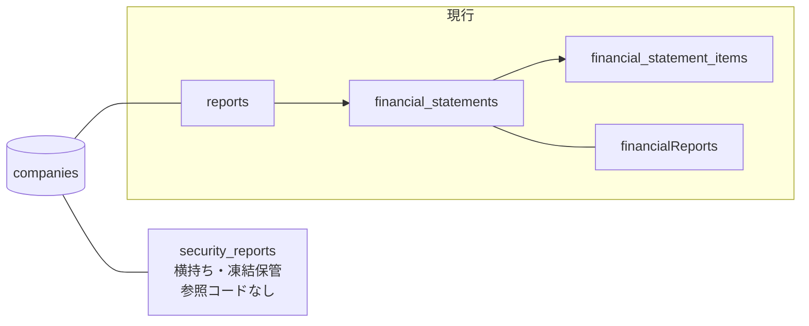

# 09. データモデル詳細

ER図と縦持ちの基本は[04章](04_system_overview.md)にある。この文書は
「なぜこの持ち方なのか」を、業務上の事実と実データで記録する。

設計を決めているのは開示実務の4つの事実。

| 業務上の事実 | データモデルへの反映 |
|---|---|
| 訂正有報が、同じ会計期間のデータを別書類として上書きしに来る | 有報の自然キーを書類IDでなく「企業+会計期間」にする |
| 企業は社名を変えるが、過去の有報は提出当時の名前で読みたい | 企業名を2箇所に持つ（下記） |
| 開示しない科目がある。「0円」とは意味が違う | 「行がない = 開示なし」の規約（下記） |
| IFRS企業でも単体財務諸表は日本基準でタグ付けされる（実測6社すべて） | 会計基準・表示形式を「有報」でなく「財務諸表」の属性にする。有報1通の中に `ifrs_classified`（連結）と `jgaap_general`（単体）が同居する |

## 企業名の持ち方: マスタ（最新名）+ 有報（提出時点の名前）

社名変更した企業は、**各年度の有報を当時の名前で表示したい**。そのため:

| 置き場所 | 内容 | 更新ルール | 用途 |
|---|---|---|---|
| `companies.company_japanese_name` | 最新の企業名 | その企業の**最新会計期**の有報を取り込んだときだけ更新（過去年度のバックフィルでは巻き戻さない） | 企業マスタ。`financialReports` の表示名フォールバック（有報側が空のとき） |
| `reports.company_name_ja` | 提出時点の企業名 | その有報を取り込むたび（訂正有報も上書き） | `financialReports` APIの表示名 |

実例（NTT。2025年に日本電信電話から社名変更）。`reports` は年度ごとに当時の名前を持つ。

| fiscal_year_end | reports.company_name_ja | 画面表示 |
|---|---|---|
| 2024-03-31 | 日本電信電話株式会社 | 当時の名前のまま |
| 2026-03-31 | NTT株式会社（旧会社名 日本電信電話株式会社） | 提出書類の表記 |

`companies.company_japanese_name` は最新の「NTT株式会社（旧会社名 日本電信電話株式会社）」だけを持つ。

## 実データ例: 武田薬品の連結（ifrs_classified）

`financial_statements` の1行はこうなる。

| カラム | 値 |
|---|---|
| consolidation_type | consolidated |
| accounting_standard | ifrs |
| presentation_format | ifrs_classified |
| is_primary | true |

これに紐づく `financial_statement_items`（抜粋）。

| item_code | amount（円） | 由来タグ |
|---|---|---|
| bs.assets | 15,511,506,000,000 | `jpigp_cor:AssetsIFRS` |
| bs.current_assets | 3,090,503,000,000 | `jpigp_cor:CurrentAssetsIFRS` |
| bs.equity | 7,430,649,000,000 | `jpigp_cor:EquityIFRS` |
| bs.goodwill_and_intangibles | 9,228,358,000,000 | のれん+無形の2タグをExtractorが合算 |
| pl.revenue | 4,505,720,000,000 | `jpigp_cor:RevenueIFRS` |
| pl.profit_before_tax | -142,355,000,000 | 赤字は負の値のまま保存する |
| cf.operating | 1,041,431,000,000 | `jpigp_cor:NetCash…OperatingActivitiesIFRS` |

`pl.gross_profit` の行は存在しない。武田は売上総利益を開示していないため。

## 規約: 「行がない = 開示なし」

| XBRLから値が | どうするか |
|---|---|
| 取れた | 行を作る（0円なら `amount = 0` の行を作る） |
| 取れない | 行を作らない（NULLも0も保存しない） |

これで「0円」と「開示なし」の区別がつく。横持ちだった旧テーブルではIFRS企業の全カラムが0で埋まり、0なのか未開示なのか判別できなかった。

## 科目コード辞書

科目コードの定義・命名規則・「DBマスタを作らない」理由は[08章](08_layering.md)の契約1にある。
どのXBRLタグがどの科目コードになり、どのBuilderが描画に使うかは
[12_taxonomy_mapping.md](12_taxonomy_mapping.md) に一覧がある。以下は分類の概要のみ。

### 科目の3グループ

| 接頭辞 | 財務諸表 | 科目数 | 性質 |
|---|---|---|---|
| `bs.` | 貸借対照表 | 18 | 時点の残高（`CurrentYearInstant`） |
| `pl.` | 損益計算書 | 17 | 期間の増減（`CurrentYearDuration`） |
| `cf.` | キャッシュ・フロー計算書 | 5 | 期間の増減 + 期首/期末残高 |

どの科目がどの形式で取れるか（全形式共通の合計科目と、形式固有の内訳科目）は
[12章](12_taxonomy_mapping.md)の表が正。

保存はするがBuilderが使っていない科目もある。再取込のコストが高いので骨格は広めに取っておき、将来の指標計算やコメント生成の入力に使えるようにしてある。

## 旧系統テーブルとの共存

- `security_reports` は旧系統の凍結テーブル（経緯と扱いの判断基準は[14章](14_legacy_cleanup.md)）
- `companies` は旧系統時代からの共用テーブル。`Disclosure::Company` が
  カラム名差異（`company_japanese_name` ↔ `name_ja`）をaliasで吸収
- 検索用インデックス: `(item_code, amount)` 複合（CF符号フィルタ用）+
  `(financial_statement_id, item_code)` ユニーク
