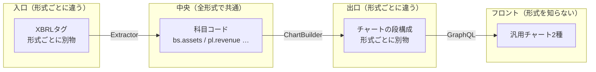
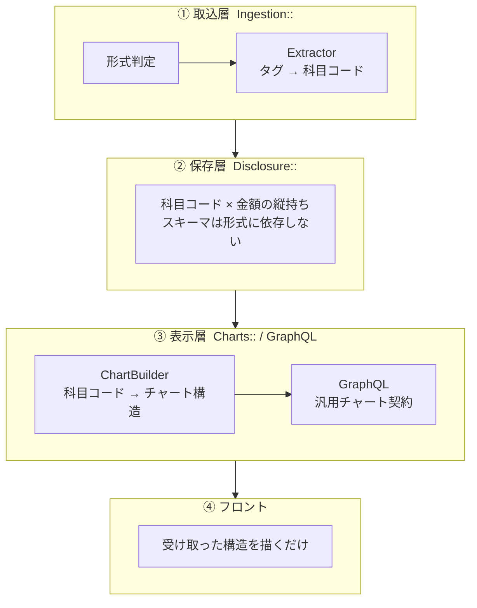

# 09. 設計思想 — 形式ごとの差異をどこに閉じ込めるか

深掘り章の最初に読む文書。[04章](04_system_overview.md)の全体像に出てきた4層構造について、
「そう作った理由」と判断基準を残す。個々のクラスの使い方ではなく、
実装で迷ったときに「どこに何を書くべきか」を判断するための基準をまとめている。

---

## 1. 出発点: このアプリ固有の難しさ

やりたいことは「有報の数字をグラフにする」だけだが、同じ「資産合計」でも企業によってXBRLのタグ名が違う。

```
武田薬品（IFRS）      jpigp_cor:AssetsIFRS
三菱UFJ（日本基準）    jppfs_cor:Assets
トヨタ（日本基準）      jppfs_cor:Assets      ← 銀行と同じタグ
```

しかもタグ名だけの違いではなく、財務諸表の構造自体が変わる。

| | 一般事業会社 | 銀行 | IFRS |
|---|---|---|---|
| BSの区分 | 流動 / 固定 | 区分なし（貸出金・預金） | 流動 / 非流動 |
| PLのトップライン | 売上高 | 経常収益 | 売上収益 |
| 利益の段階 | 営業→経常→当期 | 経常→当期 | 経常利益が無い |

つまり「会計基準 × 業種」の組み合わせごとに、取得するタグもグラフの段の構成も変わる。

### 素直に作るとどうなるか

この差異をそのまま持ち込むと、テーブルは全形式の全科目を横に並べた形になり、グラフ部品は形式ごとの専用コンポーネントに分かれていく。その状態で新しい形式（例: 保険）に対応しようとすると、こうなる。

```
DBに保険用カラムを追加 → 取込に分岐を追加 → APIに項目を追加
  → フロントに保険用チャート部品を追加 → Chrome拡張にも同じ部品を複製
```

1つの形式を足すために全層を触ることになる。実際、IFRS企業の連結が0円で保存されて表示できない、という形でこの問題が出ていた。

---

## 2. 中心にある考え: 変わるものを層の端に寄せる

何が変わり何が変わらないのかを分けて考える。

| | 具体例 |
|---|---|
| 形式ごとに変わるもの | XBRLのタグ名、BSの段の構成、PLの利益段階 |
| 形式によらず変わらないもの | 「資産 = 負債 + 資本」という関係、積み上げバー2本で貸借を表す見せ方 |

変わらないものを中央に置き、変わるものを両端に寄せる。これが全体の方針になっている。



入口と出口だけが形式を知っていて、中央とその先のフロントは知らない。この中央にあたるのが科目コード（`bs.assets` など）で、どの形式のXBRLから来ても資産合計は必ず同じ名前で保存される。

---

## 3. 4つの層と依存の向き

上の考えをコードに落とすと4層になる。



依存は上から下への一方向で、逆流させない。

| 層 | 知ってよいこと | 知ってはいけないこと |
|---|---|---|
| ① 取込 | XBRLのタグ名・タクソノミ・形式判定 | グラフの見た目・色・段の順序 |
| ② 保存 | 科目コードの一覧 | XBRLのタグ名 / グラフの構造 |
| ③ 表示 | 科目コード・グラフの構成・色の役割 | XBRLのタグ名 |
| ④ フロント | チャート構造の形（bars / segments） | 科目名も会計基準も一切 |

この表が実装で迷ったときの判断基準になる。たとえば「フロントで銀行だけ色を変えたい」と思ったら、それは④に③の知識を持ち込む変更なので、代わりに③で色の役割（`colorRole`）を割り当て直す。

### 例外が1つある

保存層のモデルが取込層の定数を参照している箇所がある。

```ruby
# app/models/disclosure/financial_statement.rb
validates :presentation_format, inclusion: { in: Ingestion::FormatRegistry::ALL }
```

向きとしては逆流だが、形式の正当な値一覧を1箇所に限定する方を優先した。モデル側にも一覧を書くと、形式を追加したときに片方を更新し忘れる。

---

## 4. 層の境界を支える2つの契約

層を分けただけでは足りず、層と層の間で受け渡すデータの形を固定しないと結局漏れてくる。契約は2つある。

### 契約1: 科目コード（①→②→③）

`"bs.assets"` `"pl.revenue"` のような文字列。命名は `<財務諸表>.<英名スネークケース>`。

- 定義は [`app/lib/financial_statements/item_codes.rb`](../../application/backend/app/lib/financial_statements/item_codes.rb) だけに置く
- DBにマスタテーブルは作らない。コードと利用箇所は必ず同時に変わるので、grepとコードレビューが効くRubyの定数の方が安全
- 「Extractorが使うコード ⊆ レジストリ」はspecで機械的に検証している（`mapping_consistency_spec.rb`）

これがあるので、②はXBRLを知らずに保存でき、③はXBRLを知らずに描ける。

### 契約2: チャート構造（③→④）

積み上げバーの中身までバックエンドが組み立てて返す。

```
StackChart                      WaterfallChart
├ renderable: 描けるか           ├ renderable
├ note: 描けない理由の説明文      ├ note
└ bars: [                       └ steps: [{ key, label, amount, kind }]
    { label: "借方",
      segments: [{ key, label, amount, signedAmount, ratio, colorRole }] } ]
```

`segments` が固定キーを持たない配列であることが効いていて、「流動資産」「貸出金」といった科目名がスキーマに出てこない。そのため銀行BSの4段もIFRS流動性配列の2段も同じ型で表せる。

これがあるので、④は形式が増えても変更が要らない。

---

## 5. 分岐ではなく登録表で形式を増やす

形式ごとの差異を `if` や継承で書くと、形式が増えるたびに既存コードを触ることになる。ここではハッシュへの登録に統一している。

```ruby
# 取込側: 形式 → Extractorクラス
EXTRACTORS = { "jgaap_bank" => Extractors::JgaapBank, ... }

# 表示側: 形式 → Builderクラス
BS = { "jgaap_bank" => Builders::BsJgaapBank, ... }
```

新形式の追加はクラスを1つ足して表に1行足すだけで、既存形式のコードは触らない。

### 形式クラス同士は継承させない

`IfrsLiquidity` は `IfrsClassified` とマッピングがよく似ているが継承していない。継承すると片方の修正がもう片方に波及して、形式ごとに独立して保守できるという利点が消える。マッピング定数の重複は許容する。

逆に、形式によらず同じロジック（債務超過の描画・貸借の検証・比率計算）は基底クラス `Charts::Builders::StackBase` に1回だけ書く。形式別Builderに書かせないことで、新形式を足したときの実装漏れを防いでいる。

重複を許すのは形式ごとの知識、許さないのは形式共通のロジック、という切り分けになる。

---

## 6. どこに何があるか

```
application/backend/app/
├── lib/
│   ├── financial_statements/item_codes.rb   ← 契約1の定義（唯一の科目一覧）
│   ├── edinet/client.rb                     ← 外部I/Oはここだけ
│   └── xbrl/document.rb                     ← XBRLの検索プリミティブ
├── services/
│   ├── ingestion/          ① 取込層
│   │   ├── format_detector.rb / format_registry.rb   形式の判定と登録表
│   │   ├── extractors/     形式別（4クラス）+ 共通処理の基底
│   │   ├── dei_extractor.rb            企業情報・会計期間の抽出
│   │   ├── report_ingester.rb          1有報の取込と永続化
│   │   └── daily_ingestion_service.rb  日次実行の入口
│   ├── charts/             ③ 表示層
│   │   ├── builder_registry.rb   形式 → Builderの登録表
│   │   └── builders/       BS4種・PL3種・CF共通 + 基底(StackBase)
│   └── disclosure/search_query.rb   一覧検索
├── models/disclosure/      ② 保存層
└── graphql/                ③ 表示層（APIの型と契約2）
```

名前空間は層に対応している（`Ingestion::` = ①、`Disclosure::` = ②、`Charts::` = ③）。

モデルが `Disclosure::` 配下にあるのは、Railsアプリのモジュール名が `FinancialStatement` のため、トップレベルに同名のモデルを定義できない（`module` と `class` が衝突する）という制約による。

---

## 7. 設計が効いているかの確かめ方

新しい形式（例: 日本基準・保険業）を追加するときに触るファイルで確認できる。

| 層 | 作業 | 種別 |
|---|---|---|
| ① 取込 | Extractorクラスを1つ追加 + 判定表と登録表に1行ずつ | 追加のみ |
| ② 保存 | なし（マイグレーション不要） | — |
| ③ 表示 | Builderクラスを1〜2つ追加 + 登録表に1行 | 追加のみ |
| ④ フロント / Chrome拡張 | なし | — |

既存ファイルへの変更が表への1行追加だけで済み、既存形式の処理は書き換えない。新形式の対応で既存クラスの中身を書き換える必要が出てきたら、層の分け方か契約のどちらかを見直した方がよい。

---

## 次に読む

| 目的 | 文書 |
|---|---|
| データの持ち方を知る | [10_data_model.md](10_data_model.md) |
| XBRLからどう取り込むか | [11_ingestion.md](11_ingestion.md) |
| どうグラフにして返すか | [12_serving.md](12_serving.md) |
| タグと科目コードの対応を引く | [13_taxonomy_mapping.md](13_taxonomy_mapping.md) |
