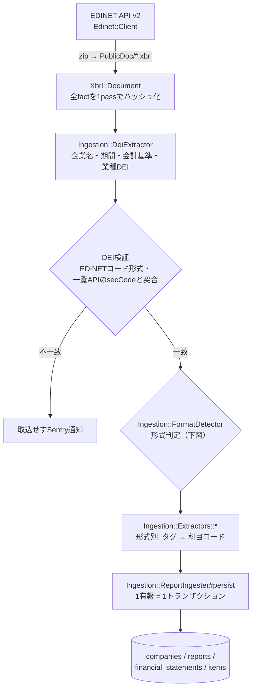

# 10. 取込層の詳細（Ingestion）

[04章](04_system_overview.md)の流れと[05章](05_backend.md)の実装ガイドの先にある、
取込の設計理由と実測にもとづく詳細を記録する。この層を難しくしているのは
EDINETという外部システムの現実で、**レート制限（403）・提出者が自分で書くメタデータ・
訂正有報・業種ごとの様式差**への対処がここに集まっている。

## パイプライン全体

- 実行入口は2つ: `DailyIngestionJob`（日次・毎日2:00に`sidekiq-cron`で実行）と
  `rake 'ingestion:backfill[from,to]'` / `rake 'ingestion:documents[docID...]'`（手動）
- **DEIは提出者が書いた値のため、企業マスタのキーとして使う前に検証する**:
  EDINETコードの形式（`[A-Z]\d{5}`）と、金融庁の一覧API（`documents.json`）が返す`secCode` との突合。食い違う書類は他社レコードを上書きし得るため取り込まない（なりすまし・提出ミスの両方が同じ経路で起きる）。docID指定のrakeタスクは一覧メタデータを持たないため証券コードの突合はスキップされる
- EDINETの403対策（同期・逐次+1秒スリープ）は[05章](05_backend.md)のとおり。
  加えて一覧APIはHTTPステータスを明示チェックする（403でエラーページ本文を掴んで
  分かりにくい例外になるのを防ぎ、早期に検出する）
- 失敗の隔離境界は「1書類」と「1日」。1社の失敗が他社に波及しない（Sentryに通知）
- 全処理が冪等（再実行・訂正有報は同じ期のデータを上書き）

## 失敗時のリカバリ

自動リトライは持たない。冪等な再実行が唯一のリカバリ手段で、
**Sentry通知メッセージ別のリカバリ手順表は [07章](07_development_operations.md) にある**
（`list failed` はその日の全有報が欠落したままになるため必ず再実行する）。

既知のエッジ（fail-safe方向・対応不要）: 「連結廃止をDEIで伝え、かつ財務factを含まない訂正有報」が来ると、連結行の削除と単体行の更新スキップが同時に起こり、`is_primary` の行が一時的に無くなってその有報が一覧から消える（Sentry警告あり。次の正常な取込で復元される）。

## 形式判定（FormatDetector）

判定フロー図は[04章](04_system_overview.md)にある。実装上の注意:

- 業種DEIコードは**小文字化してから**判定する（提出データに `bnk` のような小文字と
  `INS` のような大文字が混在するため）。未知の業種は安全側の `unsupported` に倒す
- IFRSの2様式はDEIでは区別できず、**タグの実在**でしか判定できない（実測知見）
- 判定は連結・単体それぞれで行う。**単体は常に日本基準**として判定する
  （IFRS適用企業でも単体はjppfs_corでタグ付けされる。実測6社すべて）

## Extractor = 「タグ → 科目コード」の対応表

形式1つ = クラス1つ。中身はほぼ宣言的なマッピング定数で、コードを読む場所はここだけになる。
フォールバックの仕組みと実例は[05章](05_backend.md)、マッピングで表せない2ケース
（CF期首残高・のれん合算）を書く `extract_extras` フックの詳細は
[12章](12_taxonomy_mapping.md)にある。

**全形式・全科目のタグ対応は [12_taxonomy_mapping.md](12_taxonomy_mapping.md) に一覧がある。**

## 出力例（同じ入口から形式ごとに違う科目が出る）

Extractorの戻り値は `{科目コード => 金額}` のハッシュで、形式によって入るキーが変わる。

| 科目コード | 武田薬品（ifrs_classified） | 三菱UFJ FG（jgaap_bank） |
|---|---|---|
| bs.assets | 15.5兆 | 431.7兆 |
| bs.current_assets | 3.09兆 | キーなし（銀行に流動区分がない） |
| bs.loans | キーなし | 133.8兆 |
| bs.deposits | キーなし | 239.4兆 |
| pl.revenue | 4.5兆 | キーなし（銀行は売上高がない） |
| pl.ordinary_revenue | キーなし | 14.6兆 |
| pl.profit_before_tax | -0.14兆 | 3.3兆 |
| cf.operating | 1.04兆 | -23.1兆 |

キーが無い = 開示なし。東京海上のPLは `pl.revenue` のキー自体が出ない。
この出力が保存されると[09章](09_data_model.md)の実データ例の行になり、
[11章](11_serving.md)の実例1・2でチャートになる。

## 新形式の追加手順（例: 日本基準・保険業）

1. 対象企業の有報XBRLを1件取得してタグを実測する（`Edinet::Client#download_xbrl`）
2. `app/services/ingestion/extractors/jgaap_insurance.rb` を追加（マッピング定数が本体）
3. `FormatRegistry` に定数 + `EXTRACTORS` 1行、`FormatDetector::JGAAP_INDUSTRY_FORMATS` に `"ins" => ...` 1行
4. 必要なら `ItemCodes` に科目を追加（例: `pl.insurance_revenue`）
5. 表示層のBuilderを追加（[11_serving.md](11_serving.md)）
6. 実測値でスペックを書く（`spec/services/ingestion/extractors/` の既存4形式と同型）

**DBマイグレーション・GraphQL・フロントの変更はなし。**

テストの一覧は[05章](05_backend.md)のテスト表を参照。
