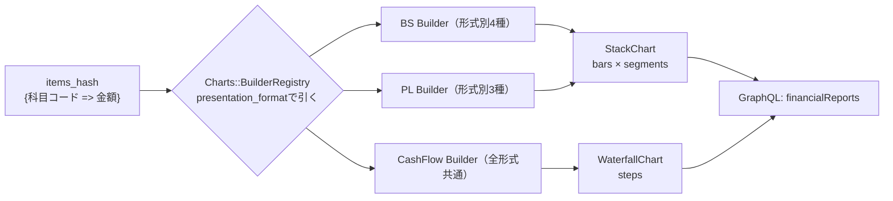

# 12. 表示層の詳細（Charts / GraphQL）

[05章](05_backend.md)の実装ガイドの先にある、チャート契約の仕様と実データでの実例を記録する。

## 役割: 「科目コード → チャートの構造そのもの」

バックエンドが積み上げバーの中身まで組み立てて返す。フロントは受け取った構造を描くだけで、科目・会計基準・形式を一切知らない。



## チャート契約（フロント・Chrome拡張と共有する構造）

```
StackChart（BS/PL用）                     WaterfallChart（CF用）
├ renderable: Boolean                     ├ renderable: Boolean
├ note: 表示不可時の説明文                 ├ note
└ bars: [                                 └ steps: [
    { label: "借方",                          { key, label: "期首残",
      segments: [                               amount: 符号付き円,
        { key: "costOfSales",                   kind: "balance" },      # 0起点で描く
          label: "売上原価",                  { key, label: "営業CF",
          amount:  描画高さ(常に≥0),            amount: -23兆もあり得る,
          signedAmount: 実値(負もある),         kind: "flow" },         # 累積から浮かせる
          ratio: 34.8,                        ...
          colorRole: "expense1" }, ... ] } ]
```

| 契約の仕掛け | 吸収する差異 |
|---|---|
| `segments[]` をそのまま積む（固定キーなし） | 形式ごとの段数・科目の違い（銀行BS 4段 / IFRS流動性配列 2段…） |
| `colorRole`（意味ベースの色enum） | 「何色にするか」。新科目にも既存roleを割り当てるだけ |
| `amount`（高さ）と `signedAmount`（実値）の分離 | 赤字・債務超過（負値を棒グラフに渡すと逆向きに描かれる問題） |
| `spacer` セグメント | 債務超過時の3本目バーの位置合わせ（透明の詰め物） |
| `renderable: false` + `note` | 「この表は出せない」を**正常系のデータ**として返す |
| `kind: balance / flow` | CFの残高（0起点）と増減（浮かせる）の描き分け + 為替換算差額の吸収 |

## 実例1: 武田薬品のPL（赤字 + 導出項目）

入力（単位: 百万円）:

| 科目コード | 金額 |
|---|---|
| pl.revenue | 4,505,720 |
| pl.cost_of_sales | 1,571,588 |
| pl.sga | 1,084,215 |
| pl.profit_before_tax | -142,355 |

開示されている費用だけでは貸借が合わないため、差額を「その他損益（純額）」として導出する。

```
その他損益（純額） = 税引前利益 - (収益 - 開示済み費用)
                 = -142,355 - (4,505,720 - 2,655,803)
                 = -1,992,272   → 負なので費用側（借方）へ積む
```

この残差項目があるので、借方合計と貸方合計は常に一致する。出力されるバーは次のとおり。

| バー | セグメント | ratio |
|---|---|---|
| 借方 | 売上原価 | 34.8% |
| 借方 | 販売費及び一般管理費 | 24.0% |
| 借方 | その他損益（純額） | -44.2% |
| 貸方 | 収益 | 100% |
| 貸方 | 税引前損失 | -3.1% |

赤字（税引前損失）は貸方に積んで高さを揃える。`ratio` は `signedAmount` 基準で計算するため、損失セグメントは負の%で届く。

## 実例2: 三菱UFJのBS（銀行・残差導出）

入力:

| 科目コード | 金額 |
|---|---|
| bs.assets | 431.7兆 |
| bs.cash_and_equivalents | 90.0兆 |
| bs.loans | 133.8兆 |
| bs.securities | 85.7兆 |
| bs.liabilities | 408.0兆 |
| bs.deposits | 239.4兆 |
| bs.equity | 23.7兆 |

銀行のBSは内訳科目が非常に多いため、意味の大きい科目だけタグで取り、残りは合計との差額で吸収する。

```
その他資産 = 資産合計 - (現金預け金 + 貸出金 + 有価証券) = 122.2兆
その他負債 = 負債合計 - 預金                          = 168.5兆
```

| バー | セグメント | ratio |
|---|---|---|
| 借方 | 現金預け金 | 20.8% |
| 借方 | 貸出金 | 30.9% |
| 借方 | 有価証券 | 19.8% |
| 借方 | その他資産 | 28.2% |
| 貸方 | 預金 | 55.4% |
| 貸方 | その他負債 | 39.0% |
| 貸方 | 純資産 | 5.4% |

## 実例3: 表示不可も正常系（東京海上のPL）

```json
{ "profitLoss":   { "renderable": false,
                    "note": "損益計算書: この企業のIFRS損益計算書は表示に対応していません。",
                    "bars": [] },
  "balanceSheet": { "renderable": true, "bars": [...] },
  "cashFlow":     { "renderable": true, "steps": [...] } }
```

保険IFRSは収益が企業拡張タグのみで標準タグから取れない → **PLだけ**説明文になり、BS・CFは普通に表示される。カード全体を落とさずチャート単位で劣化させる。

## 汎用処理は基底クラスに1回だけ書く

債務超過・貸借検証・比率計算などの形式共通処理は `Charts::Builders::StackBase` に集約し、
形式別Builderには書かせない（内容の一覧は[05章](05_backend.md)の共通処理表）。
この切り分けの理由は[09章](09_layering.md)の「形式クラス同士は継承させない」を参照。

## GraphQL

```graphql
query {
  financialReports(limit: 30, offset: 0,
                   stockCodes: ["4502"],          # 4桁。5桁化はバックエンドの責務
                   operatingCfSign: POSITIVE) {   # CF符号フィルタ（enum CashFlowSign）
    companyName
    accountingStandard      # バッジ表示のみに使う。描画分岐に使わない（規律）
    balanceSheet { renderable note bars { label segments { key label amount signedAmount ratio colorRole } } }
    profitLoss   { ... }
    cashFlow     { renderable note steps { key label amount kind } }
  }
}
```

- 金額は独自スカラ `Money` でJSON数値のまま返す。円の最大値4e14はJSの安全整数域9e15に収まる。
  gemの `GraphQL::Types::BigInt` を使わないのは、文字列でシリアライズされてWeb・Chrome拡張の両方に変換処理が必要になるため
- 検索の全体像は[05章](05_backend.md)。実装面では `is_primary` の財務諸表にJOINし、
  CF符号のEXISTSサブクエリは `(item_code, amount)` 複合インデックスで評価される
- 入力量の上限（`limit`・`stockCodes`・`max_complexity` / `max_depth`）の一覧と意図も[05章](05_backend.md)。
  `financialReports` の複雑度を `child_complexity + limit / 2` で計算するのは、
  graphql-rubyの既定が引数を見ず `limit:1` と `limit:100` が同コスト扱いになるため

複雑度と深さの実測値は次のとおり。フィールドを増やすときはこの余裕を確認する。

| クエリ | 複雑度 | 深さ |
|---|---|---|
| 一覧（`limit: 30`） | 54 | 5 |
| Chrome拡張（`limit: 100`） | 89 | 5 |
| graphql-codegenのイントロスペクション | 187 | 13 |

## テスト

Builderは純関数（`{科目コード=>金額}` → Struct）なのでDBなしで網羅。期待値は実測表（[14_xbrl_research.md](14_xbrl_research.md)）から転記:

| ケース | スペック |
|---|---|
| 武田型（赤字・残差が費用側）/ 商社型（残差が収益側）/ 楽天型（営業費用一括） | `pl_ifrs_spec.rb` |
| 債務超過（3本目バー+spacer）/ 貸借乖離>10%（unrenderable） | `bs_builders_spec.rb` |
| CF5点そろい / 1点欠け（unrenderable） | `cash_flow_spec.rb` |
| GraphQL end-to-end（金額が数値で返る・証券コード5桁→4桁変換・提出時点の社名） | `spec/graphql/resolvers/financial_reports_spec.rb` |
