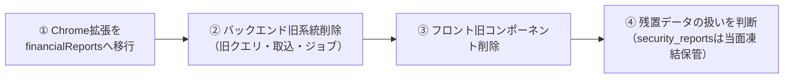

# 14. 旧系統（SecurityReport系）の削除記録

2026-08-02に新系統へ切り替えたのち、下記①〜③の削除を実施済みで、**旧系統のコードは残っていない**。
この文書は「何を消し、何を意図的に残したか」の記録と、唯一未了の④（凍結データ `security_reports` の扱い）の判断基準を残す。

## 大前提

- **データは削除しない**。`security_reports`テーブルはそのまま残す
  （旧cron停止に伴い2026-08-02時点の内容で凍結。閲覧・検証用）
- `companies`テーブルは**新系統（`Disclosure::Company`）が使用中**のため削除・変更禁止

## 削除の順序（①〜③実施済み・④のみ未了）

## ② バックエンド（application/backend）

削除するファイル:

- [x] `app/services/security_report/subscriber_service.rb`
- [x] `app/services/security_report/fetcher_service.rb`
- [x] `app/repositories/security_report/reader_repository.rb` / `document_repository.rb`
- [x] `app/jobs/security_report_subscriber_job.rb`
- [x] `app/models/security_report.rb`
- [x] `app/models/company.rb`（トップレベルの旧モデル。`Disclosure::Company`と同じテーブルを指す別クラス）
- [x] `app/graphql/types/financial_statement/` 配下すべて（旧クエリの型ツリー）
- [x] `lib/app_file/xml_parser.rb`（REXML依存。`Xbrl::Document`に置換済み）

変更するファイル:

- [x] `app/graphql/types/query_type.rb`: `companyFinancialStatements` フィールドと
      そのresolverメソッドを削除（スキーマ破壊変更 — ストア公開版拡張1.1.0の`financialReports`移行後に実施）
- [x] `Gemfile`: `gem 'rexml'` を削除（xml_parser.rbと同時。`bundle install`でlock更新。
      lock上は他gemの推移的依存として残る）

削除しないもの（新系統が使用中）:

`Disclosure::*` / `Ingestion::*` / `Charts::*` / `Xbrl::Document` / `Edinet::Client` /`FinancialStatements::ItemCodes` / `Resolvers::FinancialReports` / `Types::Chart::*` /`Types::MoneyType` / `Types::CashFlowSignType` / `DailyIngestionJob` / `lib/tasks/ingestion.rake`

## ③ フロントエンド（application/frontend）

削除するファイル:

- [x] `src/pages/financialStatementList/` 一式（旧一覧ページ）
- [x] `src/layouts/default/` 一式（旧AppBar。`ReportListLayout`に置換済み）
- [x] `src/components/balanceSheetBarChart/` / `profitLossBarChart/` / `cashFlowBarChart/` /
      `waterFlowBarChart/` / `financialStatementBarChart/` / `chartAlternative/`
      （科目別チャート部品。`shared/financialCharts`に置換済み）
- [x] `src/plugins/apollo/service.ts`（旧クエリ用クライアント。新系統は`features/financialReports/apolloClient.ts`）
- [x] `src/store/slices/financialStatementFilterSlice.ts`（検索条件はURLクエリに移行済み。
      旧slice専用の`ChangeCashFlowFilterAction` / `ChangeStockCodeFilterAction`も削除）

変更するファイル:

- [x] `src/store/store.ts`: `financialStatementFilter` slice の登録を削除（`autoPlayStatus`は残す）
- [x] `src/constants/values.ts`: 旧チャート専用の定数を削除
      （`barChartWidth` / `barChartHeight` / `tooltipStyle` / `stackLabelListFillColor`）

削除しないもの（新系統が使用中）:

| モジュール | 新系統での用途 |
|---|---|
| `src/components/appCarousel/` | `ReportCard`のカルーセル |
| `src/store/store.ts` + `slices/autoPlayStatusSlice.ts` | カルーセル自動切替の共有状態 |
| `src/constants/values.ts` の `financialStatementOffsetUnit` / `autoPlayStatusLocalStorageKey` / `cashFlowTypes` / `cashFlowTypeRequestMap` | ページサイズ・自動切替・CFプリセット |
| `src/plugins/firebase/` / `src/plugins/utils/` | アナリティクス等 |
| `src/shared/financialCharts/` / `src/features/financialReports/` | 新系統本体 |

## ④ データ・インフラ

- [ ] `security_reports` の扱いを判断（当面は凍結保管。消す場合もバックアップを取ってから）
- [ ] 判断済みまで**何もしない**（`drop_table`のマイグレーションは作らない）

## 削除後の確認

- [x] `bundle exec rspec` 全合格 / `rails zeitwerk:check`
- [x] `npx tsc --noEmit` / webpackビルド成功
- [x] `/` の表示・検索・無限スクロール、`/api/graphql` の `financialReports`
- [x] Chrome拡張の表示（②の後。開発ビルドを削除後スキーマのローカルAPIに向けてE2Eで確認）
