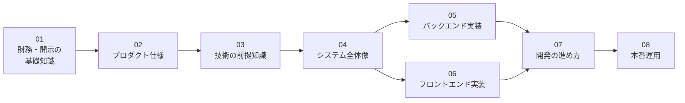

# リポジトリ理解ガイド

このリポジトリ（investee）を初めて触る人が、前提知識ゼロから全体を理解するためのガイド。
財務・会計の知識や、ここで使っているWeb技術の経験がなくても読み進められるように、
必要な前提知識から順に説明する。

## 章構成と読む順序

前の章の知識を使って次の章を説明する構成のため、初めて読むときは番号順が最短になる。

| # | 文書 | 内容 | こんな人に |
|---|---|---|---|
| 01 | [財務・開示の基礎知識](01_financial_knowledge.md) | 財務3表・有価証券報告書・EDINET・XBRL・会計基準とは何か | 財務や開示制度になじみがない人は必読 |
| 02 | [プロダクト仕様](02_product.md) | investeeで何ができるか。画面・チャートの読み方・対応範囲 | 全員 |
| 03 | [技術の前提知識](03_tech_prerequisites.md) | GraphQL・React・Rails・Docker・git submoduleなど、実装を読むための技術の基礎 | Web開発になじみがない人向け。経験者は読み飛ばして良い |
| 04 | [システム全体像](04_system_overview.md) | リポジトリ構成・データの流れ・データモデル・設計の考え方 | 全員 |
| 05 | [バックエンド実装](05_backend.md) | データ取込・チャート生成・GraphQL APIの実装 | バックエンドを触る人 |
| 06 | [フロントエンド実装](06_frontend.md) | 一覧画面・チャート描画・型生成の実装 | フロントエンドを触る人 |
| 07 | [開発の進め方](07_development.md) | 環境構築・日常の開発フロー・submoduleを含むPR運用 | 開発に参加する人 |
| 08 | [本番運用](08_operations.md) | 本番環境の構成・デプロイ・日次バッチの監視とリカバリ | 運用に関わる人 |
| 09 | [用語集](09_glossary.md) | 本ガイドと既存ドキュメントに登場する用語の索引 | 随時参照 |

## 既存ドキュメントとの役割分担

このガイドは「入門と全体像」を担当する。より深い情報は既存ドキュメントが正であり、
内容を重複させないよう、詳細は以下へのリンクで案内する。

| 場所 | 役割 |
|---|---|
| このディレクトリ（docs/guide/） | 前提知識からの入門・全体像・運用知識のまとめ |
| [ルートREADME](../../README.md) | セットアップ・起動・データ投入の具体的な手順の正 |
| [docs/architecture/](../architecture/README.md) | 実装済みアーキテクチャの正。設計意図・データモデル詳細・XBRLタグ対応表 |
| [docs/improvements.md](../improvements.md) | 未着手の改善バックログ（完了した項目は記述ごと削除する運用） |
| [CLAUDE.md](../../CLAUDE.md) | AIエージェント向けの要約コンテキスト |
