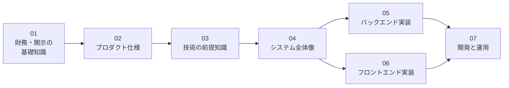

# リポジトリ理解ガイド

このリポジトリ（investee）のドキュメントの本体。3部構成になっている。

| 部 | 章 | 役割 |
|---|---|---|
| 学ぶ章 | 01〜07 | 前提知識ゼロから全体を理解する。**番号順に読む** |
| 深掘り章 | 08〜11 | 設計判断の「なぜ」と、学ぶ章に収まらない詳細。設計変更や込み入った修正の前に読む |
| 資料 | 12〜14 | 作業のときに引く一覧表・実測データ・記録 |

## 学ぶ章（01〜07）

財務・会計の知識や、ここで使っているWeb技術の経験がなくても読み進められるように、
必要な前提知識から順に説明する。前の章の知識を使って次の章を説明する構成のため、
初めて読むときは番号順が最短になる。

| # | 文書 | 内容 | こんな人に |
|---|---|---|---|
| 01 | [財務・開示の基礎知識](01_financial_knowledge.md) | 財務3表・有価証券報告書・EDINET・XBRL・会計基準とは何か | 財務や開示制度になじみがない人は必読 |
| 02 | [プロダクト仕様](02_product.md) | investeeで何ができるか。画面・チャートの読み方・対応範囲 | 全員 |
| 03 | [技術の前提知識](03_tech_prerequisites.md) | GraphQL・React・Rails・Docker・git submoduleなど、実装を読むための技術の基礎 | Web開発になじみがない人向け。経験者は読み飛ばして良い |
| 04 | [システム全体像](04_system_overview.md) | リポジトリ構成・データの流れ・データモデル・設計の考え方 | 全員 |
| 05 | [バックエンド実装](05_backend.md) | データ取込・チャート生成・GraphQL APIの実装 | バックエンドを触る人 |
| 06 | [フロントエンド実装](06_frontend.md) | 一覧画面・チャート描画・型生成の実装 | フロントエンドを触る人 |
| 07 | [開発と運用](07_development_operations.md) | submodule構成のPR運用・本番構成・デプロイ・監視とリカバリ | 開発・運用に関わる人 |

## 深掘り章（08〜11）

学ぶ章が「どう動くか」を説明するのに対し、深掘り章は「どんな業務上の事実があって、
なぜそう作ったか」の判断根拠と、実データでの実例を記録する。
08→09→10→11で、設計の考え方 → データの形 → 処理の流れ、の順に頭に入る。

| # | 文書 | 内容 |
|---|---|---|
| 08 | [設計思想](08_layering.md) | **深掘りの最初に読む。** 会計基準ごとの差異をどこに閉じ込めるか。層の分け方と、どこに何を書くべきかの判断基準 |
| 09 | [データモデル詳細](09_data_model.md) | 訂正有報・社名変更・未開示科目という業務上の事実が、自然キー・企業名2箇所・「行がない = 開示なし」の設計をどう決めたか。実データ例つき |
| 10 | [取込層の詳細](10_ingestion.md) | EDINETの現実（レート制限・提出者が書くメタデータ・様式差）への対処。DEI検証の理由・形式判定の実装注意・新形式の追加手順 |
| 11 | [表示層の詳細](11_serving.md) | 「借方 = 貸方」の恒等式を検証と描画に使うチャート契約の仕様。赤字・銀行・保険の実データ3例と、GraphQLの設計理由・実測値 |

## 資料（12〜14）

| # | 文書 | 使うとき |
|---|---|---|
| 12 | [タグ対応表](12_taxonomy_mapping.md) | XBRLタグを扱う作業のとき。タグ ↔ 科目コード ↔ Builder の一覧と、科目名のゆれを吸収するフォールバック順 |
| 13 | [XBRL実地調査](13_xbrl_research.md) | 新しい形式に対応するとき。6社・4形式の実測データ。**XBRLタグを触る前に必読** |
| 14 | [旧系統の削除記録](14_legacy_cleanup.md) | 凍結データ（`security_reports`）の扱いを判断するとき・削除の経緯を確認するとき |

## ほかのドキュメントとの役割分担

| 場所 | 役割 |
|---|---|
| [ルートREADME](../../README.md) | セットアップ・起動・データ投入の具体的な手順の正 |
| [docs/improvements.md](../improvements.md) | 未着手の改善バックログ（完了した項目は記述ごと削除する運用） |
| [CLAUDE.md](../../CLAUDE.md) | AIエージェント向けの要約コンテキスト |
| `.claude/skills/` | 定型作業の手順書（デプロイ・日次確認・PR運用・リリース） |
