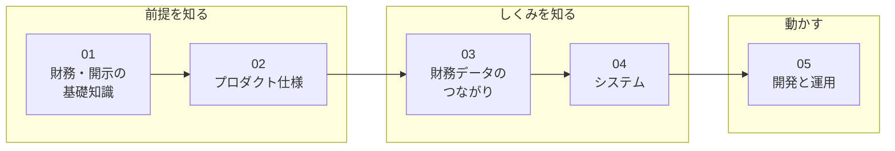

# リポジトリ理解ガイド

investeeの仕様・設計・運用資料。知りたい内容に応じて章を選べる。

| 文書 | 内容 |
|---|---|
| [01 財務・開示の基礎知識](01_financial_knowledge.md) | 財務諸表、会計基準、EDINET、XBRLの用語と関係 |
| [02 プロダクト仕様](02_product.md) | Webガイドにない検索・更新・表示の補足仕様 |
| [03 財務データのつながり](03_data_flow.md) | 原本の取得から保存、計算、画面表示までの流れ |
| [04 システム](04_system.md) | 構成、日次取込、APIの制限、画面の状態管理 |
| [05 開発と運用](05_development_operations.md) | 変更時の検証、再取込、本番反映、障害対応 |
| [06 XBRLタグ対応表と実地調査](06_taxonomy_mapping.md) | タグと科目の対応、取得条件、検証に使った書類と数値 |

## 関連資料

| 場所 | 役割 |
|---|---|
| [ルートREADME](../../README.md) | セットアップ・起動・データ投入 |
| [docs/improvements.md](../improvements.md) | 未着手の改善候補 |
| [計測ガイド](../analytics/README.md) | 利用状況の見方とイベント定義 |
