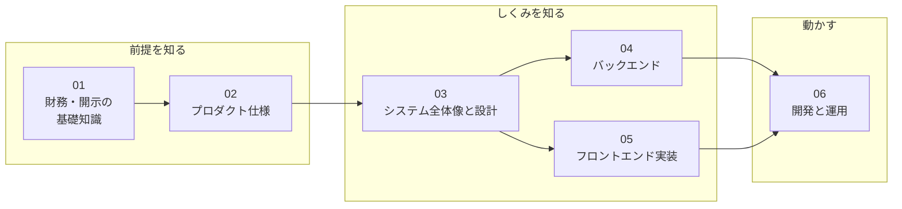

# リポジトリ理解ガイド

このリポジトリ（investee）のドキュメントの本体。**01〜06を番号順に読む**と、前提知識ゼロから設計・運用まで理解できる。07〜08は作業のときに引く資料。

学ぶ章の中は「前提を知る → しくみを知る → 動かす」の3段階になっている。

| # | 文書 | 内容 | こんな人に |
|---|---|---|---|
| 01 | [財務・開示の基礎知識](01_financial_knowledge.md) | 財務3表・有価証券報告書・EDINET・XBRL・会計基準とは何か | 財務や開示制度になじみがない人は必読 |
| 02 | [プロダクト仕様](02_product.md) | investeeで何ができるか。画面・チャートの読み方・対応範囲 | 全員 |
| 03 | [システム全体像と設計](03_system_overview.md) | 構成（リポジトリ・Docker）・このアプリ固有の難しさと解き方（4層設計）・データモデル・1科目で追うデータフロー。GraphQL・submoduleなど技術の基礎説明つき | 全員 |
| 04 | [バックエンド](04_backend.md) | 取込・チャート生成・APIを、業務上の事実と設計判断のレベルで。実データ例つき | バックエンドを触る人 |
| 05 | [フロントエンド実装](05_frontend.md) | 一覧画面・チャート描画キット・型生成 | フロントエンドを触る人 |
| 06 | [開発と運用](06_development_operations.md) | submodule構成のPR運用・本番構成・デプロイ・監視とリカバリ | 開発・運用に関わる人 |
| 07 | [XBRLタグ対応表と実地調査](07_taxonomy_mapping.md) | 【資料】名前空間・コンテキストの読み方、タグ ↔ 科目コード ↔ Builderの一覧、根拠になった6社の実測記録。**XBRLタグを触る前に必読** | タグを扱う作業のとき |
| 08 | [使っていないが残しているもの](08_unused_but_kept.md) | 【資料】旧系統の凍結データ `security_reports` など、参照ゼロでも意図的に残しているものと、消してよくなる条件 | 残置物・凍結データを判断するとき |

## ほかのドキュメントとの役割分担

| 場所 | 役割 |
|---|---|
| [ルートREADME](../../README.md) | セットアップ・起動・データ投入の具体的な手順の正 |
| [docs/improvements.md](../improvements.md) | 未着手の改善バックログ（完了した項目は記述ごと削除する運用） |
| [CLAUDE.md](../../CLAUDE.md) | AIエージェント向けの要約コンテキスト |
| `.claude/skills/` | 定型作業の手順書（デプロイ・日次確認・PR運用・リリース） |
