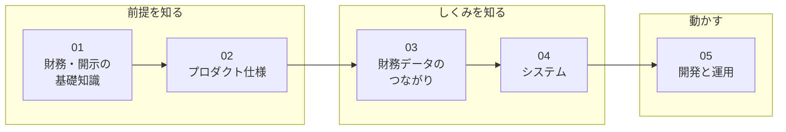

# リポジトリ理解ガイド

このリポジトリ（investee）のドキュメントの本体。**01〜05を番号順に読む**と、前提知識ゼロから設計・運用まで理解できる。06は作業のときに引く資料。

学ぶ章の中は「前提を知る → しくみを知る → 動かす」の3段階になっている。

| # | 文書 | 内容 | こんな人に |
|---|---|---|---|
| 01 | [財務・開示の基礎知識](01_financial_knowledge.md) | 財務3表・有価証券報告書・EDINET・XBRL・会計基準とは何か | 財務や開示制度になじみがない人は必読 |
| 02 | [プロダクト仕様](02_product.md) | investeeで何ができるか。画面・チャートの読み方・対応範囲 | 全員 |
| 03 | [財務データのつながり](03_data_flow.md) | XBRLタグ → 取込 → DB保存 → チャート構造 → GraphQL → 画面描画を、1つの科目の実データで通しで追う。4層設計・科目コード・チャート構造という設計の芯と、変更時にどの層を触るか | 全員 |
| 04 | [システム](04_system.md) | データを動かす器: 構成（リポジトリ・Docker）・使っている技術・取込ジョブの信頼性・公開APIの防御・一覧画面の実装・型生成 | 実装を触る人 |
| 05 | [開発と運用](05_development_operations.md) | ブランチ・PR運用・本番構成・デプロイ・監視とリカバリ | 開発・運用に関わる人 |
| 06 | [XBRLタグ対応表と実地調査](06_taxonomy_mapping.md) | 【資料】前半はタグ ↔ 科目コード ↔ Builderの対応を引く表、後半はその根拠の実測記録（基本8社 + 14業種の実測・3年分の全数検証）。**XBRLタグを触る作業の前に、前半の触る表（BS/PL/CF）の節は必読** | タグを扱う作業のとき |
## ほかのドキュメントとの役割分担

| 場所 | 役割 |
|---|---|
| [ルートREADME](../../README.md) | セットアップ・起動・データ投入の具体的な手順の正 |
| [docs/improvements.md](../improvements.md) | 未着手の改善バックログ（完了した項目は記述ごと削除する運用） |
| [CLAUDE.md](../../CLAUDE.md) | AIエージェント向けの要約コンテキスト |
| `.claude/skills/` | 定型作業の手順書（デプロイ・日次確認・PR運用・リリース・Rubyバージョンアップ・ブラウザ拡張への同期） |
